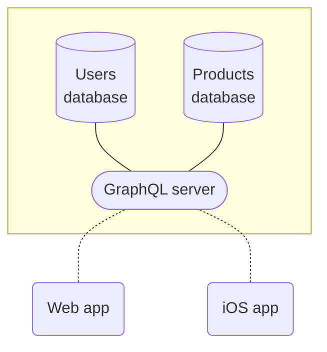
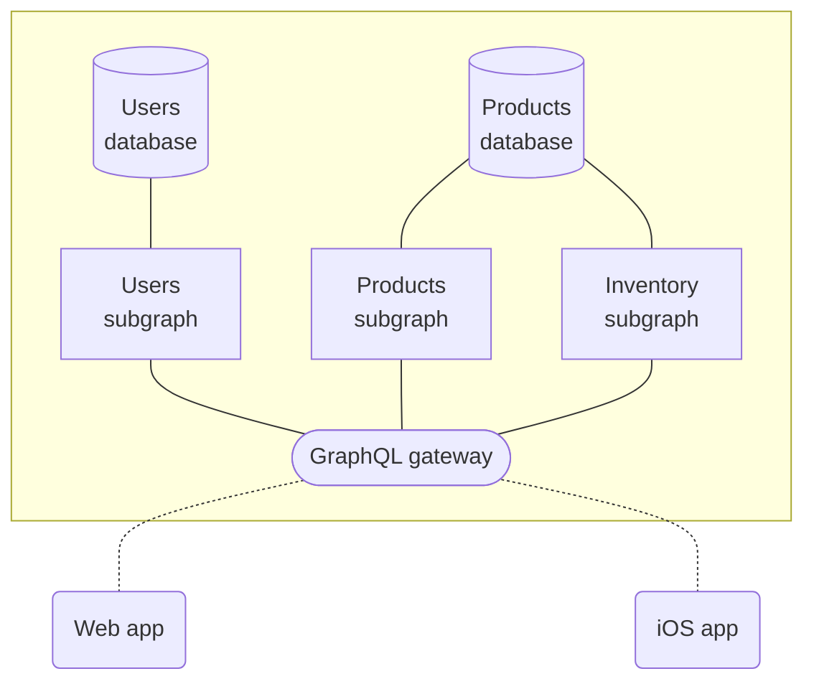

The Apollo platform helps you build, manage, and scale a **unified supergraph**: a data layer that combines your organization's backend services into a single, intuitive API. With just one query to your supergraph, an application client can fetch data from any combination of sources:


Clients query your supergraph with a powerful language called [GraphQL](./benefits/), which enables them to retrieve exactly the data they need with no overfetching. The architecture of your supergraph is not exposed, and clients query it as though it were a "monolithic" GraphQL server.

<ExpansionPanel title="See an example query and response">

<CodeColumns>

```graphql title="Example Client Query"
# This query combines data from
# both subgraphs shown above.
query GetCurrentUserCart {
  currentUser {
    id
    name
    cartItems {
      id
      name
      inStock
    }
  }
}
```

```json title="Example Supergraph Response"
{
  "data": {
    "currentUser": {
      "id": "abc",
      "name": "Katherine Johnson",
      "cartItems": [
        {
          "id": "123",
          "name": "Coffee thermos",
          "inStock": true
        }
      ]
    }
  }
}
```

</CodeColumns>

</ExpansionPanel>

**The supergraph is not a _replacement_ for your existing infrastructure!** Rather, it's a methodology for _interconnecting_ your existing infrastructure to make it more accessible and useful for everyone who interacts with your data.

## What's in a supergraph?

Every supergraph uses an open architecture called [**Apollo Federation**](/federation), which consists of the following parts:

* A **graph router** (also known as a gateway)
    * The graph router serves as the client entry point to your supergraph.
    * As its name suggests, the graph router directs each incoming query to the appropriate combination of subgraphs.
* One or more **subgraphs**
    * Each subgraph is itself a GraphQL API that's responsible for populating a subset of your supergraph's available data.
    * Usually, each of your existing backend services is a different subgraph.
* Backing **data sources** (databases, REST APIs, etc.)
    * Your subgraphs uses these to populate data.

The diagram at the top of this page shows a basic supergraph with two subgraphs and two corresponding data sources.

## What are the benefits of a supergraph?

TODO

## How do I implement a supergraph?

To implement a supergraph, you implement its individual parts: the graph router and your subgraphs. Apollo provides libraries and tools for implementing each part. And more importantly, we provide tutorials to help you!

### Supergraph tutorials

* **If you're new to GraphQL**, we recommend starting your exciting journey with the [Lift-off tutorial series](https://www.apollographql.com/tutorials/lift-off-part1/).
    * Understanding fundamental GraphQL concepts is an important prerequisite to fully understanding the supergraph architecture.
* **If you're already using GraphQL**, learn how to implement a supergraph by completing the [Voyage tutorial series](https://www.apollographql.com/tutorials/voyage-part1).
    * This series demonstrates creating a supergraph from scratch, along with converting a monolithic GraphQL server into a supergraph.

### The graph router

Apollo provides two libraries that can act as a graph router:

* [The Apollo Router](/router/)
    * This is a high-performance binary written in Rust that adds [minimal latency to request processing](https://www.apollographql.com/blog/announcement/backend/apollo-router-our-graphql-federation-runtime-in-rust/), even with extremely high traffic.
* [Apollo Server](/apollo-server/) with `@apollo/gateway`
    * This is Apollo's open-source standalone GraphQL server library, which can be configured to act as a graph router.

If you initially use one of these libraries and later decide to swap it out, you can do so without making any changes to the rest of your supergraph.

### Subgraphs

#### Apollo Server

#### Third-party libraries

## 1. Build your graph with Apollo Server

Your graph needs a service that processes GraphQL operations from application clients. This service communicates with back-end data sources to fetch and modify data as needed. To build this service, you can use [**Apollo Server**](https://www.apollographql.com/docs/apollo-server/).

Apollo Server is an extensible, [open-source](https://github.com/apollographql/apollo-server) JavaScript GraphQL server. With it, you can define:

- A [**GraphQL schema**](https://www.apollographql.com/docs/apollo-server/schema/schema/) that specifies all of the types and fields available in your graph
- A collection of [**resolvers**](https://www.apollographql.com/docs/apollo-server/data/resolvers/) that specify how to populate each field of your schema with data from your back-end data sources

You can deploy Apollo Server to any hosted or serverless environment. It supports a variety of popular [Node.js middleware](https://www.apollographql.com/docs/apollo-server/integrations/middleware/) and works seamlessly with TypeScript.

### Build incrementally

Your graph doesn't immediately need to connect _all_ of your back-end data sources or handle _all_ of your client requests. The Apollo Graph Platform supports (and encourages) **incremental adoption**.

As you connect more data sources and expand your schema, Apollo Server can handle a larger and larger percentage of your client data requests. Clients can continue using an existing solution for requests that your graph doesn't yet support.

### Make the jump to federation

As your graph begins to grow in size and complexity, you can use Apollo Server's extension libraries to [federate your graph](#4-scale-your-graph-with-apollo-federation).

In a federated architecture, your graph's API is implemented across multiple services instead of a monolithic server. Each service has its own GraphQL schema, and those schemas are merged by a **gateway** that intelligently executes operations across services.

## 2. Query your graph with Apollo Client

After you deploy a first version of your graph, application clients can begin querying it. To execute these queries, you can use [**Apollo Client**](https://www.apollographql.com/docs/react/).

Apollo Client is a customizable, [open-source](https://github.com/apollographql/apollo-client) JavaScript GraphQL client with powerful caching and state management features. It enables developers to define queries directly within the UI components that use them, and automatically update those components as query results arrive or change. It also works seamlessly with [TypeScript](https://www.apollographql.com/docs/react/development-testing/static-typing/).

Apollo Client's cache locally replicates the parts of your graph that your client cares about. This enables your client to query _itself_ for data if it's already present, dramatically improving performance by preventing unnecessary network requests.

### Supported Apollo Client platforms

Apollo Client includes official support for React, and there are community-maintained libraries for [other popular view layers](https://www.apollographql.com/docs/react/integrations/integrations/).

Apollo Client is also officially supported on mobile with a Swift client for [iOS](https://www.apollographql.com/docs/ios/) and a Java/Kotlin one for [Android](https://www.apollographql.com/docs/android/).

## 3. Manage your graph with Apollo Studio

In addition to its open-source libraries, the Apollo platform provides a cloud-hosted collection of tools that help you measure your graph's performance and grow it safely. These tools are together known as [**Apollo Studio**](https://www.apollographql.com/docs/studio/).

### The schema registry

The Apollo [schema registry](https://www.apollographql.com/docs/studio/schema-registry/) powers many development tools, including Apollo Studio. By publishing your graph's schema, you can use Studio to explore your schema's structure, track its change history, and lay the foundation for many other powerful features.

### Free Apollo Studio features

- [The Explorer](https://www.apollographql.com/docs/studio/explorer/), a powerful GraphQL IDE that helps your team build and run queries against your graph:

    

- [Metrics reporting](https://www.apollographql.com/docs/studio/setup-analytics/) for up to the last 24 hours:

    

- Team collaboration via [organizations](https://www.apollographql.com/docs/studio/org/organizations/)
- [Slack notifications](https://www.apollographql.com/docs/studio/slack-integration/) for schema changes and daily metrics reports
- [Management of a federated graph](https://www.apollographql.com/docs/federation/managed-federation/overview/)

### Paid Apollo Studio features

> For details, see the [pricing page](https://www.apollographql.com/pricing/).

- [Metrics reporting](https://www.apollographql.com/docs/studio/setup-analytics/) for arbitrary timeframes
- [Metrics segmentation by distinct clients and versions](https://www.apollographql.com/docs/studio/client-awareness/)
- [Schema checks](https://www.apollographql.com/docs/studio/schema-checks/)
- [Operation safelisting](https://www.apollographql.com/docs/studio/operation-registry/)
- [Resolver-level query tracing](https://www.apollographql.com/docs/studio/performance/)
- [Integration with Datadog](https://www.apollographql.com/docs/studio/datadog-integration/)
- Longer data retention

## 4. Scale your graph with Apollo Federation

As your graph grows, it can be useful to divide its functionality across multiple GraphQL services that own distinct portions of the graph's schema. Doing so is known as adopting a **federated architecture**. Apollo has defined the specification for a particular federated architecture called [**Apollo Federation**](https://www.apollographql.com/docs/apollo-server/federation/introduction/).

Let's look at how this differs from a non-federated architecture.

### Non-federated architecture

In a non-federated architecture, your monolithic GraphQL server is responsible for the entirety of your graph's schema. When a client request comes in, the server resolves it by fetching and/or modifying data across one or more data stores that it connects to directly:



### Apollo Federation architecture

With Apollo Federation, a **gateway** sits in front of one or more **subgraphs**:



The gateway is a GraphQL server, _and so is each subgraph_. Each subgraph defines its own schema and connects to whichever data stores it needs to populate that schema's fields. The gateway then aggregates these schemas and combines them into a _single_ schema (called the **supergraph schema**).

When a client request comes in, the gateway knows which requested fields are owned by which subgraph. It intelligently executes operations across whichever combination of subgraphs is needed to fully complete the operation.

Apollo Server includes extension libraries that enable it to act as either a gateway or a subgraph. And Apollo Studio provides free [managed federation](https://www.apollographql.com/docs/studio/managed-federation/overview/) features that help you maximize your graph's uptime.
