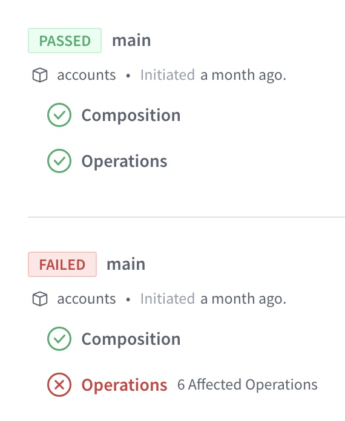

Apollo is a platform for building, managing, and scaling a **supergraph**: a unified network of your data, services, and capabilities composed into a single, all-purpose API. With just one query to your supergraph, an application client can fetch data from any combination of sources:


Clients query your supergraph with a powerful language called [GraphQL](./benefits/), which enables them to retrieve exactly the data they need with no overfetching. The architecture of your supergraph is not exposed, and clients query it from a single endpoint.

<ExpansionPanel title="See an example query and response">

<CodeColumns>

```graphql title="Example Client Query"
# This single query fetches data
# from both subgraphs shown above.
query GetCurrentUserCart {
  currentUser {
    id
    name
    cartItems {
      id
      name
      inStock
    }
  }
}
```

```json title="Example Supergraph Response"
{
  "data": {
    "currentUser": {
      "id": "abc",
      "name": "Katherine Johnson",
      "cartItems": [
        {
          "id": "123",
          "name": "Coffee thermos",
          "inStock": true
        }
      ]
    }
  }
}
```

</CodeColumns>

</ExpansionPanel>

**The supergraph is not a _replacement_ for your existing infrastructure!** Instead, it's a methodology for _interconnecting_ your existing infrastructure to make it more accessible and useful for everyone who interacts with your data.

## What's in a supergraph?

Every supergraph uses an open architecture called [**Apollo Federation**](/federation), which consists of the following parts:

* A **graph router** (also known as a gateway)
    * The graph router serves as the client-accessible entry point to your supergraph. It receives all incoming queries.
    * As its name suggests, the graph router "routes" each incoming query to the appropriate combination of **subgraphs** (see the next item). It's also responsible for combining multiple subgraph responses into a _single_ response for the client.
* One or more **subgraphs**
    * Each subgraph is itself a GraphQL API that's responsible for populating a subset of your supergraph's available data.
    * Usually, each of your existing backend services acts as a different subgraph.
* Backing **data sources** (databases, REST APIs, etc.)
    * Your subgraphs use these to populate data for incoming queries.

The diagram at the top of this page shows a basic supergraph with two subgraphs and two corresponding data sources.

The following video provides a helpful visualization of how the Apollo Federation architecture works:

<YouTube youTubeId="wRExDdgs6JU" />

## What are the benefits of a supergraph?

Adopting a supergraph significantly improves the developer experience for every team (both internal and external) that interacts with your organization's data. These improvements enable developers to ship products and features more quickly, with greater confidence in their reliability and performance.

* Many benefits of a supergraph are those provided by the GraphQL language and the Apollo Federation architecture.
    * [GraphQL benefits](./benefits/)
    * [Federation benefits](/federation/#benefits-of-federation)

* A supergraph enables the use of powerful tooling for schema management, metrics aggregation, and change validation. [Learn about Apollo Studio.](#how-do-i-manage-my-supergraph)

## How do I implement a supergraph?

To implement a supergraph, you set up its [individual parts](#whats-in-a-supergraph): the graph router and your subgraphs. Apollo provides libraries and tools for setting up each part. And more importantly, we provide tutorials to help you!

### Tutorials

* **If you're new to GraphQL**, we recommend starting your supergraph journey with the [Lift-off tutorial series](https://www.apollographql.com/tutorials/lift-off-part1/).
    * Familiarizing yourself with fundamental GraphQL concepts is an important prerequisite to getting the most out of your supergraph.
* **If you're already using GraphQL**, learn how to implement a supergraph by completing the [Voyage tutorial series](https://www.apollographql.com/tutorials/voyage-part1).
    * This series demonstrates creating a supergraph from scratch, along with converting an existing monolithic GraphQL server into a supergraph.

### Implementing the graph router

Apollo provides two libraries that can act as your graph router:

* [The Apollo Router](/router/)
    * This is a high-performance binary written in Rust that adds [minimal latency to request processing](https://www.apollographql.com/blog/announcement/backend/apollo-router-our-graphql-federation-runtime-in-rust/), even with extremely high traffic.
    * Because the Apollo Router is a precompiled binary, you don't need to write any boilerplate code around it to deploy it to your backend. All it needs is a configuration file for any behavior you want to customize.
* [Apollo Server](/federation/gateway/) with `@apollo/gateway`
    * This is Apollo's open-source Node.js GraphQL server library, which you can configure to act as a supergraph gateway.

If you get started with one of these libraries and later decide to switch to the other, you can do so without making any changes to the rest of your supergraph.

### Implementing subgraphs

Each subgraph is itself a GraphQL API. Therefore, it uses a GraphQL server library to handle queries forwarded along by your graph router.

To act as a subgraph, a GraphQL server library needs to support the [Apollo Federation subgraph specification](/federation/federation-spec/). Fortunately, many popular libraries do!

* [Apollo Server](/federation/subgraphs/) with `@apollo/subgraph`
    * This is Apollo's open-source Node.js GraphQL server library, which you can configure to act as a subgraph.
    * Apollo Server supports a variety of popular [Node.js middleware](/apollo-server/integrations/middleware/), and it works seamlessly with TypeScript.
* Any of the other server libraries listed in [Subgraph-compatible server libraries](/federation/other-servers)
    * Note that not all listed libraries support all parts of the subgraph specification.

Feel free to use whichever server library best suits your organization. Different subgraphs can even use completely different libraries, which is helpful if your various backend services use different languages.

## How do I manage my supergraph?

By unifying your infrastructure with a supergraph, you also unlock unified _tooling_ that provides visibility into the flow of data across your entire organization.

[**Apollo Studio**](https://www.apollographql.com/docs/studio/) is Apollo's cloud-based collection of tools for managing every aspect of your supergraph. Studio is essential to measuring your supergraph's performance, controlling access to it, and evolving it safely.

<YouTube youTubeId="sarXMaz3OpY" />

### Free Apollo Studio features

The Apollo Studio [Free plan](https://www.apollographql.com/pricing/) provides the following supergraph management features to every organization:

- The **schema registry**, which tracks the history of all your GraphQL schemas (for both individual subgraphs and your entire supergraph). The schema registry powers many of the other Studio features listed below.

- Automatic, zero-downtime updates to your graph router's schema and other configuration, as part of a toolset called [managed federation](/federation/managed-federation/overview/).

- [The Explorer](/studio/explorer/explorer/), a powerful GraphQL IDE that helps your team (and other teams) build and run queries against your supergraph. You can even embed the Explorer on your own website, like this!

    <EmbeddableExplorer />

- [Metrics reporting](/studio/metrics/usage-reporting/) for up to the last 24 hours (paid plans can view metrics for larger time frames):

    

- [Schema checks](/studio/schema-checks/), which enable you to verify whether proposed changes to your supergraph will cause issues with any existing client applications:

    

- Team collaboration and access management via [organizations](/studio/org/organizations/).

- [Slack notifications](/studio/notification-setup/) for schema changes and daily metrics reports.

### Paid features

These Studio features are available to organizations with a [paid Studio plan](https://www.apollographql.com/pricing/). Some features are available exclusively to an Enterprise plan.

- [Metrics reporting](/studio/metrics/usage-reporting/) for time frames beyond 24 hours
- [Metrics segmentation by distinct clients and versions](/studio/metrics/client-awareness/)
- Delivery of filtered subsets of your supergraph to different consumers via [contracts](/studio/contracts/)
- [Integration with Datadog](/studio/metrics/datadog-integration/)
- Resolver-level query tracing
- Longer data retention

## How do clients query my supergraph?

To client applications, your supergraph appears the same as any other GraphQL API. Therefore, they query it with the same client libraries!

Apollo provides GraphQL client libraries for the following platforms:

* [React / JavaScript](/react/)
    * In addition to Apollo's official React support, there are community-maintained libraries for [other popular view layers](/react/integrations/integrations/).
* [iOS](/ios/)
* [Kotlin](/kotlin/)

These are all customizable, open-source libraries with powerful caching and state management features. Client-side caching enables an application to locally replicate the parts of your supergraph that it cares about. The application can then query _itself_ for data if it's already present, which dramatically improves performance by eliminating redundant network requests.

## How do I get started?

We have loads of helpful resources to help you start your supergraph journey:

* Interactive tutorials with [Apollo Odyssey](https://www.apollographql.com/tutorials/)
    * [Lift-off](https://www.apollographql.com/tutorials/lift-off-part1) (for getting started with GraphQL)
    * [Voyage](https://www.apollographql.com/tutorials/voyage-part1) (for getting started with your supergraph)
* Quickstarts for [Apollo Federation](/federation/quickstart/setup/) and [the Apollo Router](/router/quickstart)
    * The Federation quickstart introduces many powerful Federation concepts, whereas the Router quickstart focuses on setting up the Router itself.
* An [example supergraph repo](https://github.com/apollographql/supergraph-demo-fed2) with a comprehensive README and multiple subgraph definitions

Looking for additional guidance? Share a question in our [community forums](https://community.apollographql.com/) and we'll help point you in the right direction!
