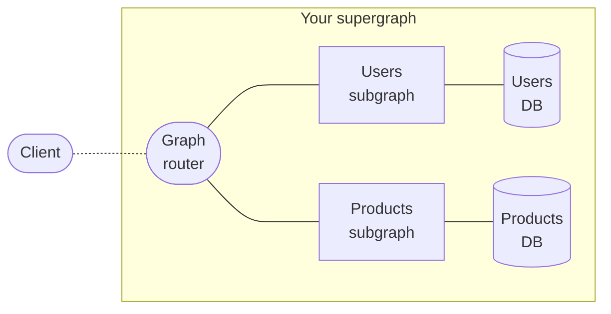

The Apollo platform helps you build, manage, and scale a **unified supergraph**: a data layer that merges your organization's backend services into a single, intuitive API. With just one query to your supergraph, an application client can fetch data from any combination of sources:



Clients query your supergraph with a powerful language called [GraphQL](./benefits/), which enables them to retrieve exactly the data they need with no overfetching. The architecture of your supergraph is not exposed, and clients query it exactly as though it were a "monolithic" GraphQL server.

<ExpansionPanel title="See an example query and response">

<CodeColumns>

```graphql title="Example Client Query"
# This single query fetches data
# from both subgraphs shown above.
query GetCurrentUserCart {
  currentUser {
    id
    name
    cartItems {
      id
      name
      inStock
    }
  }
}
```

```json title="Example Supergraph Response"
{
  "data": {
    "currentUser": {
      "id": "abc",
      "name": "Katherine Johnson",
      "cartItems": [
        {
          "id": "123",
          "name": "Coffee thermos",
          "inStock": true
        }
      ]
    }
  }
}
```

</CodeColumns>

</ExpansionPanel>

**The supergraph is not a _replacement_ for your existing infrastructure!** Instead, it's a methodology for _interconnecting_ your existing infrastructure to make it more accessible and useful for everyone who interacts with your data.

## What's in a supergraph?

Every supergraph uses an open architecture called [**Apollo Federation**](/federation), which consists of the following parts:

* A **graph router** (also known as a gateway)
    * The graph router serves as the client-accessible entry point to your supergraph. It receives all incoming queries.
    * As its name suggests, the graph router "routes" each incoming query to the appropriate combination of your subgraphs. It then combines multiple subgraph responses into a _single_ response for the client.
* One or more **subgraphs**
    * Each subgraph is itself a GraphQL API that's responsible for populating a subset of your supergraph's available data.
    * Usually, each of your existing backend services is a different subgraph.
* Backing **data sources** (databases, REST APIs, etc.)
    * Your subgraphs use these to populate data.

The diagram at the top of this page shows a basic supergraph with two subgraphs and two corresponding data sources.

## What are the benefits of a supergraph?

### Incremental adoption

Your supergraph doesn't immediately need to connect _all_ of your backend data sources or handle _all_ of your client requests. The Apollo Supergraph Platform supports (and encourages) **incremental adoption**.

As you connect more backend services and data sources, your supergraph can handle a larger and larger percentage of client data requests. Clients can continue using an existing solution for data that your supergraph doesn't yet provide.

### Distributed ownership

TODO

## How do I implement a supergraph?

To implement a supergraph, you implement its [individual parts](#whats-in-a-supergraph): the graph router and your subgraphs. Apollo provides libraries and tools for implementing each part. And more importantly, we provide tutorials to help you!

### Tutorials

* **If you're new to GraphQL**, we recommend starting your supergraph journey with the [Lift-off tutorial series](https://www.apollographql.com/tutorials/lift-off-part1/).
    * Familiarizing yourself with fundamental GraphQL concepts is an important prerequisite to getting the most out of your supergraph.
* **If you're already using GraphQL**, learn how to implement a supergraph by completing the [Voyage tutorial series](https://www.apollographql.com/tutorials/voyage-part1).
    * This series demonstrates creating a supergraph from scratch, along with converting an existing monolithic GraphQL server into a supergraph.

### The graph router

Apollo provides two libraries that can act as a graph router:

* [The Apollo Router](/router/)
    * This is a high-performance binary written in Rust that adds [minimal latency to request processing](https://www.apollographql.com/blog/announcement/backend/apollo-router-our-graphql-federation-runtime-in-rust/), even with extremely high traffic.
* [Apollo Server](/federation/gateway/) with `@apollo/gateway`
    * This is Apollo's open-source Node.js GraphQL server library, which you can configure to act as a supergraph gateway.

If you get started with one of these libraries and later decide to switch to the other, you can do so without making any changes to the rest of your supergraph.

### Subgraphs

Each subgraph is itself a GraphQL API. Therefore, it uses a GraphQL server library to handle queries passed along by the graph router.

To act as a subgraph, a GraphQL server library needs to support the [Apollo Federation subgraph specification](/federation/federation-spec/). Fortunately, many popular libraries do:

* [Apollo Server](/federation/subgraphs/) with `@apollo/subgraph`
    * This is Apollo's open-source Node.js GraphQL server library, which you can configure to act as a subgraph.
    * Apollo Server supports a variety of popular [Node.js middleware](/apollo-server/integrations/middleware/), and it works seamlessly with TypeScript.
* Any of the other server libraries listed in [Subgraph-compatible server libraries](/federation/other-servers)

Feel free to use whichever library (or combination of libraries!) best suits your organization.

## How do I manage my supergraph?

In addition to its open-source libraries, the Apollo platform provides a cloud-hosted collection of tools that help you measure your graph's performance and grow it safely. These tools are together known as [**Apollo Studio**](https://www.apollographql.com/docs/studio/).

### The schema registry

The Apollo [schema registry](https://www.apollographql.com/docs/studio/schema-registry/) powers many development tools, including Apollo Studio. By publishing your graph's schema, you can use Studio to explore your schema's structure, track its change history, and lay the foundation for many other powerful features.

### Free Apollo Studio features

- [The Explorer](https://www.apollographql.com/docs/studio/explorer/), a powerful GraphQL IDE that helps your team build and run queries against your graph:

    

- [Metrics reporting](https://www.apollographql.com/docs/studio/setup-analytics/) for up to the last 24 hours:

    

- Team collaboration via [organizations](https://www.apollographql.com/docs/studio/org/organizations/)
- [Slack notifications](https://www.apollographql.com/docs/studio/slack-integration/) for schema changes and daily metrics reports
- [Management of a federated graph](https://www.apollographql.com/docs/federation/managed-federation/overview/)

### Paid Apollo Studio features

> For details, see the [pricing page](https://www.apollographql.com/pricing/).

- [Metrics reporting](https://www.apollographql.com/docs/studio/setup-analytics/) for arbitrary timeframes
- [Metrics segmentation by distinct clients and versions](https://www.apollographql.com/docs/studio/client-awareness/)
- [Schema checks](https://www.apollographql.com/docs/studio/schema-checks/)
- [Operation safelisting](https://www.apollographql.com/docs/studio/operation-registry/)
- [Resolver-level query tracing](https://www.apollographql.com/docs/studio/performance/)
- [Integration with Datadog](https://www.apollographql.com/docs/studio/datadog-integration/)
- Longer data retention

## How do clients query my supergraph?

Your supergraph appears the same as any other GraphQL API to client applications. Therefore, client applications query it with the same client libraries!

Apollo provides GraphQL client libraries for the following platforms:

* [React / JavaScript](/react/)
    * In addition to Apollo's official React support, there are community-maintained libraries for [other popular view layers](/react/integrations/integrations/).
* [iOS](/iOS/)
* [Kotlin](/kotlin/)

These are all customizable, open-source libraries with powerful caching and state management features. Client-side caching enables an application to locally replicate the parts of your supergraph that it cares about. The application can then query _itself_ for data if it's already present, which dramatically improves performance by eliminating redundant network requests.

## How do I get started?

TODO
