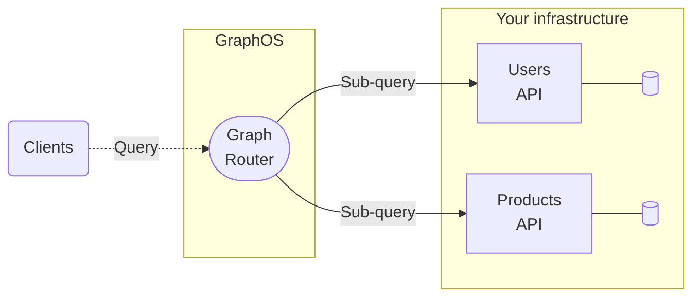
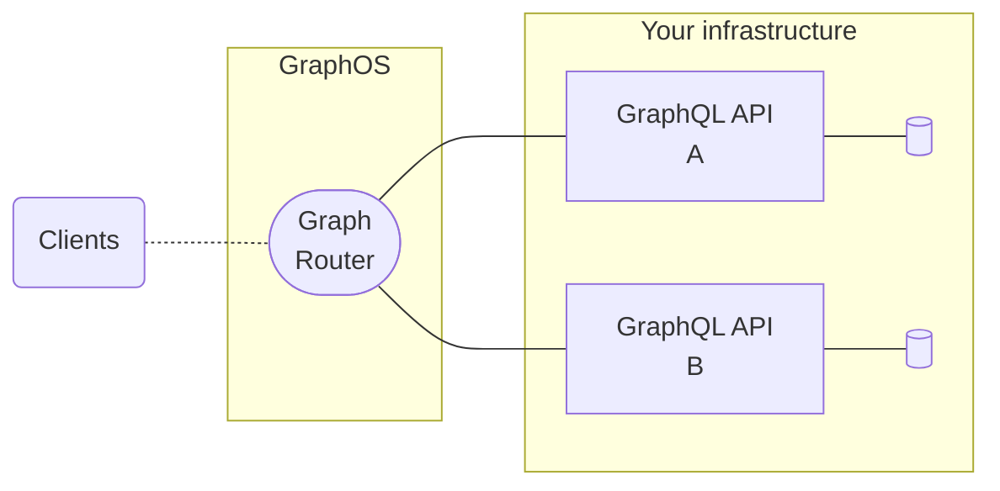

import {GraphQLIcon} from '../../../components/Icons';

Does this inline <GraphQLIcon style={{ color: '#E10098', display: 'inline-block' }} /> work?

Apollo GraphOS is the platform for building, managing, and scaling a _supergraph_: a unified network of your organization's microservices and their data sources—all composed into a single distributed API.

With one query to your supergraph's _router_, an application client can fetch data from any combination of your services:



Clients query your supergraph with a powerful language called [GraphQL](./benefits/), which enables them to retrieve exactly the data they need, with no overfetching. Your supergraph's architecture is not exposed—clients send queries to a single endpoint (your router), no matter what data they need.

<ExpansionPanel title="See an example query and response.">

<CodeColumns>

```graphql title="Example Client Query"
# This single query fetches data
# from both APIs shown above.
query GetCurrentUserWishlist {
  currentUser {
    id
    name
    wishlistedProducts {
      id
      name
      inStock
    }
  }
}
```

```json title="Example Router Response"
{
  "data": {
    "currentUser": {
      "id": "abc",
      "name": "Katherine Johnson",
      "wishlistedProducts": [
        {
          "id": "123",
          "name": "Coffee thermos",
          "inStock": true
        }
      ]
    }
  }
}
```

</CodeColumns>

</ExpansionPanel>

The supergraph is not a replacement for your existing infrastructure. Instead, it's a methodology for interconnecting your existing infrastructure, to make it more accessible and useful for everyone who interacts with your data.

## What's in GraphOS?

The GraphOS platform provides an ever-growing collection of tools and services to help you build your supergraph and scale it safely alongside your organization.

These features are core to GraphOS:

- Cloud routing
  - GraphOS automatically provisions and hosts a router for each of your supergraphs. Clients query your router instead of your individual services (also called subgraphs). This enables the router to automatically collect operation metrics that you can then visualize in GraphOS Studio.
- The schema registry
  - GraphOS tracks the schemas for all your GraphQL APIs, and it also handles composing those schemas into one supergraph schema for your router.
- Safe schema delivery
  - The [schema checks](/graphos/delivery/schema-checks/) feature of GraphOS enables you to verify whether proposed changes to one of your services will cause an issue with other services, or with any of your existing clients.
  - Whenever you update a service's schema, GraphOS composes a new supergraph schema for your router. If composition succeeds, your router automatically begins using its new schema.
  - You can view the results of each [launch](/graphos/delivery/launches/) that takes place whenever you update a service's schema, helping you resolve any issues that might occur.
- An interface for every use case
  - [GraphOS Studio](https://studio.apollographql.com?referrer=docs-content) is the primary web interface for GraphOS. Among other capabilities, you use Studio to create your organization and its supergraphs, view [schemas](/graphos/graphs/studio-features/#the-schema-page) and [metrics](/graphos/metrics/), and test out operations in [the Explorer](/graphos/explorer/).
  - [The Rover CLI](/rover/getting-started/) is the primary command-line interface for GraphOS. Among other capabilities, you use Rover to publish schemas to the registry, run schema checks from CI, and test out your supergraph within your development environment.
  - If you want to automate your own workflows outside of Studio or Rover, you can use the official [GraphOS Platform API](/graphos/platform-api) to do so. We'll expose more GraphOS capabilities through the Platform API over time.

To learn more about these and many more GraphOS features, see the [complete GraphOS documentation](/graphos/).

## What's in a supergraph?

If GraphOS is the platform for building and managing supergraphs, it's important to understand what's in a supergraph.

Every supergraph uses an open architecture called [_Apollo Federation_](/federation), which consists of the following parts:



* The graph router
    * The graph router serves as the client-accessible entry point to your supergraph. It receives all incoming queries.
    * As its name suggests, the router "routes" each incoming query to the appropriate combination of subgraphs (see the next item). It's also responsible for combining multiple subgraph responses into a single response for the client.
    * GraphOS can take care of provisioning and hosting your supergraph's router for you. 
* One or more subgraphs
    * Your GraphQL APIs each contribute a subset of your supergraph's available data, so we call them _subgraphs_ Clients don't query your subgraphs directly—only your router does.
    * Usually, each of your existing microservices acts as a different subgraph.
* Backing data sources (databases, REST APIs, etc.)
    * Your subgraphs use these to populate data for incoming queries.

The diagram above shows a basic supergraph with a GraphOS-managed router, two subgraphs, and two corresponding data sources.

The following video provides a helpful visualization of how the Apollo Federation architecture helps organizations scale with their data:

<YouTube youTubeId="wRExDdgs6JU" />

## Why adopt a supergraph?

Adopting a supergraph significantly improves the developer experience for every team (both internal and external) that interacts with your organization's data. These improvements enable developers to ship products and features more quickly, with greater confidence in their reliability and performance.

* Many benefits of a supergraph are those provided by the GraphQL language and the Apollo Federation architecture.
    * [GraphQL benefits](./benefits/)
    * [Federation benefits](/federation/#benefits-of-federation)

* A supergraph enables the use of powerful tooling for schema management, metrics aggregation, and change validation. [Learn more about GraphOS tooling.](/graphos/)

## How do I implement a supergraph?

To implement a supergraph, you set up its [individual parts](#whats-in-a-supergraph): the graph router and your subgraphs. Apollo provides libraries and tools for setting up each part. And more importantly, we provide tutorials to help you.

### Tutorials

- If you're new to GraphQL, we recommend starting your supergraph journey with the [Lift-off tutorial series](https://www.apollographql.com/tutorials/lift-off-part1/).
    - Familiarizing yourself with fundamental GraphQL concepts is an important prerequisite to getting the most out of your supergraph.
- If you're already using GraphQL, we recommend jumping in with your first GraphOS cloud supergraph. [See the quickstart.](/graphos/quickstart/cloud/)
    - You can also check out the [Voyage tutorial series](https://www.apollographql.com/tutorials/voyage-part1) to learn how to create a complete supergraph from scratch.

### Implementing the router

If you [create a cloud supergraph](/graphos/quickstart/cloud/) with GraphOS, Apollo provisions and hosts your supergraph's router for you.

For enterprise organizations that need to run their router in their own infrastructure, Apollo provides two libraries that can act as a router:

- [The Apollo Router](/router/) (strongly recommended)
    - This is a high-performance binary written in Rust that adds [minimal latency to request processing](https://www.apollographql.com/blog/announcement/backend/apollo-router-our-graphql-federation-runtime-in-rust/), even with extremely high traffic.
    - Because the Apollo Router is a precompiled binary, you don't need to write any boilerplate code around it to deploy it to your backend. All it needs is a configuration file for any behavior you want to customize.
    - Cloud supergraph routers use the Apollo Router under the hood.
- [Apollo Server](/apollo-server/using-federation/apollo-gateway-setup) with `@apollo/gateway`
    - This is Apollo's open-source Node.js GraphQL server library, which you can configure to act as a supergraph gateway.

If you get started with one of these libraries and later decide to switch to the other, you can do so without making any changes to the rest of your supergraph.

### Implementing subgraphs

Each subgraph is itself a GraphQL API. Therefore, it uses a GraphQL server library to handle queries forwarded along by your graph router.

To act as a subgraph, a GraphQL server library needs to support the Apollo Federation subgraph specification. Fortunately, many popular libraries do. See [Federation-compatible subgraph implementations](/federation/building-supergraphs/supported-subgraphs).

Feel free to use whichever server library best suits your organization. Different subgraphs can even use completely different libraries, which is helpful if your various microservices use different languages.

## How do clients query my supergraph?

To client applications, your supergraph appears the same as any other GraphQL API. Therefore, they query it with the same client libraries.

Apollo provides GraphQL client libraries for the following platforms:

* [React / JavaScript](/react/)
    * In addition to Apollo's official React support, there are community-maintained libraries for [other popular view layers](/react/integrations/integrations/).
* [iOS](/ios/)
* [Kotlin](/kotlin/)

These are all customizable, open-source libraries with powerful caching and state management features. Client-side caching enables an application to locally replicate the parts of your supergraph that it cares about. The application can then query itself for data if it's already present, which dramatically improves performance by eliminating redundant network requests.

## Where do I start?

We have loads of helpful resources to help you start your supergraph journey:

- Interactive tutorials with [Apollo Odyssey](https://www.apollographql.com/tutorials/)
    - [Lift-off](https://www.apollographql.com/tutorials/lift-off-part1) (for getting started with GraphQL)
    - [Voyage](https://www.apollographql.com/tutorials/voyage-part1) (for getting started with your supergraph)
- A quickstart for [creating your cloud supergraph with GraphOS](/graphos/quickstart/cloud/)
    - Connect your own GraphQL API, or try out the platform with Apollo-hosted example subgraphs.
- An [example supergraph repo](https://github.com/apollographql/supergraph-demo-fed2) with a detailed README and multiple subgraph definitions

Looking for additional guidance? Share a question in our [community forums](https://community.apollographql.com/) and we'll help point you in the right direction.
