GraphOS Studio provides tools to help multiple teams collaborate on a supergraph and its subgraphs.

## Supergraph variants

Each [variant](./#variants) of a Studio supergraph has its own subgraph schemas, supergraph schema, change history, and metrics.

Different variants of a supergraph can even have completely different sets of subgraphs:

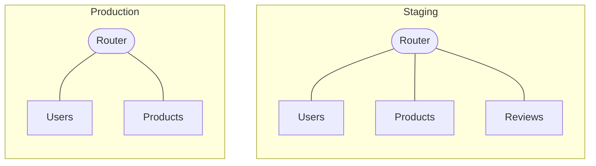

This helps you test out adding new subgraphs (or removing existing ones) in non-production environments.

When you [publish a subgraph's schema](../delivery/publishing-schemas/#publish-subgraph-schema), you can specify which variant of the supergraph you're publishing that schema to.

### Adding a variant

You can add a new variant to your existing GraphOS supergraph in the following ways:

- [In GraphOS Studio](#adding-a-variant-in-graphos-studio) (cloud supergraphs only)
- [Via the Rover CLI](#adding-a-variant-via-the-rover-cli)

#### Adding a variant in GraphOS Studio

<Note>

This method of adding a variant is available only to cloud supergraphs. For other graph types, see [Adding a variant via the Rover CLI](#adding-a-variant-via-the-rover-cli)

</Note>

1. Go to your supergraph's Settings page in Studio and navigate to **This Graph > Variants**:

   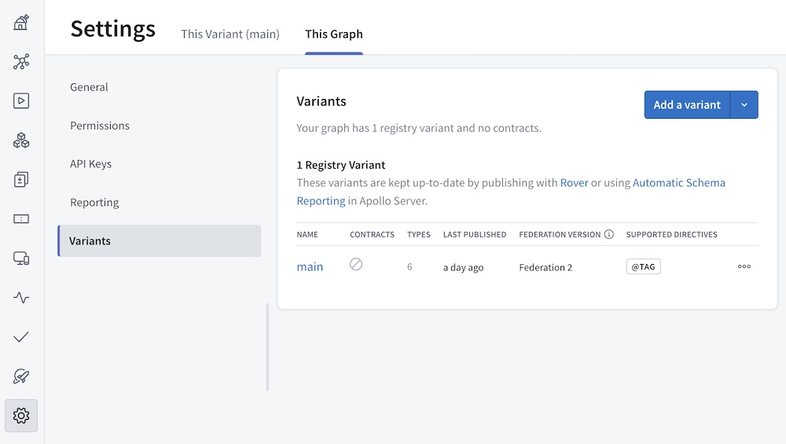

2. Click **Add a variant**. The following dialog appears:

   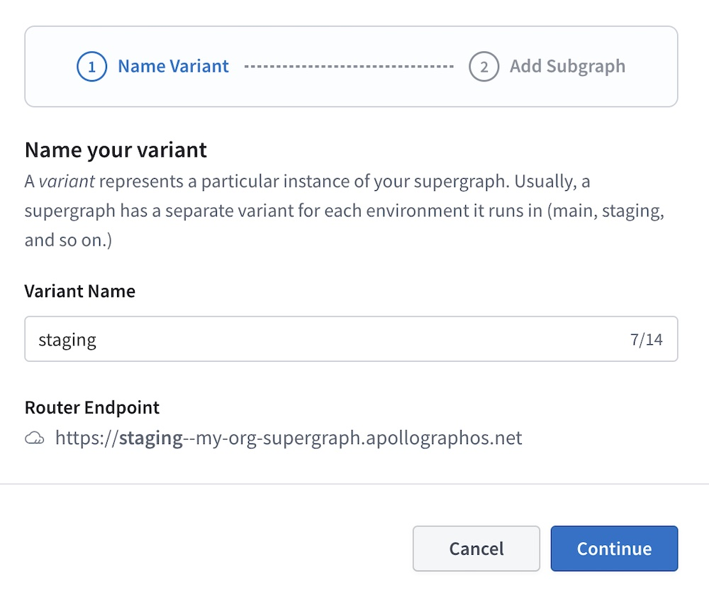

3. Provide a **Variant Name** and click **Continue**. The next step in the dialog appears:

   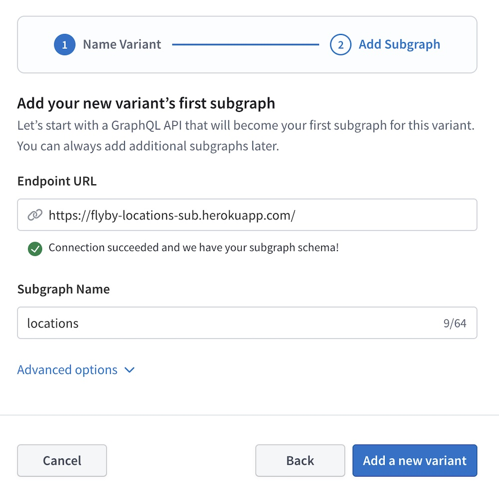

4. Provide your first subgraph's **Routing URL** (this is the URL that your new variant's router will use to communicate with the subgraph), along with a **Subgraph Name**.

   - Creating a new supergraph variant always requires also creating the first subgraph for that variant.

5. If Studio can't fetch your subgraph's schema automatically from the routing URL, click **Advanced options** to provide the schema another way (such as by pasting the schema directly or introspecting a locally running server).

6. Click **Add a new variant**. When the action completes, your new variant is listed on your organization's homepage in Studio.

#### Adding a variant via the Rover CLI

To add a new variant to your supergraph with Rover, you publish its first subgraph's schema! To do this, you use the exact same Rover command as [updating an existing subgraph](../quickstart/next-steps/#update-a-subgraph-schema). The only difference is that you provide the name of the new variant to the command.

[Learn about publishing subgraph schemas.](../delivery/publishing-schemas/#publish-subgraph-schemas)

## Managing subgraphs

After you create a [cloud supergraph](./#cloud-supergraphs) (or a new variant of one), you can view a list of its associated subgraphs from the variant's Subgraphs page:


The list includes each subgraph's name and routing URL, along with type and field counts for each subgraph's schema.

### Adding a new subgraph

You can add your new subgraph to your GraphOS supergraph in the following ways:

- [In GraphOS Studio](#adding-a-subgraph-in-graphos-studio) (cloud supergraphs only)
- [Via the Rover CLI](#adding-a-subgraph-via-the-rover-cli)

#### Adding a subgraph in GraphOS Studio

<Note>

This method of adding a subgraph is available only to cloud supergraphs. For other graph types, see [Adding a subgraph via the Rover CLI](#adding-a-subgraph-via-the-rover-cli)

</Note>

1. Go to your variant's Subgraphs page in Studio:

   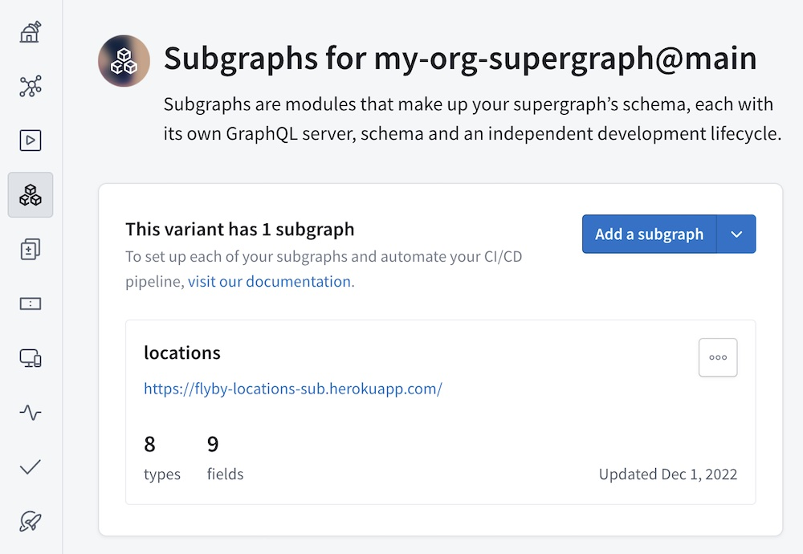

2. Click **Add a subgraph**. The following dialog appears:

   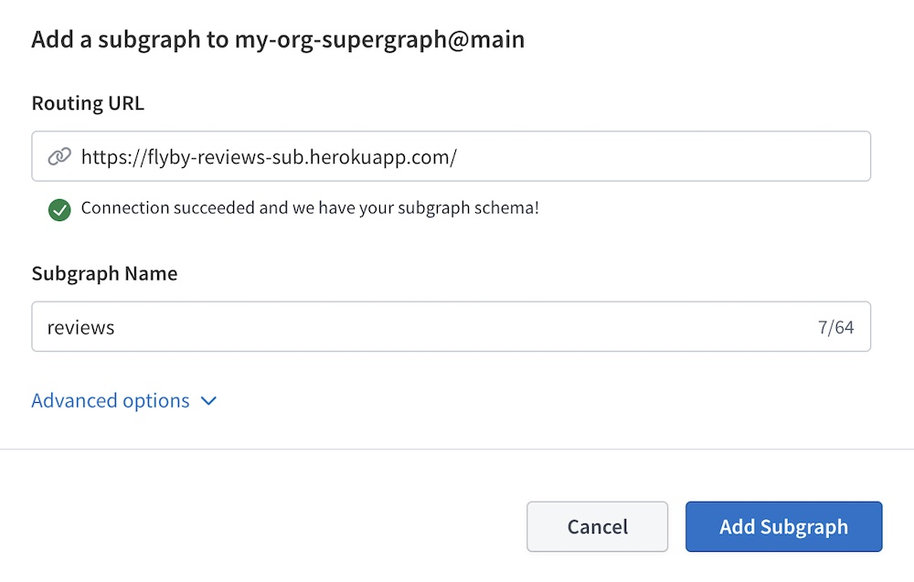

3. Provide your subgraph's **Routing URL** (this is the URL that your supergraph's router will use to communicate with the subgraph), along with a **Subgraph Name**.

4. If Studio can't fetch your subgraph's schema automatically from the routing URL, click **Advanced options** to provide the schema another way (such as by pasting the schema directly or introspecting a locally running server).

5. Click **Add Subgraph**. When the action completes, your new subgraph is listed on the Subgraphs page.

#### Adding a subgraph via the Rover CLI

To add a subgraph to your supergraph with Rover, you publish the subgraph's schema! To do this, you use the exact same Rover command as [updating an existing subgraph](../quickstart/next-steps/#update-a-subgraph-schema). The only difference is that you provide the name of the new subgraph to the command.

[Learn about publishing subgraph schemas.](../delivery/publishing-schemas/#publish-subgraph-schemas)

### Modifying a subgraph

From your variant's Subgraphs page, you can modify an existing subgraph's routing URL:

1. Open the "◦◦◦" menu for the subgraph you want to modify:

   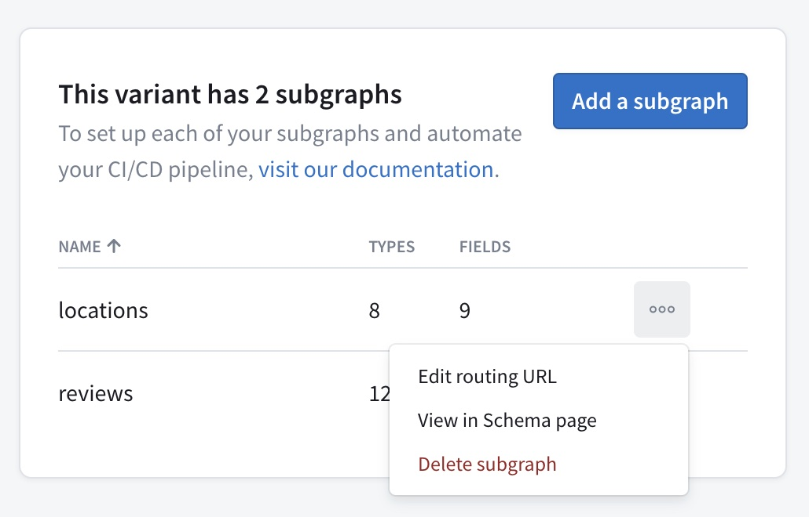

2. Click **Edit routing URL**.
3. In the dialog that appears, provide a new URL and click **Update**.
   - Your router automatically begins using the new URL to communicate with your subgraph.

If you need to make any other modifications to an existing subgraph, use the Rover CLI. [Learn about `rover subgraph` commands.](/rover/commands/subgraphs)

### Deleting a subgraph

<Caution>

**Deleting a subgraph is dangerous!** Read this section fully before deleting a subgraph.

</Caution>

You can delete an existing subgraph from a variant of your cloud supergraph. If you do:

1. The variant automatically attempts to compose an updated supergraph schema using the schemas from all remaining subgraphs.

   - Studio displays the result of this attempt, and you can cancel the deletion if there are errors.

2. **If composition succeeds,** the variant's router automatically begins using the updated supergraph schema. This means clients can no longer query the router for fields that are defined only in the deleted subgraph.

   **If composition fails,** the router continues using its existing supergraph schema. This means clients can continue querying the router for fields from the deleted subgraph, until the remaining subgraph schemas are updated to compose successfully.

#### ⚠️ Important considerations

- **Deleting a subgraph can break existing clients!** This action is equivalent to removing all the subgraph's types and fields from your supergraph (unless they're also defined in another subgraph). If a client sends an operation that includes any of those types and fields, the router will reject that operation.

  - To help you remove schema definitions safely, learn about [schema checks](../delivery/schema-checks/).

- Deleting a subgraph in Studio has no effect on your actual running subgraph instance. It only removes your router's knowledge of that instance and its corresponding schema fields.

#### Steps to delete within Studio

1. Go to the Subgraphs page for the subgraph's corresponding variant.

2. Open the "◦◦◦" menu for the subgraph you want to delete:

   

3. Click **Delete subgraph**. Studio attempts to compose a new supergraph schema that doesn't include the subgraph you want to delete.

4. A confirmation dialog appears that displays any composition errors that occurred:

   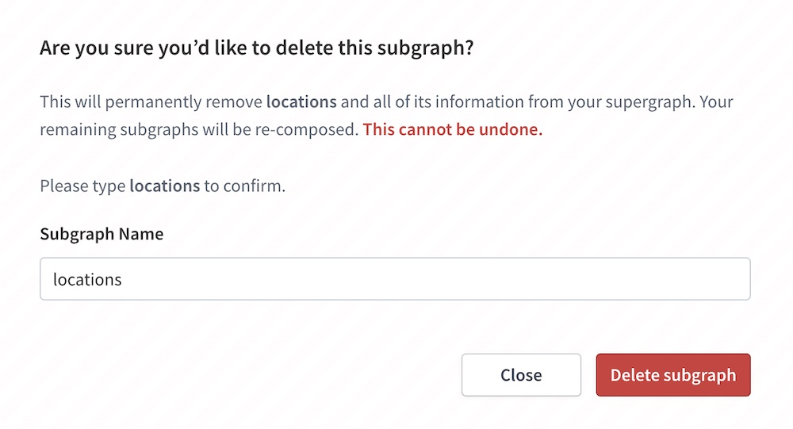

   If you're sure you want to delete the subgraph, enter its name and click **Delete subgraph**.

## Viewing a field's originating subgraph

The **Schema > Reference** page in Studio displays a table of your supergraph's types and fields. This table includes a **Subgraph** column, which lists the subgraphs that define each type and field:

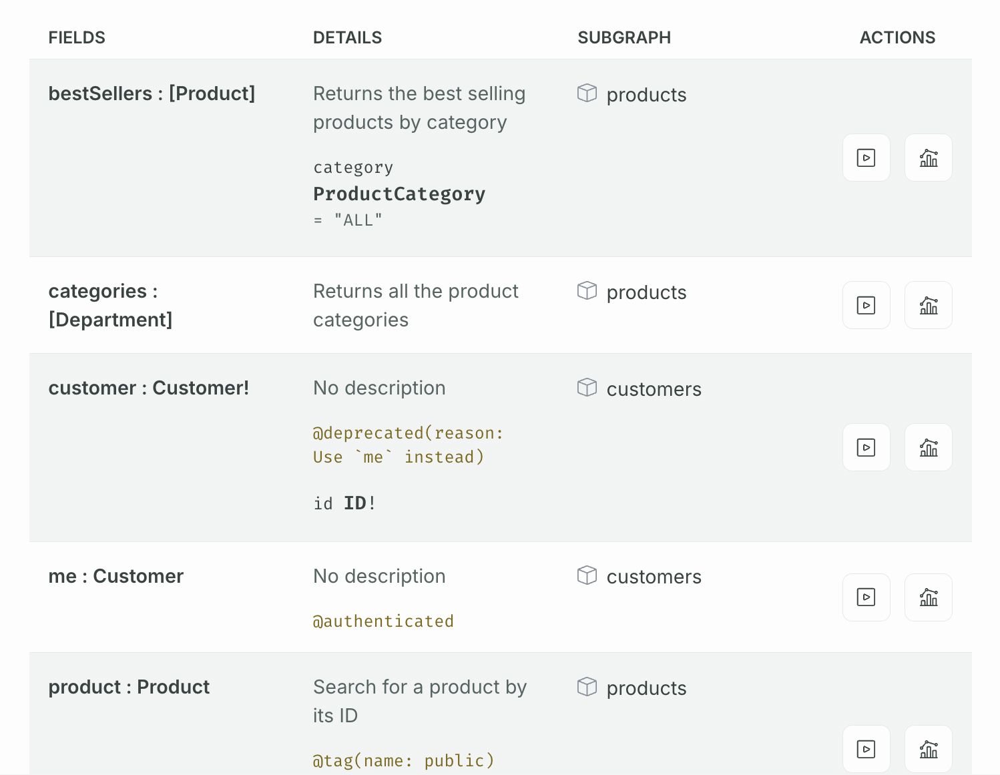

Clicking the subgraph link for a type or field takes you to the line where it's defined in the corresponding subgraph schema:

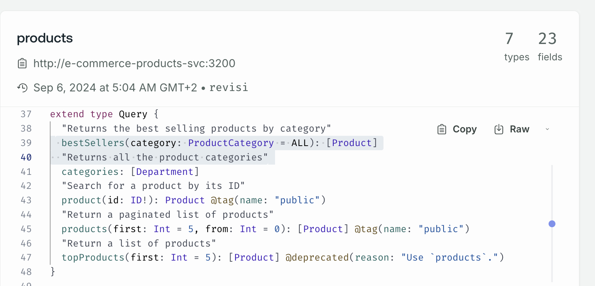

If you're using [the `@contact` directive](#contact-info-for-subgraphs) to specify owner contact information for your subgraphs, hovering over a subgraph name displays its contact information, enabling you to follow up with the appropriate team:

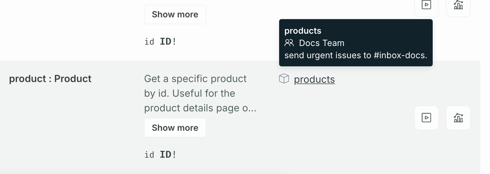

## Viewing subgraph SDL

The **Schema > SDL** page in Studio displays the raw SDL for each schema type associated with your supergraph—an API schema, a supergraph schema, and subgraph schemas.

From this page, you can:

- View metadata about the composed supergraph, along with metadata about each subgraph (such its endpoint URL and most recent schema registration date)
- Identify which subgraphs define any type or field in your API and share a link with team members
- Search for types and fields
- Download a copy of your subgraph's SDL for local development
- Filter out comments and deprecated fields for improved scanning

<Note>

Organization members with the [**Consumer** role](../org/members#organization-wide-member-roles) can only view the API schema. **Observers**, **Documenters**, **Contributors**, **Graph Admins**, and **Org Admins** can view all schema types.

</Note>

## Contact info for subgraphs

You can use the `@contact` directive to add your team's contact info to a subgraph schema. This info is displayed in Studio, which helps other teams know who to contact for assistance with the subgraph:

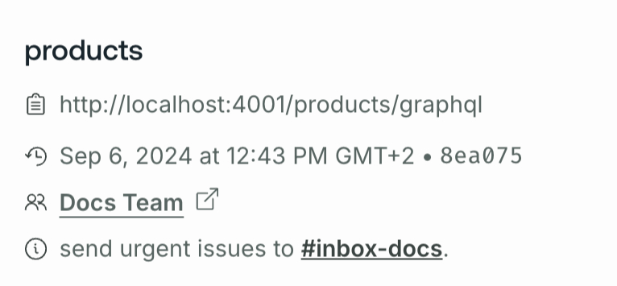

The contact info includes a name (of a team or individual), along with an optional description and custom URL.

### Adding the `@contact` directive to your subgraph

To use the `@contact` directive in your subgraph schema, you first need to define the directive in your schema. Add the following definition to each of your subgraph schemas:

```graphql title="schema.graphql"
directive @contact(
  "Contact title of the subgraph owner"
  name: String!
  "URL where the subgraph's owner can be reached"
  url: String
  "Other relevant notes can be included here; supports markdown links"
  description: String
) on SCHEMA
```

You can now apply the `@contact` directive to each subgraph schema's special `schema` object. If your schema doesn't already define this object, you can add it like so:

```graphql title="schema.graphql"
extend schema
  @contact(
    name: "Acephei Server Team"
    url: "https://myteam.slack.com/archives/teams-chat-room-url"
    description: "send urgent issues to [#oncall](https://yourteam.slack.com/archives/oncall)."
  )
```

#### Supported `@contact` fields

<table class="field-table">
  <thead>
    <tr>
      <th>Name /<br/>Type</th>
      <th>Description</th>
    </tr>
  </thead>

<tbody>

<tr class="required">
<td>

##### `name`

`String!`

</td>
<td>

**Required.** The name of the person, people, or team responsible for the subgraph.

</td>
</tr>

<tr>
<td>

##### `url`

`String`

</td>
<td>

The URL where the subgraph's owner can be reached. This might be the URL of a chat room or forum, or it could be an email address.

</td>
</tr>

<tr>
<td>

##### `description`

`String`

</td>
<td>

Provides any additional helpful details about working with this subgraph or contacting its owner.

This field supports Markdown-formatted links.

</td>
</tr>

</tbody>
</table>

#### Known `@contact` limitations

- To provide the `@contact` directive to Apollo, you must publish your subgraph schemas by providing a local `.graphql` file as the `--schema` option of [`rover subgraph publish`](../delivery/publishing-schemas/).
  - If you provide an introspection result to the command instead, the `@contact` directive is **not** included in that result.

### Viewing contact info

After you publish a subgraph schema that includes the `@contact` directive, the contact information is included in the metadata shown in Studio's **Schema > SDL** tab:


In the **Schema > Reference** tab, you'll also see a contact card when you hover over the subgraph link of a type or field:

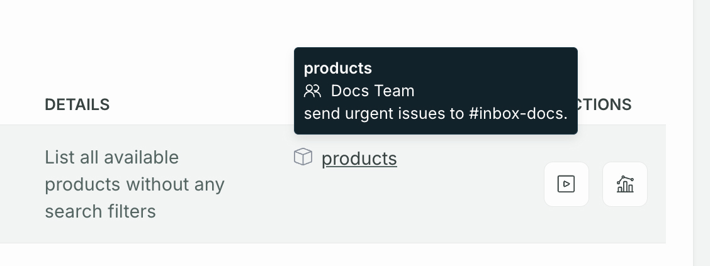

## Schema tagging

In your subgraph schemas, you can use the `@tag` directive to tag a type or field with an arbitrary string value:

```graphql {4} title="products.graphql"
type Product {
  id: ID!
  name: String!
  codename: String! @tag(name: "internal")
}
```

By default, these tags are removed from the [API schema](/federation/federated-types/overview/#api-schema) that's generated as part of composition. This means that tag information isn't visible to clients querying your supergraph.

If tag information should be visible to clients (for example, to help document your API), you can enable this for a variant in Studio with the following steps:

1. Go to the **Settings** page for your variant in GraphOS Studio.
2. On the **General** tab, click **Edit Configuration**. The Update Build Configuration dialog appears.
3. If you have a Federation 1 supergraph, enable the toggle for the `@tag` directive under **Directives** (this step isn't necessary for Federation 2 supergraphs).
4. Under **Build Settings**, enable the toggle labeled **Show all uses of @tag directives to consumers in Schema Reference and Explorer**.
5. Click **Save**.

After you make your `@tag` directives visible, you can view them inline with both the Schema and Explorer tabs in Studio.

In the **Schema > Reference** tab, tags are shown inline with each type and field:

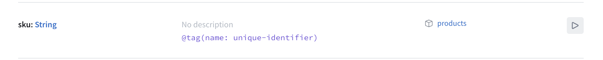

Tags are also visible in the Explorer's Documentation tab:

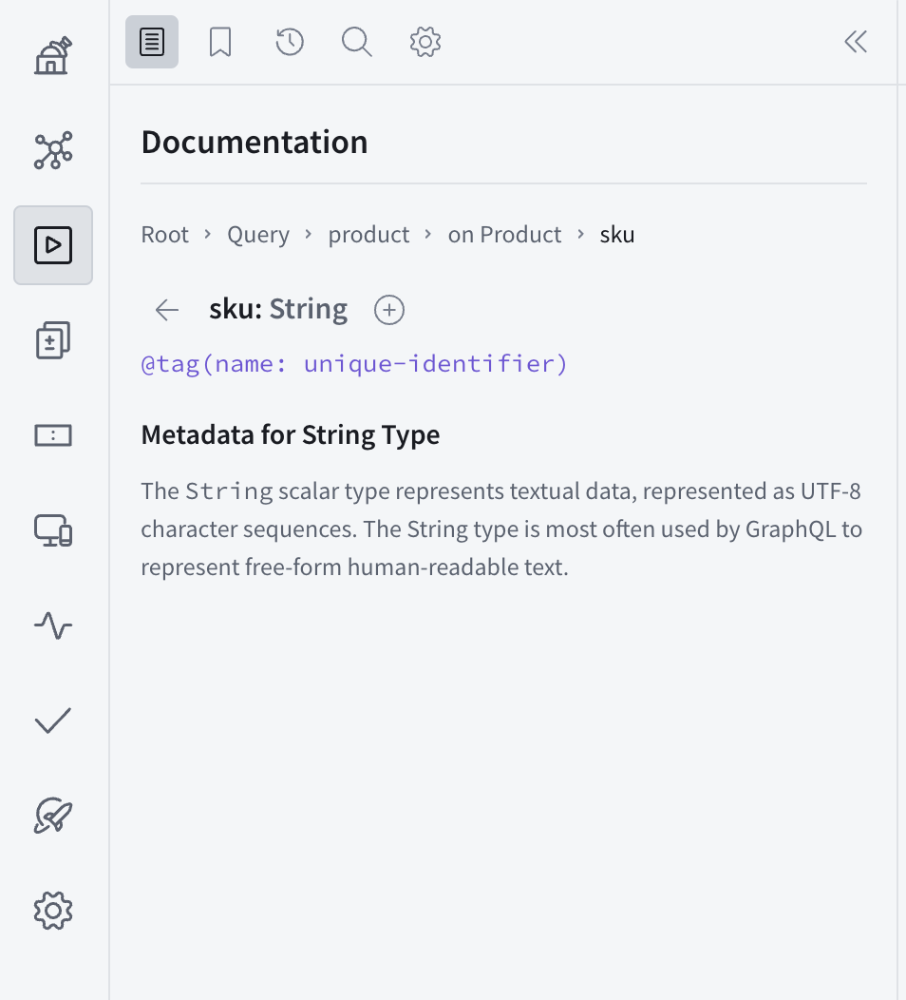

## Supergraph support in the Explorer

The [GraphOS Studio Explorer](../explorer/) provides enhanced support for working with supergraphs:

- You can preview how your supergraph's router resolves data for an operation by inspecting the operation's [query plan](/federation/query-plans) in the Response pane.
- While you're building operations in the Explorer, you can see which subgraph each field of your operation originates in by enabling subgraph hints from the Explorer's Settings tab.

## Viewing composition errors

If a supergraph's most recent set of subgraph schemas failed to compose, a **BUILD FAILED** label is shown at the top of the supergraph's page in Studio:


You can click this label to view the errors that must be resolved before composition can succeed. Refer to the [composition error reference](/federation/errors/) for more information.