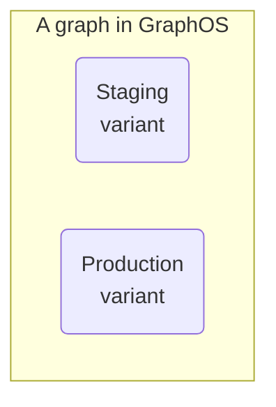
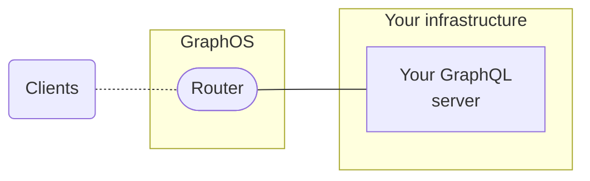
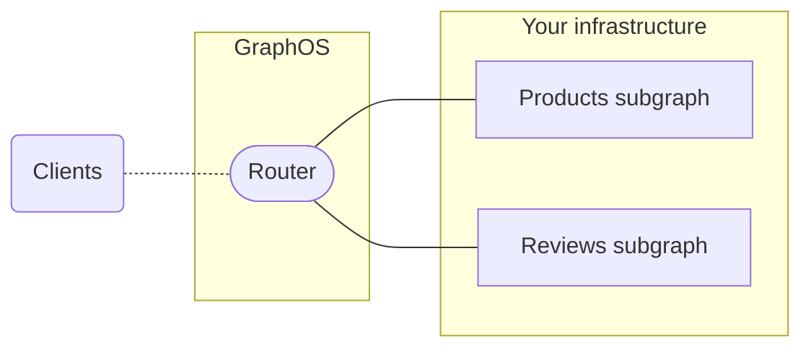
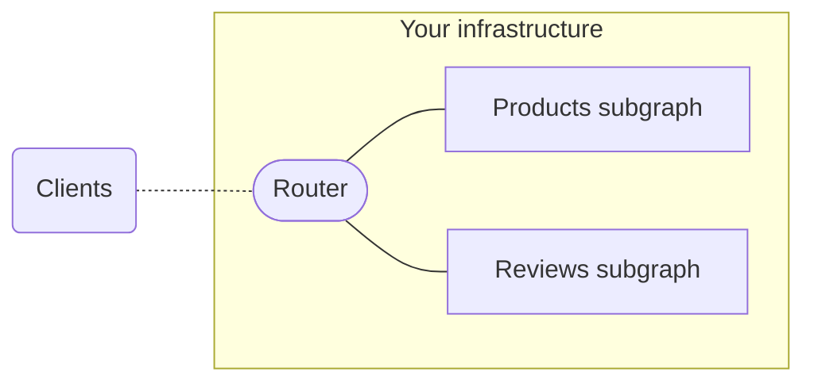
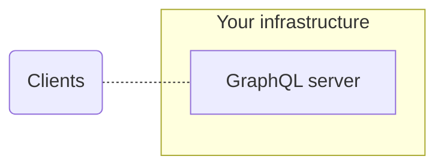
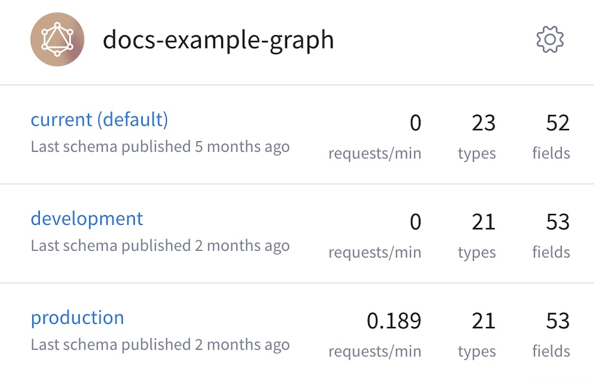

As its name suggests, **GraphOS** is a platform for building and managing **graphs**. Each graph corresponds to a GraphQL service in your organization.

A GraphQL service usually runs in more than one environment (such as staging or production), so every graph in GraphOS has one or more **variants** that each correspond to one environment:

Each variant of a graph keeps track of its own separate GraphQL schemas and operation metrics.

## Graph types

Every graph in GraphOS is one of these graph types:

<table>

<thead>
<tr>
<th>
Graph type
</th>

<th>
Description
</th>
</tr>
</thead>
<tbody>
<tr>
<td>

[Cloud supergraph](#cloud-supergraphs)

</td>
<td>

A supergraph consisting of:

* A GraphOS-hosted **router**
* One or more **subgraphs** hosted in your infrastructure

**Recommended** for all organizations getting started with GraphOS.

</td>
</tr>

<tr>
<td>

[Self-hosted supergraph](#self-hosted-supergraphs) (enterprise only)

</td>
<td>

A supergraph consisting of:

* A **router** hosted in your infrastructure
* One or more **subgraphs** hosted in your infrastructure

Recommended for enterprise organizations that require full customization of their router, usually for advanced performance or data compliance reasons.

</td>
</tr>

<tr>
<td>

[Monograph](#monographs)

</td>
<td>

**Not recommended.** A single GraphQL service hosted in your infrastructure with _no_ router.

</td>
</tr>

</tbody>

</table>

### Cloud supergraphs

> Cloud supergraphs require an Apollo organization on the **Serverless (Free)** or **Serverless** plan. [Learn more about plans.](../org/plans/)

**Cloud supergraphs** are recommended for every organization that's getting started with GraphOS. For every variant of a cloud supergraph, GraphOS provisions and manages a **router** that acts as the variant's public endpoint. Application clients communicate with this endpoint instead of communicating directly with your GraphQL server(s):

The router automatically reports certain operation metrics to GraphOS, so you don't need to configure this reporting in your GraphQL servers.

> [Learn more about cloud routing.](../routing/cloud/)

Cloud supergraphs use an architecture called [Apollo Federation](/federation/). With federation, you can distribute your supergraph's capabilities across _multiple_ GraphQL services, which are known as **subgraphs**. The router executes client operations across multiple subgraphs as needed:

Even if your API currently uses only _one_ GraphQL server, a cloud supergraph helps you add more subgraphs later as your organization grows.

> [Get started with a cloud supergraph.](../quickstart/cloud/)

### Self-hosted supergraphs

> ⚠️ **Self-hosted supergraphs are a feature of Enterprise plans.** If you need to host your supergraph's router in your own infrastructure, please [contact us](https://www.apollographql.com/contact-sales/).

With a self-hosted supergraph, GraphOS does _not_ provision a router for your supergraph. Instead, you host your supergraph's router in your own infrastructure:

Your self-hosted router is an instance of [the Apollo Router](/router/) (cloud supergraphs use the Apollo Router under the hood).

> [See the Apollo Router docs.](/router/)

Self-hosted supergraphs provide full control over your router, but they also require handling its deployment and management. Before you adopt this graph type, make sure you have the necessary team structure to properly manage an additional service in your infrastructure.

> [Get started with a self-hosted supergraph.](../quickstart/self-hosted/)

### Monographs

A **monograph** is a graph that consists of a single GraphQL server with _no_ router:

> ⚠️ **We strongly recommend _against_ monographs!** A monograph introduces significant technical _and_ logistical scaling issues as more teams contribute to your graph and its schema.
>
> Additionally, the router provides essential GraphOS functionality beyond support for multiple subgraphs: it also enables powerful features like [`@defer` support](/router/executing-operations/defer-support/) and straightforward [metrics reporting](../metrics/).

## Creating graphs

**To create a cloud supergraph,** see the [GraphOS quickstart](../quickstart/cloud/).

**To create a _non_-cloud graph** (i.e., a self-hosted supergraph or a monograph), see the instructions for your organization's [plan type](../org/plans/):

<ExpansionPanel title="Serverless plans">

1. Go to your organization's **Graphs** tab in [Apollo Studio](https://studio.apollographql.com/).

    - **If you see this dialog...**

        

        ...then click **Coming from Apollo Odyssey, or want to connect a self-managed router?**

    - **Otherwise,** find the following notice in the bottom-right corner of the page:

        

        Click **Head over to our classic graph flow**.

    In either case, Studio displays the following dialog for creating a graph:

    

2. Specify an organization and title for your graph.

3. Specify your **Graph Architecture**:

    * To create a self-hosted supergraph, leave this as **Supergraph (default)**.
    * To create a monograph, switch this to **Monolith**.

4. Click **Next**. A dialog like the following appears (the details differ depending on which **Graph Architecture** you're using):

    

5. **If you're creating a self-hosted supergraph,** select the version of Apollo Federation you're using from the **Supergraph Pipeline Track** dropdown.

Your graph has been created, and it appears in the **Classic Graphs** section of your **Graphs** tab.

Next, you need to publish your graph's schema(s) to Apollo using the Rover CLI. For details, see [Publishing schemas to GraphOS](../delivery/).

</ExpansionPanel>

<ExpansionPanel title="Enterprise and legacy plans">

1. Go to your organization's **Graphs** tab in [Apollo Studio](https://studio.apollographql.com/).

2. Click **New Graph** in the top right. Studio displays the following dialog:

    

3. Specify an organization and title for your graph.

4. Specify your **Graph Architecture**:

    * To create a self-hosted supergraph, leave this as **Supergraph (default)**.
    * To create a monograph, switch this to **Monolith**.

5. Click **Next**. A dialog like the following appears (the details differ depending on which **Graph Architecture** you're using):

    

6. **If you're creating a self-hosted supergraph,** select the version of Apollo Federation you're using from the **Supergraph Pipeline Track** dropdown.

Your graph has been created.

Next, you need to publish your graph's schema(s) to Apollo using the Rover CLI. For details, see [Publishing schemas to GraphOS](../delivery/).

</ExpansionPanel>

## Variants

To distinguish between instances of the same graph running in different environments (such as staging and production), you define multiple **variants** of your graph. Each variant has its own schemas, along with its own change history and metrics.

Each of your graph's variants is shown in [Apollo Studio](https://studio.apollographql.com):

### Creating a variant

See [this section](./federated-graphs/#adding-a-variant).

## Publishing schemas

See [Publishing schemas to GraphOS](../delivery/).
