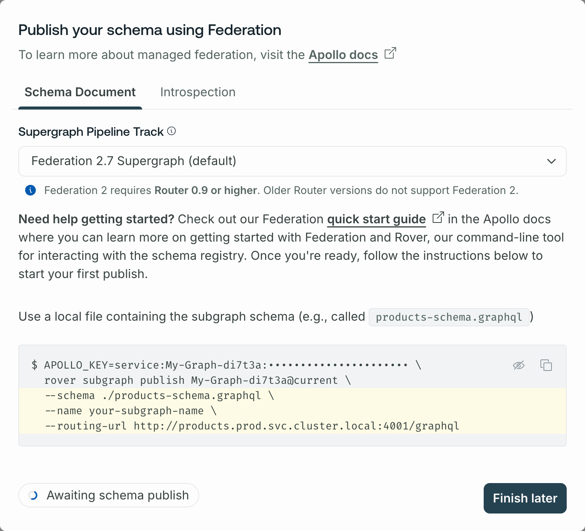

GraphOS is a platform for building and managing _graphs_. Each graph corresponds to a GraphQL service in your organization.

A GraphQL service usually runs in more than one environment—for example, staging or production—so every graph in GraphOS has one or more _variants_ that each correspond to one environment:

Each variant of a graph keeps track of its own separate GraphQL schemas and operation metrics.

## Graph types

Every graph in GraphOS is one of these graph types:

<table>

<thead>
<tr>
<th>
Graph type
</th>

<th>
Description
</th>
</tr>
</thead>
<tbody>
<tr>
<td>

[Cloud supergraph](#cloud-supergraphs)

</td>
<td>

A supergraph consisting of:

- A GraphOS-hosted runtime
- One or more subgraphs hosted in your infrastructure

Recommended for all organizations getting started with GraphOS.

</td>
</tr>

<tr>
<td>

[Self-hosted supergraph](#self-hosted-supergraphs)

(Enterprise only)

</td>
<td>

A supergraph consisting of:

- A runtime hosted in your infrastructure
- One or more subgraphs hosted in your infrastructure

Recommended for enterprise organizations that require full customization of their runtime, usually for advanced performance or data compliance reasons.

</td>
</tr>

<tr>
<td>

[Monograph](#monographs)

(Enterprise only)

</td>
<td>

A single GraphQL service hosted in your infrastructure with no runtime.

⚠️ Not recommended.

</td>
</tr>

</tbody>

</table>

### Cloud supergraphs

<Note>

Cloud supergraphs require an Apollo organization on the Serverless (free or paid) or Dedicated plan.

</Note>

Cloud supergraphs are recommended for every organization that's getting started with GraphOS. For every variant of a cloud supergraph, GraphOS provisions and manages a runtime that acts as the variant's public endpoint. Application clients communicate with this endpoint instead of communicating directly with your GraphQL server(s):

The runtime automatically reports certain operation metrics to GraphOS, so you don't need to configure this reporting in your GraphQL servers.

<Tip>

[Learn more about cloud routing.](../cloud-routing)

</Tip>

Cloud supergraphs use an architecture called [Apollo Federation](/federation/). With federation, you can distribute your supergraph's capabilities across multiple GraphQL services, which are known as subgraphs. The runtime executes client operations across multiple subgraphs as needed:

Even if your API currently uses only one GraphQL server, a cloud supergraph helps you add more subgraphs later as your organization grows.

  <ButtonLink
    href="/graphos/quickstart/cloud/"
    style={{
      marginRight: '10px'
    }}
  >
    Get started with a cloud supergraph
  </ButtonLink>

### Self-hosted supergraphs

<EnterpriseFeature>

Self-hosted supergraphs are an [Enterprise feature](/graphos/enterprise/) for organizations with advanced performance or compliance requirements. If your organization doesn't currently have an Enterprise plan, you can test out this functionality by signing up for a free [Enterprise trial](https://studio.apollographql.com/signup?type=enterprise-trial&referrer=docs-content).

</EnterpriseFeature>

With a self-hosted supergraph, GraphOS does not provision a runtime for your supergraph. Instead, you host your supergraph's runtime in your own infrastructure:

Your self-hosted runtime is an instance of [the Apollo Router](/router/) (cloud supergraphs use the Apollo Router under the hood).

Self-hosted supergraphs provide full control over your runtime, but they also require handling its deployment and management. Before you adopt this graph type, make sure you have the necessary team structure to properly manage an additional service in your infrastructure.

  <ButtonLink
    href="../quickstart/self-hosted/"
    style={{
      marginRight: '10px'
    }}
  >
    Get started with a self-hosted supergraph
  </ButtonLink>

### Monographs

<EnterpriseFeature>

Monographs require an Apollo organization on the Enterprise plan.

</EnterpriseFeature>

A monograph is a graph that consists of a single GraphQL server with no runtime:

<Caution>

Apollo strongly recommends against monographs. A monograph introduces technical and logistical scaling issues as more teams contribute to your graph and its schema.

Additionally, the runtime provides essential GraphOS functionality beyond support for multiple subgraphs. It also enables powerful features like [`@defer` support](/router/executing-operations/defer-support/) and straightforward [metrics reporting](../metrics/).

</Caution>

## Creating graphs

You can create a cloud supergraph or a _non_-cloud supergraph (self-hosted or monograph).

<Tabs labels={['Cloud','Non-cloud']}>

<Tab label="Cloud">

To create a cloud supergraph, see the [GraphOS quickstart](../quickstart/cloud/).

</Tab>

<Tab label="Non-cloud">

To create a non-cloud graph, follow these steps:

<EnterpriseFeature linkWithAnchor="https://www.apollographql.com/pricing#graphos-router" />

1. Go to your organization's **Graphs** tab in [GraphOS Studio](https://studio.apollographql.com/?referrer=docs-content).

2. Click **Create New Graph** in the top right.

3. In the dialog that appears, specify an **Organization** and **Graph title** for your graph.

4. Specify your **Graph Architecture**:

   - To create a self-hosted supergraph, leave this as **Supergraph (default)**.
   - To create a monograph, switch this to **Monolith**.

5. Click **Next**. A dialog like the following appears (the details differ depending on which **Graph Architecture** you're using):

   

6. If you're creating a self-hosted supergraph, select the version of Apollo Federation you're using from the **Supergraph Pipeline Track** dropdown.

Your graph has been created.

</Tab>
</Tabs>

Next, you need to publish your graph's schema(s) to Apollo using the Rover CLI. For details, see [Publishing schemas to GraphOS](../delivery/publishing-schemas/).

## Variants

To distinguish between instances of the same graph running in different environments (such as staging and production), you define multiple variants of your graph. Each variant has its own schemas, along with its own change history and metrics.

Each of your graph's variants is shown in [GraphOS Studio](https://studio.apollographql.com?referrer=docs-content):

### Creating a variant

See [this section](./federated-graphs/#adding-a-variant).

## Publishing schemas

See [Publishing schemas to GraphOS](../delivery/publishing-schemas/).
