Your supergraph consists of multiple components that are each versioned independently:

```mermaid
flowchart LR;
  subgraph "GraphOS";
  router(["Router"]);
  pipeline[["🛠<br/>Build<br/>pipeline"]];
  end;
  subgraph "Your infrastructure";
  products[Subgraph A];
  reviews[Subgraph B]
  router --- products & reviews
  end;
```



- **The router** is powered by a particular version of the [Apollo Router](/router/).
  - This is true for all supergraph types ([cloud](./#cloud-supergraphs) and [self-hosted](./#self-hosted-supergraphs)).
- **The GraphOS build pipeline** uses a particular version of Apollo Federation to compose your router's supergraph schema.
  - If you use the [Rover CLI](/rover/) to compose your supergraph schema, this is true for Rover as well. In this case, you effectively maintain your _own_ build pipeline.
- **Your subgraph schemas** might each use special directives that were first introduced in a particular version of Apollo Federation.

These components _each_ target support for a particular version of [Apollo Federation](/federation/), the architecture that underpins every supergraph. Because of this, it's important to make sure these various Federation versions remain compatible with each other as you make updates to individual components.

## Recommended update order

**To avoid runtime or composition errors,** your supergraph's components should _always_ maintain the following relationship between their targeted Apollo Federation versions:

> (**Router** fed. version) ≥ (**Build Pipeline** fed. version) ≥ (**Subgraph** fed. version)

To maintain this relationship, always update these supergraph components in order from **left to right**:


## 1. Update your router

The method you use to update your router depends on which type of supergraph you have:

- **If you have a [self-hosted supergraph](./#self-hosted-supergraphs),** you [download the latest Apollo Router binary](/router/quickstart#1-download-and-extract-the-apollo-router-binary) in every environment where your router runs.

- **If you have a [serverless cloud supergraph](./#cloud-supergraphs),** GraphOS _automatically_ updates your router to the latest supported version whenever that version changes.

  - You can see which Apollo Router version you're running from the **Cloud Router** section of your variant's Settings page in [Studio](https://studio.apollographql.com/):

  {' '}

  

For details on each Apollo Router version's corresponding Apollo _Federation_ version, see [this article](/router/federation-version-support#support-table).

## 2. Update your build pipeline

Whenever you make an operational change to your graph (such as [publishing changes to a subgraph schema](../delivery/#subgraph-schemas)), GraphOS initiates a **build** that composes your graph's new _supergraph_ schema. From [Apollo Studio](https://studio.apollographql.com/), you can configure which version of Apollo Federation the build pipeline uses to perform this composition.

> GraphOS enables you to choose between _minor_ versions of Federation (such as `2.1`). Each option automatically uses the latest supported _patch_ release of that minor version (such as `2.1.4`).
>
> Although patch release updates are automatic, you must _manually_ move a graph's build pipeline to a different _minor_ release.

1. Go to your variant's Settings page, then find the **General > Build Configuration** section.

   

2. Click **Edit Configuration**. The following dialog appears:

   

3. Select a Federation version from the **Supergraph Pipeline Track** dropdown and click **Save**.

GraphOS immediately initiates a new build using the selected Federation version, and all future builds also use the selected version.

### Composing with the Rover CLI

If you host your own Apollo Router instance, you can use the [Rover CLI](/rover/) to compose its supergraph schema via [the `rover supergraph compose` command](/rover/commands/supergraphs#composing-a-supergraph-schema).

> ⚠️ **Performing composition with Rover is not recommended.** Instead, perform composition via the [GraphOS build pipeline](#2-update-your-build-pipeline) to help ensure a consistent schema delivery process across all of your graph's environments.

If you _do_ perform composition with `rover supergraph compose`, the command uses the _exact_ version of composition you specify via the `federation_version` key in the YAML configuration file you pass:

```bash
rover supergraph compose --config ./supergraph.yaml
```

```yaml title="supergraph.yaml"
federation_version: =2.3.2 #highlight-line
subgraphs:
  # ...
```

This value **must** target a _specific patch release_ (`2.3.1`, `2.3.2`, etc.), and it must start with an equals sign (`=`).

> ⚠️ **Important:** If you _don't_ provide a value for `federation_version`, Rover prints a warning and chooses a composition version according to [this logic](/rover/commands/supergraphs#automatic-updates). **This is dangerous!** Rover might use a newer composition version than what your router supports, resulting in a supergraph schema that causes the router to fail on startup.
>
> [Learn more about setting a Rover composition version](/rover/commands/supergraphs#setting-a-composition-version).

## 3. Update subgraph schemas (as needed)

After both your [router](#1-update-your-router) _and_ your [build pipeline](#2-update-your-build-pipeline) support a particular minimum version of Apollo Federation, your subgraphs can use features that were first introduced in that version.

> You _don't need_ to update any subgraph schema that _doesn't_ use newly introduced Apollo Federation features. Different subgraph schemas can target different Federation versions as needed. Ultimately, your [build pipeline](#2-update-your-build-pipeline) determines which version of composition is actually used to create the supergraph schema.

As an example, the [`@interfaceObject` directive](/federation/federated-types/federated-directives#interfaceobject) was first introduced in Federation 2.3. To start using this directive in a subgraph, do the following:

1. Make sure your chosen subgraph library has added support for the `@interfaceObject` directive by consulting [this table](/federation/building-supergraphs/supported-subgraphs/).
   - If your library _doesn't_ yet support the directive, reach out to its maintainers about adding support.
2. Upgrade to the latest version of your subgraph library to make sure you're using a version that supports `@interfaceObject`.
3. Modify the following `@link` directive in your subgraph schema (or add it if it isn't present yet):

   ```graphql
   extend schema
     @link(
       url: "https://specs.apollo.dev/federation/v2.3"
       import: ["@key", "@shareable", "@interfaceObject"]
     )
   ```

   Notice that the `url` argument targets `v2.3` of the Apollo Federation spec, and `@interfaceObject` is included in the `import` list.

4. Apply the `@interfaceObject` directive to relevant locations in your subgraph schema.

Because you've already updated your [router](#1-update-your-router) and [build pipeline](#2-update-your-build-pipeline), the next time you deploy your subgraph and publish its schema to GraphOS, every component in your supergraph will be prepared to interact with a schema that includes the `@interfaceObject` directive you've added.

## Why is this update order necessary?

GraphOS supergraphs use the [Apollo Federation 2](/federation/) architecture. Federation 2 is _itself_ a versioned technology (2.2, 2.3, etc.), and each version introduces changes and additions to the set of supported [subgraph directives](/federation/federated-types/federated-directives/).

- Each version of the Apollo Router is compiled against a particular version of Federation 2 (for details, [see this table](/router/federation-version-support)). Any given router version is backward compatible with _previous_ versions of Federation. However, it _isn't_ compatible with _newer_ versions.

  Therefore, it's important to update your router _first_, before any _other_ supergraph component begins using a later Federation 2 version. Otherwise, you might cause your router to break by providing it a supergraph schema that it doesn't support.

- Your graph's **Supergraph Pipeline Track** setting in Apollo Studio determines which version of Federation 2 is used to compose your supergraph schema. This composition process fails if one of your subgraph schemas uses a directive that was introduced in a Federation version later than your chosen pipeline track.

  - In the case of a failed build, GraphOS continues to provide your router with the supergraph schema from the most recent _successful_ build.

- Finally, subgraph schemas are where you _actually apply_ new Federation 2 directives. You need to update your subgraph library to a version that recognizes all directives that you use in your schema.

  You perform this update _last_ to make sure that every other component of your supergraph is prepared to interact with any newly introduced directives.
