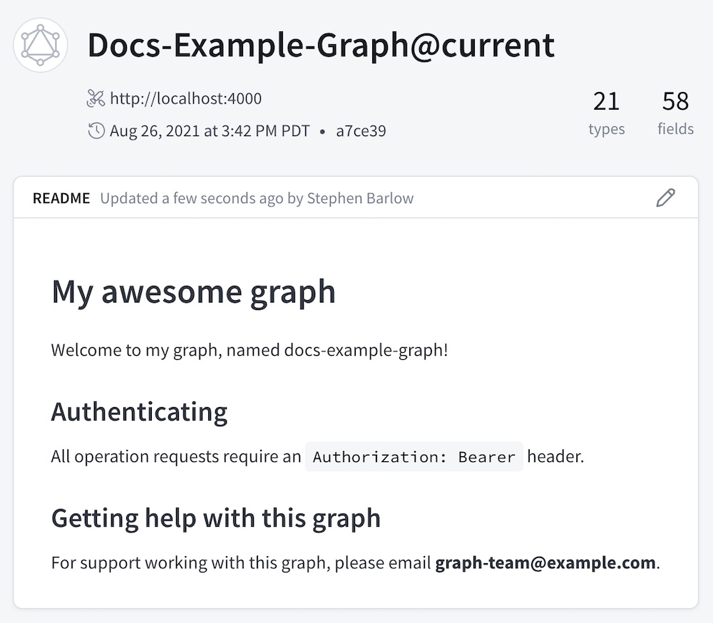
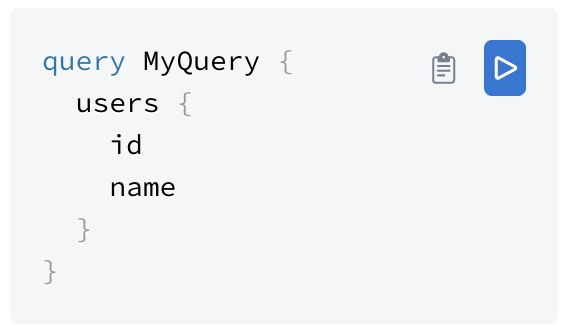
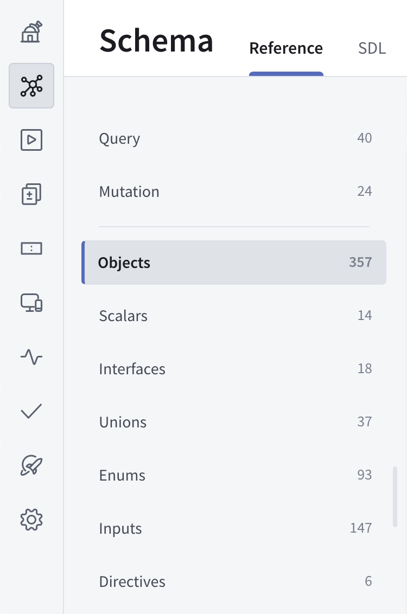
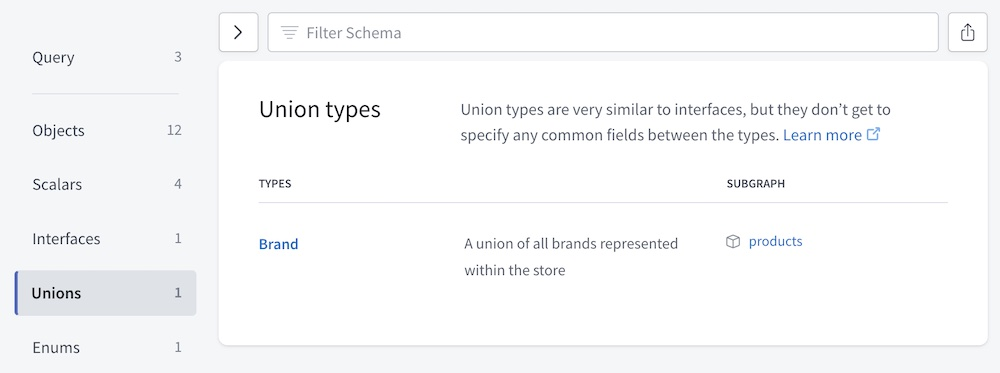
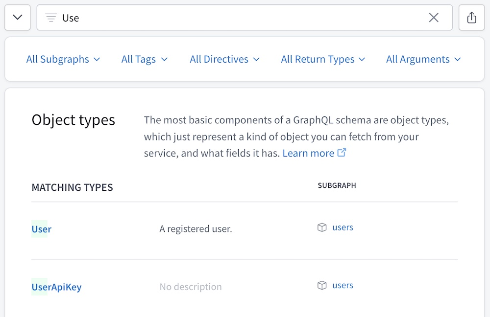
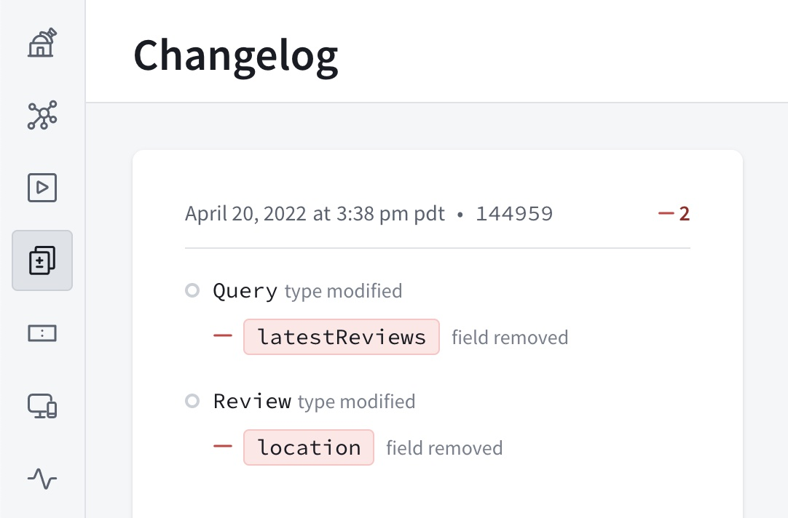

As your graph grows, understanding and communicating about its structure can become more difficult.
Without understanding a schema's intricacies—particularly how subgraphs relate to one another—development can become blocked or take wrong turns.

GraphOS Studio provides several ways of understanding and exploring your organization's graphs, including:

- An editable **README** page that describes the graph to newcomers
- The **Schema** page, which includes three distinct views, including a graph visualization
- The **Explorer**, which helps you build new operations against your graph
- The **Changelog**, which displays all published changes
- The **Insights** page, which displays operation and field metrics

See [Variant pages](../quickstart/self-hosted/#variant-pages-in-studio) for the full list of Studio pages.

## Viewing graph pages

After selecting an organization in GraphOS Studio, click a particular graph variant to view its pages. All of a Studio organization's members can access the data and settings for every graph that belongs to that organization.

<Tip>

Enterprise accounts can set [member roles](../org/members/#organization-wide-member-roles) to configure fine-grained access for individual members of their organization.

</Tip>

## The README page

When a user opens one of your graph's variants in GraphOS Studio, its **README** page is shown:



Like the typical homepage for a Git repository, this page displays a Markdown-based README that you can edit with any content you like.

<Note>

Only organization members with the [**Org Admin**, **Graph Admin**, **Contributor**, or **Documenter** role](../org/members/) can edit a variant's README. If a variant is [protected](#protected-variants-enterprise-only), **Contributors** cannot edit its README.

</Note>

Each variant has its own README. If you edit one variant's README, those edits are not applied to other variants. Among other uses, this enables you to provide different information to external consumers in a [public variant](#public-variants).

### Supported Markdown

The README supports all [basic Markdown syntax](https://www.markdownguide.org/cheat-sheet/#basic-syntax) and most [extended syntax](https://www.markdownguide.org/cheat-sheet/#extended-syntax) (including tables, code blocks, and footnotes).

You can define a GraphQL code block with the following syntax:

    ```graphql
    query MyQuery {
      users {
        id
        name
      }
    }
    ```

This renders the code block with buttons you can use to copy an operation or open it in the Explorer:



### README shortcodes

The README supports a set of shortcodes you can use to populate it with data that's specific to your variant, such as the graph's name and the variant's graph ref:

```md
# Overview of {{ graph.name }}

Graph ref: {{ graph.ref }}
```

For a list of all supported shortcodes, click **Graph shortcodes** in the bottom-left corner of the README editor.


<!-- vale Apollo.Headings = NO -->

## The Schema page

<!-- vale Apollo.Headings = YES -->

A graph variant's **schema** page has three distinct views:

  - The **Reference** tab lets you filter your schema's type and field definitions
  - The **SDL** tab displays your schema's raw SDL
  - The ** Visualization** tab 

### Reference

The **Reference** tab on the **Schema** page lists the different kinds of definitions in your schema (objects, scalars, etc.):



Select a kind of definition to view a table of all corresponding types:



Each type definition in the table includes:

- The type's name
  - You can click the name to view additional details for the type (such as fields for an object, or possible types for a union).
- The type's description (if your schema includes one)
- Which subgraphs define the type (if you have a federated supergraph)
  - Users with the **Consumer** role can't view subgraph details.

#### Filtering your schema

The top of the **Schema** page provides a **Filter Schema** box you can use to find types and fields that match a set of filters:



<Tip>

- Click the arrow button to the left of the filter box to show/hide the filter selection dropdowns.
- Click the button to the right of the filter box to copy a shareable URL of your currently active set of filters (you can also copy your browser's address bar directly).

</Tip>

Any filters you set remain active as you move between definitions on the Schema page.

You can filter your schema definitions by type/field name (as shown above), along with any combination of the following:

<table class="field-table">
  <thead>
    <tr>
      <th>Filter</th>
      <th>Description</th>
      <th>Example</th>
    </tr>
  </thead>

<tbody>

<tr>
<td>

##### `subgraph`

</td>
<td>

Include results defined in any of the specified subgraphs.

Valid only for federated supergraphs.

</td>
<td>

`subgraph:products,reviews`

</td>
</tr>

<tr>
<td>

##### `tag`

</td>
<td>

If your graph uses the `@tag` directive, include results that have a `@tag` with any of the specified names. If viewing a table of objects, also include objects with at least one field that has a specified `@tag`.

If your graph doesn't use the `@tag` directive, this filter is not available.

</td>
<td>

`tag:internal,experimental`

</td>
</tr>

<tr>
<td>

##### `directive`

</td>
<td>

Include results that have any of the specified directives applied. If viewing a table of objects, also include objects with at least one field that has a specified directive.

</td>
<td>

`directive:deprecated,unused`

</td>
</tr>

<tr>
<td>

##### `returnType`

</td>
<td>

Include results with any of the specified return types. If viewing a table of objects, include objects with at least one field that has a specified return type.

This filter includes all fields that return a particular type, regardless of each field's nullability or whether it returns a list. For example, if you specify `returnType:Int`, the filter includes fields that return any of `Int`, `Int!`, or `[Int]`.

</td>
<td>

`returnType:Int,String`

</td>
</tr>

<tr>
<td>

##### `argument`

</td>
<td>

Include results that take a GraphQL argument with any of the specified names. If viewing a table of objects, include objects with at least one field that takes a specified argument.

</td>
<td>

`argument:offset,limit`

</td>
</tr>

</tbody>

</table>

#### Filtering rules

- If you list multiple possible values in a single filter, those values use "OR" logic.
  - For example, if you filter by `subgraph:products,reviews` the result includes definitions from each subgraph.
- If you apply multiple types of filters, those filters use "AND" logic.
  - For example, if you filter by `subgraph:products` and `returnType:Int`, the result includes only definitions that fulfill both criteria.
- Currently, it isn't possible to use "AND" logic for multiple filters of the same type.
  - For example, it isn't possible to filter by `subgraph:products` "AND" `subgraph:reviews` to include only definitions that are present in both subgraphs.

### SDL

### Schema visualization

_Schema visualization_ provides a clear graphical representation of your schema's structure, including types, fields, and relationships.
It can help identify potential issues in your data model, allowing for more effective schema design. Visualization enhances comprehension, facilitates discussions, and enables better decision-making throughout the development lifecycle.

Every member of a Studio organization can access all their organization's graphs' visualizations. Click the **Visualization** tab on the **Schema** page to open a graph's visualization.


Click the double right arrow to expand a searchable list of types.


Click **Filters** to filter your visualization by root type, subgraph, or tag.
Click **Highlight** to highlight particular types, tags, or directives.


Click **More** to **Collapse all fields** or hide particular fields, types, and nodes.

## The Explorer

GraphOS Studio provides a powerful Explorer IDE that helps you visualize your graph and run queries against it. It's available from your graph's **Explorer** page in Studio. Refer to the [Explorer docs](../explorer/) to learn more.

## Tracking schema changes

The **Changelog** page in Studio displays a timeline of changes made to your graph's schema:



Only schema changes that you publish to Studio are included in this timeline, which is one of the most important reasons to [include schema publishing in your continuous delivery pipeline](../delivery/publishing-schemas/#publish-with-continuous-delivery).

## Viewing graph metrics

Refer to the [Metrics and reporting documentation](../metrics/#insights-and-analysis) for an overview of the **Insights** page's capabalities.
