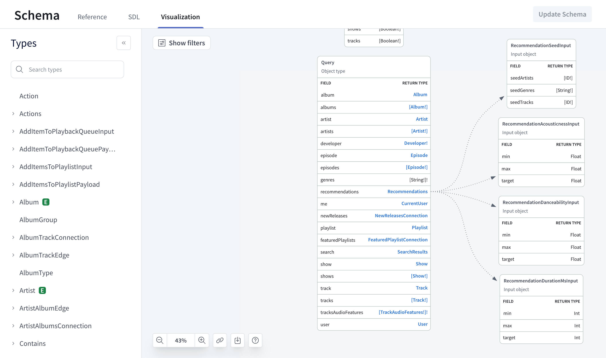

As your graph grows, understanding and communicating about its structure and relationships can become more difficult.
Without understanding a schema's intricacies—particularly how subgraphs relate to one another—development can become blocked or take wrong turns, which need to be corrected later.

Schema visualization provides a clear graphical representation of your schema's structure, including types, fields, and relationships.
It can help identify potential issues in your data model, allowing for more effective schema design. Visualization enhances comprehension, facilitates discussions, and enables better decision-making throughout the development lifecycle.

## View schema visualization

All GraphOS Studio users can view any graph's schema visualization.
In [Studio](https://studio.apollographql.com?referrer=docs-content), open the **Schema** page from the left navigation, then the **Visualization** tab.

Click **Filters** to filter your visualization by root type, subgraph, or tag.
You can also **Highlight** particular types, tags, or directives.

Click **More** to **Collapse all fields** or hide particular fields, types, and nodes.
Click the double right arrow to expand a searchable list of types.

