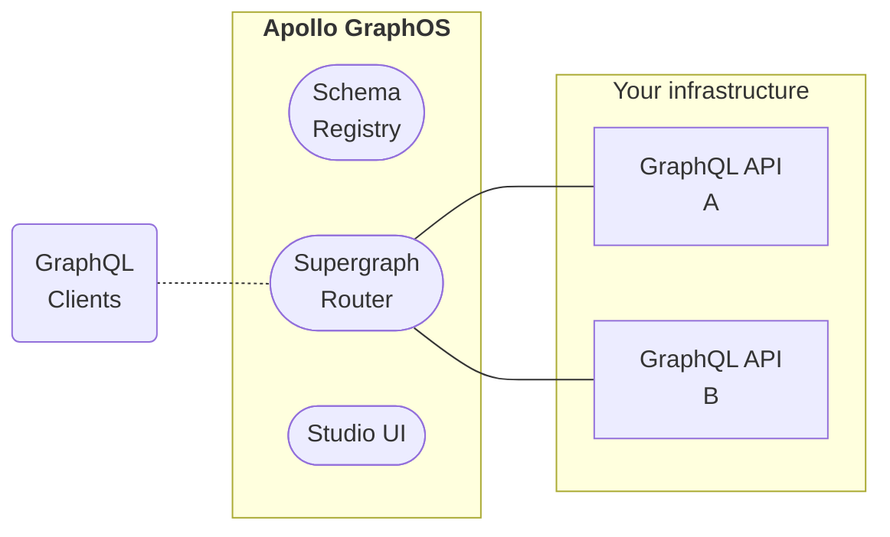

import {Link} from 'gatsby';

**Apollo GraphOS** is the cloud platform for building, growing, and collaborating on your organization's **supergraph**, an organization-wide data layer powered by GraphQL.

  <Button
    colorScheme="indigo"
    to="/graphos/quickstart/cloud/"
    as={Link}
    style={{
      marginRight: '10px'
    }}
  >
    Create your first supergraph!
  </Button>
  <Button colorScheme="gray" to="/intro/platform/" as={Link}>
    What's a supergraph?
  </Button>

## What's in GraphOS?

The GraphOS platform provides an ever-growing collection of tools and services to help you build your supergraph and scale it safely:

### Core features

These features (along with many others) are available to organizations on the **Serverless (Free)** or **Serverless** plan:

> [Learn about Apollo plans.](https://www.apollographql.com/pricing/)

- [**Cloud routing.**](./routing/cloud/)
  - GraphOS automatically provisions and hosts a router for each of your supergraphs. Clients query your router instead of individual **subgraphs**, enabling the router to automatically collect operation metrics that you can then [visualize in Apollo Studio](./metrics/).
- **The schema registry.**
  - GraphOS tracks the GraphQL schemas for all of your individual subgraphs, and it also handles **composing** those subgraph schemas into one _supergraph_ schema for your router.
- **Safe schema delivery.**
  - The [schema checks](./delivery/schema-checks/) feature of GraphOS enables you to verify whether proposed changes to a subgraph will cause an issue with _other_ subgraphs, or with any of your existing clients.
  - Whenever you update a subgraph schema, GraphOS composes a new _supergraph_ schema for your router. If composition succeeds, your router automatically begins using its new schema.
  - You can view the results of each [launch](./delivery/launches/) that takes place whenever you update a subgraph schema, helping you resolve any issues that might occur.
- **An interface for every use case.**
  - [Apollo Studio](https://studio.apollographql.com) is the primary web interface for GraphOS. Among other capabilities, you use Studio to create your organization and its supergraphs, view [schemas](./graphs/studio-features/#the-schema-page) and [metrics](./metrics/), and test out operations in [the Explorer](./explorer/).
  - [The Rover CLI](/rover/getting-started/) is the primary _command-line_ interface for GraphOS. Among other capabilities, you use Rover to publish subgraph schemas to the registry, run schema checks from CI, and test out your supergraph within your development environment.
  - If you want to automate your own workflows outside of Studio or Rover, you can use the official [GraphOS Platform API](./platform-api) to do so. We'll expose more GraphOS capabilities through the Platform API over time.

### Enterprise features

These additional features are available to organizations on an **Enterprise** plan:

- [**Self-hosted routing.**](./routing/self-hosted/)
  - Deploy your supergraph's router inside your own infrastructure, enabling you to maximize its performance and fully customize its behavior. Self-deployed routers use [the same powerful technology](/router/) that cloud routing uses under the hood.
- **Supergraph filtering with [contracts](./delivery/contracts/).**
  - Deploy multiple instances of your router that use different filtered subsets of your supergraph's schema. Different clients can then communicate with different routers, limiting them to whichever types and fields they should have access to.
- **Extended data retention.**
  - Your supergraph's historical operation metrics are available for visualization in Studio significantly longer than with a **Serverless** plan.
- **Enhanced user management.**
  - Assign fine-grained [user roles](./org/members/) to organization members, and optionally override those roles on a graph-by-graph basis.
  - Set up single sign-on (SSO) with your identity provider.
  - Export [audit logs](./org/audit-log/) of all material events that occurred within your organization over a time period.

In addition to the features above, an Enterprise plan provides access to our Graph Champions community and a dedicated support channel for your team to talk with Apollo supergraph experts. We'll work with you to customize a query volume limit and support package that's right for you.

**If you're interested in an Enterprise plan,** please [get in touch with us!](https://www.apollographql.com/contact-sales/)

---

**Ready to create your first supergraph?**

<Button
  colorScheme="indigo"
  to="/graphos/quickstart/cloud/"
  as={Link}
  style={{
    marginRight: '10px'
  }}
>
  Get started with GraphOS!
</Button>
