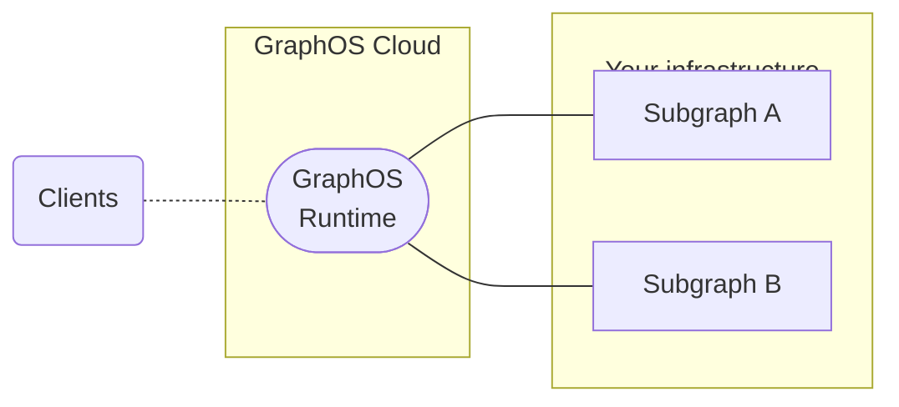

Apollo GraphOS is the platform for building, managing, and scaling a _supergraph_: a unified network of your services and data—all composed into a single distributed GraphQL API.
In a supergraph, the individual services are called subgraphs.

The federated supergraph enables clients to interact with multiple APIs through a single request.
Clients query the supergraph with a powerful language called GraphQL, which enables them to retrieve exactly the data they need, with no overfetching.

## What's in GraphOS?

The GraphOS platform provides an ever-growing collection of tools and services to help you build your supergraph and scale it safely.
Its main components are:

- Schema pipeline tools
- The GraphOS Federation Runtime
- Various interfaces, including the GraphOS Studio UI

### Schema pipeline tools

GraphOS provides schema pipeline tools to develop and deploy changes to your graph schemas.

- **Schema governance** tools let you manage, validate, and enforce standards in your schemas. These include:

  - Schema registries track the GraphQL schemas for all your individual subgraphs.
  - Schema checks identify breaking changes before you publish them. They can also determine when a potentially dangerous change is, in fact, safe.
  - Schema linting ensures consistent, well-formed schemas. Automated linting lowers maintenance overheads and improves developer productivity.
  - Schema proposals provide GraphOS-native schema change management. Team members propose changes to subgraph schemas, and others review and approve them before they're implemented.

- **Schema delivery** tools let you integrate schema publication into your DevOps workflows.
  - Whenever you update a subgraph schema, GraphOS composes a new supergraph schema for your router. If composition succeeds, your router automatically begins using its new schema.
  - You can view the results of each [launch](./delivery/launches/) that takes place whenever you update a subgraph schema, helping you resolve any issues that might occur.

### Federation Runtime

A key component of the supergraph is the unified endpoint it presents to clients. The GraphOS Federation Runtime makes this possible.
The runtime intelligently orchestrates and distributes the request across your APIs and returns a unified response.

For a client, the request and response cycle of querying the runtime looks the same as querying any GraphQL server.

With GraphOS, you can choose for Apollo to provision and manage a cloud-hosted runtime for you:

Or you can choose to self-host your runtime:

Cloud and self-hosted runtimes are both powered by the Apollo Router—a high-performance routing runtime packaged as a [standalone binary](https://github.com/apollographql/router).

### An interface for every use case

GraphOS offers a UI, command-line tool, and Platform API to address your organizations needs.

| Interface                                                                | Description                                                                                                                                                                                                                                        |
| ------------------------------------------------------------------------ | -------------------------------------------------------------------------------------------------------------------------------------------------------------------------------------------------------------------------------------------------- |
| [GraphOS Studio](https://studio.apollographql.com?referrer=docs-content) | GraphOS Studio is the primary web interface for GraphOS. Among other capabilities, you use Studio to create your organization and its supergraphs, view schemas and metrics, and test out operations in the Explorer.                              |
| [The Rover CLI](/rover/getting-started/)                                 | The Rover CLI is the primary command-line interface for GraphOS. Among other capabilities, you use Rover to publish subgraph schemas to the registry, run schema checks from CI, and test out your supergraph within your development environment. |
| [GraphOS Platform API](./platform-api)                                   | If you want to automate your own workflows outside of Studio or Rover, you can use the official GraphOS Platform API to do so.                                                                                                                     |

---

## Next steps

Ready to create your first supergraph?

<ButtonLink colorScheme="navy" href="/graphos/quickstart/cloud/">
  Get started with GraphOS!
</ButtonLink>
