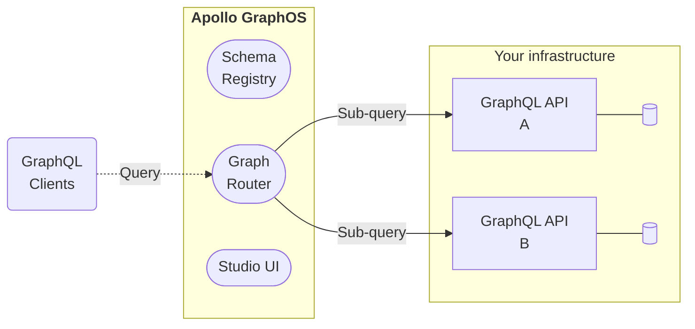

Apollo GraphOS is the platform for building, managing, and scaling a _supergraph_: a network of your microservices and their data sources—all composed into a unified GraphQL API.

  <ButtonLink
    colorScheme="navy"
    href="/graphos/quickstart/cloud/"
    style={{
      marginRight: '10px'
    }}
  >
    Create your first supergraph!
  </ButtonLink>
  <ButtonLink colorScheme="gray" href="/intro/platform/">
    What's a supergraph?
  </ButtonLink>

## What's in GraphOS?

The GraphOS platform provides an ever-growing collection of tools and services to help you build your supergraph and scale it safely.

<SummitCallout
  topic="GraphOS features"
  workshopName="Scaling your graph: Drive efficiency and collaboration with GraphOS"
  URL="https://reg.summit.graphql.com/flow/apollo/summit24/AttendeePortal/page/catalog/session/1712944865354001K23Q"
/>

### Core features

These features (along with many others) are available to organizations on Apollo [Serverless and Dedicated plans](https://www.apollographql.com/pricing/):

- Cloud routing
  - GraphOS automatically provisions and hosts a router for each of your supergraphs. Clients query your router instead of individual subgraphs, enabling the router to automatically collect operation metrics that you can then [visualize in GraphOS Studio](./metrics/).
- The schema registry
  - GraphOS tracks the GraphQL schemas for all your individual subgraphs, and it also handles composing those subgraph schemas into one supergraph schema for your router.
- Safe schema delivery
  - The [schema checks](./delivery/schema-checks/) feature of GraphOS enables you to verify whether proposed changes to a subgraph will cause an issue with other subgraphs, or with any of your existing clients.
  - Whenever you update a subgraph schema, GraphOS composes a new supergraph schema for your router. If composition succeeds, your router automatically begins using its new schema.
  - You can view the results of each [launch](./delivery/launches/) that takes place whenever you update a subgraph schema, helping you resolve any issues that might occur.
- An interface for every use case
  - [GraphOS Studio](https://studio.apollographql.com?referrer=docs-content) is the primary web interface for GraphOS. Among other capabilities, you use Studio to create your organization and its supergraphs, view [schemas](./graphs/studio-features/#the-schema-page) and [metrics](./metrics/), and test out operations in [the Explorer](./explorer/).
  - [The Rover CLI](/rover/getting-started/) is the primary command-line interface for GraphOS. Among other capabilities, you use Rover to publish subgraph schemas to the registry, run schema checks from CI, and test out your supergraph within your development environment.
  - If you want to automate your own workflows outside of Studio or Rover, you can use the official [GraphOS Platform API](./platform-api) to do so. We'll expose more GraphOS capabilities through the Platform API over time.

### Enterprise features

<Tip>

Test out these features for free with an [Enterprise trial](./org/plans/#enterprise-trials).

</Tip>

Additional GraphOS features are available to organizations on an Enterprise plan:

- [Connect your self-hosted router to GraphOS](./quickstart/self-hosted/)
  - The Apollo Router Core is available as a free and source-available runtime for Apollo Federation. Connecting your self-hosted router to GraphOS requires an Enterprise plan. Once you connect the Apollo Router Core to GraphOS, it is called GraphOS Router.
  - Deploy GraphOS Routers inside your own infrastructure, enabling you to maximize performance and fully customize their behavior. Self-hosted routers use [the same powerful technology](/router/) that cloud routing uses under the hood.
  - Enable [advanced features](/router/enterprise-features/) for your router fleet, such as operation limits and Redis-backed distributed caching.
- Supergraph filtering with [contracts](./delivery/contracts/)
  - Deploy multiple instances of your router that each use a different filtered subset of your supergraph's schema. Different clients can then communicate with different routers, limiting them to whichever parts of your supergraph they should have access to.
- Enhanced user management
  - Assign fine-grained [user roles](./org/members/) to organization members, and optionally override those roles on a graph-by-graph basis.
  - Set up single sign-on (SSO) with your identity provider.
  - Export [audit logs](./org/audit-log/) of all material events that occurred within your organization over a time period.
- Extended data retention
  - Your supergraph's historical operation metrics are available for visualization in Studio longer than with other plans. See the pricing page's [section on data retention](https://www.apollographql.com/pricing#data-retention) for details.

An Enterprise plan also provides access to our Graph Champions community and a dedicated support channel for your team to connect with Apollo supergraph experts. We'll work with you to customize a query volume limit and support package that's right for you.

If you're interested in Enterprise features, please <TrackableLink href="https://www.apollographql.com/contact-sales" eventName="content_contact_sales">get in touch with us</TrackableLink>! You can also test out these features with a free [Enterprise trial](./org/plans/#enterprise-trials).

---

Ready to create your first supergraph?

<ButtonLink colorScheme="navy" href="/graphos/quickstart/cloud/">
  Get started with GraphOS!
</ButtonLink>
