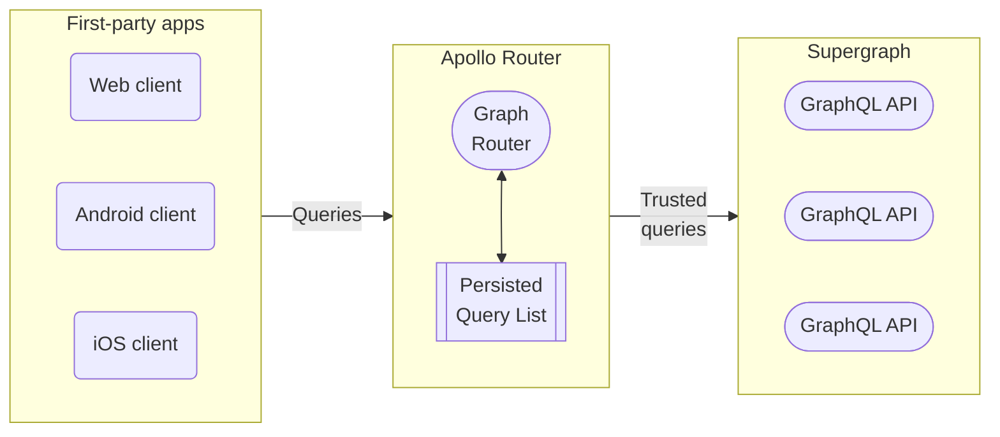
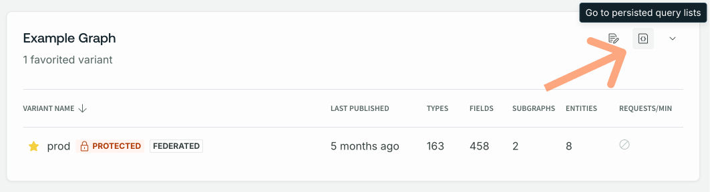
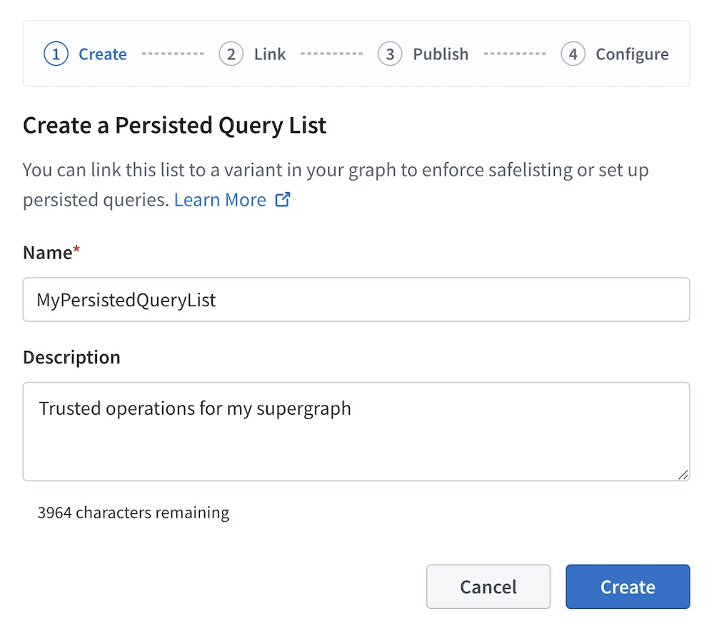
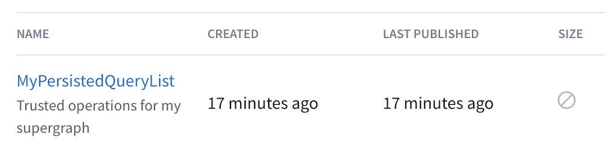
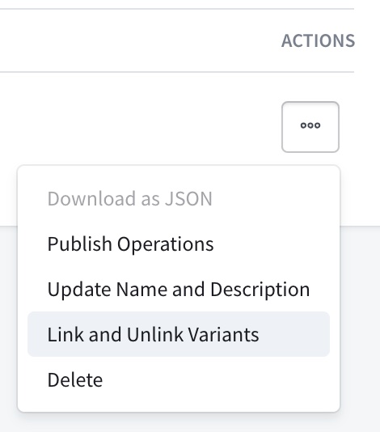
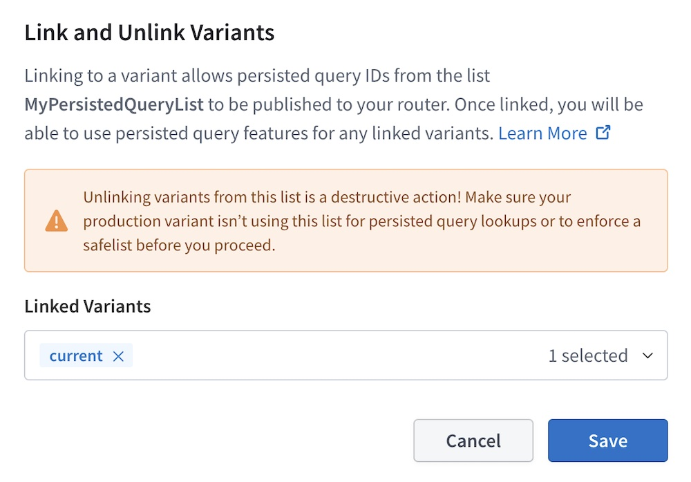
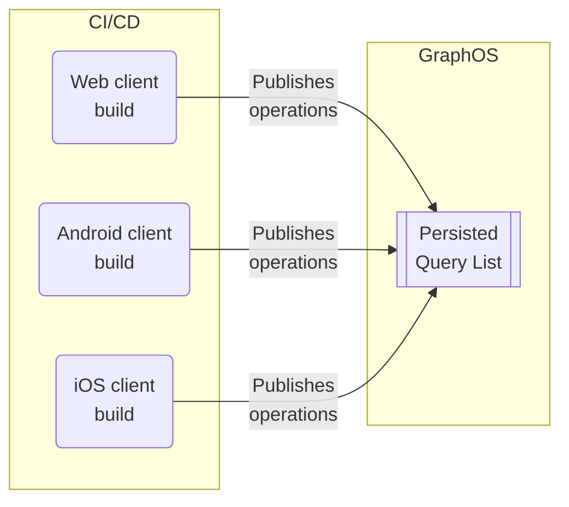

<blockquote>

**This feature is available only with a [GraphOS Enterprise plan](/graphos/enterprise/).** It is currently in [preview](/resources/product-launch-stages#preview).

If your organization _doesn't_ currently have an Enterprise plan, you can test this functionality by signing up for a free [Enterprise trial](/graphos/org/plans/#enterprise-trials).

</blockquote>

GraphQL APIs are broadly open by design. They let client applications send queries with arbitrary shapes and sizes. And while this allows for expedited client development and a highly performant API platform, it necessitates securing your graph against potentially malicious requests. 

With [GraphOS Enterprise](../enterprise/), you can enhance your supergraph's security by maintaining a **persisted query list** (**PQL**) for your supergraph's self-hosted router. The [Apollo Router](/router/) checks incoming requests against the PQL, a safelist of trusted operations made by your first-party apps.



Your router can use its persisted query list (PQL) to both **protect your supergraph** and **speed up your clients' operations**:

- When you enable **safelisting**, your router _rejects_ any incoming operations not registered in its PQL.
- Client apps can execute an operation by providing its PQL-specified ID _instead of_ an entire operation string.
    - Querying by ID can significantly reduce latency and bandwidth usage for very large operation strings.
    - Your router can _require_ that clients provide operations by ID and _reject_ full operation strings (even operation strings present in the PQL).

## Differences from automatic persisted queries

The Apollo Router supports a related feature called [automatic persisted queries](/router/configuration/in-memory-caching#caching-automatic-persisted-queries-apq) (APQ). With APQ, clients can execute a GraphQL operation by sending the SHA256 hash of its operation string instead of the entire string.

APQ has a few limitations compared to preregistered persisted queries.

<table>
  <thead>
    <tr>
      <th></th>
      <th>automatic persisted queries </th>
      <th>Preregistered persisted queries</th>
    </tr>
  </thead>
  <tbody>
    <tr>
      <td>Query performance</td>
      <td>✅ Clients can send identifiers instead of full query strings, reducing request sizes dramatically and latency.</td>
      <td>✅ Same as APQ</td>
    </tr>
    <tr>
      <td>Build- vs. runtime registration</td>
      <td> Queries are registered at <b>runtime</b>. One of your router instances must receive any given operation string from a client at least once to <a href="/router/configuration/distributed-caching">cache it</a>.</td>
      <td> Clients contribute to the PQL at <b>build-time</b>. Your router fetches its PQL from GraphOS on startup, meaning clients can always execute operations using their PQL-specified ID.</td>
    </tr>
    <tr>
      <td>Safelisting</td>
      <td>❌ APQ doesn't provide safelisting capabilities because the router dynamically populates its APQ cache over time with <em>any</em> operations it receives.</td>
      <td>✅ Clients preregister their operations to GraphOS. Your router fetches its PQL on startup, enabling it to reject operations not present in the PQL.</td>
    </tr>
  </tbody>
</table>

If you _only_ want to improve request latency and bandwidth usage, APQ addresses your use case. If you _also_ want to secure your supergraph with operation safelisting, you should preregister trusted operations in a PQL.

## Security levels

The Apollo Router supports the following security levels or modes, in increasing order of restrictiveness:

|Security Level|Description|
|--|--|
|**Performance-only**| Clients can optionally execute an operation on your router by providing the operation's PQL-specified ID.|
|**Audit mode**| Executing operations by providing a PQL-specified ID is still optional, but the router logs any unregistered operations.|
|**Safelisting with operation strings allowed**| The router _rejects_ any incoming operations that aren't present in its PQL.|
|**Safelisting with IDs only**| The router rejects any incoming operations that aren't present in its PQL, _and_ clients _must_ execute an operation by providing its PQL-specified ID.|

> _You can find more details, including configuration instructions, in the [implementation section](#2-router-configuration)._

These levels of permissiveness allow you to [incrementally adopt](#incremental-adoption-path) persisted queries on a client-by-client basis. Specifically, the router should use audit mode until you're confident that _all_ your clients' trusted operations have been registered in the PQL. Refer to the [incremental adoption section](#incremental-adoption-path) for a step-by-step guide.

## Implementation steps

Persisted queries provide benefits to different teams:
- Safelisting helps **platform teams** secure the graph and optimize its performance.
- **Application developers** can use trusted operation IDs to write performant client code.

Implementation also requires collaboration among these parties. These are the main steps for implementing persisted queries for safelisting, along with the team that usually performs it:

<table>
  <thead>
    <tr>
      <th>Step</th>
      <th>Description</th>
      <th>Responsible party</th>
    </tr>
  </thead>
  <tbody>
     <tr>
      <td> <a href="#1-pql-creation-and-linking">1. PQL creation and linking</a> </td>
      <td>Create and apply a PQL to graph variants. </td>
      <td>Platform team</td>
    </tr>
    <tr>
      <td> <a href="#2-router-configuration">2. Router configuration</a> </td>
      <td>
        Update your router's <a href="/router/configuration/overview/#yaml-config-file">YAML config file</a> to enable persisted queries at the appropriate <a href="#security-level">security level</a>.   
      </td>
      <td>Platform team</td>
    </tr>
    <tr>
      <td> <a href="#3-preregister-trusted-operations">3. Preregister trusted operations</a> </td>
      <td>
      Generate and publish a persisted queries manifest (PQM) to the PQL from your client's CI/CD pipeline.
      </td>
      <td>App developers</td>
    </tr>
    <tr>
      <td><a href="#4-client-updates">4. Client updates (Optional) </a> </td>
      <td>
        Update clients to use operation IDs rather than full query strings.
        <br/>
        <br/>
        <em>This step provides performance benefits but isn't necessary for safelisting.</em>
      </td>
      <td>App developers</td>
    </tr>
  </tbody>
</table>

Continue on for each step's details, or skip to the [incremental adoption section](#incremental-adoption-path) for the recommended for incremental adoption strategy. (This section assumes you have a high-level understanding of each implementation step.)

### 1. PQL creation and linking

To use persisted queries, you first need a **persisted query list** (**PQL**) in GraphOS Studio.
Platform teams create an empty PQL in GraphOS Studio so that client teams can register trusted operations to it.

Each PQL is associated with a single graph in GraphOS.
You can link a PQL to any number of different variants of its graph.
Although many variants may use the same PQL, each variant can only have one linked PQL at a time.

#### 1.1 PQL creation

1. From your organization's Graphs page in [GraphOS Studio](https://studio.apollographql.com/?referrer=docs-content), open the PQL page for a graph by clicking its PQL button:

  

2. From the PQL page:

    - If you haven't created any PQLs yet, click **Create a Persisted Query List**.
    - If you already have at least one PQL, click **New List** in the upper right.

  The following dialog appears:

  

3. Provide a name and (optional) description for your PQL, then click **Create**.

    - At this point, your empty PQL has been created. The remaining dialog steps help with additional setup.

4. The second dialog step (**Link**) enables you to link your new PQL to one existing variant of your graph.

    - You can optionally **Skip** this step and link variants later (covered in the next step).

5. The third dialog step (**Publish**) displays your new PQL's unique ID and an example Rover CLI command for publishing operations to the PQL.

    - For now, you can leave the PQL empty. Client teams can publish operations to it in a later step.
    - Save this Rover CLI command so you can pass it on to your client teams when they publish operations.

6. The fourth and final dialog step (**Configure**) displays configuration options you apply to your router to begin using your PQL. We'll cover these in a later step.

7. Click **Finish** to close the dialog. Your newly created PQL appears in the table:

    

#### 1.2 Link the PQL to variants

After you create a PQL, you can link it to one or more variants of your graph. Each router instance associated with a linked variant automatically fetches its PQL from GraphOS.

> It's safe to link an empty or incomplete PQL to a variant because your router doesn't _use_ its PQL for anything until you [configure it to do so](#2-router-configuration) (covered in a later step).

1. From the table on your graph's PQL page, open the **•••** menu under the **Actions** column for the PQL you want to link:

    

2. Click **Link and Unlink Variants**. The following dialog appears:

    

3. Use the dropdown menu to select any variants you want to link your PQL to.

> As a best practice, you can begin by linking your PQLs to a staging environment before moving onto a production one.

4. Click **Save**.

After you link a PQL to a variant:

1. GraphOS validates the PQL against the variant's reported operation history and flags any recent operations not represented in the PQL.

2. GraphOS then uploads the PQL to Uplink, the service that delivers configuration to your router at runtime.

### 2. Router configuration

The Apollo Router is the key component that enforces safelisting. Recall that the router supports four [security levels](#security-levels). When first implementing persisted queries, it's best to start with [audit—or "dry run"—mode](#security-levels).

Once your organization's PQL has registered all your clients' operations and you've ensured your client apps are only sending trusted operations, you can update your router configuration to the safelisting security level.

You can configure router instances to fetch and use the PQL by following these steps:

1. Ensure your router instances are ready to work with PQLs:
    - Make sure you're using version `1.25.0` or later of the Apollo Router.
    - Make sure your router instances are [connected to your GraphOS Enterprise organization](/router/enterprise-features/#enabling-enterprise-features) and that they're associated with a variant that your PQL is linked to.

2. Set your desired security level in your router's YAML config file. For supported options, see [router security levels](#router-security-levels).

3. Deploy your updated router instances to begin using your PQL.

#### Router security levels

As you may recall, the Apollo Router supports the following [security levels](#security-levels), in increasing order of restrictiveness:

- **Performance-only**: Clients can optionally execute an operation on your router by providing the operation's PQL-specified ID.
    - All other levels also provide this core capability.
    - This level provides no operation safelisting.
- **Audit mode**: Executing operations by providing a PQL-specified ID is still optional, but the router also logs any unregistered operations.
    - The level serves as a dry run and helps you identify operations you may still need to register before turning on safelisting.
- **Safelisting with operation strings allowed**: The router _rejects_ any incoming operations that aren't present in its PQL.
    - Before moving to this security level, ensure _all_ your client operations are present in your PQL.
- **Safelisting with IDs only**: The router rejects any incoming operations that aren't present in its PQL, _and_ clients _must_ execute an operation by providing its PQL-specified ID.
    - Before moving to this security level, ensure _all_ your clients execute operations by providing their PQL-specified ID.

See below for sample YAML configurations for each level.

#### Performance-only

To use persisted queries _only_ to reduce network bandwidth and latency (_not_ for safelisting), add the following minimal configuration:

```yaml title="router.yaml"
preview_persisted_queries:
  enabled: true
enabled: true # APQ can be enabled
```

> **Note:** You can use the performance-only security level with or without [automatic persisted queries](/router/configuration/in-memory-caching#caching-automatic-persisted-queries-apq) enabled.

This enables your clients to execute operations by providing their PQL-specified ID instead of the full operation string.
Your router also continues to accept full operation strings, even for operations that _don't_ appear in its PQL.

The router works with both formats since the PQL-specified ID is the operation string's [SHA256 hash](https://en.wikipedia.org/wiki/SHA-2), and the router can derive it from the operation string if needed. 

#### Audit mode (dry run)

Turning on logging is crucial for gauging your client apps' readiness for safelisting. The logs identify which operations you need to either add to your PQL or stop your client apps from making. 

To enable logging for unregistered queries, enable the `log_unknown` property:

```yaml title="router.yaml"
preview_persisted_queries:
  enabled: true
  log_unknown: true
enabled: true # APQ can be enabled
```
> **Note:** You can use audit mode with or without [automatic persisted queries](/router/configuration/in-memory-caching#caching-automatic-persisted-queries-apq) enabled.

Unregistered operations appear in your [router's logs](./logging).

#### Safelisting (operation strings allowed)

> ⚠️ Before applying this configuration, ensure your PQL contains _all_ of the GraphQL operations that _all active versions_ of your clients execute. If you enable safelisting _without_ ensuring this, your router will reject any unpublished client operations.

With the following configuration, your router allows _only_ GraphQL operations that are present in its PQL while rejecting all other operations:

```yaml title="router.yaml"
preview_persisted_queries:
  enabled: true
  log_unknown: true
  safelist:
    enabled: true
    require_id: false
apq:
  enabled: false # APQ must be disabled 
```

> **Note:** To enable safelisting, you _must_ disable [automatic persisted queries](/router/configuration/in-memory-caching#caching-automatic-persisted-queries-apq).

To execute an operation, clients can provide its full operation string _or_ its PQL-specified ID.

#### Safelisting (IDs only)

> ⚠️ **Do not start with this configuration:** It requires _all_ your clients execute operations by providing their PQL-specified ID. If any clients still provide full operation strings, those clients will break.

With the following configuration, your router allows _only_ GraphQL operations that are present in its PQL, _and_ it requires clients to provide PQL-specified IDs instead of full operation strings:

```yaml title="router.yaml"
preview_persisted_queries:
  enabled: true
  log_unknown: true
  safelist:
    enabled: true
    require_id: true #highlight-line
apq:
  enabled: false # APQ must be disabled 
```

> **Note:** To enable safelisting, you _must_ disable [automatic persisted queries](/router/configuration/in-memory-caching#caching-automatic-persisted-queries-apq).

If you want to use this security level, you should always _first_ set up [safelisting with operation strings allowed](#safelisting-operation-strings-allowed). This level requires modifying _all_ of your clients to execute operations via PQL-specified ID instead of an operation string. While making those necessary changes, you can use the less restrictive safelisting level in your router.

### 3. Preregister trusted operations

Preregistering trusted operations to a PQL has two steps:
1. Generating persisted queries manifests (PQM) using client-specific tooling
2. Publishing PQMs to the PQL using the Rover CLI tool

Building both of these into your CI/CD pipeline incorporates new operations automatically whenever you release a new client app version.

#### 3.1 Generate persisted queries manifests

Once a PQL exists in GraphOS, client teams can start publishing operations to it. To do so, you need to generate JSON **manifests** of the trusted operations to publish. You generate a separate manifest for each of your client apps.

<ExpansionPanel title="See an example manifest file with two operations">

```json title="persisted-queries.json"
{  
  "format": "apollo-persisted-queries",
  "version": 1,
  "operations": [  
    {
      "id": "dc67510fb4289672bea757e862d6b00e83db5d3cbbcfb15260601b6f29bb2b8f",
      "body": "query UniversalQuery { __typename }",
      "name": "UniversalQuery",
      "type": "query" 
    },
    {
      "id": "f11e4dcb28788af2e41689bb366472084aa1aa1e1ba633c3d605279cff08ed59",
      "body": "query FragmentedQuery { post { ...PostFragment } }  fragment PostFragment on Post { id title }",
      "name": "FragmentedQuery",
      "type": "query" 
    }
  ]
}
```

</ExpansionPanel>

You perform manifest generation in your CI/CD pipeline. This enables you to incorporate new operations automatically whenever you release a new client app version.

#### Generation methods

Apollo Client for Web, Kotlin, and iOS each provide a mechanism for generating a manifest file from your app source.

> If your client app uses another GraphQL client library, you can build your _own_ mechanism for generating operation manifests. See the expected [manifest format](#manifest-format).

See the instructions for your client library:

#### Apollo Client Web

1. In your app's project, install the `@apollo/generate-persisted-query-manifest` package as a dev dependency:

    ```bash
    npm install --save-dev @apollo/generate-persisted-query-manifest
    ```

    This package includes a CLI command to generate a manifest file from your application source.

2. Generate your first manifest with the following command:

    ```bash
    npx generate-persisted-query-manifest
    ```

    - **If the command succeeds,** your manifest is written to `persisted-query-manifest.json`.
    - **If the command fails** (or if your manifest doesn't include all of the operations you expect it to), you can configure the command's behavior using the options described in the [package README](https://www.npmjs.com/package/@apollo/generate-persisted-query-manifest).

[See the full Apollo Client persisted queries guide for detailed instructions](/react/api/link/persisted-queries/).

#### Apollo Kotlin

> Manifest generation requires Apollo Kotlin `3.8.2` or later.

To generate an operation manifest with Apollo Kotlin, you modify your project's [Gradle plugin configuration](/kotlin/advanced/plugin-configuration) to generate a manifest in addition to standard Kotlin source for your operations:

```kotlin
apollo {
  service("myapi") {
    packageName.set("com.example.myapi")
    operationManifestFormat.set("persistedQueryManifest") //highlight-line
  }
}
```
The manifest will be generated in `build/generated/manifest/apollo/myapi/persistedQueryManifest.json`

[See the full Apollo Kotlin persisted queries guide for detailed instructions](/kotlin/advanced/persisted-queries/).

#### Apollo iOS

> Manifest generation requires Apollo iOS `1.3.1` or later.

To generate an operation manifest with Apollo iOS, you use the same [code generation engine](/ios/code-generation/introduction) that you use to generate Swift code for each of your operations. Specifically, you modify the engine's file output configuration to include the output of an `operationManifest`. [See the full Apollo iOS persisted queries guide for detailed instructions](/ios/fetching/persisted-queries/).

#### 3.2 Publish manifests to the PQL

<blockquote>

Ensure your Rover CLI version is `0.17.2` or later. Previous versions of Rover don't support publishing operations to a PQL.
[Download the latest version.](/rover/getting-started/)

</blockquote>

After you [generate an operation manifest](#31-generate-persisted-queries-manifests), you publish it to your PQL with the [Rover CLI](/rover/):

```bash title="Example command"
rover persisted-queries publish my-graph@my-variant \
  --manifest ./persisted-query-manifest.json
```

- Replace `my-graph@my-variant` with the **graph ref** of _any_ variant your PQL is [linked to](#12-link-the-pql-to-variants). Your platform team can provide this for you.
    - Graph refs have the format `graph-id@variant-name`.
- For the `--manifest` option, provide the path to the manifest you want to publish.

<blockquote>

As with [generating manifests](#31-generate-persisted-queries-manifests), execute this command in your CI/CD pipeline to publish new operations as part of your app release process.

</blockquote>

**The above command does the following:**

1. It publishes all operations in the provided manifest file to the PQL linked to the specified variant.
    - Publishing a manifest to a PQL is additive. Any _existing_ entries in the PQL remain.
    - If you publish an operation with the same `id` but different details from an existing entry in the PQL, the entire publish command fails with an error.

2. It updates any _other_ variants that the PQL is applied to so that routers associated with those variants can fetch their updated PQL.

### 4. Client updates

With your [manifest published](#3-preregister-trusted-operations) and the [router configured](#2-router-configuration), you can update your clients to use trusted operations IDs. Organizations can do this one client at a time as client teams [publish client-specific PQMs](#32-publish-manifests-to-the-pql) to the PQL.

> **Note:** This step provides performance benefits but isn't necessary for safelisting. You can continue to use full operation strings rather than operation IDs.

#### 4.1 Test operations

Before updating your client apps, it's best to send some test operations.

First, start your GraphOS-connected router:

```bash
APOLLO_KEY="..." APOLLO_GRAPH_REF="..." ./router --config ./router.yaml

2023-05-11T15:32:30.684460Z  INFO Apollo Router v1.18.1 // (c) Apollo Graph, Inc. // Licensed as ELv2 (https://go.apollo.dev/elv2)
2023-05-11T15:32:30.684480Z  INFO Anonymous usage data is gathered to inform Apollo product development.  See https://go.apollo.dev/o/privacy for details.
2023-05-11T15:32:31.507085Z  INFO Health check endpoint exposed at http://127.0.0.1:8088/health
2023-05-11T15:32:31.507823Z  INFO GraphQL endpoint exposed at http://127.0.0.1:4000/ 🚀
```

Next, make a POST request with `curl`, like so:

```bash
curl http://localhost:4000 -X POST --json \
'{"extensions":{"persistedQuery":{"version":1,"sha256Hash":"dc67510fb4289672bea757e862d6b00e83db5d3cbbcfb15260601b6f29bb2b8f"}}}'
```

If your router's PQL includes an operation with an ID that matches the value of the provided `sha256Hash` property, it executes the corresponding operation and returns its result.

#### 4.2 Update client apps

Once you've tested requests using operation IDs, you can update your client apps to execute operations using their PQL-specified ID instead of sending full query strings.

To do this, clients can use the same protocol used for automatic persisted queries (APQ). 

Here's the JSON body of a request to execute an operation by its ID:

```json
{
  "variables": null,
  "extensions": {
    "persistedQuery": {
      "version": 1,
      "sha256Hash": "PQL_ID_HERE"
    }
  }
}
```

> If you're executing an operation that includes GraphQL variables, specify them with the `variables` property.

If your GraphQL client library provides a mechanism for executing operations via APQ, you can use that same mechanism with your router's PQL.

Here are links to documentation for APQ mechanisms in Apollo Client libraries:

- [Apollo Client Web](/react/api/link/persisted-queries/)
- [Apollo iOS](/ios/fetching/apqs/)
- [Apollo Kotlin](/kotlin/advanced/persisted-queries/)

## Incremental adoption path

Persisted queries' [tiered security levels](#security-levels) let you adopt an incremental approach rather than simultaneously requiring all clients to send requests via trusted operations IDs. You can follow these steps for incremental adoption:

1. Identify the first client you want to implement persisted queries with. It could be the client or team you're most comfortable with or the one most comfortable with GraphOS.
2. Follow all [implementation steps](#implementation-steps) for your chosen client:
    1. [Create and link a PQL](#1-pql-creation-and-linking) to a staging or development variant.
    1. When [configuring the router](#2-router-configuration) begin with [audit mode](#audit-mode-dry-run).
    1. Use the [client-specific tooling](#generation-methods) to generate an [operation manifest](#31-generate-persisted-queries-manifests) and [publish it to the PQL](#32-publish-manifests-to-the-pql) as part of your client's CI/CD pipeline.
    1. (Optional) Update your chosen client to use only trusted operations, either by full operation string or operation ID.

3. Continue to monitor your router logs: once you consistently see that unregistered operations are being logged and registered ones aren't, you've completed most of the setup for this client! 🎉

If safelisting is your goal, you'll need to [coordinate across client teams](#coordinate-with-client-teams) to complete these steps for each of your client apps.

Once your router's logs are clear of unexpected operations, you can configure your router to use the [safelisting security level](#router-security-levels). Then, [update your client apps](#4-client-updates) to use operation IDs rather than full query strings.

Once you've confirmed all client apps use IDs, you can move to the most restrictive security level: [safelisting with IDs only](#safelisting-ids-only).
This security level _enforces_ the performance benefit of using operation IDs rather than full operation strings. If you're content with the safelisting aspect of persisted queries with only optional performance benefits, you don't need to enable it.

### Coordinate with client teams

Once you've followed the implementation steps for one client, you can coordinate across all your client teams:

1. Identify all the client apps that execute operations against your router, along with the GraphQL client libraries that those apps use.
    - Before you enable safelisting in your router, your client apps must start publishing their operations to your PQL.
2. Communicate to your client development teams that adopting persisted queries will require adding tooling to their CI/CD pipeline.
    - Specifically, each client team will need to perform the following steps of this adoption path: [Generate client operation manifests](#31-generate-persisted-queries-manifests) and [publish manifests to the PQL](#32-publish-operations-to-the-pql)
3. Identify which team members will assist with adding tooling to their respective CI/CD pipelines.



Guide each client team to follow the implementation steps presented in the [incremental adoption path](#incremental-adoption-path).


## Manifest format

<blockquote>

⚠️ **This manifest format is subject to change during the preview period.**

You only need to read this section if you're building your own tooling to [generate persisted query manifests](#generating-manifests).

</blockquote>

A persisted query manifest has the following minimal structure:

```json title="persisted-queries-manifest.json"
{  
  "format": "apollo-persisted-queries",
  "version": 1,
  "operations": [  
    {
      "id": "dc67510fb4289672bea757e862d6b00e83db5d3cbbcfb15260601b6f29bb2b8f",
      "body": "query UniversalQuery { __typename }",
      "name": "UniversalQuery",
      "type": "query" 
    }
  ]
}
```

Manifest properties are documented below.

### Top-level properties

<table class="field-table">
  <thead>
    <tr>
      <th>Property</th>
      <th>Description</th>
    </tr>
  </thead>

<tbody>
<tr>
<td>

###### `format`

</td>
<td>

This value is currently always `apollo-persisted-queries`.

</td>
</tr>

<tr>
<td>

###### `version`

</td>
<td>

This value is currently always `1`.

</td>
</tr>

<tr>
<td>

###### `operations`

</td>
<td>

An array of objects describing the individual GraphQL operations to publish.

For details, see [Per-operation properties](#per-operation-properties).

</td>
</tr>

</tbody>
</table>

### Per-operation properties

Each entry in a [manifest's](#manifest-format) `operations` array is a JSON object that describes a single GraphQL operation to publish:

```json
{
  "id": "dc67510fb4289672bea757e862d6b00e83db5d3cbbcfb15260601b6f29bb2b8f",
  "body": "query UniversalQuery { __typename }",
  "name": "UniversalQuery",
  "type": "query" 
}
```

Each operation object has the following properties:

<table class="field-table">
  <thead>
    <tr>
      <th>Property</th>
      <th>Description</th>
    </tr>
  </thead>

<tbody>
<tr>
<td>

###### `id`

</td>
<td>

The unique ID to use for the operation in your PQL.

**This value must be unique among operations in the PQL.** If you publish an operation with the same `id` as an existing operation, the new operation _overwrites_ the existing PQL entry.

**To ensure uniqueness,** tooling should generate this value based on the operation `body`. For details, see [Generating IDs](#generating-ids).

</td>
</tr>

<tr>
<td>

###### `body`

</td>
<td>

The complete query document for the operation. Includes the definition of the operation itself, along with accompanying fragment definitions.

**This string must match _exactly_ the query document that your client sends your router, including whitespace and field order.** For details, see [Ensuring consistent operation signatures](#ensuring-consistent-operation-signatures).

</td>
</tr>

<tr>
<td>

###### `name`

</td>
<td>

The operation's name. Must match the name specified in `body`.

This value does _not_ need to be unique among operations in the PQL. Often, different clients execute slightly different operations with the same name, and those operations each require a separate entry in the PQL.

</td>
</tr>

<tr>
<td>

###### `type`

</td>
<td>

The type of GraphQL operation. Always one of the following values:

- `query`
- `mutation`
- `subscription`

</td>
</tr>

</tbody>
</table>

### Generating IDs

When generating operation IDs for a manifest, you should use a value that's unique to each operation, such as the query document's cryptographic hash. Apollo's [manifest generation tools](#13-generate-persisted-queries-manifests) use the base16 representation of the document's SHA256 hash, which is the same format used for [APQ](#differences-from-apq).

By generating identifiers based on query documents this way, you ensure that different operations always have different IDs. This prevents unexpected collisions in your PQL. It also allows the router to execute queries both by full query strings and PQL-specified IDs, since the router can derive the ID from the operation string if needed. 

> **Never use an operation _names_ for PQL IDs.** Different clients (or even different versions of the _same_ client) might execute different operations with the same name, and _all_ of those distinct operations should be present in your PQL.

### Ensuring consistent operation signatures

Whenever a client sends an operation string to a router that has safelisting enabled, the router checks for that operation string's presence in its persisted query list. **The incoming string must match a PQL entry's operation string _exactly_, including whitespace and field order.**

The following queries are functionally identical, but the router will _reject_ the client operation because it doesn't match the PQL entry exactly:

<CodeColumns>

```graphql title="PQL entry"
query GetBooks {
  books {
    author
    title
  }
}
```

```graphql title="Client operation"
query GetBooks {
  books {
    #highlight-start
    title # Field order reversed!
    author
    #highlight-end
  }
}
```

</CodeColumns>

To ensure that you generate manifest entries correctly, it's important to note that your app's client library might potentially _modify_ the operation strings you define in your source before executing those corresponding operations. For example, by default all Apollo Client libraries add the `__typename` field to every object in a query (if that field isn't already present):

<CodeColumns>

```graphql title="Source-defined query"
query GetBooks {
  books {
    author
    title
  }
}
```

```graphql title="Client-executed query"
query GetBooks {
  books {
    author
    title
    __typename #highlight-line
  }
}
```

</CodeColumns>

> The [manifest generation tools](#13-generate-persisted-queries-manifests) for Apollo Client libraries all account for this default behavior.

If you're building your own manifest generation tool, make sure it accounts for any such operation changes in your chosen client library. Otherwise, the router will reject your app's operations due to a operation string mismatch.

Similarly, if your clients execute operations by providing their PQL-specified ID, they might end up executing an operation with a different shape than expected if you don't account for these operation changes.