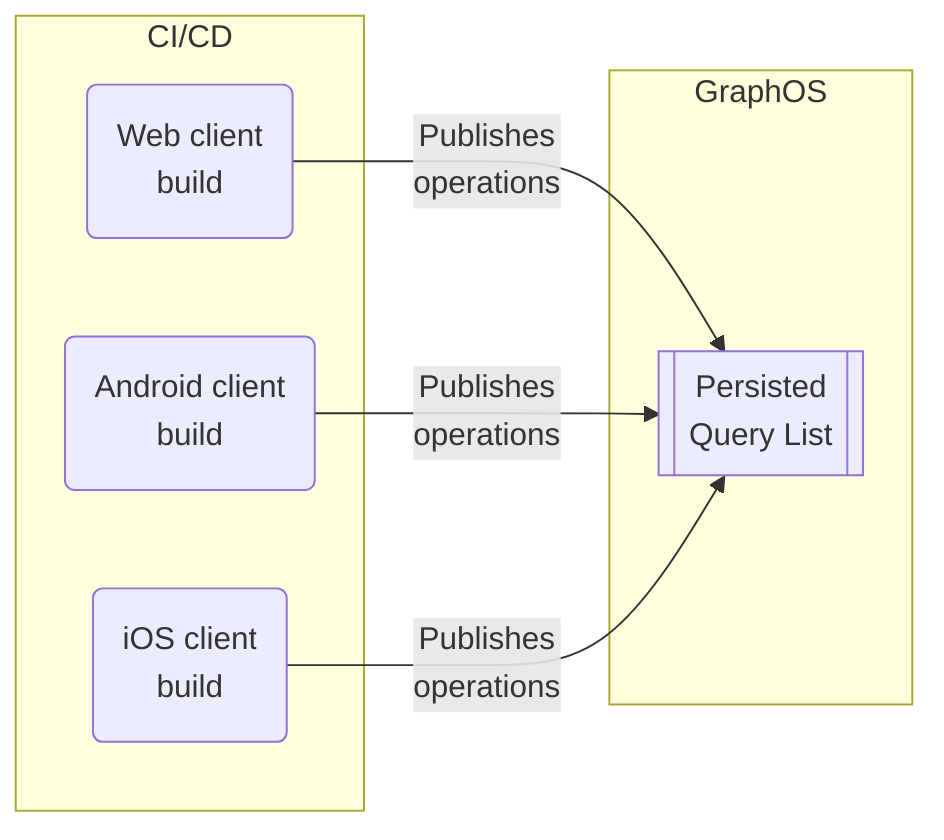
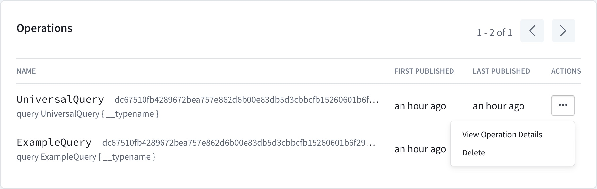

<GraphOSEnterpriseRequired />

<PreviewFeature discordLink="https://discordapp.com/channels/1022972389463687228/1143901714173407342"/>

GraphQL APIs are broadly open by design. They let client applications send queries with arbitrary shapes and sizes. And while this allows for expedited client development and a highly performant API platform, it necessitates securing your graph against potentially malicious requests. 

<PQIntro />

## Differences from automatic persisted queries

The Apollo Router also supports a related feature called [automatic persisted queries](/router/configuration/in-memory-caching#caching-automatic-persisted-queries-apq) (APQ). With APQ, clients can execute a GraphQL operation by sending the SHA256 hash of its operation string instead of the full string.

APQ has a few limitations compared to preregistered persisted queries.

<table>
  <thead>
    <tr>
      <th></th>
      <th>automatic persisted queries </th>
      <th>Preregistered persisted queries</th>
    </tr>
  </thead>
  <tbody>
    <tr>
      <td>Query performance</td>
      <td>✅ Clients can send identifiers instead of full query strings, reducing request sizes dramatically and latency.</td>
      <td>✅ Same as APQ</td>
    </tr>
    <tr>
      <td>Build- vs. runtime registration</td>
      <td> Queries are registered at <b>runtime</b>. One of your router instances must receive any given operation string from a client at least once to <a href="/router/configuration/distributed-caching">cache it</a>.</td>
      <td> Clients contribute to the PQL at <b>build-time</b>. Your router fetches its PQL from GraphOS on startup and polls for updates, meaning clients can always execute operations using their PQL-specified ID.</td>
    </tr>
    <tr>
      <td>Safelisting</td>
      <td>❌ APQ doesn't provide safelisting capabilities because the router dynamically populates its APQ cache over time with <em>any</em> operations it receives.</td>
      <td>✅ Clients preregister their operations to GraphOS. Your router fetches its PQL on startup, enabling it to reject operations not present in the PQL.</td>
    </tr>
  </tbody>
</table>

If you _only_ want to improve request latency and bandwidth usage, APQ addresses your use case. If you _also_ want to secure your supergraph with operation safelisting, you should preregister operations in a PQL.

## Security levels

The Apollo Router supports the following security levels or modes, in increasing order of restrictiveness:

<table>
  <thead>
    <tr>
      <th style={{minWidth: 215}}>Security Level</th>
      <th>Description</th>
    </tr>
  </thead>
  <tbody>
    <tr>
      <td><strong>Allow operation IDs</strong></td>
      <td>Clients can optionally execute an operation on your router by providing the operation's PQL-specified ID.</td>
    </tr>
    <tr>
      <td><strong>Audit mode</strong></td>
      <td>Executing operations by providing a PQL-specified ID is still optional, but the router logs any unregistered operations.</td>
    </tr>
    <tr>
      <td><strong>Safelisting</strong></td>
      <td>The router <em>rejects</em> any incoming operations that aren't present in its PQL. Clients can use either PQL-specified ID or operation string to execute operations.</td>
    </tr>
    <tr>
      <td><strong>Safelisting with IDs only</strong></td>
      <td>Clients can _only_ execute operations by providing their PQL-specified IDs; the router rejects all freeform GraphQL requests.</td>
    </tr>
  </tbody>
</table>


> _You can find more details, including configuration instructions, in the [implementation section](#2-router-configuration)._

These levels of permissiveness allow you to [incrementally adopt](#incremental-adoption-path) persisted queries on a client-by-client basis. Specifically, the router should use audit mode until you're confident that _all_ your clients' trusted operations have been preregistered in the PQL. Refer to the [incremental adoption section](#incremental-adoption-path) for a step-by-step guide.

## Implementation steps

Persisted queries provide benefits to different teams:
- Safelisting helps **platform teams** secure the graph and optimize its performance.
- **Application developers** can use preregistered operation IDs to write performant client code.

Implementation also requires collaboration among these parties. These are the main steps for implementing persisted queries for safelisting, along with the team that usually performs them:

<table>
  <thead>
    <tr>
      <th>Step</th>
      <th>Description</th>
      <th>Responsible party</th>
    </tr>
  </thead>
  <tbody>
     <tr>
      <td> <a href="#1-pql-creation-and-linking">1. PQL creation and linking</a> </td>
      <td>Create and apply a PQL to graph variants. </td>
      <td>Platform team</td>
    </tr>
    <tr>
      <td> <a href="#2-router-configuration">2. Router configuration</a> </td>
      <td>
        Update your router's <a href="/router/configuration/overview/#yaml-config-file">YAML config file</a> to enable persisted queries at the appropriate <a href="#security-level">security level</a>.   
      </td>
      <td>Platform team</td>
    </tr>
    <tr>
      <td> <a href="#3-preregister-operations">3. Preregister operations</a> </td>
      <td>
      Generate and publish a persisted queries manifest (PQM) to the PQL from your client's CI/CD pipeline.
      </td>
      <td>App developers</td>
    </tr>
    <tr>
      <td><a href="#4-client-updates">4. Client updates (Optional) </a> </td>
      <td>
        Update clients to use operation IDs rather than full query strings.
        <br/>
        <br/>
        <em>This step provides performance benefits but isn't necessary for safelisting.</em>
      </td>
      <td>App developers</td>
    </tr>
  </tbody>
</table>

Continue reading for each step's details, or skip to the [incremental adoption section](#incremental-adoption-path) for the recommended incremental adoption strategy. (This section assumes you have a high-level understanding of each implementation step.)

### 1. PQL creation and linking

To use persisted queries, you first need a **persisted query list** (**PQL**) in GraphOS Studio.
Platform teams create an empty PQL in GraphOS Studio so that client teams can preregister operations to it.

Each PQL is associated or "linked" with a single graph in GraphOS. A graph, however, can have several PQLs. For example, one graph may need multiple PQLs if you want a separate PQL for each [contract variant](../delivery/contracts/). You can link a PQL to any variants of its graph. And although many variants may use the same PQL, each variant can only have one linked PQL at a time.

#### 1.1 PQL creation

1. From your organization's Graphs page in [GraphOS Studio](https://studio.apollographql.com/?referrer=docs-content), open the PQL page for a graph by clicking its PQL button:

  

  > You can also access a graph's PQLs from its settings page. 

2. From the PQL page:

    - If you haven't created any PQLs yet, click **Create a Persisted Query List**.
    - If you already have at least one PQL, click **New List** in the upper right.

  The following dialog appears:

  

3. Provide a name and (optional) description for your PQL, then click **Create**.

    - At this point, your empty PQL has been created. The remaining dialog steps help with additional setup.

4. The second dialog step (**Link**) enables you to link your new PQL to one existing variant of your graph.

    - You can optionally **Skip** this step and link variants later (covered in the next step).

5. The third dialog step (**Publish**) displays your new PQL's unique ID and an example Rover CLI command for publishing operations to the PQL.

    - For now, you can leave the PQL empty. Client teams can publish operations to it in a later step.
    - Save this Rover CLI command so you can pass it on to your client teams when they publish operations.

6. The fourth and final dialog step (**Configure**) displays the configuration options you apply to your router to begin using your PQL. We'll cover these in a later step.

7. Click **Finish** to close the dialog. Your newly created PQL appears in the table:

    

#### 1.2 Link the PQL to variants

After you create a PQL, you can link it to one or more variants of your graph. Each router instance associated with a linked variant automatically fetches its PQL from GraphOS.

> It's safe to link an empty or incomplete PQL to a variant because your router doesn't _use_ its PQL for anything until you [configure it to do so](#2-router-configuration) (covered in a later step).

1. From the table on your graph's PQL page, open the **•••** menu under the **Actions** column for the PQL you want to link:

    

2. Click **Link and Unlink Variants**. The following dialog appears:

    

3. Use the dropdown menu to select any variants you want to link your PQL to.

> As a best practice, you can begin by linking your PQLs to a staging environment before moving on to a production one.

4. Click **Save**.

After you link a PQL to a variant:

1. GraphOS validates the PQL against the variant's reported operation history and flags any recent operations not represented in the PQL.

2. GraphOS then uploads the PQL to [Uplink](/federation/managed-federation/uplink/), the service that delivers configuration to your router at runtime.

### 2. Router configuration

The Apollo Router is the key component that enforces safelisting.

<PQRouterConfiguration />

#### Router security levels

<PQSecurityLevels />

### 3. Preregister operations

Preregistering operations to a PQL has two steps:
1. Generating persisted queries manifests (PQM) using client-specific tooling
2. Publishing PQMs to the PQL using the Rover CLI tool

Building both of these into your CI/CD pipeline incorporates new operations automatically whenever you release a new client app version.

#### 3.1 Generate persisted queries manifests

Once a PQL exists in GraphOS, client teams can start publishing operations to it. To do so, you must generate JSON **manifests** of the operations to publish. You generate a separate manifest for each of your client apps.

<ExpansionPanel title="See an example manifest file with two operations">

```json title="persisted-queries.json"
{  
  "format": "apollo-persisted-query-manifest",
  "version": 1,
  "operations": [  
    {
      "id": "dc67510fb4289672bea757e862d6b00e83db5d3cbbcfb15260601b6f29bb2b8f",
      "body": "query UniversalQuery { __typename }",
      "name": "UniversalQuery",
      "type": "query" 
    },
    {
      "id": "f11e4dcb28788af2e41689bb366472084aa1aa1e1ba633c3d605279cff08ed59",
      "body": "query FragmentedQuery { post { ...PostFragment } }  fragment PostFragment on Post { id title }",
      "name": "FragmentedQuery",
      "type": "query" 
    }
  ]
}
```

</ExpansionPanel>

You perform manifest generation in your CI/CD pipeline. Doing so automatically incorporates new operations when you release a new client app version.

#### Generation methods

Apollo Client for Web, Kotlin, and iOS each provide a mechanism for generating a manifest file from your app source. Apollo also supports manifests [generated by the Relay compiler](#relay-compiler).

> If your client app uses another GraphQL client library, you can build your own mechanism for generating operation manifests. See the expected [manifest format](#manifest-format).

See the instructions for your client library:

#### Apollo Client Web

1. In your app's project, install the `@apollo/generate-persisted-query-manifest` package as a dev dependency:

    ```bash
    npm install --save-dev @apollo/generate-persisted-query-manifest
    ```

    This package includes a CLI command to generate a manifest file from your application source.

2. Generate your first manifest with the following command:

    ```bash
    npx generate-persisted-query-manifest
    ```

    - **If the command succeeds,** your manifest is written to `persisted-query-manifest.json`.
    - **If the command fails** (or if your manifest doesn't include all the operations you expect it to), you can configure the command's behavior using the options described in the [package README](https://www.npmjs.com/package/@apollo/generate-persisted-query-manifest).

[See the full Apollo Client persisted queries guide for detailed instructions](/react/api/link/persisted-queries/).

#### Apollo Kotlin

> Manifest generation requires Apollo Kotlin `3.8.2` or later.

To generate an operation manifest with Apollo Kotlin, you modify your project's [Gradle plugin configuration](/kotlin/advanced/plugin-configuration) to generate a manifest in addition to the standard Kotlin source for your operations:

```kotlin
apollo {
  service("myapi") {
    packageName.set("com.example.myapi")
    operationManifestFormat.set("persistedQueryManifest") //highlight-line
  }
}
```
The manifest will be generated in `build/generated/manifest/apollo/myapi/persistedQueryManifest.json`

[See the full Apollo Kotlin persisted queries guide for detailed instructions](/kotlin/advanced/persisted-queries/).

#### Apollo iOS

> Manifest generation requires Apollo iOS `1.4.0` or later.

To generate an operation manifest with Apollo iOS, you use the same [code generation engine](/ios/code-generation/introduction) that you use to generate Swift code for each of your operations. Specifically, you modify the engine's file output configuration to include the output of an `operationManifest`.

[See the full Apollo iOS persisted queries guide for detailed instructions](/ios/fetching/persisted-queries/).

#### Relay compiler

The Rover CLI has a [built-in capability](/rover/commands/persisted-queries/#relay-support) to publish operation manifests generated by the Relay compiler. Refer to [Relay's documentation](https://relay.dev/docs/guides/persisted-queries/#local-persisted-queries) for instructions on generating manifests.

#### 3.2 Publish manifests to the PQL

<PublishPQMs />

### 4. Client updates

With your [manifest published](#3-preregister-operations) and the [router configured](#2-router-configuration), you can update your clients to use preregistered operations IDs. Organizations can do this one client at a time as client teams [publish client-specific PQMs](#32-publish-manifests-to-the-pql) to the PQL.

> **Note:** This step provides performance benefits but isn't necessary for safelisting. You can continue to use full operation strings rather than operation IDs in [safelisting mode](#safelisting).

To execute operations using their PQL-specified ID instead of full operations strings, clients can use the same protocol used for automatic persisted queries (APQ). 

Here's the JSON body of a request to execute an operation by its ID:

```json
{
  "variables": null,
  "extensions": {
    "persistedQuery": {
      "version": 1,
      "sha256Hash": "PQL_ID_HERE"
    }
  }
}
```

> If executing an operation that includes GraphQL variables, specify them with the `variables` property.

Apollo's mobile clients let you use the same mechanism for executing persisted queries operations as APQs.
Refer to their persisted query documentation for implementation details.

- [Apollo iOS](/ios/fetching/persisted-queries/)
- [Apollo Kotlin](/kotlin/advanced/persisted-queries/)

With Apollo Client Web, sending persisted queries by ID requires you to use an [additional package](https://www.npmjs.com/package/@apollo/persisted-query-lists) at runtime alongside `@apollo/client`'s built-in `createPersistedQueryLink`. Apollo Client Web requires this package to ensure that the ID sent at runtime matches the ID generated by [`generate-persisted-query-manifest`](#apollo-client-web). Mobile clients have a more deterministic approach to formatting operations and, thus, don't need additional support.

Refer to the Apollo Client Web's [persisted query documentation](/react/api/link/persisted-queries/) for implementation details.

## Incremental adoption path

Persisted queries' [tiered security levels](#security-levels) let you adopt an incremental approach rather than simultaneously requiring all clients to send requests via preregistered operations IDs. You can follow these steps for incremental adoption:

1. Identify the first client you want to implement persisted queries with. It could be the client or team you're most comfortable with or the one most comfortable with GraphOS.
2. Follow all [implementation steps](#implementation-steps) for your chosen client:
    - [Create and link a PQL](#1-pql-creation-and-linking) to a staging or development variant.
    - When [configuring the router](#2-router-configuration), begin with [audit mode](#audit-mode-dry-run).
    - Use the [client-specific tooling](#generation-methods) to generate an [operation manifest](#31-generate-persisted-queries-manifests) and [publish it to the PQL](#32-publish-manifests-to-the-pql) as part of your client's CI/CD pipeline.
    - (Optional) Update your chosen client to use only preregistered operations, either by full operation string or operation ID.
        - Teams working with Apollo Client Web need to use an [additional package](https://www.npmjs.com/package/@apollo/persisted-query-lists) at runtime to send persisted queries.

3. Continue to monitor your router logs: once you consistently see that unregistered operations are being logged and preregistered ones aren't, you've completed the setup for this client! 🎉

If safelisting is your goal, you'll need to [coordinate across client teams](#coordinate-with-client-teams) to complete these steps for each of your client apps.

Once your router's logs are completely clear of unexpected operations, you can configure your router to use [safelisting mode](#safelisting). Then, to reap the performance benefits, [update your client apps](#4-client-updates) to use operation IDs rather than full query strings.

Once you've confirmed all client apps use IDs, you can move to the most restrictive security level: [safelisting with IDs only](#safelisting-with-ids-only).
This security level _enforces_ the performance benefit of using operation IDs rather than full operation strings. If you're content with the safelisting aspect of persisted queries with only optional performance benefits, you don't need to enable it.

### Coordinate with client teams

Once you've followed the implementation steps for one client, you can coordinate across all your client teams:

1. Identify all the client apps that execute operations against your router, and the GraphQL client libraries that those apps use.
    - Before you enable safelisting in your router, your client apps must start publishing their operations to your PQL.
2. Communicate to your client development teams that adopting persisted queries will require adding tooling to their CI/CD pipeline.
    - Specifically, each client team will need to generate client operation [manifests](#31-generate-persisted-queries-manifests) and [publish manifests to the PQL](#32-publish-operations-to-the-pql).
3. Identify which team members will assist with adding tooling to their respective CI/CD pipelines.



Guide each client team to follow the implementation steps presented in the [incremental adoption path](#incremental-adoption-path).

## Persisted query list management

From the persisted query lists page, you can perform the following actions by clicking the **Actions** button on the right of any PQL:

- Download the list as a JSON file
- Update the PQL's name and description
- Link and unlink variants
- Delete the PQL entirely

  

The **Publish operations** action provides the [Rover CLI command to do so](/rover/commands/persisted-queries/).

### Operation management

You can add new operations to a PQL by using the the [Rover CLI](/rover/commands/persisted-queries/) and you can delete operations from the PQL's page in GraphOS Studio. Since every operation should [have a unique ID](#id), you can't update existing operations. If you try to publish a revised operation [`body`](#body) for an existing operation ID, Rover returns an error.

#### Adding operations

To add new operations to a PQL, you need to [publish an updated manifest using the Rover CLI](#32-publish-manifests-to-the-pql). If the manifest you're publishing doesn't include an operation from a previous version, this does _not_ delete the operation from the PQL. Each manifest publication only adds any new operations to the list.

#### Deleting operations

If you want to delete an operation, you must do so from Studio. From the persisted query lists page, click a persisted query list to open it. Then, click the **Actions** button next to a particular operation and select to **Delete**.

  

Deleting operations is a destructive action that cannot be undone. Depending on your router's [security level](#router-security-levels), deleting operations from a PQL can cause application errors. For example, if you've enabled [safelisting](#safelisting)—with or without requiring IDs—the router rejects any operations you've deleted from the PQL but that your clients are still performing.

## Manifest format

<blockquote>

⚠️ **This manifest format is subject to change during the preview period.**

You only need to read this section if you're building your own tooling to [generate persisted query manifests](#31-generate-persisted-queries-manifests).

</blockquote>

A persisted query manifest has the following minimal structure:

```json title="persisted-queries-manifest.json"
{  
  "format": "apollo-persisted-query-manifest",
  "version": 1,
  "operations": [  
    {
      "id": "dc67510fb4289672bea757e862d6b00e83db5d3cbbcfb15260601b6f29bb2b8f",
      "body": "query UniversalQuery { __typename }",
      "name": "UniversalQuery",
      "type": "query" 
    }
  ]
}
```

Manifest properties are documented below.

### Top-level properties

<table class="field-table">
  <thead>
    <tr>
      <th>Property</th>
      <th>Description</th>
    </tr>
  </thead>

<tbody>
<tr>
<td>

###### `format`

</td>
<td>

This value is currently always `apollo-persisted-query-manifest`.

</td>
</tr>

<tr>
<td>

###### `version`

</td>
<td>

This value is currently always `1`.

</td>
</tr>

<tr>
<td>

###### `operations`

</td>
<td>

An array of objects describing the individual GraphQL operations to publish.

For details, see [Per-operation properties](#per-operation-properties).

</td>
</tr>

</tbody>
</table>

### Per-operation properties

Each entry in a manifest's `operations` array is a JSON object that describes a single GraphQL operation to publish:

```json
{
  "id": "dc67510fb4289672bea757e862d6b00e83db5d3cbbcfb15260601b6f29bb2b8f",
  "body": "query UniversalQuery { __typename }",
  "name": "UniversalQuery",
  "type": "query" 
}
```

Each operation object has the following properties:

<table class="field-table">
  <thead>
    <tr>
      <th>Property</th>
      <th>Description</th>
    </tr>
  </thead>

<tbody>
<tr>
<td>

###### `id`

</td>
<td>

The unique ID to use for the operation in your PQL.

**This value must be unique among operations in the PQL.** It can match a previously-published operation as long as the operation's [`body`](#body) remains the same. If you try to publish an operation with the same `id` as an existing operation but a different body, manifest publication throws an error. GraphOS interprets this as an attempt to _overwrite_ the existing PQL entry with a new [`body`](#body), which would change the behavior of existing deployed clients.

**To ensure uniqueness,** tooling should generate this value based on the operation `body`. For details, see [Generating IDs](#generating-ids).

</td>
</tr>

<tr>
<td>

###### `body`

</td>
<td>

The complete query document for the operation. Includes the definition of the operation itself, along with accompanying fragment definitions. The router executes this string as the query document when a client sends the corresponding ID or matching operation. For details, see [Ensuring consistent operation documents](#ensuring-consistent-operation-documents).

</td>
</tr>

<tr>
<td>

###### `name`

</td>
<td>

The operation's name. Must match the name specified in `body`.

This value does _not_ need to be unique among operations in the PQL. Often, different clients execute slightly different operations with the same name, and those operations each require a separate entry in the PQL.

</td>
</tr>

<tr>
<td>

###### `type`

</td>
<td>

The type of GraphQL operation. Always one of the following values:

- `query`
- `mutation`
- `subscription`

</td>
</tr>

</tbody>
</table>

<br/>

### Generating IDs

When generating operation IDs for a manifest, you should use a value that's unique to each operation, such as the query document's cryptographic hash. Apollo's [manifest generation tools](#31-generate-persisted-queries-manifests) use the base16 representation of the document's SHA256 hash, which is the same format used for [APQ](#differences-from-automatic-persisted-queries).

By generating identifiers based on query documents this way, you ensure that different operations always have different IDs. ID uniqueness prevents unexpected collisions in your PQL. It also allows the router to execute queries both by full query strings and PQL-specified IDs. 

> **Never use an operation's _name_ for its PQL ID.** Different clients (or even different versions of the _same_ client) might execute different operations with the same name, and _all_ of those distinct operations should be present in your PQL.

### Ensuring consistent operation documents

Whenever a client sends an operation string to a router with safelisting enabled, the router checks for that operation string's presence in its persisted query list.

When comparing an incoming freeform GraphQL document to the registered operations in its PQL, the router **ignores some aspects** of the document that have no semantic impact:

- [Ignored tokens](http://spec.graphql.org/draft/#sec-Language.Source-Text.Ignored-Tokens) such as white space, comments, and commas are ignored.
- The order of **top-level** definitions (operation and fragment definitions) is ignored. This means that when assembling a full GraphQL document from its operation and fragments, there's no need to ensure that fragments are put in the same order at build time and at run time.

However, **all other details of the document must match**. For example, field order, argument order, `$variable` names, alias names, string and numeric literals, and the presence of `__typename` fields must match between the incoming freeform GraphQL document and the document in the persisted query list.

> Note: Prior to Router v1.28, safelisting required the incoming document to match the document in the safelist *precisely*, including white space, comments, and top-level definition order.

For example, most applications treat responses from the following queries equivalently, but the router would reject the client operation because it doesn't match the PQL entry exactly. (The operations do semantically differ because GraphQL servers [return fields in the order requested](http://spec.graphql.org/draft/#sec-Serialized-Map-Ordering), even though most applications ignore the order of object fields in JSON.)

<CodeColumns>

```graphql title="PQL entry"
query GetBooks {
  books {
    publishDate
    title
  }
}
```

```graphql title="Client operation"
query GetBooks {
  books {
    #highlight-start
    title
    publishDate
    #highlight-end
  }
}
```

</CodeColumns>

Ordering differences (other than the order of top-level definitions) between a preregistered operation and the operation a client sends can similarly cause the router to reject client operations, even if they have no semantic impact on the operation.

<CodeColumns>

```graphql title="PQL entry"
query GetBooks($limit: Int, $offset: Int) {
  books(limit: $limit, offset: $offset) {
    title
  }
}
```

```graphql title="Client operation"
query GetBooks($limit: Int, $offset: Int) {
  #highlight-start
  books(offset: $offset, limit: $limit) {
  #highlight-end
    title
  }
}
```

</CodeColumns>

> The router ignores top-level definition order and ignored tokens in order to make it easier to build tools that generate persisted query manifests whose contents match what will be sent at runtime. If your use case requires further normalization steps to be applied when comparing incoming opportunities to the safelist, contact Apollo Support; we are open to adding further normalization as an opt-in feature.

To ensure that you generate manifest entries correctly, it's important to note that your app's client library may _modify_ the operation strings you define in your source before executing those corresponding operations. For example, by default, all Apollo Client libraries add the `__typename` field to every object in a query if that field isn't already present:

<CodeColumns>

```graphql title="Source-defined query"
query GetBooks {
  books {
    author
    title
  }
}
```

```graphql title="Client-executed query"
query GetBooks {
  books {
    author
    title
    __typename #highlight-line
  }
}
```

</CodeColumns>

> The [manifest generation tools](#31-generate-persisted-queries-manifests) for Apollo Client libraries all account for this default behavior.

If you're building your own manifest generation tool, ensure it accounts for any such operation changes in your chosen client library. Otherwise, the router will reject your app's operations due to an operation string mismatch if safelisting is enabled.

Similarly, if your clients execute operations by providing their PQL-specified ID, they might execute an operation without the augmentation added by your client library if you don't account for these operation changes.
