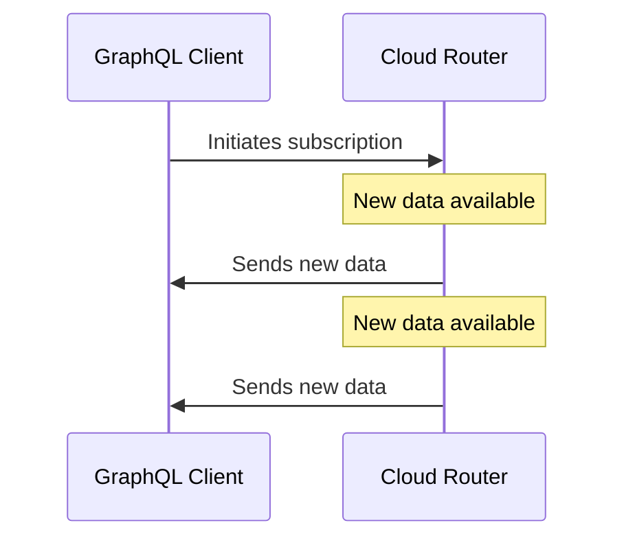
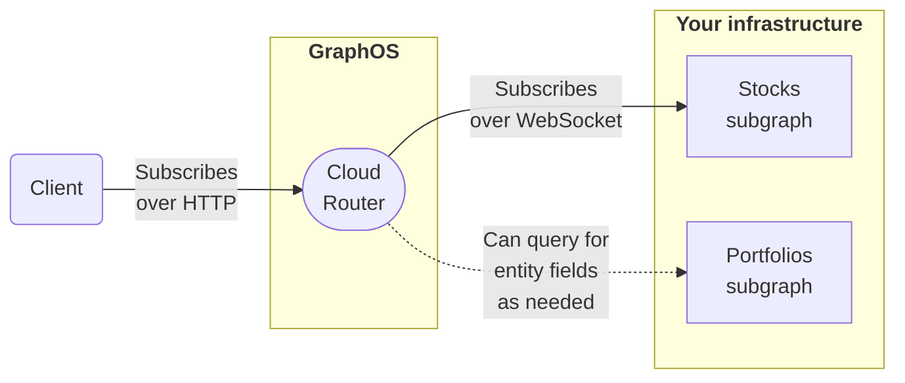

<blockquote>

**GraphQL subscription support for cloud supergraphs is currently in [preview](/resources/product-launch-stages#preview).**

You can also use subscriptions with an Enterprise self-hosed supergraph. See the [Apollo Router documentation](/router/executing-operation/subscription-support/).

</blockquote>

Cloud supergraphs provide preview support for GraphQL subscription operations:

```graphql
subscription OnStockPricesChanged {
  stockPricesChanged {
    symbol
    price
  }
}
```

With subscription support enabled, you can add `Subscription` fields to the schema of any subgraph that supports common WebSocket protocols for subscription communication:

```graphql title="stocks.graphql"
type Subscription {
  stockPricesChanged: [Stock!]!
}
```

> ⚠️ **Important:** To use subscriptions with your cloud supergraph, you must first complete certain [prerequisites](#prerequisites).

## What are subscriptions for?

GraphQL subscriptions enable clients to receive continual, real-time updates whenever new data becomes available. Unlike queries and mutations, subscriptions are _long-lasting_. This means a client can receive multiple updates from a single subscription:



Subscriptions are best suited to apps that rely on frequently-changing, time-sensitive data (such as stock prices, IoT sensor readings, live chat, or sports scores).

## How it works



1. A client executes a GraphQL subscription operation against your cloud router _over HTTP:_

    ```graphql title="Example subscription"
    subscription OnStockPricesChanged {
      stockPricesChanged {
        symbol
        price
      }
    }
    ```

   - **The client does _not_ use a WebSocket protocol!** Instead, it receives updates via [multipart HTTP responses](./subscription-multipart-protocol/).
   - By using HTTP for subscriptions, clients can execute _all_ GraphQL operation types over HTTP instead of using two different protocols.
   - Apollo Client for [Web](/react/data/subscriptions#http), [Kotlin](/kotlin/essentials/subscriptions#configuring-http-subscriptions), and [iOS](/ios/fetching/subscriptions#http) all support GraphQL subscriptions over HTTP with minimal configuration. See each library's documentation for details.

2. When your cloud router receives a subscription, it executes that _same_ subscription against whichever subgraph defines the requested field (`stockPricesChanged` in the example above).

   - This communication _does_ use [a WebSocket subprotocol](#subscription-modes) for compatibility with most subgraph libraries.

3. The subgraph periodically sends new data to your router. Whenever it does, the router returns that data to the client in an additional HTTP response part.
   - A subscription can include federated entity fields that are defined in _other_ subgraphs. If it does, the router _first_ fetches those fields by querying the corresponding subgraphs (such as **Portfolios** in the diagram above). These queries use HTTP as usual.

> [Walk through an example.](#example-execution)

## Prerequisites

⚠️ **Before you add `Subscription` fields to your subgraphs,** do _all_ of the following _in the order shown_ to prevent schema composition errors:

1. [Update your supergraph's build pipeline](../graphs/updating#2-update-your-build-pipeline) to use Apollo Federation 2.4 or later.
    - Previous versions of Apollo Federation don't support subscription operations.
2. Modify your subgraph schemas to use Apollo Federation 2.4 or later:
    ```graphql title="stocks.graphql"
    extend schema
    @link(url: "https://specs.apollo.dev/federation/v2.4", #highlight-line
          import: ["@key", "@shareable"])

    type Subscription {
      stockPricesChanged: [Stock!]!
    }
    ```

    - You can _skip_ modifying subgraph schemas that don't define any `Subscription` fields.

After you complete these prerequisites, you can safely [configure your router](#router-setup) for subscriptions.

## Cloud router setup

> ⚠️ **Make sure you've completed all [prerequisites](#prerequisites)!**

In your cloud router's [configuration](../routing/cloud-configuration/#router-configuration-yaml), you specify how the router communicates with each of your subgraphs when executing GraphQL subscriptions.

GraphOS cloud routers support two popular [WebSocket protocols](#websocket-setup) for subscriptions. **Your router must use whichever protocol is expected by each subgraph!**

Here's an example router configuration snippet that sets up subgraph subscriptions over WebSocket:

```yaml title="Router configuration YAML"
subscription:
  mode:
    passthrough:
      all: # The router uses these subscription settings UNLESS overridden per-subgraph
        path: /subscriptions # The URL path to use for subgraph subscription endpoints (Default: /ws)
      subgraphs: # Overrides subscription settings for individual subgraphs
        reviews: # Overrides settings for the 'reviews' subgraph
          path: /ws # Overrides '/subscriptions' defined above
          protocol: graphql_transport_ws # The WebSocket-based subprotocol to use for subscription communication (Default: graphql_ws)
```

This example enables subscriptions in **passthrough mode**, which uses long-lived WebSocket connections.

### Supported protocols

The router supports the following WebSocket subprotocols, specified via the `protocol` option:

- `graphql_ws`
  - Legacy subprotocol used by the [`subscriptions-transport-ws` library](https://github.com/apollographql/subscriptions-transport-ws), which is **unmaintained**
  - For backward compatibility, this is the default value.
- `graphql_transport_ws`
  - Used by the [graphql-ws](https://github.com/enisdenjo/graphql-ws) library
  - This subprotocol is recommended for GraphQL server libraries implementing WebSocket-based subscriptions.

> ⚠️ **Your router must use whichever subprotocol is expected by each of your subgraphs!**

By default, the router uses `graphql_ws` for all subgraphs. You can change this global default and/or override it for individual subgraphs by setting the `protocol` key as shown above.

Your router creates a separate WebSocket connection for each client subscription, _unless_ it can perform [subscription deduplication](#subscription-deduplication).

## Example execution

Let's say our supergraph includes the following subgraphs and partial schemas:

<CodeColumns>

```graphql title="Products subgraph"
type Product @key(fields: "id") {
  id: ID!
  name: String!
  price: Int!
}

# highlight-start
type Subscription {
  productPriceChanged: Product!
}
#highlight-end
```

```graphql title="Reviews subgraph"
type Product @key(fields: "id") {
  id: ID!
  reviews: [Review!]!
}

type Review {
  score: Int!
}
```

</CodeColumns>

Now, let's say a client executes the following subscription against our router ([over HTTP!](#how-it-works)):

```graphql
subscription OnProductPriceChanged {
  productPriceChanged {
    # Defined in Products subgraph
    name
    price
    reviews {
      # Defined in Reviews subgraph!
      score
    }
  }
}
```

When our router receives this operation, it executes a corresponding subscription operation against the Products subgraph (over a new WebSocket connection):

```graphql
subscription {
  productPriceChanged {
    id # Added for entity fetching
    name
    price
    # Reviews fields removed!
  }
}
```

<blockquote>

**Note the following:**

- This operation _adds_ the `Product.id` field. The router needs `@key` fields of the `Product` entity to merge entity fields from across subgraphs.
- This operation _removes_ all fields defined in the Reviews subgraph, because the Products subgraph can't resolve them.

</blockquote>

At any point after the subscription is initiated, the Products subgraph might send updated data to our router. Whenever this happens, the router _does not_ immediately return this data to the client, because it's missing requested fields from the Reviews subgraph!

Instead, our router executes a standard GraphQL _query_ against the Reviews subgraph to fetch the missing entity fields:

```graphql
query {
  _entities(representations: [...]) {
    ... on Product {
      reviews {
        score
      }
    }
  }
}
```

After receiving this query result from the Reviews subgraph, our router combines it with the data from Products and returns the combination to the subscribing client.

## Trying subscriptions with `curl`

To quickly try out HTTP-based subscriptions _without_ setting up an Apollo Client library, you can execute a `curl` command against your cloud router with the following format:

```bash title="Example curl request"
 curl 'https://main--my-org-supergraph.apollographos.net/graphql' -v \
  -H 'accept: multipart/mixed; boundary="graphql"; subscriptionSpec=1.0, application/json' \
  -H 'content-type: application/json' \
  --data-raw '{"query":"subscription OnProductPriceChanged { productPriceChanged { name price reviews { score } } }","operationName":"OnProductPriceChanged"}'
```

This command creates an HTTP multipart request and keeps an open connection that receives new subscription data in multiple response parts:

```
--graphql
content-type: application/json

{}
--graphql
content-type: application/json

{"payload":{"data":{"productPriceChanged":{"name":"Croissant","price":400,"reviews":[{"score":5}]}}}}
--graphql
content-type: application/json

{"payload":{"data":{"productPriceChanged":{"name":"Croissant","price":375,"reviews":[{"score":5}]}}}}
--graphql
content-type: application/json

{"payload":{"data":{"productPriceChanged":{"name":"Croissant","price":425,"reviews":[{"score":5}]}}}}
--graphql--
```

> This example subscription only emits three events and then directly closes the connection.
>
> For more information on this multipart HTTP subscription protocol, see [this article](./subscription-multipart-protocol/).
