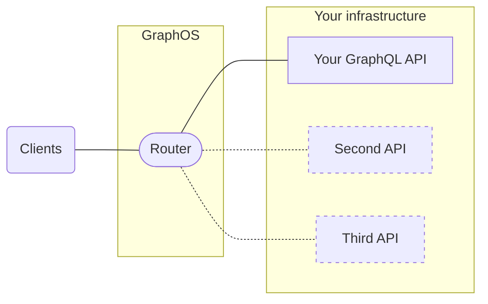

Hello! 👋 This quickstart gets you up and running with GraphOS and your first supergraph. None of this setup requires a paid plan.

To complete these steps, it's helpful to have one of the following available:

- The URL of your running GraphQL server, with introspection enabled
- Your GraphQL server's schema, as plaintext SDL

If you don't have either, that's okay! You can still try out GraphOS with an example GraphQL server. To do so, provide all values labeled **🚀 Example setup** in the steps below.

<Note>

If you're getting started with a Dedicated plan, follow [this quickstart](../cloud-routing/dedicated/quickstart) instead.

</Note>

## 1. Create your Apollo account

GraphOS Studio is the primary web interface for interacting with the GraphOS platform. We'll use Studio in every step of this tutorial, starting with creating a Studio account.

<Note>

If you already have an Apollo account, you can skip to [creating your first supergraph](#2-create-your-first-supergraph).
If your account is part of an organization created before October 2022, you might need to [create a new organization](../org/#creating-an-organization) to create cloud supergraphs.

Some legacy organizations can upgrade to a current plan. [See details.](../org/plans#upgrading-to-a-current-plan)

</Note>

1. Go to [studio.apollographql.com](https://studio.apollographql.com/?referrer=docs-content) and click **Let's get started**.

2. Choose a signup method—either using GitHub or with an email and password. Studio then shows a signup form. Its details vary depending on your signup method.

3. Complete the form, and click **Create Account**. By default, your account is on the [Serverless (Free) plan](../org/plans/#current-plans).

## 2. Create your first supergraph

You now have a GraphOS Studio account, but it doesn't contain any graphs yet. The next steps guide you to create a _cloud supergraph_.
A cloud supergraph automatically provisions a GraphOS Router in front of your API. Clients query your router instead of querying your API directly.

With this architecture, you can combine multiple APIs into a single graph, all orchestrated by the router:



If you're creating a new cloud supergraph from an existing account, follow the steps in [that section](#from-an-existing-account).
Otherwise, continue with the steps below.

### From a new account

1. Studio prompts you to **Connect your API** or **Try a demo graph**. If you have the URL of your running GraphQL server, select **Connect API**. Otherwise, you can select **Try a demo graph**, and Apollo creates a demo graph for you to play with.

2. Provide your **GraphQL API's Endpoint URL**. This is the same URL that client applications currently use to query your API. After you provide the URL, Studio attempts to fetch your API's schema from it via introspection. The result of that fetch is shown beneath the text box.

   - If your GraphQL server requires certain HTTP headers for Studio to introspect it, click **Provide HTTP Headers** to specify them.

3. Provide the **name of your service**. The name should reflect the data or capabilities that your API provides and should uniquely identify your API among any other APIs you might add to the supergraph later.

   <Note>

   The service name is immutable.

   </Note>

4. Click **Continue**.

   - If the **Continue** button is inactive, Studio hasn't obtained your API's schema. If necessary you can bypass introspection by **uploading your schema**. By selecting this option, you can manually copying and pasting your schema, or dragging and dropping a `.gql` or `.graphql` file.

5. Provide a name and ID for your new graph.

   - The name is displayed throughout Studio and helps your team distinguish between your different graphs. You can change your graph's name at any time.
   - The ID is immutable and must be unique across all of Apollo. Make sure it starts with a letter and contains only letters, numbers, and dashes. You'll use the ID to reference your graph from various tools, such as the Rover CLI.

6. Click **Continue**.

You've now created your first cloud supergraph, which is listed in your organization's **Graphs** tab:


Your GraphQL API is now the first **subgraph** in that cloud supergraph.
Skip to [the next step](#3-learn-about-your-variant) to learn about **variants**.

### From an existing account

1. From your account in [GraphOS Studio](https://studio.apollographql.com/?referrer=docs-content), navigate to the **Graphs** tab if it isn't already open. Select **+ Create New Graph** in the top right.
2. Click **Connect your GraphQL API**.
3. In the dialog that appears, provide your GraphQL API's **Endpoint URL**.

   - This is the same URL that client applications currently use to query your API.
   - If you don't have a URL, you can use `https://flyby-locations-sub.herokuapp.com/` as an example.

   After you provide the URL, Studio attempts to fetch your API's schema from it via introspection. Once the fetch succeeds, the input shows a green check.

4. (Optional) You can click **Advanced options** for the following scenarios:

- If your GraphQL server requires certain HTTP headers for Studio to introspect it, click **Provide HTTP Headers** to specify them.
- You can click **Provide your schema directly** to provide your API's schema as plaintext SDL.
- Finally, you can select **Use local introspection** to provide a local URL and do a one-time introspection of your schema.

5. Provide a **Subgraph Name** for your API. This name uniquely identifies your API among any other APIs you might add to the supergraph later. The name should reflect the data or capabilities that your API provides.

   - If you're using the `https://flyby-locations-sub.herokuapp.com/` example URL, you can enter **Locations** as the subgraph name.

   <Note>

   A subgraph name is immutable.

   </Note>

6. Click **Next**.

   - If the **Next** button is inactive, Studio hasn't obtained your API's schema! Make sure to provide it using one of the methods described in steps 3 and 4.

7. In the dialog that appears, provide a name and ID for your new supergraph.

   - The name is displayed throughout Studio and helps your team distinguish between your different graphs. You can change your graph's name at any time.
   - The ID is immutable and must be unique across all of Apollo. Make sure it starts with a letter and contains only letters, numbers, and dashes. You'll use the ID to reference your graph from various tools, such as the Rover CLI.

8. Click **Create Supergraph**.

You've now created your first cloud supergraph, and you can view it listed in your organization's **Graphs** tab:


Your GraphQL API is now the first subgraph in that cloud supergraph.

## 3. Learn about your variant

When you created your supergraph, you also created its first variant. Every graph in GraphOS has one or more variants representing a different environment where the graph runs, such as staging or production. Each variant has a name that you set or is `current` by default.

Let's look at the views that Studio provides to help you understand your variant:

From your **Graphs** tab, click your graph's `current` variant. This opens the variant's **Overview** page.

The README is great for documenting your supergraph so team members can learn the basics of how to work with it. It supports Markdown syntax like a typical README in a Git repository.

When viewing any page for a variant, you can navigate to other pages from the navigation on the left side.
You can collapse this navigation to show only icons.

We'll cover some of these pages in later steps, but feel free to click around and see what each provides. You can also expand the summary table below.

### Variant pages in Studio

<StudioPages />

## 4. Configure your router's network settings

Before we try executing operations on your supergraph, we need to make sure your router is set up to communicate successfully with both your clients and your subgraph.

Open your variant's **Cloud Router** page from the left navigation. This page displays your router's endpoint URL, and it also enables you to customize its networking behavior with YAML-based config. Under **Router configuration YAML**, you'll see a default configuration similar to the following:

```yaml
cors:
  origins:
    - https://studio.apollographql.com
headers:
  subgraphs:
    locations: # This value matches your subgraph's name.
      request:
        - propagate:
            matching: '.*'
```

Let's modify this default config to work with your clients and your subgraph.

<Note>

Make sure to save any changes you make to your configuration YAML in Studio.

</Note>

### CORS rules

<Note>

If no browser-based GraphQL clients will communicate with your supergraph, you can skip this section.

</Note>

The [Cross-Origin Resource Sharing](https://developer.mozilla.org/en-US/docs/Web/HTTP/CORS) (CORS) protocol enables a server to dictate exactly which origins can communicate with it from a web browser.

As shown in the configuration above, by default your router only accepts browser-based requests from GraphOS Studio! If other browser-based applications will query your supergraph, you need to modify your CORS settings.

To limit browser-based queries to specific domains, list those domains in the configuration YAML like so:

```yaml
cors:
  origins:
    - https://studio.apollographql.com
    # highlight-start
    - https://first-domain.example.com
    - https://second-domain.example.com
    # highlight-end
```

To allow browser-based queries from any domain, you can instead set `allow_any_origin: true`:

```yaml
cors:
  # highlight-start
  allow_any_origin: true
  # highlight-end
```

<Tip>

For advanced CORS options, see [Configuring cloud routing](/graphos/cloud-routing/configuration#cors-settings).

</Tip>

### Header rules

<Note>

If your router doesn't need to provide specific HTTP headers in its requests to your subgraph, you can skip this section.

</Note>

If your subgraph's server requires certain HTTP headers to communicate with it (such as an `Authorization` header), let's specify those headers in the configuration YAML.

#### Creating secrets

If the value of any required header includes a secure credential (such as an access token), let's first create a router-specific secret for that credential.

On the **Cloud Router** page, click **Save a secret**. The following dialog appears:

In the dialog that appears, enter a name and value for your secret. You can't view a secret's value after you save it, so make sure that the value is correct before saving. When you're ready, click **Save secret**.

Your secret is encrypted and stored. Now you can use the secret's value in your router's configuration YAML.

#### Setting header values

In your configuration YAML, you set header values to pass from your router to your subgraph like so:

```yaml
headers:
  subgraphs:
    locations: # This value matches your subgraph's name.
      request:
        - propagate:
            matching: '.*'
        # highlight-start
        - insert:
            name: 'Authorization'
            value: 'Bearer ${env.MY_SECRET}'
        - insert:
            name: 'X-CUSTOM-HEADER'
            value: 'Custom value'
        # highlight-end
```

Here, we add two headers: `Authorization` and `X-CUSTOM-HEADER`. The `Authorization` header's value includes the value of a [router-specific secret](#creating-secrets) named `MY_SECRET`.

<Note>

Make sure you save any [router-specific secrets](#creating-secrets) before you update your config YAML to include them. Otherwise, your router won't be updated with the new configuration.

</Note>

## 5. Query your supergraph

Let's try executing a query against your new supergraph! To do that, we'll use one of Studio's most powerful features: the Explorer. The Explorer is a GraphQL IDE that provides visibility into your supergraph's entire schema and helps you build and run queries against it.

From your organization's **Graphs** tab, select your new variant and then open its **Explorer** page from the left navigation.

Try building a couple of queries and running them against your supergraph. Notice that the supergraph supports the exact same query structures as your underlying GraphQL API.

Because you've created a cloud supergraph, operations you run in the Explorer are sent to the GraphOS Router that sits in front of your API. Application clients will also query the router instead of querying your API directly.

<Note>

If the Explorer returns errors for all operations, GraphOS might not be finished provisioning your router. If this is the case, an **INITIATING ENDPOINT** label is shown at the top of the page:


</Note>

## 6. View operation and field metrics

Here's a powerful benefit of a cloud supergraph: because clients execute operations against your GraphOS Router, the router automatically collects metrics on those operations and their fields. You can then visualize those metrics in Studio.

Go to your variant's **Insights** page, which looks like this:


The operations you [executed in the Explorer](#4-query-your-supergraph) should already be represented on this page. After you update all your clients to query your router, the Insights page becomes vital to monitoring your supergraph's performance.

Learn more about the available metrics in the [metrics documentation](../metrics).

## 7. Connect clients to your router

Your supergraph is ready to start receiving client operations! If you have existing client applications that connect directly to your GraphQL API, you can update their GraphQL endpoint URL to your router's URL.

Similarly, any new client applications should use your router's URL.

<Note>

- For all browser-based clients, make sure their origin is allowed in your router's [CORS rules](#cors-rules).

- Only update clients that communicate with the correct instance of your GraphQL API. For example, if your API has staging and production instances, only update clients that communicate with the instance used by this supergraph variant.

</Note>

Your router's URL is available from the top of your variant's **Overview** page, directly below the variant's graph ref.


## Next steps

Congratulations! 🎉 You've built your first cloud supergraph on GraphOS. Next, we'll cover some of the most common and important actions to perform on your supergraph, including:

- Updating your subgraph's schema
- Adding another subgraph
- Setting up schema checks

[Go to next steps.](./next-steps/)
