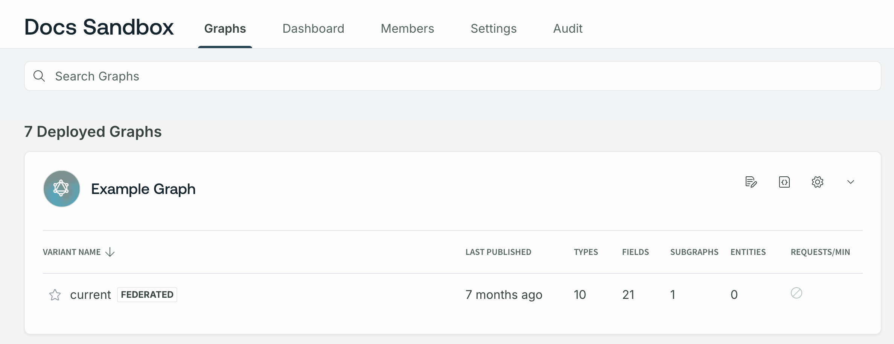

Hello! 👋 This quickstart gets you up and running with GraphOS and your first supergraph. **None of this setup requires a paid plan.**

To complete these steps, it's helpful to have one of the following available:

- The URL of your running GraphQL server, with introspection enabled
- Your GraphQL server's schema, as plaintext SDL

**If you don't have either, that's okay!** You can still try out GraphOS with an example GraphQL server. To do so, provide all values labeled **🚀 Example setup** in the steps below.

## 1. Create your Apollo account

<blockquote>

**If you already have an Apollo account,** and you created your organization prior to October 2022, you might need to **create a new organization** to create cloud supergraphs:


_Some_ legacy organizations can upgrade to a current plan. [See details.](../org/plans#upgrading-to-a-current-plan)

</blockquote>

**Apollo Studio** is the primary web interface for interacting with the GraphOS platform. We'll use Studio in every step of this tutorial, starting with creating an account.

1. Go to [studio.apollographql.com](https://studio.apollographql.com/) and click **Let's get started**.

2. Choose a signup method (GitHub or username/password).

   Studio then shows a signup form (its details vary depending on your signup method):

   

3. Complete the signup form.

   - If you want to customize your organization's details (such as its name or ID), you can uncheck **Create an organization for my automatically**.

4. Click **Create Account**.

You're all set! Studio automatically redirects you to your newly created organization, which is on the **Serverless (Free)** plan by default.

## 2. Create your first supergraph

You now have an Apollo Studio organization, but it doesn't contain any graphs yet. Let's create your first **cloud supergraph**, which will incorporate your existing GraphQL API.

<blockquote>

A **cloud supergraph** automatically provisions a GraphOS-managed **router** in front of your API. Clients query your router instead of querying your API directly.

With this architecture, you can later combine _multiple_ APIs into a single graph, all orchestrated by the router:


</blockquote>

1. From your new organization in [Apollo Studio](https://studio.apollographql.com/), navigate to the **Graphs** tab if it isn't already open.

   Because you haven't created any graphs yet, Studio shows the following:

   

2. Click **Connect your GraphQL API**. The following dialog appears:

   

3. Provide your GraphQL API's **Endpoint URL**.

   - This is the same URL that client applications currently use to query your API.
   - **🚀 Example setup:** `https://flyby-locations-sub.herokuapp.com/`

   After you provide the URL, Studio attempts to fetch your API's schema from it via introspection. The result of that fetch is shown beneath the text box:

   

4. **If the schema fetch failed,** click **Advanced options** (otherwise, proceed to the next step):

   

   - If your GraphQL server requires certain HTTP headers for Studio to introspect it, click **Provide HTTP Headers** to specify them.
   - Otherwise, click **Upload your schema directly** to provide your API's schema as plaintext SDL.

5. Provide a **Subgraph Name** for your API. This name uniquely identifies your API among any _other_ APIs you might add to the supergraph later.

   - The name should reflect the data or capabilities that your API provides.
   - **🚀 Example setup:** `locations`

6. Click **Next**.

   - If the **Next** button is inactive, Studio hasn't obtained your API's schema! Make sure to provide it using one of the methods described in the previous few steps.

   The following dialog appears:

   

7. Provide an ID and a name for your new supergraph.

   - The ID is **immutable** and must be unique across all of Apollo. You'll use this value to reference your supergraph from various tools, such as the Rover CLI.
   - The name is displayed throughout Studio and helps your team distinguish between your different graphs. You can change your supergraph's name at any time.

8. Click **Create Supergraph**.

Nice work! You've created your first cloud supergraph, which is now listed in your organization's **Graphs** tab:



Your GraphQL API is now the first **subgraph** in a cloud supergraph. Later, we'll cover how to add _another_ subgraph.

> **Note:** It'll take a few seconds for GraphOS to finish provisioning your new variant's router. Until it's finished, you'll see an **INITIATING ENDPOINT** label next to the variant.

## 3. Learn about your variant

When you created your supergraph, you also created its first **variant** (which is named `main`). Every graph in GraphOS has one or more variants. Each variant represents a different environment where the graph runs (such as staging or production).

Let's look at the helpful views that Studio provides for your variant!

From your **Graphs** tab, click your graph's `main` variant. This opens the variant's README page.

The README is great for documenting your supergraph so team members can learn the basics of how to work with it. It supports Markdown syntax like a typical README in a Git repository.

While you're viewing _any_ page for a variant, the following navigation is shown on the left side:


> You can collapse this navigation to show only icons.

We'll cover some of these pages in later steps, but feel free to click around and see what each provides! You can also expand the summary table below:

### Variant pages in Studio

<ExpansionPanel title="Click to expand">

| Page           | Description                                                                                                                                                                                                                |
| -------------- | -------------------------------------------------------------------------------------------------------------------------------------------------------------------------------------------------------------------------- |
| **README**     | Displays the variant's editable Markdown-formatted README, along with other important details about the variant (such as its graph ref and router URL). [Learn more](../graphs/studio-features/#the-readme-page)           |
| **Schema**     | Documentation for all your supergraph's types and fields. Supports filtering definitions by name, subgraph, and other values. [Learn more](../graphs/studio-features/#the-schema-page)                                     |
| **Explorer**   | A powerful IDE for building and executing operations against your supergraph. [Learn more](../explorer/)                                                                                                           |
| **Subgraphs**  | Displays the details for each separate GraphQL API that's part of your supergraph. (Each API is called a **subgraph**.) [Learn more](../routing/cloud/)                                                                    |
| **Changelog**  | Displays a historical diff of additions, modifications, and deletions made to your supergraph's schema.                                                                                                                    |
| **Fields**     | Displays field-level metrics for your supergraph, indicating how frequently each field is included in client operations. [Learn more](../metrics/field-usage)                                                              |
| **Clients**    | Displays operation metrics for the variant, broken down by individual clients. This feature requires that clients identify themselves in their requests to your router. [Learn more](../metrics/client-awareness)          |
| **Operations** | Displays an overview of usage metrics for the variant, including request and error rates. Supports filtering by date range. [Learn more](../metrics/)                                                       |
| **Checks**     | Displays the results of schema checks that have been run for the variant. [Learn more](../delivery/schema-checks)                                                                                                          |
| **Launches**   | Displays the results of recent launches executed for your supergraph. A launch occurs whenever changes are made to one of your subgraph schemas, resulting in an update to your router. [Learn more](../delivery/launches) |
| **Settings**   | Configuration options for the individual variant, along with high-level options for the entire supergraph.                                                                                                                 |

</ExpansionPanel>

## 4. Configure your router's network settings

Before we try executing operations on your supergraph, we need to make sure your router is set up to communicate successfully with both your clients _and_ your subgraph.

Go to your variant's **Settings** page, then click **Cloud Router**:


This page displays your router's endpoint URL, and it also enables you to customize its networking behavior with YAML-based config. In the **Router configuration YAML** section, you'll see a default configuration similar to the following:

```yaml
cors:
  origins:
    - https://studio.apollographql.com
headers:
  subgraphs:
    locations: # This value matches your subgraph's name.
      request:
        - propagate:
            matching: '.*'
```

Let's modify this default config to work with your clients and your subgraph.

> After you make any necessary changes to your configuration YAML in Studio, make sure to click **Save**.

### CORS rules

> If no browser-based GraphQL clients will communicate with your supergraph, you can skip this.

The [Cross-Origin Resource Sharing](https://developer.mozilla.org/en-US/docs/Web/HTTP/CORS) (CORS) protocol enables a server to dictate exactly which origins can communicate with it from a web browser.

As shown in the configuration above, by default your router only accepts browser-based requests from Apollo Studio! If other browser-based applications will query your supergraph, you need to modify your CORS settings.

**To limit browser-based queries to specific domains,** list those domains in the configuration YAML like so:

```yaml
cors:
  origins:
    - https://studio.apollographql.com
    # highlight-start
    - https://first-domain.example.com
    - https://second-domain.example.com
    # highlight-end
```

**To allow browser-based queries from _any_ domain,** you can instead set `allow_any_origin: true`:

```yaml
cors:
  # highlight-start
  allow_any_origin: true
  # highlight-end
```

> For advanced CORS options, see [Configuring cloud routing](../routing/cloud-configuration#cors-settings).

### Header rules

> If your router doesn't need to provide specific HTTP headers in its requests to your subgraph, you can skip this.

If your subgraph's server requires certain HTTP headers to communicate with it (such as an `Authorization` header), let's specify those headers in the configuration YAML.

#### Creating secrets

If the value of any required header includes a secure credential (such as an access token), let's first create a **router-specific secret** for that credential.

On the **Cloud Router** page, click **Save a secret**. The following dialog appears:


Enter a name and value for your secret. **You can't view a secret's value after you save it**, so make sure that the value is correct before saving. When you're ready, click **Save secret**.

Your secret is encrypted and stored. Now you can use the secret's value in your router's configuration YAML.

#### Setting header values

In your configuration YAML, you set header values to pass from your router to your subgraph like so:

```yaml
headers:
  subgraphs:
    locations: # This value matches your subgraph's name.
      request:
        - propagate:
            matching: '.*'
        # highlight-start
        - insert:
            name: 'Authorization'
            value: 'Bearer ${env.MY_SECRET}'
        - insert:
            name: 'X-CUSTOM-HEADER'
            value: 'Custom value'
        # highlight-end
```

Here, we add two headers: `Authorization` and `X-CUSTOM-HEADER`. The `Authorization` header's value includes the value of a [router-specific secret](#creating-secrets) named `MY_SECRET`.

> Make sure you save any [router-specific secrets](#creating-secrets) _before_ you update your config YAML to include them. Otherwise, your router won't be updated with the new configuration.

## 5. Query your supergraph

Let's try executing a query against your new supergraph! To do that, we'll use one of Studio's most powerful features: the **Explorer**. The Explorer is a GraphQL IDE that provides visibility into your supergraph's entire schema and helps you build and run queries against it.

From your organization's **Graphs** tab, select your new variant and then open its Explorer page from the left navigation. The Explorer looks like this:


Try building a couple of queries and running them against your supergraph. Notice that the supergraph supports the exact same query structures as your underlying GraphQL API.

Because you've created a cloud supergraph, operations you run in the Explorer are sent to the GraphOS-managed **router** that sits in front of your API. Application clients will _also_ query the router instead of querying your API directly.

<blockquote>

**If the Explorer returns errors for all operations,** GraphOS might not be finished provisioning your router. If this is the case, an **INITIATING ENDPOINT** label is shown at the top of the page:


</blockquote>

## 6. View operation metrics

Here's a powerful benefit of a cloud supergraph: because clients execute operations against your GraphOS-managed router, the router automatically collects metrics on those operations! You can then visualize those metrics in Studio.

Go to your variant's **Operations** page, which looks like this:


The operations you [executed in the Explorer](#4-query-your-supergraph) should already be represented on this page! After you update all of your clients to query your router, the **Operations** page becomes vital to monitoring your supergraph's performance.

## 7. Connect clients to your router

Your supergraph is ready to start receiving client operations! If you have existing client applications that connect _directly_ to your GraphQL API, you can update their GraphQL endpoint URL to your _router's_ URL.

Similarly, any _new_ client applications should use your router's URL.

> ⚠️ **Important considerations:**
>
> - For all browser-based clients, make sure their origin is allowed in your router's [CORS rules](#cors-rules).
> - Only update clients that communicate with the correct instance of your GraphQL API! For example, if your API has staging and production instances, only update clients that communicate with the instance used by this supergraph variant.

Your router's URL is available from the top of your variant's README page:


Every router URL is on a subdomain of `apollographos.net`.

## Next steps

Congratulations! 🎉 You've built your first cloud supergraph on GraphOS. Next, we'll cover some of the most common and important actions to perform on your supergraph, including:

- Updating your subgraph's schema
- Adding another subgraph
- Setting up schema checks

[Go to next steps.](./next-steps/)
