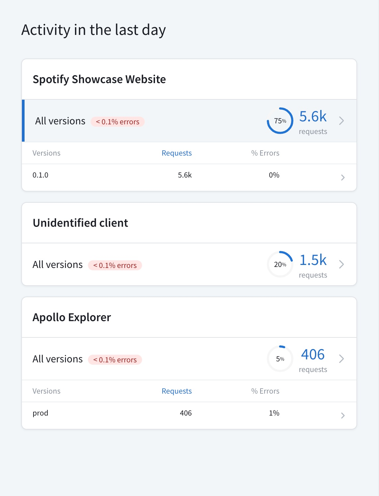

After you [create a supergraph](./cloud/) in Apollo Studio, read below to learn about some of the next steps you should take to get the most out of it and the entire GraphOS platform.

> For the most part, you can perform these next steps in any order. But you should definitely start by [installing the Rover CLI](#first-install-the-rover-cli).

## First, install the Rover CLI!

The Rover CLI is the primary command-line interface for interacting with GraphOS. You'll use Rover both locally _and_ in CI environments to perform a variety of actions on your supergraph and its individual subgraphs.

[**Install Rover**](/rover/getting-started), then return to this article.

## Run your supergraph locally

See [this article](../graphs/local-development/).

## Subgraph actions

### Update a subgraph schema

When you first set up your cloud supergraph, Apollo Studio fetches your existing GraphQL API's schema. Your existing API becomes the first **subgraph** in your supergraph:

This initial schema fetch is a one-time action to help you get started. Whenever your API's schema _changes_, Studio _doesn't_ automatically fetch it again. This means your router _doesn't know_ about those changes. Clients can't include any new schema fields in their queries until your router _does_ know about the changes!

Whenever you update your subgraph's schema, you need to **publish** those changes with the Rover CLI. [Learn about publishing subgraph schemas.](../delivery/#subgraph-schemas)

After learning about the publishing process, you should [integrate it into your CI workflow](#set-up-continuous-delivery).

### Add another subgraph

One of the most powerful features of a supergraph is that it can combine _multiple_ GraphQL APIs into a _single_ graph:

With this architecture, different teams in your organization can each maintain their own subgraph. This helps teams work in parallel, because they aren't all contributing to the same single codebase.

#### 1. Build your new subgraph

See [Creating a new subgraph](../graphs/creating-a-subgraph/).

#### 2. Add the subgraph to your supergraph

See [Adding a new subgraph](../graphs/federated-graphs#adding-a-new-subgraph).

### Add another variant

Most supergraphs have multiple **variants**, each of which represents that supergraph running in a different environment (production, staging, and so on).

If your supergraph runs in multiple environments, you sould create a different variant for each.

[Learn how to create variants.](../graphs/federated-graphs/#adding-a-variant)

### Enable federation features

Supergraphs use an architecture called **Apollo Federation**. Federation is at its most powerful when your subgraphs _share_ responsibility for some of your schema's types, instead of defining mutually exclusive types and fields.

> [Learn the fundamentals of federation.](/federation/#how-it-works)

To take full advantage of federation features, each of your subgraphs needs to use a GraphQL server library that conforms to the **Apollo Federation subgraph specification**. Fortunately, many popular server libraries do!

1. To check whether your current GraphQL server library supports the subgraph specification, see [this article](/federation/building-supergraphs/supported-subgraphs).
   - If your library _does_ support the spec, consult its documentation to learn how to enable its federation support. For Apollo Server, see [this article](/apollo-server/using-federation/apollo-subgraph-setup).
   - If your library _doesn't_ support the spec, consult the library list to find an alternative in your preferred programming language.
2. Enable federation support for all of your subgraphs and deploy the updated subgraphs to your environment.

After you make these changes, you can start using powerful federation features in your subgraphs, including:

- [Entities](/federation/entities/) (object types that are defined and resolved across multiple subgraphs)
- [Federation-specific directives](/federation/federated-types/federated-directives) for sharing types, marking fields as inaccessible, and more
- [Federated trace reporting](/federation/metrics/) for metrics visualization in Apollo Studio

### Set up continuous delivery

Every time you want to make changes to one of your subgraphs, you should do the following:

1. Verify that your proposed changes won't break your supergraph _or_ any of your existing clients.
   - To do this, you set up [schema checks](../delivery/schema-checks/) for your supergraph.
2. Whenever you deploy verified changes, always publish your updated subgraph schema to GraphOS as part of that deployment.
   - For a basic example of this, see [Publishing with continuous delivery](../delivery/#publishing-with-continuous-delivery).

### Disable client-subgraph communication

With a supergraph architecture, clients should _never_ query your individual subgraphs directly. Instead, they should always query the router! This means your subgraphs can (and should) _reject_ incoming requests from any source _besides_ the router.

How you choose to configure this access control depends on your GraphQL server library and your particular infrastructure.

> Make sure any _existing_ clients that communicate directly with your API are updated to communicate with your router _before_ you begin rejecting direct requests!

For more information, see [Securing your subgraphs](/federation/building-supergraphs/subgraphs-overview#securing-your-subgraphs).

## Studio actions

### Configure notifications

GraphOS can send you various types of notifications via a few different channels (including Slack and Pagerduty). These notifications can include a daily metrics report, schema change updates, and experimental performance alerts. [Set up notifications.](../metrics/notifications/notification-setup/)

### Invite team members

If you've created a Studio organization to collaborate with your team, invite your team members from the organization's **Members** tab.

## Client actions

### Add identification headers to your clients

A supergraph variant's **Clients** page enables you to view operation metrics, segmented by your different clients:

To get the most out of this feature, each of your client applications should set values for the following HTTP headers in each request they send to your router:

- `apollographql-client-name`
- `apollographql-client-version`
