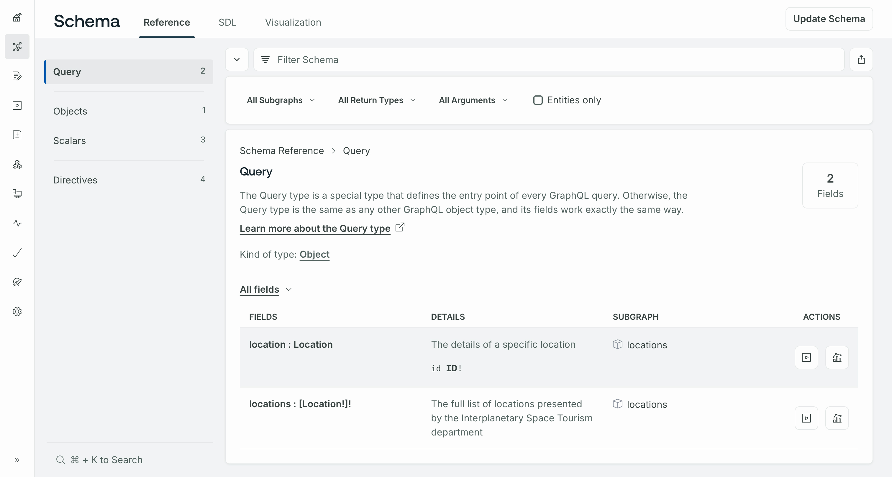
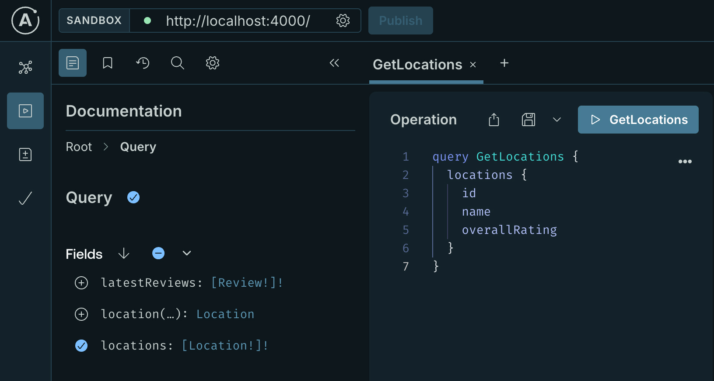
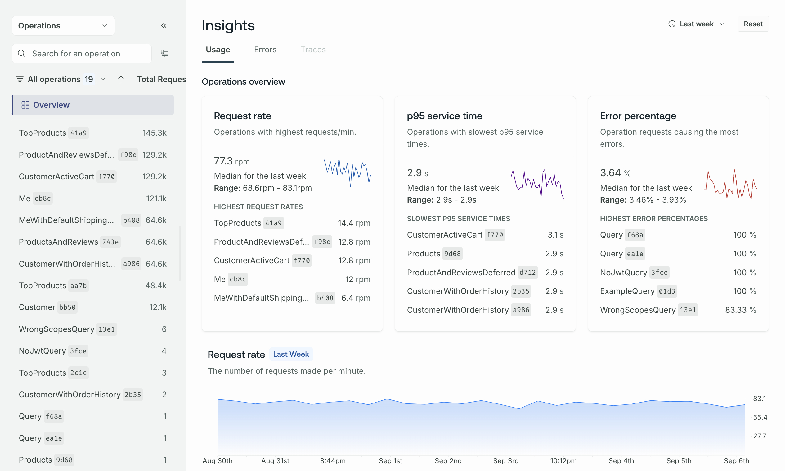

This tutorial gets you up and running with GraphOS and a self-hosted supergraph, using the GraphOS Router. While you can run the Apollo Router Core regardless of your Apollo plan, connecting the router to GraphOS requires an [Enterprise plan](https://new.apollographql.com/pricing).
If your organization doesn't currently have an Enterprise plan, you can test out this functionality by signing up for a free [Enterprise trial](https://studio.apollographql.com/signup?type=enterprise-trial&referrer=docs-content).

<Note>

This tutorial uses [Docker](https://www.docker.com/) for containerization of your supergraph's router.

</Note>

## Supergraph concepts

Before we get started, let's quickly cover what a self-hosted supergraph is.

A _supergraph_ combines multiple GraphQL APIs into a single unified GraphQL service. The individual APIs in a supergraph are called _subgraphs_:


A separate service called the _router_ sits in front of your subgraphs and provides the publicly accessible endpoint for your supergraph. Clients query the router, which distributes each query across the appropriate combination of subgraphs and returns the combined result.

The router uses a special GraphQL schema called the _supergraph schema_. This schema incorporates the types and fields in each subgraph schema, along with metadata that enables the router to correctly distribute queries across subgraphs.

A _self-hosted supergraph_ is a supergraph with a router that you host and manage in your own infrastructure. This is in contrast to a [_cloud supergraph_](./cloud/), which uses a router that's hosted and managed by Apollo.

We'll cover these concepts in more detail as we proceed through the steps below.

## 1. Set up Apollo tools

This quickstart uses the following Apollo tools:

- **GraphOS Studio**: This is the primary web interface for GraphOS. Studio helps you monitor, manage, and collaborate on your supergraph.
- **The Rover CLI**: This is the primary command-line interface for GraphOS. Rover helps you interact with your graphs and their schemas.

Let's set these up first.

#### Create an Apollo account

To manage our supergraph with GraphOS, we need an Apollo account. Let's create one if you don't have one yet.

Complete the first step of <a href="./cloud/#1-create-your-apollo-account" target="_blank">Get started with GraphOS</a> (**Create your Apollo account**), then return here.

#### Create a graph in GraphOS Studio

After you create your Apollo account, create your first graph in GraphOS Studio by following these steps:

<CreateSelfHostedSupergraph />

#### Install the Rover CLI

_Rover_ is Apollo's CLI for managing all kinds of graphs, including subgraphs and supergraphs. We'll use it throughout this quickstart.

<Note>

Even if you already have Rover installed, you should update your version now by completing this step.

</Note>

Install the latest Rover release with the appropriate command for your system:

```bash showLineNumbers=false title="Mac/Unix"
curl -sSL https://rover.apollo.dev/nix/latest | sh
```

```bash showLineNumbers=false title="Windows" 
iwr 'https://rover.apollo.dev/win/latest' | iex
```

After installing, run `rover` in your terminal with no arguments to confirm that it installed successfully. Verify that the printed version number matches the [latest full release](https://github.com/apollographql/rover/releases) (if it doesn't, you might need to manually delete a previous outdated installation).

#### Authenticate Rover with GraphOS

We'll use Rover to publish our subgraph schemas to GraphOS. To do that, we first need to authenticate Rover with GraphOS.

Complete the first two steps of <a href="/rover/configuring/" target="_blank">Configuring Rover</a> (_Obtain an API key_ and _Provide the API key to Rover_), then return here.

## 2. Clone the router project template

For this quickstart, we'll use some Apollo-hosted example services as our subgraphs, and we'll set up the GraphOS Router in front of them. The router is a high-performance, precompiled Rust executable that acts as the router for a supergraph.

First, let's create a project directory for your router:

1. Open [this GitHub template](https://github.com/apollographql/router-template). It provides out-of-the box configuration for deploying and running the router via a Dockerfile.
2. On the template page, click **Use this template > Create a new repository** to copy the template into a new repository in your GitHub account.
    - If you don't use GitHub, you can instead clone the template directly via the **Code** menu.
3. Clone your new repository to your local machine.

## 3. Start the router with Docker

To run the router locally, you need a way to build and run containers. Here are some popular options:

- [Docker Desktop](https://www.docker.com/products/personal/)
- [Rancher](https://rancherdesktop.io)
- [Podman](https://podman.io)

<Note>

This tutorial uses the `docker` command. Alternative commands usually look similar.

</Note>

Try building and running your router container:

```bash showLineNumbers=false
docker build -t router .
docker run -it -p4000:4000 router
```

When you do, you'll get a startup error message like the following:

<ExpansionPanel title="Click to expand">

```
Apollo Router v1.18.0 // (c) Apollo Graph, Inc. // Licensed as ELv2 (https://go.apollo.dev/elv2)

⚠️  The Apollo Router requires a composed supergraph schema at startup. ⚠️

👉 DO ONE:

  * Pass a local schema file with the '--supergraph' option:

      $ ./router --supergraph <file_path>

  * Fetch a registered schema from GraphOS by setting
    these environment variables:

      $ APOLLO_KEY="..." APOLLO_GRAPH_REF="..." ./router

      For details, see the Apollo docs:
      https://www.apollographql.com/docs/router/managed-federation/setup

🔬 TESTING THINGS OUT?

  1. Download an example supergraph schema with Apollo-hosted subgraphs:

    $ curl -L https://supergraph.demo.starstuff.dev/ > starstuff.graphql

  2. Run the Apollo Router in development mode with the supergraph schema:

    $ ./router --dev --supergraph starstuff.graphql
```

</ExpansionPanel>

That's because we aren't currently providing a supergraph schema to the router! We'll fix that soon.

## 4. Obtain your subgraph schemas


<Note>


This quickstart uses two Apollo-hosted subgraphs (named `locations` and `reviews`) from an imaginary space tourism application called FlyBy. Here are their URLs and schemas for reference:

<ExpansionPanel title="locations">

URL: `https://flyby-locations-sub.herokuapp.com/`

```graphql title="locations"
extend schema
  @link(url: "https://specs.apollo.dev/federation/v2.0",
        import: ["@key"])

type Query {
  "The full list of locations presented by the Interplanetary Space Tourism department"
  locations: [Location!]!
  "The details of a specific location"
  location(id: ID!): Location
}

type Location @key(fields: "id"){
  id: ID!
  "The name of the location"
  name: String!
  "A short description about the location"
  description: String!
  "The location's main photo as a URL"
  photo: String!
}
```

</ExpansionPanel>

<ExpansionPanel title="reviews">

URL: `https://flyby-reviews-sub.herokuapp.com/`

```graphql title="reviews"
extend schema
  @link(url: "https://specs.apollo.dev/federation/v2.0",
        import: ["@key"])

type Query {
  "The three latest reviews submitted for FlyBy's locations"
  latestReviews: [Review!]!
}

type Mutation {
  submitReview(locationReview: LocationReviewInput): SubmitReviewResponse
}

type Location @key(fields: "id") {
  id: ID!
  "The calculated overall rating based on all reviews"
  overallRating: Float
  "All submitted reviews about this location"
  reviewsForLocation: [Review]!
}

type Review {
  id: ID!
  "Written text"
  comment: String
  "A number from 1 - 5 with 1 being lowest and 5 being highest"
  rating: Int
  "The location the review is about"
  location: Location
}

input LocationReviewInput {
  "Written text"
  comment: String!
  "A number from 1 - 5 with 1 being lowest and 5 being highest"
  rating: Int!
  "Location Id"
  locationId: String!
}

type SubmitReviewResponse {
  "Similar to HTTP status code, represents the status of the mutation"
  code: Int!
  "Indicates whether the mutation was successful"
  success: Boolean!
  "Human-readable message for the UI"
  message: String!
  "Newly created review"
  locationReview: Review
}
```

</ExpansionPanel>

If you have your own existing subgraphs that you want to use instead of these examples, feel free! Provide their names and URLs wherever you see the example subgraphs used in the steps below.

</Note>

To compose a supergraph schema for our router, GraphOS needs the following information about each of our subgraphs:

* The subgraph's schema
* The URL of the subgraph's GraphQL endpoint (which must be accessible by the router)

Fortunately, we have all this information! Let's send it to GraphOS.

## 5. Publish your subgraph schemas

Because we've already configured the Rover CLI, we can now use its `subgraph publish` command to publish our subgraph schemas to GraphOS.

In [GraphOS Studio](https://studio.apollographql.com/?referrer=docs-content), click the graph you created back in the first step. Because we haven't published any schemas to it yet, the following dialog appears:


To publish our subgraph schema, we'll first use Rover to introspect the running subgraph, then pass the obtained schema to `subgraph publish`.

1. Paste the following multi-line command into your terminal, but don't run it—you need to modify it first.

    ```bash showLineNumbers=false
    rover subgraph introspect https://flyby-locations-sub.herokuapp.com/ | \
    rover subgraph publish --name locations \
    --routing-url https://flyby-locations-sub.herokuapp.com/ \
    --schema - <GRAPH_REF>
    ```

2. In your terminal, replace the final value `<GRAPH_REF>` with the appropriate value for your graph. In the screenshot above, this value is `MyGraph-1ncyus@current`, but your value will be different.

    <ExpansionPanel title="What's a graph ref?">

    A graph ref uniquely identifies a particular _variant_ of a particular graph in GraphOS. Every graph ref is a string with the following format:

    `graph-id@variant-name`

    - The value before the `@` is your graph's unique ID in GraphOS.
    - The value after the `@` is the name of the graph variant you're interacting with.

    Each variant of a graph represents a different environment where that graph runs (such as staging and production). For this quickstart, you can keep the default suggested variant name or change it to anything else you like (for example, `quickstart`). Just make sure to provide the same graph ref to every command in this quickstart!

    After you've published a schema to a particular variant, that variant's graph ref is always available at the top of its **Overview** page:

    </ExpansionPanel>

3. Run the modified command.

    - If the command is successful, you'll see output like the following:

      ```
      A new subgraph called 'locations' was created in 'docs-example-graph@main'
      The supergraph schema for 'docs-example-graph@main' was updated, composed from the updated 'locations' subgraph
      ```

    - If the command fails, make sure you've [authenticated Rover with GraphOS](#authenticate-rover-with-graphos). All Rover commands that interact with GraphOS require a valid API key.

    If you open your graph's details in Studio now, you'll see types and fields from the `locations` subgraph listed on the **Schema** page:

    

4. Do the same thing for the `reviews` subgraph, again substituting your graph ref:

    ```bash showLineNumbers=false
    rover subgraph introspect https://flyby-reviews-sub.herokuapp.com/ | \
    rover subgraph publish --name reviews \
    --routing-url https://flyby-reviews-sub.herokuapp.com/ \
    --schema - <GRAPH_REF>
    ```

    You only need to provide a subgraph's `--routing-url` the first time you publish that subgraph's schema to a particular variant (unless you need to change that URL later).

    If you refresh the Schema page in Studio, you'll now see types and fields from the `reviews` subgraph as well.

Every time we publish a subgraph schema, GraphOS automatically composes all our subgraph schemas into a supergraph schema! However, our router isn't yet fetching that schema from Apollo. We'll tackle that next.

## 6. Connect the router to GraphOS

It's time to enable our router to fetch its supergraph schema from GraphOS. To do that, we need a graph API key that we set as the value of an environment variable.

<Tip>

We recommend that you create a separate API key for each system that communicates with GraphOS. This reduces the impact whenever you need to replace an API key that might be compromised.

</Tip>

1. Obtain a graph API key for your Studio graph by following these steps:

    <ObtainGraphApiKey />

    If you have an Enterprise plan, set the API key's role according to the following:

    - If your router will use a [protected variant](../graphs/management/#protected-variants-enterprise-only), choose **Graph Admin**.
    - Otherwise, choose **Contributor**.

    <Tip>
    
    Make sure to copy and paste the API key's value somewhere so you can reference it. For security, API keys are not visible in Studio after creation.

    </Tip>

2. Create a file called `.env` in your Router project and paste in the following (replace `<API_KEY>` with your graph API key and `<GRAPH_REF>` with your graph ref):

    ```
    APOLLO_KEY=<API_KEY>
    APOLLO_GRAPH_REF=<GRAPH_REF>
    ```

    <Caution>
    
    API keys are secret credentials. Never share them outside your organization or commit them to version control. Delete and replace API keys that you believe are compromised. Make sure always to add `.env` files to your `.gitignore` file. The router template project already does this.

    </Caution>

3. Paste this command into your terminal and run it:

    ```bash showLineNumbers=false
    docker run -it --env-file .env -p4000:4000 router
    ```

    This time there's no error, and you'll see output similar to the following (timestamps omitted for brevity):

    <ExpansionPanel title="Click to expand">

    ```
    INFO Apollo Router v1.18.0 // (c) Apollo Graph, Inc. // Licensed as ELv2 (https://go.apollo.dev/elv2)
    INFO Anonymous usage data is gathered to inform Apollo product development.  See https://go.apollo.dev/o/privacy for more info.
    INFO Running with *development* mode settings which facilitate development experience (for example, introspection enabled)
    INFO GraphOS Studio usage reporting is enabled. See https://go.apollo.dev/o/data for details
    INFO creating apollo exporter spaceport_endpoint=https://127.0.0.1:62894/
    INFO creating apollo exporter spaceport_endpoint=https://127.0.0.1:62894/
    INFO healthcheck endpoint exposed at http://127.0.0.1:8088/health
    INFO GraphQL endpoint exposed at http://127.0.0.1:4001/ 🚀
    ```

    </ExpansionPanel>

    By providing an API key to the router, you also automatically enable operation metrics reporting to GraphOS, enabling you visualize your graph's performance. [Learn more about metrics.](../metrics/)

Now that our router is running, we can quickly open our browser to `localhost:4000` to explore our composed schema in Apollo Sandbox:



Let's execute some test queries against the supergraph. We'll look at metrics for those test queries in the next step.


## 7. View operation and field metrics

Because our router is connected to GraphOS, it automatically collects and reports metrics on incoming operations and their fields. You can then visualize those metrics in Studio.

Return to [GraphOS Studio](https://studio.apollographql.com?referrer=docs-content) and go to your supergraph variant's **Insights** page, which looks like this:



Within a few minutes, the test queries you executed in the previous step should be represented on this page. The Insights page is vital to monitoring your supergraph's performance across all your clients that query the router.

Learn more about the available metrics in the [metrics documentation](../metrics). Expand the summary table below to learn more about the other variant pages in Studio.

### Variant pages in Studio

<StudioPages />

## 8. Deploy your router and connect clients

Now that our router is running successfully in our development environment, we can deploy it to our preferred platform (AWS, Google Cloud, etc.) so clients can begin querying it!

The exact details for deploying the router depend on which platform you use, but these high-level steps hold true for most platforms:

1. Build the Docker image in CI and push it to a container registry (some providers let you skip this step).
2. Deploy the image to your preferred platform (there are [additional resources for Kubernetes deployments](/router/containerization/kubernetes)).
3. Set the `APOLLO_KEY` and `APOLLO_GRAPH_REF` environment variables in the router's deployment environment, as we did locally in [this step](#6-connect-the-router-to-graphos).
    - Keep in mind that `APOLLO_KEY` is a secret, so use an appropriate mechanism for storing it in your deployment environment.

4. If your platform expects the router to listen on a particular port, set this port in the `router.yaml` file included with the template:

    ```yaml title="router.yaml"
    supergraph:
      # The socket address and port to listen on
      listen: 127.0.0.1:4000
      # OR if the port is specified via environment variable
      listen: 127.0.0.1:${env.PORT}
    ```

    <Tip>
    
    Learn more about [router configuration options](/router/configuration/overview).

    </Tip>

After you successfully deploy your router, it's ready to start receiving client operations! If you have any existing client applications that connect directly to your GraphQL API, you can update their GraphQL endpoint URL to your router's URL.

Similarly, any new client applications should use your router's URL.

<Note>

- For browser-based clients, make sure their origin is allowed in your router's CORS rules, which you can set in the router's [YAML configuration file](/router/configuration/cors).
- Only update clients that communicate with the correct instance of your GraphQL API! For example, if your API has staging and production instances, only update clients that communicate with the instance used by this supergraph variant.

</Note>

## Next steps

Nice work! We've registered two subgraph schemas with GraphOS, and we've set up a router that fetches its composed supergraph schema so it can execute operations across subgraphs.

If we now publish changes to one of our subgraph schemas, our running router automatically fetches the corresponding changes to the supergraph schema (assuming composition succeeds).

Next, we'll cover some of the most common and important actions to perform on your new supergraph, including:

- Updating subgraph schemas
- Adding another subgraph
- Setting up schema checks

[Go to next steps.](./next-steps/)
