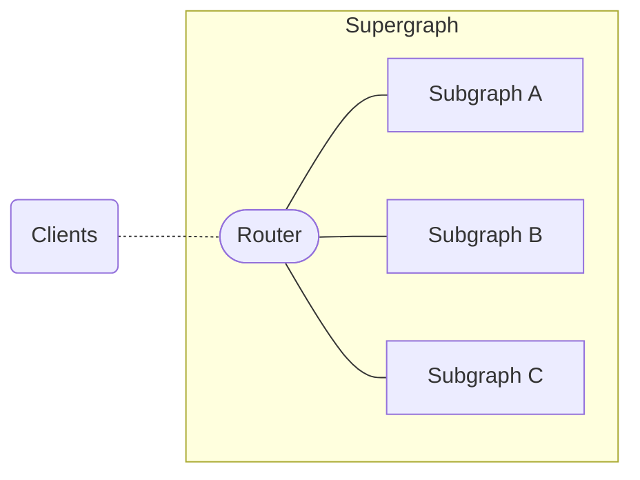
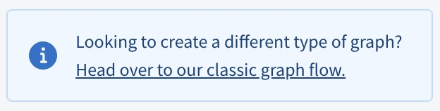
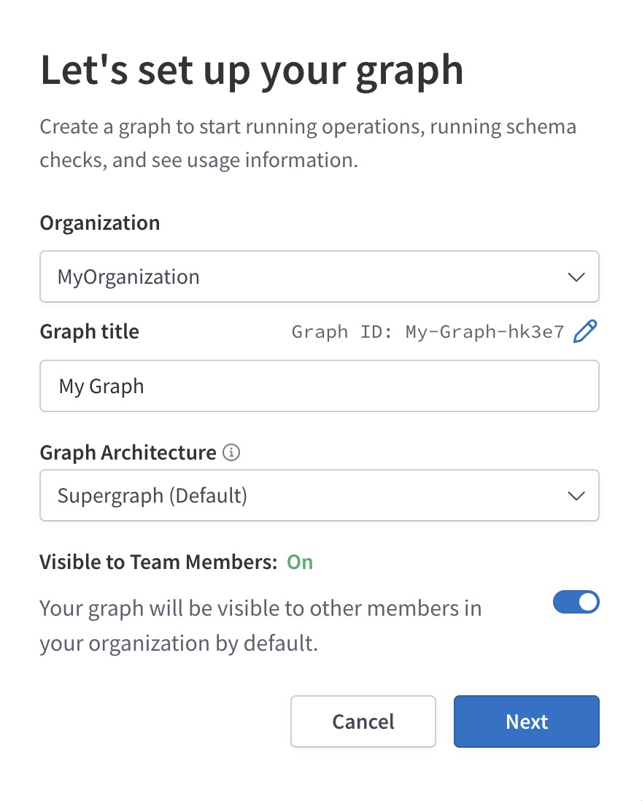
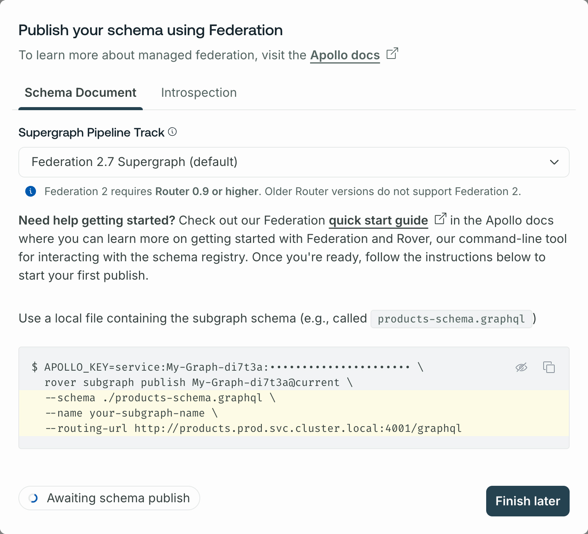
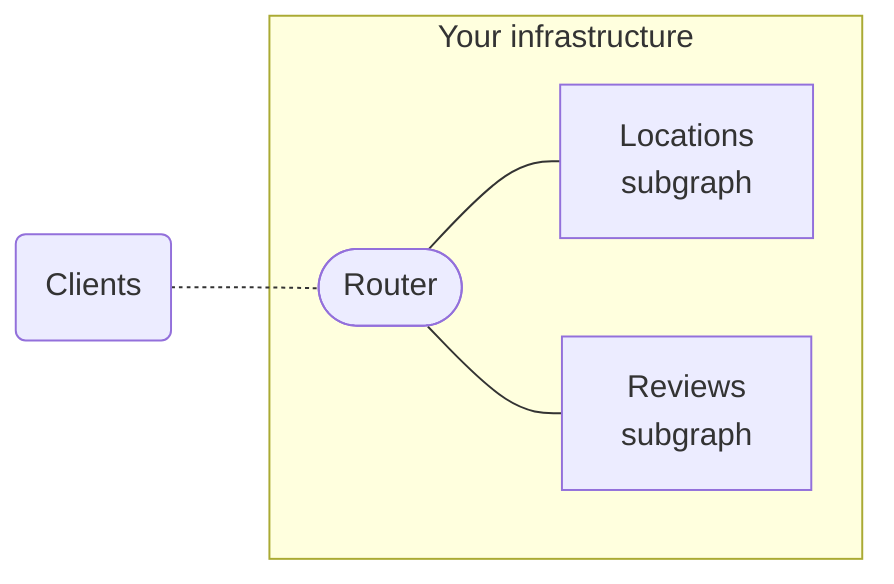
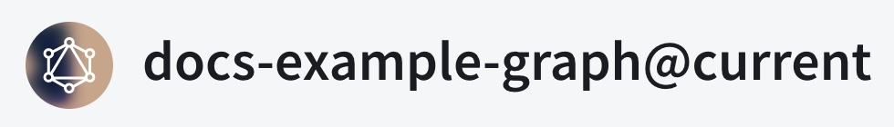
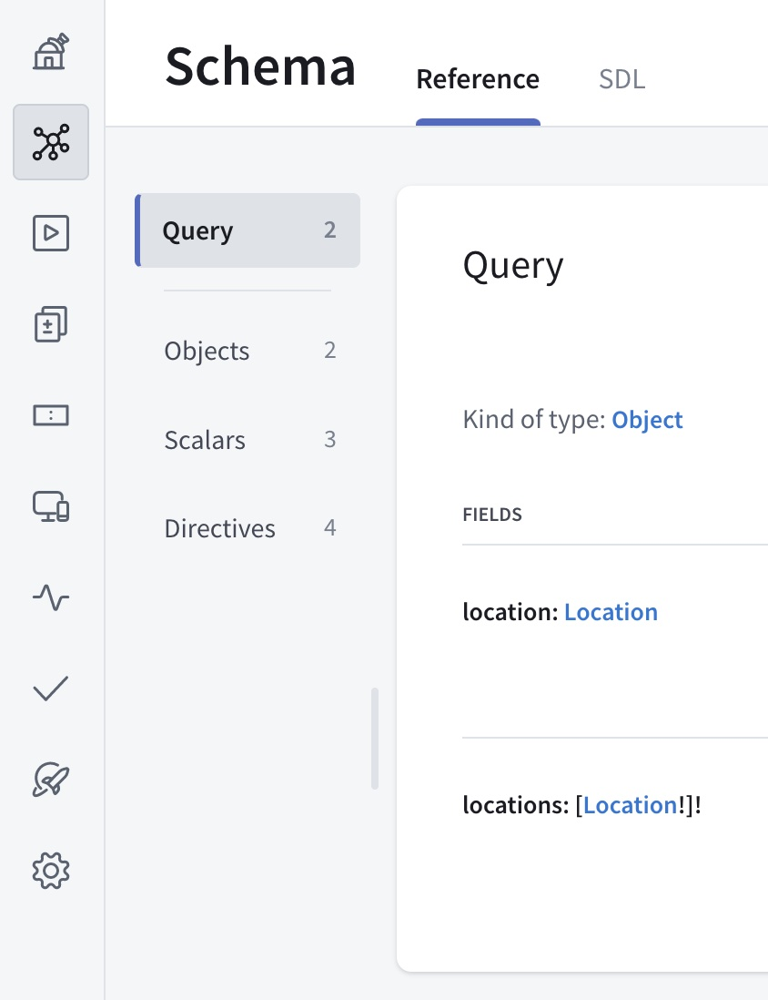
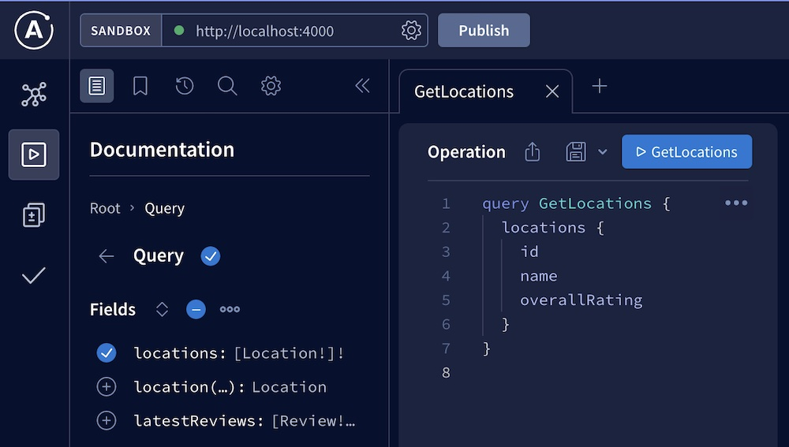

> ⚠️ **Important:** If you're just getting started with GraphOS, instead [create a cloud supergraph](./cloud/).
>
> Self-hosted supergraphs are an enterprise-only feature for organizations with advanced performance or compliance requirements.
>
> If your organization might benefit from the expanded features of an [Enterprise plan](https://www.apollographql.com/pricing/), please [get in touch with us!](https://www.apollographql.com/contact-sales/)

This tutorial helps you get you up and running with GraphOS and a self-hosted supergraph. You can complete this tutorial even if your organization _doesn't_ currently have an Enterprise plan, enabling you to test out this functionality.

## Supergraph concepts

Before we get started, let's quickly cover what a self-hosted supergraph _is_.

A **supergraph** combines multiple GraphQL APIs into a single unified GraphQL service. The individual APIs in a supergraph are called **subgraphs**:



A separate service called the **router** sits in front of your subgraphs and provides the publicly accessible endpoint for your supergraph. Clients query the router, which distributes each query across the appropriate combination of subgraphs and returns the combined result.

The router uses a special GraphQL schema called the **supergraph schema**. This schema incorporates the types and fields in each subgraph schema, along with metadata that enables the router to correctly distribute queries across subgraphs.

A **_self-hosted_ supergraph** is a supergraph with a router that you host and manage in your _own infrastructure_. This is in contrast to a [**cloud supergraph**](./cloud/), which uses a router that's hosted and managed by Apollo.

We'll cover these concepts in more detail as we proceed through the steps below.

## 1. Set up Apollo tools

This quickstart uses the following Apollo tools:

* **Apollo Studio.** This is the primary web interface for GraphOS. Studio helps you monitor, manage, and collaborate on your supergraph.
* **The Rover CLI.** This is the primary _command-line_ interface for GraphOS. Rover helps you interact with your graphs and their schemas.

Let's set these up first.

#### Create an Apollo account

To manage our supergraph with GraphOS, we need an Apollo account. Let's create one if you don't have one yet.

Complete the first step of <a href="./cloud/#1-create-your-apollo-account" target="_blank">Get started with GraphOS</a> (**Create your Apollo account**), then return here.

#### Create a graph in Apollo Studio

After you create your Apollo account, create your first graph in Apollo Studio by following the instructions for your organization's [plan type](../org/plans/):

> If you just created your organization as part of creating your account, it's on a **Serverless** plan type.

<ExpansionPanel title="Serverless plans">

1. Go to your organization's **Graphs** tab in [Apollo Studio](https://studio.apollographql.com/).

    - **If you see this dialog...**

        

        ...then click **Coming from Apollo Odyssey, or want to connect a self-managed router?**

    - **Otherwise,** find the following notice in the bottom-right corner of the page:

        

        Click **Head over to our classic graph flow**.

    In either case, Studio displays the following dialog for creating a graph:

    

2. Specify an organization and title for your graph.

3. Leave the **Graph Architecture** as **Supergraph (default)**.

4. Click **Next**. A dialog like the following appears:

    

5. Leave the **Supergraph Pipeline Track** dropdown set to its default value.

Your graph has been created, and it appears in the **Classic Graphs** section of your **Graphs** tab.

</ExpansionPanel>

<ExpansionPanel title="Enterprise and legacy plans">

1. Go to your organization's **Graphs** tab in [Apollo Studio](https://studio.apollographql.com/).

2. Click **New Graph** in the top right. Studio displays the following dialog:

    

3. Specify an organization and title for your graph.

3. Leave the **Graph Architecture** as **Supergraph (default)**.

5. Click **Next**. A dialog like the following appears:

    

6. Leave the **Supergraph Pipeline Track** dropdown set to its default value.

Your graph has been created.

</ExpansionPanel>

#### Install the Rover CLI

**Rover** is Apollo's CLI for managing all kinds of graphs, including subgraphs and supergraphs. We'll use it throughout this quickstart.

> Even if you already have Rover installed, you should update your version now by completing this step.

Install the latest Rover release with the appropriate command for your system:

```bash title="Mac/Unix"
curl -sSL https://rover.apollo.dev/nix/latest | sh
```

```bash title="Windows"
iwr 'https://rover.apollo.dev/win/latest' | iex
```

After installing, run `rover` in your terminal with no arguments to confirm that it installed successfully. Verify that the printed version number matches the [latest full release](https://github.com/apollographql/rover/releases) (if it doesn't, you might need to manually delete a previous outdated installation).

#### Authenticate Rover with GraphOS

We'll use Rover to publish our subgraph schemas to GraphOS. To do that, we first need to _authenticate_ Rover with GraphOS.

Complete the first two steps of <a href="/rover/configuring/" target="_blank">Configuring Rover</a> (**Obtain an API key** and **Provide the API key to Rover**), then return here.

## 2. Create a router project directory

With a self-hosted supergraph, you're responsible for deploying and managing your supergraph's **router**. The router provides the public endpoint that clients use to query your supergraph:



For this quickstart, we'll use some Apollo-hosted example services as our subgraphs, and we'll set up **the Apollo Router** in front of them. The Apollo Router is a high-performance, precompiled Rust executable that acts as the router for a supergraph.

On your development machine, first create a new directory for your router project. Then inside that directory, run the following to install the Apollo Router:

```bash
curl -sSL https://router.apollo.dev/download/nix/latest | sh
```

This installs the `router` executable in your project directory. Try running it with the following command:

```bash
./router
```

When you do, you'll get a startup error message like the following:

<ExpansionPanel title="Click to expand">

```
Apollo Router v1.2.0 // (c) Apollo Graph, Inc. // Licensed as ELv2 (https://go.apollo.dev/elv2)

⚠️  The Apollo Router requires a composed supergraph schema at startup. ⚠️

👉 DO ONE:

  * Pass a local schema file with the '--supergraph' option:

      $ ./router --supergraph <file_path>

  * Fetch a registered schema from Apollo Studio by setting
    these environment variables:

      $ APOLLO_KEY="..." APOLLO_GRAPH_REF="..." ./router

      For details, see the Apollo docs:
      https://www.apollographql.com/docs/router/managed-federation/setup

🔬 TESTING THINGS OUT?

  1. Download an example supergraph schema with Apollo-hosted subgraphs:

    $ curl -L https://supergraph.demo.starstuff.dev/ > starstuff.graphql

  2. Run the Apollo Router in development mode with the supergraph schema:

    $ ./router --dev --supergraph starstuff.graphql
```

</ExpansionPanel>

That's because we aren't currently providing a **supergraph schema** to the router! We'll fix that soon.

## 3. Obtain your subgraph schemas


<blockquote>


This quickstart uses two Apollo-hosted subgraphs (named Locations and Reviews) from an imaginary space tourism application called FlyBy. Here are their URLs and schemas for reference:

<ExpansionPanel title="Locations">

URL: `https://flyby-locations-sub.herokuapp.com/`

```graphql title="Locations"
extend schema
  @link(url: "https://specs.apollo.dev/federation/v2.0",
        import: ["@key"])

type Query {
  "The full list of locations presented by the Interplanetary Space Tourism department"
  locations: [Location!]!
  "The details of a specific location"
  location(id: ID!): Location
}

type Location @key(fields: "id"){
  id: ID!
  "The name of the location"
  name: String!
  "A short description about the location"
  description: String!
  "The location's main photo as a URL"
  photo: String!
}
```

</ExpansionPanel>

<ExpansionPanel title="Reviews">

URL: `https://flyby-reviews-sub.herokuapp.com/`

```graphql title="Reviews"
extend schema
  @link(url: "https://specs.apollo.dev/federation/v2.0",
        import: ["@key"])

type Query {
  "The three latest reviews submitted for FlyBy's locations"
  latestReviews: [Review!]!
}

type Mutation {
  submitReview(locationReview: LocationReviewInput): SubmitReviewResponse
}

type Location @key(fields: "id") {
  id: ID!
  "The calculated overall rating based on all reviews"
  overallRating: Float
  "All submitted reviews about this location"
  reviewsForLocation: [Review]!
}

type Review {
  id: ID!
  "Written text"
  comment: String
  "A number from 1 - 5 with 1 being lowest and 5 being highest"
  rating: Int
  "The location the review is about"
  location: Location
}

input LocationReviewInput {
  "Written text"
  comment: String!
  "A number from 1 - 5 with 1 being lowest and 5 being highest"
  rating: Int!
  "Location Id"
  locationId: String!
}

type SubmitReviewResponse {
  "Similar to HTTP status code, represents the status of the mutation"
  code: Int!
  "Indicates whether the mutation was successful"
  success: Boolean!
  "Human-readable message for the UI"
  message: String!
  "Newly created review"
  locationReview: Review
}
```

</ExpansionPanel>


If you have your own existing subgraphs that you want to use instead of these examples, feel free! Provide their names and URLs wherever you see the example subgraphs used in the steps below.

</blockquote>

To compose a supergraph schema for our router, GraphOS needs the following information about each of our **subgraphs**:

* The subgraph's schema
* The URL of the subgraph's GraphQL endpoint (which must be accessible by the router)

Fortunately, we have all of this information! Let's collect it in our project.

Do the following in your router project's root directory:

1. Create a new file called `locations.graphql` and paste the following schema into it:

    <ExpansionPanel title="Locations">

    ```graphql title="locations.graphql"
    extend schema
      @link(url: "https://specs.apollo.dev/federation/v2.0",
            import: ["@key"])

    type Query {
      "The full list of locations presented by the Interplanetary Space Tourism department"
      locations: [Location!]!
      "The details of a specific location"
      location(id: ID!): Location
    }

    type Location @key(fields: "id"){
      id: ID!
      "The name of the location"
      name: String!
      "A short description about the location"
      description: String!
      "The location's main photo as a URL"
      photo: String!
    }
    ```

    </ExpansionPanel>

2. Create a new file called `reviews.graphql` and paste the following schema into it:

    <ExpansionPanel title="Reviews">

    ```graphql title="reviews.graphql"
    extend schema
      @link(url: "https://specs.apollo.dev/federation/v2.0",
            import: ["@key"])

    type Query {
      "The three latest reviews submitted for FlyBy's locations"
      latestReviews: [Review!]!
    }

    type Mutation {
      submitReview(locationReview: LocationReviewInput): SubmitReviewResponse
    }

    type Location @key(fields: "id") {
      id: ID!
      "The calculated overall rating based on all reviews"
      overallRating: Float
      "All submitted reviews about this location"
      reviewsForLocation: [Review]!
    }

    type Review {
      id: ID!
      "Written text"
      comment: String
      "A number from 1 - 5 with 1 being lowest and 5 being highest"
      rating: Int
      "The location the review is about"
      location: Location
    }

    input LocationReviewInput {
      "Written text"
      comment: String!
      "A number from 1 - 5 with 1 being lowest and 5 being highest"
      rating: Int!
      "Location Id"
      locationId: String!
    }

    type SubmitReviewResponse {
      "Similar to HTTP status code, represents the status of the mutation"
      code: Int!
      "Indicates whether the mutation was successful"
      success: Boolean!
      "Human-readable message for the UI"
      message: String!
      "Newly created review"
      locationReview: Review
    }
    ```

    </ExpansionPanel>

> 💡 **In most supergraphs,** each subgraph schema lives in the codebase for its associated subgraph. Because we're using remotely-hosted example subgraphs in this quickstart, we're saving these subgraph schemas in our router project for convenience.

## 4. Publish your subgraph schemas

With our subgraph schemas ready, we now can use the Rover CLI's `subgraph publish` command to publish those schemas to GraphOS.

In [Apollo Studio](https://studio.apollographql.com/), click the graph you created back in the first step. Because we haven't published a schema to it yet, the following dialog appears:


This dialog shows an example Rover command for publishing a subgraph schema. Copy that command and paste it into your text editor so we can modify it.

Edit the command like so:

1. Change the value of the `--name` option to `locations`
    - This will be our first subgraph's name.
2. Change the value of the `--schema` option to `./locations.graphql`
    - This is the path to the schema for our Locations subgraph.
3. Change the value of the `--routing-url` option to:
    - `https://flyby-locations-sub.herokuapp.com/` 
    - This is the URL that our router will use to communicate with the Locations subgraph.

When you're done, the command resembles the following:

```shell {1-2}
APOLLO_KEY=<API_KEY> \
rover subgraph publish <GRAPH_REF> \
  --name locations \
  --schema ./locations.graphql \
  --routing-url https://flyby-locations-sub.herokuapp.com/  
```

<blockquote>

Note that this command includes two custom values: an **API key** and a **graph ref**.

- Rover uses the **API key** to authenticate with GraphOS. The key's permissions are scoped to this particular graph, which means Rover can't use it to perform operations on any _other_ graph.
  - If you [authenticated Rover with GraphOS](#authenticate-rover-with-graphos) earlier, you don't actually _need_ to provide an API key to this command via `APOLLO_KEY` (although it's fine to do so).

<ExpansionPanel title="What's a graph ref?">

A **graph ref** uniquely identifies a particular **variant** of a particular graph in GraphOS. Every graph ref is a string with the following format:

`graph-id@variant-name`

- The value before the `@` is your graph's unique ID in GraphOS.
- The value after the `@` is the name of the graph variant you're interacting with.

Each **variant** of a graph represents a different _environment_ where that graph runs (such as staging and production). For this quickstart, you can keep the default suggested variant name or change it to anything else you like (e.g., `quickstart`). Just make sure to provide the _same_ graph ref to every command in this quickstart!

_After_ you've published a schema to a particular variant, that variant's graph ref is always available at the top of its README page:



</ExpansionPanel>

</blockquote>

When you're finished modifying the command, paste it into your terminal and run it from your router project's root directory.

If the command is successful, you'll see output like the following:

```
A new subgraph called 'locations' was created in 'docs-example-graph@main'
The supergraph schema for 'docs-example-graph@main' was updated, composed from the updated 'locations' subgraph
```

Nice! If you open your graph's details in Studio now, you'll see types and fields from our `locations` subgraph listed on the Schema page:



Next, let's do the same thing for our `reviews` subgraph, **again substituting your graph ref**:

```shell {1-2}
APOLLO_KEY=<API_KEY> \
rover subgraph publish <GRAPH_REF> \
  --routing-url https://flyby-reviews-sub.herokuapp.com/ \
  --schema ./reviews.graphql \
  --name reviews
```

> You only need to provide a subgraph's `--routing-url` the _first_ time you publish that subgraph's schema to a particular variant (unless you need to change that URL later).

If you refresh the Schema page in Studio, you'll now see types and fields from our `reviews` service as well.

Every time we publish a subgraph schema, GraphOS automatically composes _all_ of our subgraph schemas into a **supergraph schema**! However, our router isn't yet _fetching_ that schema from Apollo. We'll tackle that next.

## 5. Connect the router to GraphOS

It's time to enable our router to fetch its supergraph schema from GraphOS. To do that, we'll need a **graph API key** that we set as the value of an environment variable.

In theory, we _could_ use the same API key that we just provided to the `rover subgraph publish` command. However, it's recommended practice to create a separate API key for each system that communicates with GraphOS. This reduces the impact whenever you need to _replace_ an API key that might be compromised.

> ⚠️ **API keys are secret credentials.** Never share them outside your organization or commit them to version control. Delete and replace API keys that you believe are compromised.

1. Obtain a graph API key for your Studio graph by <a href="../api-keys/#graph-api-keys" target="_blank">following these steps</a>. If you have an Enterprise plan, set the API key's role to **Contributor**.

    > Make sure to copy and paste the API key's value somewhere so you can reference it (for security, API keys are not visible in Studio after creation).

2. Paste the following terminal command into your text editor so you can make changes to it:

    ```bash
    APOLLO_KEY=your-api-key \
    APOLLO_GRAPH_REF=your-graph-id@your-variant \
    ./router --dev
    ```

    Then, make the following changes:

    * Replace `your-api-key` with your graph API key.
    * Replace `your-graph-id@your-variant` with your variant's **graph ref**.
        * _For a refresher on graph refs, see [Step 4](#4-publish-your-subgraph-schemas)._

3. Paste the edited command into your terminal and run it.

    This time there's no error, and you'll see output similar to the following (timestamps omitted for brevity):

    <ExpansionPanel title="Click to expand">

    ```
    INFO Apollo Router v1.3.0 // (c) Apollo Graph, Inc. // Licensed as ELv2 (https://go.apollo.dev/elv2)
    INFO Anonymous usage data is gathered to inform Apollo product development.  See https://go.apollo.dev/o/privacy for more info.
    INFO Running with *development* mode settings which facilitate development experience (e.g., introspection enabled)
    INFO Apollo Studio usage reporting is enabled. See https://go.apollo.dev/o/data for details
    INFO creating apollo exporter spaceport_endpoint=https://127.0.0.1:62894/
    INFO creating apollo exporter spaceport_endpoint=https://127.0.0.1:62894/
    INFO healthcheck endpoint exposed at http://127.0.0.1:8088/health
    INFO GraphQL endpoint exposed at http://127.0.0.1:4001/ 🚀
    ```

    </ExpansionPanel>

    > By providing an API key to the router, you also automatically enable **operation metrics reporting** to GraphOS, enabling you visualize your graph's performance. [Learn more about metrics.](../metrics/)

4. **Optionally,** to help you keep track of your router's environment variables, consider setting up a tool like [direnv](https://direnv.net/) so you don't need to set the variables every time you run `./router`.

    (Most cloud deployment environments provide a helpful way to set environment variables, so this issue is mostly limited to local development.)

Now that our router is running, we can quickly open our browser to `localhost:4000` to explore our composed schema in Apollo Sandbox:



While we're here, execute some test queries against the supergraph! We'll look at metrics for those test queries in the next step.

## 6. View operation metrics

Because our router is connected to GraphOS, it automatically collects and reports metrics on incoming operations. You can then visualize those metrics in Studio.

Return to [Apollo Studio](https://studio.apollographql.com) and go to your supergraph variant's Operations page, which looks like this:


The test queries you executed in the previous step should already be represented on this page! (If they aren't there yet, check the page again in a few minutes.) After you update all of your clients to query your router, the Operations page becomes vital to monitoring your supergraph's performance.

## 7. Deploy your router and connect clients

Now that our router is running successfully in our development environment, we can deploy it to our preferred platform (AWS, Google Cloud, etc.) so clients can begin querying it!

The exact details for deploying the router depend on which platform you use, but these high-level steps hold true for most platforms:

1. Set the `APOLLO_KEY` and `APOLLO_GRAPH_REF` environment variables in the router's deployment environment, as we did locally in [this step](#5-connect-the-router-to-graphos).
    - Most deployment platforms provide a mechanism for setting environment variables for a given application or container.

2. Make sure the Apollo Router executable is available to the application _before_ it runs `router` to start up.
    - The application can include the router download command as a pre-launch task:

      ```bash
      curl -sSL https://router.apollo.dev/download/nix/latest | sh
      ```

3. If your platform expects the router to listen on a particular port, set this port in a YAML configuration file you include in the application's deployment bundle:

    ```yaml title="router-config.yaml"
    supergraph:
      # The socket address and port to listen on
      listen: 127.0.0.1:4000
      # OR if the port is specified via environment variable
      listen: 127.0.0.1:${env.PORT}
    ```

    You provide this config file to the router executable like so:

    ```bash
    router --config router-config.yaml
    ```

    > Learn more about [router configuration options](/router/configuration/overview).

After you successfully deploy your router, it's ready to start receiving client operations! If you have any existing client applications that connect _directly_ to your GraphQL API, you can update their GraphQL endpoint URL to your _router's_ URL.

Similarly, any _new_ client applications should use your router's URL.

> ⚠️ **Important considerations:**
>
> - For browser-based clients, make sure their origin is allowed in your router's CORS rules, which you can set in the router's [YAML configuration file](/router/configuration/cors).
> - Only update clients that communicate with the correct instance of your GraphQL API! For example, if your API has staging and production instances, only update clients that communicate with the instance used by this supergraph variant.

## Next steps

Nice work! We've registered two **subgraph schemas** with GraphOS, and we've set up a **router** that fetches its composed **supergraph schema** so it can execute operations across subgraphs.

If we now publish changes to one of our subgraph schemas, our running router _automatically_ fetches the corresponding changes to the supergraph schema (assuming composition succeeds).

Next, we'll cover some of the most common and important actions to perform on your new supergraph, including:

- Updating subgraph schemas
- Adding another subgraph
- Setting up schema checks

[Go to next steps.](./next-steps/)
