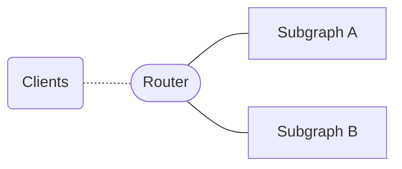
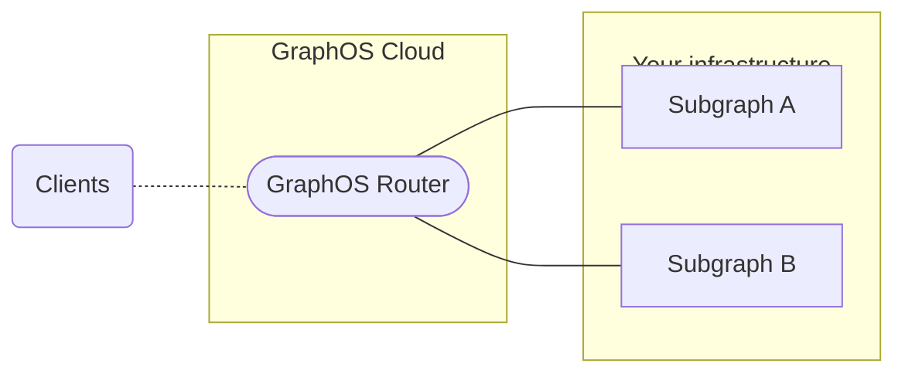
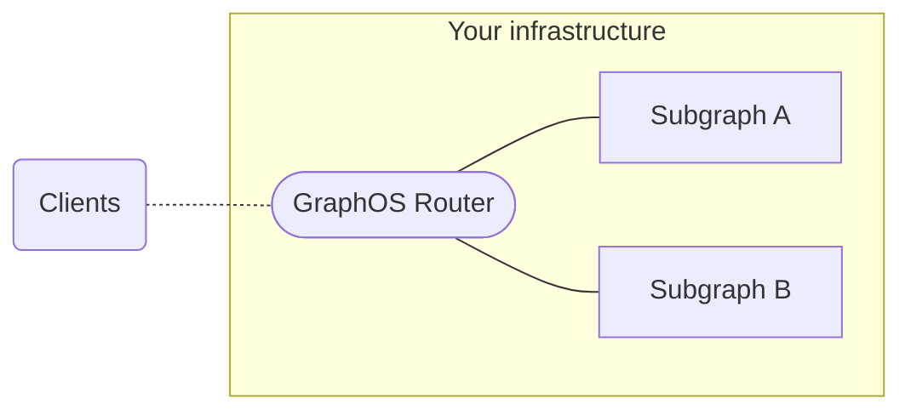

With supergraph architecture (also known as [Apollo Federation](/federation/)), each component service is known as a _subgraph_. A _router_ acts as an entry point to your subgraphs and provides a unified interface for clients to interact with. Clients send operations to your router's public endpoint instead of directly to your APIs.

The router intelligently executes each incoming client operation across the appropriate combination of subgraphs. It then merges subgraph responses into a single response for the client. You can configure your router's error handling, CORS settings, other security features, and more. Your configuration options depend on your router type.

## Router types

GraphOS comes with a fully integrated router called the _GraphOS Router_.
You can choose for Apollo to provision and manage a cloud-hosted GraphOS Router for you:

Or you can choose to self-host your GraphOS Router:

Both cloud and self-hosted GraphOS Routers are powered by the Apollo Router Core—a high-performance routing runtime packaged as a [standalone binary](https://github.com/apollographql/router).

<Note>

Apollo also offers the [`@apollo/gateway`](/federation/v1/gateway/) library, but we recommend GraphOS Routers over `@apollo/gateway` because they provide [significant performance and security improvements](https://www.apollographql.com/blog/announcement/backend/apollo-router-our-graphql-federation-runtime-in-rust/). For more information about the differences and how to migrate, see the [migration guide](/router/migrating-from-gateway/).

</Note>

### Router comparison

GraphOS offers the following router options, in increasing order of configurability:

<table>
  <thead>
    <tr>
      <th>Router type</th>
      <th>Description</th>
      <th>Configurability</th>
      <th>Plan availability</th>
    </tr>
  </thead>
  <tbody>
    <tr>
      <th>Shared cloud router</th>
      <td>Apollo provisions and manages routers on shared infrastructure.</td>
      <td>
        Basic configurability, including HTTP header rules, CORS settings, and
        subgraph error inclusion
      </td>
      <td>
        <a href="https://apollographql.com/pricing">Serverless</a>
      </td>
    </tr>
    <tr>
      <th>Dedicated cloud router</th>
      <td>
        Apollo provisions and manages routers on dedicated infrastructure that
        you control and scale.
      </td>
      <td>
        Highly configurable, including all options for shared cloud routers and
        additional configurations
      </td>
      <td>
        <a href="https://apollographql.com/pricing">Dedicated</a>
      </td>
    </tr>
    <tr>
      <th>Self-hosted router</th>
      <td>You host and manage the router on your own infrastructure.</td>
      <td>
        Highly configurable and customizable, including all options for Cloud
        Dedicated routers and additional{' '}
        <a href="/router/customizations/overview">customization options</a>
      </td>
      <td>
        The Apollo Core Router is available as a free and source-available
        runtime. Connecting a self-hosted router to GraphOS requires an{' '}
        <a href="https://apollographql.com/pricing">Enterprise</a> plan.
      </td>
    </tr>
  </tbody>
</table>

### GraphOS Router features

Although all GraphOS Routers (both cloud- and self-hosted) are powered by the source-available Apollo Router Core binary, they offer an expanded feature set that isn't available when running the Apollo Router Core without connecting it to GraphOS.

Cloud-hosted routers automatically have access to GraphOS Router features, while self-hosted routers must be authenticated with a GraphOS Enterprise license to gain access to these features. Refer to the [pricing page](https://www.apollographql.com/pricing#graphos-router) to compare GraphOS Router features across plan types.

## Setup and configuration

For setup and configuration instructions, refer to the respective router documentation:

- [Cloud router on shared infrastructure](./quickstart/cloud)
- [Cloud router on dedicated infrastructure](/graphos/cloud-routing/dedicated/quickstart)
- [Self-hosted router](./quickstart/self-hosted)
