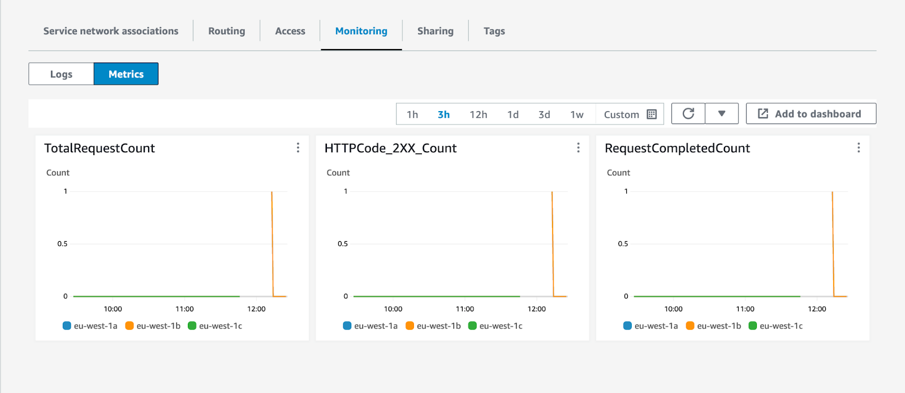

> Cloud Dedicated is currently in [alpha](/resources/product-launch-stages/#alpha--beta). Your questions and feedback are highly valued—don't hesitate to [get in touch](mailto:cloud@apollographql.com).

Cloud Dedicated leverages [AWS VPC Lattice](https://aws.amazon.com/vpc/lattice/) to send traffic to your subgraphs running in an AWS VPC without exposing them to the internet. With Lattice, you can define services and share them with the Apollo AWS organization. Cloud Dedicated can then send traffic directly to your subgraphs without VPC peering.


<blockquote>

⚠️ **Note**:

- You can only use Lattice for subgraphs in the **same AWS region as your Cloud Router**. If you need to run subgraphs in different AWS regions or run your workloads in a region not yet supported by Cloud Dedicated, please [let us know](mailto:cloud@apollographql.com).
- Using AWS VPC Lattice incurs costs outside of your Cloud Dedicated spend. Refer to the [Lattice pricing page](https://aws.amazon.com/vpc/lattice/pricing/) to learn more.

</blockquote>

## Create and share an AWS VPC Lattice service

To allow Cloud Dedicated to send traffic to your private subgraphs, you must:

1. Create one or more AWS VPC Lattice target groups.
2. Create one or more AWS VPC Lattice services.
3. Share the service(s) with the Apollo AWS Organization.
4. Provide the service(s) routing information in your Apollo Organization configuration page.

This guide offers step-by-step instructions for each stage.

> The AWS Console interface may differ slightly from the screenshots in this guide.

### Step 1. Create AWS VPC Lattice target groups

A Lattice **target group** is a collection of targets, or compute resources, that run your application or service. You must set these up so your Lattice services can route requests accurately. Check out the [AWS documentation](https://docs.aws.amazon.com/vpc-lattice/latest/ug/target-groups.html) to learn more.

1. In the AWS Console for your region of choice, go to the VPC service page:

- [US East (N. Virginia) — `us-east-1`](https://us-east-1.console.aws.amazon.com/vpc/home?region=us-east-1)
- [Europe (Ireland) — `eu-west-1`](https://eu-west-1.console.aws.amazon.com/vpc/home?region=eu-west-1)

2. In the menu on the left, scroll down and open **Target groups** in the **VPC Lattice** section.


3. Click **Create target group** on the top right.


4. In the **Basic configuration** section, set the properties that match your subgraph resources.


5. (Optional) If you use a target type with health checks, ensure you configure your health checks correctly, or Lattice will not be able to send traffic to your subgraphs.


6. Register the targets based on your chosen target type.


7. Review your targets to make sure all information is correct.


8. Click **Create target group** at the bottom right corner of the page.


Congratulations! You've created an AWS VPC Lattice target group. Repeat this process for each resource you want to share with Cloud Dedicated.

### Step 2. Create an AWS VPC Lattice service

1. In the AWS Console for your region, go to the VPC service page:

- [US East (N. Virginia) — `us-east-1`](https://us-east-1.console.aws.amazon.com/vpc/home?region=us-east-1)
- [Europe (Ireland) — `eu-west-1`](https://eu-west-1.console.aws.amazon.com/vpc/home?region=eu-west-1)

2. In the menu on the left, scroll down and open **Services** in the **VPC Lattice** section.


3. Click **Create service** in the top right.


4. In the **Identifiers** section, give the name, description, and tags of your choice for the service.


5. In the **Custom domain configuration** section, leave the **Specify a custom domain configuration** checkbox **unselected**.


6. In the **Service access** section, select the AWS IAM authentication type and paste the following auth policy. This policy ensures that only the AWS Organization for Cloud Dedicated can send traffic to your subgraphs.

```json
{
	"Version": "2012-10-17",
	"Statement": [
    	{
        	"Effect": "Allow",
        	"Principal": "*",
        	"Action": "vpc-lattice-svcs:Invoke",
        	"Resource": "*",
        	"Condition": {
            	"ForAnyValue:StringLike": {
                	"aws:PrincipalOrgPaths": "o-9vaxczew6u/*/ou-leyb-l9pccq2t/ou-leyb-fvqz35yo/*"
            	}
        	}
    	}
	]
}
```


7. (Optional) For extra security, you can audit all the traffic coming to your subgraph by enabling access logs in the **Monitoring** section.

8. Once you've configured the service, click **Next** on the bottom right of the page.


9. Define routing information to your target groups. Set the protocol to **HTTPS** and the port to **443**.

> For security reasons, we require you to use HTTPS for your listener. This enforces encryption in transit of the traffic between your GraphOS Cloud Router and your Lattice listener.


10. If you have multiple target groups, add a rule for each subgraph.


11. Click **Next** at the bottom right of the page once you've configured your listener.


12. Do _NOT_ select a VPC Lattice service network. Your subgraphs will integrate with a service network managed by Apollo. Instead, click the **Next** button at the bottom right of the page.


13. Ensure the information you've entered is correct, then click **Create VPC Lattice service** at the bottom right of the page.


Congratulations! You've now created a Lattice service for your subgraphs.

### Step 3. Share the AWS VPC Lattice service with Cloud Dedicated

1. In the AWS Console for your region of choice, go to the Resource Access Manager service page:

- [US East (N. Virginia) — us-east-1](https://us-east-1.console.aws.amazon.com/ram/home?region=us-east-1)
- [Europe (Ireland) — eu-west-1](https://eu-west-1.console.aws.amazon.com/ram/home?region=eu-west-1)

2. In the menu on the left, click **Resource shares** in the **Shared by me** section.


3. Click **Create resource share** in the top right corner.


4. In the **Resource share name** section, enter a name for your resource share.


5. In the **Resources section**, select the resource type **VPC Lattice Services**.


6. Select all the Lattice services that contain your subgraphs.


7. (Optional) Set tags for your resource share.


8. Click the **Next** button at the bottom right corner of the page.


9. Verify that the managed permissions give access to associate the Lattice services with a service network (`vpc-lattice:CreateServiceNetworkServiceAssociation and vpc-lattice:GetService`). Then click the **Next** button at the bottom right of the page.


10. In the **Principals** section, select **Allow sharing with anyone** with a principal type of **AWS account**, enter the following value for the account ID: `282421723282`, then click the **Add** button.


11. Confirm that `282421723282` is the only selected principal for this resource share, then click the **Next** button on the bottom right corner.


12. Confirm that all the information is correct, then click **Create resource share** at the bottom right of the page.


Congratulations! You've now shared your Lattice services with Cloud Dedicated.

The last step is associating your resource share with the Apollo Organization account.

<blockquote>

⚠️ **Note**:

- You only have 12 hours to associate your resource share—otherwise, AWS Resource Access Manager will fail to process the invitation, and you will have to restart this step.
- For security purposes, we recommend you continue to the next step immediately after creating the resource share. If you see that the resource share was **Accepted** or **Failed** in the AWS console and you did not follow step 4 of this guide, follow the steps to [remove access to private subgraphs](#removing-access-to-private-subgraphs) and restart this step.

</blockquote>

### Step 4. Associate your resource share with your Apollo Organization

1. In the AWS Console for your region of choice, go to the Resource Access Manager service page:

- [US East (N. Virginia) — us-east-1](https://us-east-1.console.aws.amazon.com/ram/home?region=us-east-1)
- [Europe (Ireland) — eu-west-1](https://eu-west-1.console.aws.amazon.com/ram/home?region=eu-west-1)

2. In the menu on the left, click **Resource shares** in the **Shared by me** section.


3. Click the resource share you created in the previous step.


4. Copy the **ARN** for the resource share.


Setup from this point differs based on whether this is [your first private subgraph](#setup-for-new-private-subgraphs) or if you're adding this [service to an existing graph](#setup-for-existing-graphs).

#### Setup for new private subgraphs

1. Go to [GraphOS Studio](https://studio.apollographql.com?referrer=docs-content).
2. Click the **Create New Graph** tab at the top right of the screen.
3. Follow Studio's onboarding steps to create a graph with a new private subgraph.


4. When prompted to **Provide your GraphQL API endpoint**, select **My endpoint is not directly accessible** at the bottom of the page.


5. Choose the backend provider you want to use for your private subgraph and the region where your subgraph should be provisioned.

> All private subgraphs connected to a GraphOS Cloud Router must be in the same region.


6. Paste the ARN of the resource share you created and copied from your AWS Console, then click **Link my Resource** and **Next** to continue.


7. From the dropdown menu, select the Lattice service that you would like to connect to your GraphOS Router. A default path of `/api/graphql` is automatically added to the URL. You can change this path if you want to.


8. Add a **Service Name** to describe your Lattice service. This name will be used to identify your Lattice service in GraphOS Studio.


9. Paste the GraphQL schema for this subgraph in the **Schema** field. You can also upload a schema file by clicking the **Upload Schema** button.


<ExpansionPanel title="Why do I need to provide a GraphQL Schema?">

When your AWS resource is set to private, it isn't accessible by external services by default. This ensures a high level of security for your data, but it also means extra steps are needed to enable communication between your resource and our system. We need to know the schema of your GraphQL API so that we can generate the correct queries and mutations to send to your subgraph.

</ExpansionPanel>

10. Update the ID and the name of the supergraph that you want to add this private subgraph to. An ID and name are automatically generated based on your organization's name, but you can change both as needed.


11. To finish, click **Create GraphOS Router**.


Congratulations! You've now created a GraphOS Cloud Router with a private subgraph.

#### Setup for existing graphs

1. Go to the graph you want to connect in [GraphOS Studio](https://studio.apollographql.com?referrer=docs-content).
2. From the left sidebar, open the **Subgraphs** tab of your graph.
3. Click **Add a Subgraph** on the right of the page.


4. In the modal, select the **Private** option, then select the AWS service you want to add from the dropdown menu. A default path of `/api/graphql` is automatically added to the URL. You can change this path if you like.


5. Add a **Service Name** to describe your Lattice service. This name will be used to identify your Lattice service in GraphOS Studio.


6. Paste the GraphQL schema for this subgraph in the **Schema** field. You can also upload a schema file by clicking the **Upload Schema** button.


<ExpansionPanel title="Why do I need to provide a GraphQL Schema?">

When your AWS resource is set to private, it isn't accessible by external services by default. This ensures a high level of security for your data, but it also means extra steps are needed to enable communication between your resource and our system. We need to know the schema of your GraphQL API so that we can generate the correct queries and mutations to send to your subgraph.

</ExpansionPanel>

7. To finish, click **Add Subgraph**.

Congratulations! You've now added a private subgraph to your GraphOS Cloud Router.

## Removing access to private subgraphs

To remove Cloud Dedicated access to private subgraphs, you need to remove both resource shares and service network associations. Keep in mind that any existing supergraph that sends traffic to your private subgraphs will stop working once you remove access.

### Remove resource shares

1. In the AWS Console for your region of choice, go to the Resource Access Manager service page:

- [US East (N. Virginia) — us-east-1](https://us-east-1.console.aws.amazon.com/ram/home?region=us-east-1)
- [Europe (Ireland) — eu-west-1](https://eu-west-1.console.aws.amazon.com/ram/home?region=eu-west-1)

2. In the menu on the left, click **Resource shares** in the **Shared by me** section.


3. Select the resource share(s) associated with Cloud Dedicated and click the **Delete** button in the top right corner.


4. Click **Delete** in the popup modal.


### Remove service network associations

1. In the AWS Console for your region of choice, go to the VPC service page:

- [US East (N. Virginia) — us-east-1](https://us-east-1.console.aws.amazon.com/ram/home?region=us-east-1)
- [Europe (Ireland) — eu-west-1](https://eu-west-1.console.aws.amazon.com/ram/home?region=eu-west-1)

2. In the menu on the left, scroll down and open **Services** in the **VPC Lattice** section.


3. Click the name of the Lattice service you want to disconnect.


4. In the **Service network associations**, select the **graphos-cloud** service name.


5. Click the **Actions** button in the top right of that section, and click **Delete network associations**.


6. Follow the confirmation instructions and click **Delete**.


Deleting the network association can take a few seconds. Once the network association is deleted, Cloud Dedicated cannot contact your subgraphs anymore.

## Frequently asked questions

#### How does Cloud Dedicated prevent other users from accessing my private subgraphs?

When you associate a resource share for the first time, Cloud Dedicated will scan the Lattice services contained in the resource share to retrieve their ARNs and domain names.

When you add a private subgraph to one of your supergraphs, Cloud Dedicated will check that the domain for that subgraph matches one of the Lattice services you have associated with your Apollo Organization.

As a second line of defense, supergraphs use AWS IAM permissions and [SigV4](https://docs.aws.amazon.com/AmazonS3/latest/API/sig-v4-authenticating-requests.html) to only allow traffic to the subgraphs in the same Apollo organization.

#### I've added a new service to my resource share, but it doesn't appear in my private subgraphs. How can I fix this?

Cloud Dedicated does not automatically scan your resource shares for new Lattice services. If you add a service, you can manually trigger a scan by going to your Apollo Organization settings page and clicking the **Rescan subgraphs** button.

#### I want to use AWS VPC Lattice within my own organization. Can I still use Lattice for private subgraphs?

Yes. Cloud Dedicated will associate your Lattice services with its own service network, and you can associate a Lattice service with multiple service networks. You can also create multiple Lattice target groups or Lattice services for the same load balancer, IP addresses, Lambda functions, or other resources supported by Lattice target groups.

## Troubleshooting instructions

### Enable Subgraph Error Inclusion

To simplify troubleshooting connection issues to AWS VPC Lattice, we recommend you enable subgraph error inclusions in the settings page for your graph variant. This will allow you to see error messages generated by your subgraphs.

1. Go to [GraphOS Studio](https://studio.apollographql.com?referrer=docs-content).

2. Navigate to the settings page for your graph variant.


3. In the menu on the left, click on **Settings**, then on **Cloud Router** to access the GraphOS Cloud settings page.


4. In the **Router configuration YAML** section, ensure that the following configuration block is present:

```yaml
include_subgraph_errors:
  all: true
```

5. Click on the **Save** button in the top right corner of that section.


This will trigger a new launch. Please wait for a few minutes for your Cloud Router to update with this new configuration.

Once you have identified and resolved the underlying issue, we recommend you to disable subgraph errors by removing the block and saving the Router configuration YAML again.

### AWS VPC Lattice monitoring

To validate that traffic is flowing to your private subgraphs, you can leverage the metrics and access logs emitted by AWS VPC Lattice:

1. In the AWS Console for your region of choice, go to the VPC service page.

2. In the menu on the left, scroll down and open **Services** in the **VPC Lattice** section.


3. Click on the name of the Lattice service leveraged by the subgraph in question.


4. Click on the **Monitoring** tab.

From there, you can configure and enable access logs for your AWS VPC Lattice service. You can also navigate to the Metrics tab to get a quick overview if traffic is flowing to your private subgraphs.




You can also leverage [Amazon CloudWatch metrics emitted by AWS VPC Lattice](https://docs.aws.amazon.com/vpc-lattice/latest/ug/monitoring-cloudwatch.html) to set up dashboards and alarms to understand the health of your private subgraphs.

### Error trying to connect: Connection reset by peer (os error 104)

This error is likely to occur when your Cloud Router tries to send traffic to a port different from the listener on your AWS VPC Lattice service. Apollo GraphOS Cloud only supports communicating with private subgraphs over HTTPS on port 443.

You can validate that your Lattice services are configured to receive traffic on the right port by navigating to the service routing page:

1. In the AWS Console for your region of choice, go to the VPC service page.

2. In the menu on the left, scroll down and open **Services** in the **VPC Lattice** section.


3. Click on the name of the Lattice service leveraged by the subgraph in question.


4. Click on the **Routing** tab.


5. Validate that you have a listener with a protocol:port configuration of **HTTPS:443**.

If this is not the case, you must create a new listener by clicking on the Add listener button at the top left of this section.

### HTTP fetch failed from '*subgraph*': 403: Forbidden

This error is likely to occur for one of the following reasons:

* One of your clients is sending a subscription request to a private subgraph over WebSockets.
* The VPC Lattice IAM Policy does not allow traffic from Apollo GraphOS Cloud.

For subscriptions over WebSockets, this is a known limitation of AWS VPC Lattice, as [it does not support WebSockets at the moment](https://docs.aws.amazon.com/vpc-lattice/latest/ug/listeners.html#listener-configuration). When sending a request to upgrade to a WebSockets connection, Lattice will return a blank response with a 403 response code. In this situation, Lattice will also not emit access log entries to Amazon CloudWatch Logs. We recommend you to [contact your AWS account team](https://aws.amazon.com/contact-us/sales-support/) to notify them of your interest in this feature.

You can validate that your Lattice services are configured to allow traffic from Apollo GraphOS Cloud by navigating to the service access page:

1. In the AWS Console for your region of choice, go to the VPC service page.

2. In the menu on the left, scroll down and open **Services** in the **VPC Lattice** section.


3. Click on the name of the Lattice service leveraged by the subgraph in question.


4. Click on the **Access** tab.

5. Ensure that the Auth type is set to **IAM** and that the policy looks like this:

```json
{
	"Version": "2012-10-17",
	"Statement": [
    	{
        	"Effect": "Allow",
        	"Principal": "*",
        	"Action": "vpc-lattice-svcs:Invoke",
        	"Resource": "*",
        	"Condition": {
            	"ForAnyValue:StringLike": {
                	"aws:PrincipalOrgPaths": "o-9vaxczew6u/*/ou-leyb-l9pccq2t/ou-leyb-fvqz35yo/*"
            	}
        	}
    	}
	]
}
```