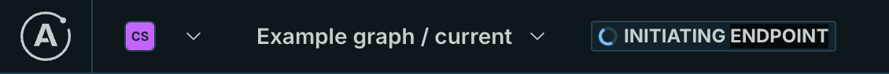

> **Cloud supergraphs are available to organizations with new Apollo Serverless plans.** They are _not_ available to organizations with an Enterprise plan or a legacy Free or Team plan.
>
> [See details about plans.](https://www.apollographql.com/pricing/)

When you [create a cloud supergraph](../quickstart/cloud/#2-create-your-first-supergraph) with Apollo Studio, GraphOS automatically provisions and manages a **router** that sits in front of your GraphQL API:

Clients send operations to your router's public endpoint, _instead of_ sending them directly to your API. This way, you can later add _more_ APIs to your supergraph, and clients can query data from _all_ of them with a single request to the router:

With this supergraph architecture (also known as [Apollo Federation](/federation/)), each of your individual GraphQL APIs is known as a **subgraph**. Your router takes care of executing each incoming client operation across the appropriate combination of subgraphs, and then it merges subgraph responses into a _single_ response for the client.

## Initializing your router

Your router is provisioned _automatically_ whenever you create a cloud supergraph in Studio, or whenever you create a new [variant](../graphs/#variants) for an _existing_ cloud supergraph. Each variant has its own distinct router.

When you first create your variant, the router provisioning process can take a few minutes. If this process hasn't completed yet for a particular variant, an **INITIATING ENDPOINT** label is shown at the top of the variant's page in Studio:

## Configuring your router

See [Configuring cloud routing](./cloud-configuration).

## Cloud launches

Publishing a new subgraph schema or editing your router's configuration triggers a new [launch](/graphos/delivery/launches/). Every launch automatically deploys new router instances for your supergraph.

> A router deployment might fail due to a platform incident or schema composition issues. To resolve this, try republishing your subgraph schema.

## Cloud routing FAQ

#### What happens if my cloud router goes down?

If your supergraph's cloud router goes down, queries sent to it will fail until service is restored. However, every cloud router has redundant machines in place to help prevent this.

#### How is my data protected with cloud routing?

The entire GraphOS platform (including its cloud routing infrastructure) is SOC 2 Type 2 certified. Secrets are encrypted both in transit and at rest, and they are available only inside the runtime environment where users have total control over when those secrets are resolved in configuration.

The Apollo Router (the underlying technology for cloud routing) has been [tested and audited by Doyensec](https://doyensec.com/resources/Doyensec_Apollo_Report_Q22022_v4_AfterRetest.pdf), with no issues.

#### How are cloud routers hosted?

Apollo works with major public cloud providers to deliver GraphOS cloud routing.

#### Which regions are available for cloud routers?

Cloud routing is available in Chicago, USA. Our infrastructure has interconnects with major public cloud providers, so latency is minimal. For example, latency between Chicago and AWS in Virginia is approximately 10ms.

We're actively working to add support for more regions. If there's a specific region you'd like us to support please [request a region](https://docs.google.com/forms/d/e/1FAIpQLSeLfIHulp-45VYzZspkOslFMzd1pPnMtVgIj_pVyJbox5DCKw/viewform).

#### Can I choose my cloud router's region?

Not yet, but we're working to make additional regions available. If there's a region you'd like to see supported, [let us know](https://docs.google.com/forms/d/e/1FAIpQLSeLfIHulp-45VYzZspkOslFMzd1pPnMtVgIj_pVyJbox5DCKw/viewform).

#### Will cloud routing support multi-region and/or edge caching?

Our goal with cloud routing is to deliver global, industry-leading graph performance. Routing infrastructure is hosted in one region with plans to expand globally and add caching support in 2023.

#### Does GraphOS also host my individual subgraphs?

No. GraphOS only hosts the runtime for your supergraph's cloud router. GraphQL servers for your individual subgraphs are still hosted in your infrastructure.

#### Which GraphQL server libraries are compatible with cloud routers?

Cloud supergraphs use [Apollo Federation 2](/federation/) for their core architecture. [Many GraphQL server libraries](/federation/building-supergraphs/supported-subgraphs/) support Federation 2.

Your GraphQL API does _not_ already need to be using Apollo Federation to add it to a cloud supergraph.
