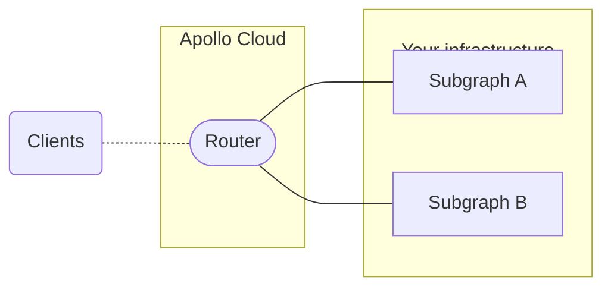

<Note>

**Cloud supergraphs are only available to organizations with Apollo Serverless and Dedicated plans.**
They are _not_ available to organizations with an Enterprise plan or a legacy Free or Team plan.

[See plan details.](https://www.apollographql.com/pricing/)

</Note>

When you [create a cloud supergraph](../quickstart/cloud/#2-create-your-first-supergraph) with GraphOS Studio, GraphOS automatically provisions and manages a **router** that acts as an entry point to your GraphQL APIs. In this architecture, individual GraphQL APIs are called **subgraphs**. Clients send operations to your router's public endpoint, _instead of_ sending them directly to your subgraphs.

## Initializing your router

Your router is provisioned _automatically_ whenever you [create a cloud supergraph in GraphOS Studio](../quickstart/cloud), or whenever you create a new [variant](../graphs/#variants) for an existing cloud supergraph. Each variant has its own distinct router.

When you first create a variant, the router provisioning process can take a few minutes. If this process hasn't completed yet for a particular variant, an **INITIATING ENDPOINT** label is shown at the top of the variant's page in Studio:

## Configuring your router

See [Configuring cloud routing](./cloud-configuration).

### Cloud launches

Publishing a new subgraph schema or editing a cloud router's configuration triggers a new [launch](/graphos/delivery/launches/). Every launch automatically deploys new router instances for your supergraph.

<Note>

A router deployment might fail due to a platform incident or schema composition issues. To resolve this, try republishing your subgraph schema.

</Note>

## Automatic deletion of unused routers

<Note>

Only cloud routers on the Serverless plan are automatically deleted.
This does not apply cloud routers on the Dedicated plan.
[See details about plans.](https://www.apollographql.com/pricing/)

</Note>

**Apollo automatically deletes variants of Serverless cloud supergraphs that receive zero operations for 60 consecutive days.** This deletes the router, along with all of the variant's historical metrics.

- Apollo will notify you via email whenever a Serverless variant is approaching this 60-day limit.
- To prevent deletion, execute at least one GraphQL operation on the variant's router before the 60-day limit.

## Cloud routing FAQ

#### What happens if my cloud router goes down?

If your supergraph's cloud router goes down, queries sent to it will fail until service is restored. However, every cloud router has redundant machines in place to help prevent this.

#### How is my data protected with cloud routing?

The entire GraphOS platform (including its cloud routing infrastructure) is SOC 2 Type 2 certified. Secrets are encrypted both in transit and at rest, and they are available only inside the runtime environment where users have total control over when those secrets are resolved in configuration.

The Apollo Router (the underlying technology for cloud routing) has been [tested and audited by Doyensec](https://doyensec.com/resources/Doyensec_Apollo_Report_Q22022_v4_AfterRetest.pdf), with no issues.

#### How are cloud routers hosted?

Apollo works with major public cloud providers to deliver GraphOS cloud routing.

#### Which regions are available for cloud routers?

Cloud routing for Serverless plans is only available in Chicago, USA. Our infrastructure has interconnects with major public cloud providers, so latency is minimal. For example, latency between Chicago and AWS in Virginia is approximately 10ms. If there's a specific region you'd like us to support please [request a region](https://docs.google.com/forms/d/e/1FAIpQLSeLfIHulp-45VYzZspkOslFMzd1pPnMtVgIj_pVyJbox5DCKw/viewform).

Cloud routing on the [Dedicated](./cloud-dedicated) plan has a wider variety of options. <TrackableLink href="mailto:cloud@apollographql.com" eventName="content_contact_cloud">Get in touch</TrackableLink> to learn more.

#### Can I choose my cloud router's region?

Choice of region for cloud routers is only available on the [Dedicated](./cloud-dedicated) plan.

#### Does GraphOS also host my individual subgraphs?

No. GraphOS only hosts the runtime for your supergraph's cloud router. GraphQL servers for your individual subgraphs are still hosted in your infrastructure.

#### Which GraphQL server libraries are compatible with cloud routers?

Cloud supergraphs use [Apollo Federation 2](/federation/) for their core architecture. [Many GraphQL server libraries](/federation/building-supergraphs/supported-subgraphs/) support Federation 2.

Your GraphQL API does _not_ already need to be using Apollo Federation to add it to a cloud supergraph.
