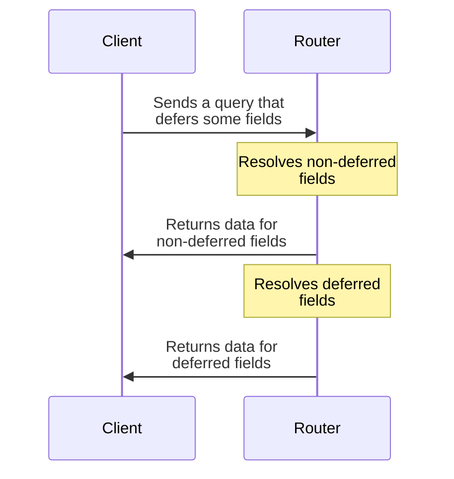

With GraphOS, your supergraph's router can **defer** returning data for certain fields in your schema. This enables a querying client to receive _non_-deferred data more quickly, because the router can return it _immediately_ instead of waiting for _all_ response data to be ready:



Both [cloud supergraphs](../graphs/#cloud-supergraphs) and [self-hosted supergraphs](../graphs/#self-hosted-supergraphs) support deferring fields with the router. Additionally, this feature is compatible with all [supported subgraph libraries](/federation/building-supergraphs/supported-subgraphs), because the logic resides entirely within the router!

## How do I defer fields in a query?

> ⚠️ **Deferring query fields requires a defer-compatible client library.** These libraries support receiving query data incrementally via multipart HTTP responses.
>
> Defer support is currently available in Apollo Client for [Web](/react/data/defer) and [Kotlin (experimental)](/kotlin/fetching/defer).

If you're using a defer-compatible client, you apply the `@defer` directive to fragments in your queries to specify which fields you want to defer:

```graphql
query GetTopProductsAndReviews {
  topProducts {
    id
    name
    # highlight-start
    # You always apply @defer to a fragment, not to individual fields
    ... @defer { 
      reviews { #highlight-line
        score
      }
    }
    # highlight-end
  }
}
```

When your supergraph's router receives this query, it defers every field in these fragments **[that it's able to](#which-fields-can-my-router-defer)**.

## Which fields can my router defer?

Your supergraph's router can defer the following fields in your schema:

- Root fields of the `Query` type (along with their subfields)
- Fields of any **entity** type (along with their subfields)
  - Deferring entity fields is extremely powerful but requires some setup if you aren't using entities already. This is covered in more detail [below](#entity-fields).

See below for more information on each of these.

### `Query` fields

Your router can defer any field of your schema's `Query` type, along with any subfields of those fields:

```graphql
query GetUsersAndDeferProducts {
  users {
    id
  }
  # highlight-start
  ... @defer {
    products {
      id
    }
  }
  # highlight-end
}
```

With the query above, the router first returns a list of `User` IDs, then later completes the response with a list of `Product` IDs.

### Entity fields

Your router supports deferring fields of the special object types in your supergraph called [**entities**](/federation/entities/).

Entities are object types that often define their fields across _multiple_ subgraphs (but they don't have to). You can identify an entity by its use of the `@key` directive. In the example subgraph schemas below, the `Product` type is an entity:

<CodeColumns>

```graphql title="Products subgraph"
type Product @key(fields: "id") {
  id: ID!
  name: String!
  price: Int!
}

type Query {
  topProducts: [Product!]!
}
```

```graphql title="Reviews subgraph"
type Product @key(fields: "id") {
  id: ID!
  reviews: [Review!]!
}


type Review {
  score: Int!
}
```

</CodeColumns>

Entities are query entry points into your subgraphs, and this is what enables your router to defer their fields: the router can send a _followup_ query to a subgraph to fetch any entity fields that it doesn't fetch initially.

Here's an example query that defers entity fields using the subgraphs above:

```graphql
query GetProductsAndDeferReviews {
  topProducts {
    id
    name
    # highlight-start
    ... @defer {
      reviews {
        score
      }
    }
    # highlight-end
  }
}
```

To handle this query, the router first resolves and returns a list of `Product` objects with their IDs and names. Later, the router completes the response by returning review scores for each of those products.

> It doesn't matter _which_ subgraph defines a particular entity field! Queries can defer entity fields that are defined across any number of different subgraphs.

### Defining entities in your subgraphs

If your subgraphs don't yet include any entities, you need to define some before clients can start deferring their fields in queries.

To learn about creating entities, see [this article](/federation/entities/).

## Requirements for `@defer`

To use `@defer` successfully, your supergraph and its clients must meet the requirements listed below. These requirements are divided between [general requirements](#general-requirements) (requirements for using `@defer` at all) and [entity-specific requirements](#entity-specific-requirements) (additional requirements for using `@defer` with entity fields).

### General requirements

- Clients must support receiving deferred query responses as multipart HTTP responses.
  - This functionality is currently supported in Apollo Client for [Web](/react/data/defer) and [Kotlin (experimental)](/kotlin/fetching/defer).
- Your supergraph must be one of:
  - A [cloud supergraph](../graphs/#cloud-supergraphs)
  - A [self-hosted supergraph](../graphs/#self-hosted-supergraphs) running the [Apollo Router](/router/)

### Entity-specific requirements

- Your subgraphs must each use a [subgraph-compatible GraphQL server library](/federation/building-supergraphs/supported-subgraphs).
- You must [define one or more entities](/federation/entities) in your subgraph schemas.
- Each subgraph must define a [reference resolver](/federation/entities#2-define-a-reference-resolver) for each of its entities (or implement the corresponding functionality in your chosen subgraph library).
  - This is what enables the router to directly access entity fields with followup sub-queries.
