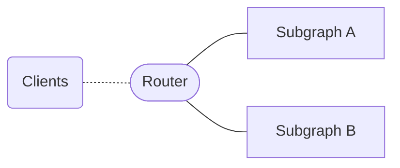
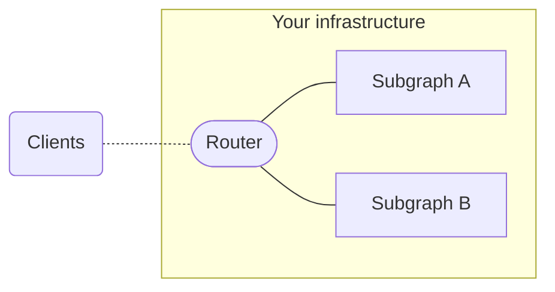
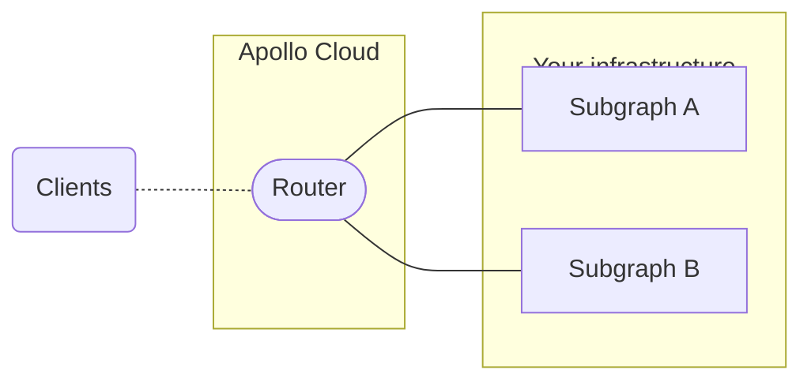

With supergraph architecture (also known as [Apollo Federation](/federation/)), each component service is known as a **subgraph**. A **router** acts as an entry point to your subgraphs and provides a unified interface for clients to interact with. Clients send operations to your router's public endpoint instead of directly to your APIs.

The router intelligently executes each incoming client operation across the appropriate combination of subgraphs. It then merges subgraph responses into a single response for the client. You can configure your router's error handling, CORS settings, other security features, and more. Your configuration options depend on your router type.

## Router types

With GraphOS, you can [host your own](./self-hosted) **Apollo Router**, a configurable, high-performance routing runtime packaged as a standalone binary:

Or you can choose for Apollo to provision a **cloud router** for you:

The cloud router uses the same Apollo Router binary. If you use a cloud router, you can choose run it on shared or dedicated infrastructure. Running it on dedicated infrastructure offers more configuration options. Continue reading for a detailed comparison of your router options.

<Note>

Apollo also offers the [`@apollo/gateway`](https://www.apollographql.com/docs/federation/v1/gateway/) library, but we recommend the Apollo Router over `@apollo/gateway` because it provides significant performance improvements. For more information about differences, see the [migration guide](https://www.apollographql.com/docs/router/migrating-from-gateway/).

</Note>

### Router comparison

Apollo offers the following router options, in increasing order of configurability:

<table>
  <thead>
    <tr>
      <th>Router type</th>
      <th>Description</th>
      <th>Configurability</th>
      <th>Plan availability</th>
    </tr>
  </thead>
  <tbody>
    <tr>
      <th>Cloud shared router</th>
      <td>
        Apollo provisions and manages the router on shared infrastructure.
      </td>
      <td>
        Basic configurability, including HTTP header rules, CORS settings, and
        subgraph error inclusion
      </td>
      <td>
        <a href="https://apollographql.com/pricing">Serverless</a>
      </td>
    </tr>
    <tr>
      <th>Cloud Dedicated router</th>
      <td>
        The router runs on dedicated, pre-provisioned infrastructure that you
        control and scale.
      </td>
      <td>
        Highly configurable, including all options in the Serverless cloud
        router and additional configurations
      </td>
      <td>
        <a href="https://apollographql.com/pricing">Dedicated</a>
      </td>
    </tr>
    <tr>
      <th>Self-hosted router</th>
      <td>You host and manage the router on your own infrastructure.</td>
      <td>
        Highly configurable, including all options in the Cloud Dedicated router
        and additional{' '}
        <a href="/router/enterprise-features">enterprise-only configurations</a>{' '}
        and{' '}
        <a href="/router/customizations/overview">
          further customization options
        </a>
      </td>
      <td>
        Apollo Router is available as a free and source-available runtime.
        Connecting your self-hosted Router to GraphOS requires an{' '}
        <a href="https://apollographql.com/pricing">Enterprise</a> plan.
      </td>
    </tr>
  </tbody>
</table>

Somes organizations might need to use Cloud Dedicated or self-hosted routing instead of shared cloud routing for these reasons:

- **Compliance.** All of your supergraph's components must be hosted in a particular region to adhere to compliance requirements.
- **Performance.** You need to minimize latency between your router and subgraphs by enabling them to communicate _without_ traversing the public internet (e.g., by hosting all components in a VPC).
- **Customization.** You need to customize your router's behavior beyond what's currently possible with cloud routing

With the exception of Apollo-managed routing, self-hosted supergraphs benefit from all of the same GraphOS features as cloud supergraphs: metrics reporting, schema checks, the Explorer, etc.

If you are interested in either Cloud Dedicated or self-hosted routing, don't hesitate to [get in touch](https://www.apollographql.com/contact-sales/).

## Setup and configuration

For setup and configuration instructions, refer to the respective router documentation:

- [Cloud router on shared infrastructure](./cloud)
- [Cloud router on dedicated infrastucture](./cloud-dedicated)
- [Self-hosted router](./self-hosted)
