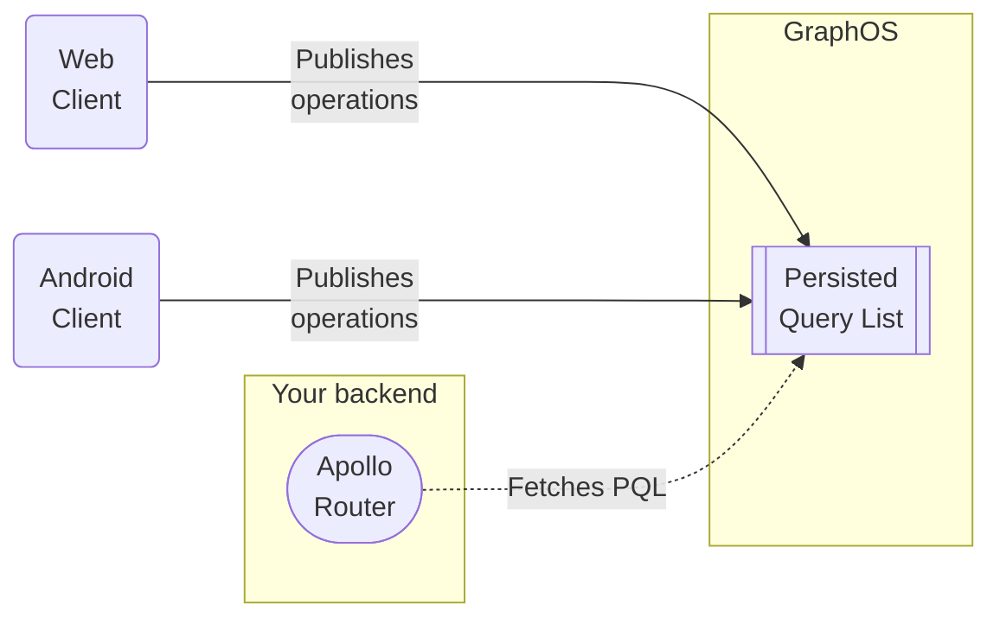

<blockquote>

**This feature is available only with a [GraphOS Enterprise plan](/graphos/enterprise/).** It is currently in [preview](/resources/product-launch-stages#preview).

If your organization _doesn't_ currently have an Enterprise plan, you can test out this functionality by signing up for a free [Enterprise trial](/graphos/org/plans/#enterprise-trials).

</blockquote>

With [GraphOS Enterprise](../enterprise/), you can maintain a **persisted query list** (or **PQL**) for your supergraph's self-hosted router. This list contains all of the known GraphQL operations that all of your app clients execute against your router:



Your router can use its PQL to **protect your supergraph** and **speed up your clients**:

- If you enable **operation safelisting**, your router _rejects_ any incoming operations that aren't in its PQL.
- Client apps can execute operations by providing their PQL-specified IDs, _instead of_ providing full operation strings.
    - For very large operation strings, this can dramatically reduce latency and bandwidth usage.
    - Your router can even _require_ that clients provide operations this way and _reject_ full query strings (even query strings that are present in the PQL).

## Differences from APQ

The Apollo Router also supports a feature called [automatic persisted queries](/router/configuration/in-memory-caching#caching-automatic-persisted-queries-apq), or APQ. With APQ, clients can execute a GraphQL operation by sending the _hash_ of its operation string, instead of sending the full string.

**Compared to GraphOS persisted queries, APQ has the following limitations:**

- APQ doesn't provide safelisting capabilities, because the router populates its APQ cache over time with _any_ operations it receives.
    - **With GraphOS persisted queries,** clients pre-publish their operations with GraphOS. Your router fetches its PQL on startup, enabling it to approve or reject operations based on their presence in the PQL.

- With APQ, your router must receive any given operation string from a client at least once, in order to cache it.
    - **With GraphOS persisted queries,** your router fetches its full PQL from GraphOS on startup, which means clients can _always_ execute operations by their PQL-specified ID.

If you _only_ want to improve request latency and bandwidth usage, APQ probably addresses your use case. If you _also_ want to secure your supergraph with operation safelisting, you should use GraphOS persisted queries.

## Setup

### 1. Create a persisted query list (PQL)

To use persisted queries, you first create at least one **persisted query list** (**PQL**) in GraphOS Studio. Each PQL is associated with a single graph in GraphOS, and you can link a single PQL to multiple variants of a graph.

1. From your organization's Graphs page in [GraphOS Studio](https://studio.apollographql.com/?referrer=docs-content), open the PQL page for a particular graph by clicking its PQL button:

  

2. From the PQL page:

    - If you haven't created any PQLs yet, click **Create a Persisted Query List**.
    - If you already have at least one PQL, click **New List** in the upper right.

  The following dialog appears:

  

3. Provide a name and (optional) description for your PQL, then click **Create**.

    - At this point, your empty PQL has been created. The remaining dialog steps help with additional setup.

4. The second dialog step (**Link**) enables you to link your new PQL to one existing variant of your supergraph.

    - You can optionally **Skip** this step and link variants later (covered in the next step).
    
5. The third dialog step (**Publish**) displays your PQL's unique ID, along with an example Rover CLI command for publishing operations to the PQL.

    - For now, we'll leave the PQL empty. We'll publish some operations to it in a later step.

6. The fourth and final dialog step (**Configure**) displays configuration options you apply to your router to begin using your PQL. We'll cover these in a later step.

7. Click **Finish** to close the dialog. Your newly created PQL appears in the table:

    

### 2. Link the PQL to individual variants

After you create a PQL, you can link it to one or more variants of your supergraph. It's safe to link an empty or incomplete PQL, because your router doesn't _use_ its PQL for anything until you configure it to do so (covered later).

1. From the table on your graph's PQL page, open the **•••** menu under the **Actions** column for the PQL you want to link:

    

2. Click **Link and Unlink Variants**. The following dialog appears:

    

3. Use the dropdown menu to select any variants you want to link your PQL to.

4. Click **Save**.

After you link a PQL to a variant:

1. GraphOS validates it against the variant's reported operation history and flags any recent operations that aren't represented in the PQL.

2. GraphOS then uploads the PQL to Uplink, the service that delivers configuration to your router at runtime.

> As a best practice, you should link PQLs to your staging _and_ production environments. To help with debugging in staging, you can configure your staging router to _log_ unrecognized operations instead of _rejecting_ them.

### 3. Publish operations to the PQL

After you create a PQL, you can start publishing GraphQL operations to it. **A PQL should contain _all_ of the GraphQL operations that _all_ of your trusted clients execute on your associated router.**

You publish operations to a PQL using the [Rover CLI](/rover/):

```bash title="Example command"
rover persisted-queries publish my-graph@my-variant \
  --manifest ./persisted-query-manifest.json # Manifest covered below
```

You can incorporate this process into your CI/CD pipeline, enabling you to automatically publish new operations whenever a new client app version is released.

#### Generating a manifest file

As shown in the example above, you provide `rover persisted-queries publish` a JSON **manifest** that contains details for all of the operations you want to publish.

All Apollo Client libraries (Web, Kotlin, and iOS) provide a mechanism for generating this manifest from your application source.

> You can also generate your own manifests if you use other client libraries. See [Manifest format](#manifest-format).

Here's an example manifest file that includes three operations:

```json title="persisted-query-manifest.json"
{  
  "format": "apollo-persisted-queries-manifest",
  "version": 1,
  "operations": [  
    {
      "id": "dc67510fb4289672bea757e862d6b00e83db5d3cbbcfb15260601b6f29bb2b8f",
      "body": "query UniversalQuery { __typename }",
      "name": "UniversalQuery",
      "type": "query" 
    },
    {
      "id": "f11e4dcb28788af2e41689bb366472084aa1aa1e1ba633c3d605279cff08ed59",
      "body": "query FragmentedQuery { post { ...PostFragment } }  fragment PostFragment on Post { id title }",
      "name": "FragmentedQuery",
      "type": "query" 
    },
    {
      "id": "04649073787db6f24b495d49e5e87526734335a002edbd6e06e7315e302af5ac",
      "body": "mutation SetNameMutation($name: String!) { setName($name) }",
      "name": "SetNameMutation",
      "type": "mutation" 
    }
  ]
}
```

You define all of the operations to publish under the `operations` key, which maps persisted query IDs to operation details. The above example associates the operation: `query Universal { __typename }` to the key: `dc67510fb4289672bea757e862d6b00e83db5d3cbbcfb15260601b6f29bb2b8f`. In practice, this identifier can be any string, but it must be a unique key in your list.


GraphOS does allow modifying the body of a published persisted query (this requires user confirmation). This functionality is not intended for modeling the evolution of a GraphQL operation over time. Instead, this supports advanced use cases like forcing legacy client versions to execute slightly different operations without needing to modify client code.

`name` should be the name of the published operation. It does not need to be unique; typically a Persisted Queries List will contain multiple operations with the same name from different versions of your client. It is used to help find operations when browsing them and does not affect Router behavior.

`type` should be `"query"`, `"mutation"`, or `"subscription"`.

#### Generating a PQM file

All Apollo Client libraries support generating PQM files at application build time. Each client library has its own documentation on how to generate PQM files, we will share dedicated docs for the following libraries:

- Apollo Client Web
- Apollo Client Kotlin
- Apollo Client iOS
- Relay

Although each library defines its own flow for generating PQM files, the output from each is the same: a file that maps graph operations to some identifier that can then be uploaded to GraphOS. This will be part of build tooling for associated clients, and customers who are relying on bespoke clients will be responsible for extraction of those runtime operation bodies to conform to the above standards.

To help support your clients, we'd love to work with you to help make this process as easy as possible!

#### Keeping build and runtime operation signatures consistent

Operations that are executed against your graph at runtime must precisely match the shapes of the operations in your Persisted Queries List. By default, even whitespace must match. Apollo Client libraries can all potentially modify the operations they define in app. This means that the operations they define will be potentially different from the operations that are executed at runtime.

For example, the client libraries typically add a `__typename`  field to every object type in the operation in order to understand more information about the operation's result. It's important that these changes are reflected in the published operations as well. Otherwise, two kinds of issues may occur:

- If a client's operation is published without the added __typename and the client sends the operation's ID in its request, the server will return results that do not include the `__typename` fields that the client was expecting. This will break the client features that need to know the type information.

- If a client's operation is published without the added `__typename` and the client sends the operation as a raw GraphQL document, then if the Router is configured to reject raw GraphQL that does not match a published operation, the operation may be surprisingly rejected. (We expect the "matching" rules to be configurable here, so that this particular "unexpected extra `__typename`" case could be made to work, but this may not cover all possible client-side transformations.)

Apollo's clients use the same logic to transform operations at runtime and at build time, so that this is not a concern.

You use the Rover CLI to publish one or more GraphQL operations to an existing PQL:

Apollo Clients are able to produce a Persisted Queries Manifest. Here is an example that includes the universal query as the only operation.

```json title="persisted-queries.json"
{  
  "format": "apollo-persisted-queries",
  "version": 1,
  "operations": [  
    {
      "id": "dc67510fb4289672bea757e862d6b00e83db5d3cbbcfb15260601b6f29bb2b8f",
      "body": "query UniversalQuery { __typename }",
      "name": "UniversalQuery",
      "type": "query" 
    },
  ]
}
```

```sh
rover persisted-queries publish my-graph@my-variant --manifest ./persisted-queries.json
```

- The `my-graph@my-variant` argument looks up the **PQL** linked to the variant (in step 2) and publishes operations to it.
- The `--manifest` option is the path to a **Persisted Queries Manifest** (**PQM**) file you create. This file contains a JSON object that describes the details of all the operations to publish. [See details.](#3-generate-a-persisted-queries-manifest-pqm-file)

**The above command does the following:**

1. It publishes all operations in the PQM file (`--manifest persisted-queries.json`) to the PQL linked to the graph.
    - If any operation in the PQM has the same ID as an operation already in the PQL, the existing PQL entry is replaced with the new operation. If using Apollo Client libraries, any change in the document would result in a new Persisted Query ID and a new entry in the PQL. Operation entries can only be replaced when manually setting your own identifiers.
2. It updates any additional supergraph variants that the PQL is already applied to.

### 4. Configure your router

After your PQLs are published and applied to a variant, you can configure the behavior of router instances associated with that variant.

While Persisted Queries is still in private preview, you’ll need to download a custom router image that has these features built in. This will only be required until this functionality is released in the stock router binary. [private preview binary](https://storage.googleapis.com/mdg-repo/router-persisted-queries-private-beta.20230602%2B6cfe51c6-x86_64.tar.gz)

After your PQLs are published and applied to a variant, you can configure the behavior of router instances associated with that variant.

Make sure your router instances connect to GraphOS by setting [these environment variables](/router/configuration/overview/#environment-variables). Otherwise, they can’t fetch your variant’s PQL from Uplink.

Described below are different router configurations for several use cases:

#### Persisted queries only

Simply enabling Persisted Queries will allow the operations in the variant’s linked PQ List to be queried by their associated persisted query IDs. These IDs can be provided via the standard [APQ format or the new Persisted Queries format](#6-make-requests).

```yaml title="router.yaml"
persisted_queries:
  enabled: true
```

#### Non-persisted query monitoring

[forthcoming]

Your router can allow all GraphQL operations, while flagging unpublished operations with additional logging/telemetry/metadata.

```yaml
persisted_queries:
  enabled: true
  safelist:
    enabled: false
    log_unpersisted: true
```

#### Operation safelisting

Your router can allow _only_ GraphQL operations that match a published shape, while rejecting unpublished operations.

```yaml title="router.yaml"
persisted_queries:
  enabled: true
  safelist:
    enabled: true
    freeform_graphql: 
      enabled: true
```

#### Safelisting with opaque IDs (full lockdown)

Configure your router to allow _only_ requests that specify a GraphQL operation by its **persisted query ID**, while rejecting requests that provide a freeform query string (or an _invalid_ ID).

```yaml title="router.yaml"
persisted_queries:
  enabled: true
  safelist:
    enabled: true
    freeform_graphql:
      enabled: false
```

### 5. Make requests

If you’ve followed the above steps (create a PQ List, link it to a variant, publish operations to it, enable known operations in your router), you can start sending known operations to your router.

Start the router:

```bash
APOLLO_KEY="..." APOLLO_GRAPH_REF="..." ./router --config ./router.yaml

2023-05-11T15:32:30.684460Z  INFO Apollo Router v1.18.1 // (c) Apollo Graph, Inc. // Licensed as ELv2 (https://go.apollo.dev/elv2)
2023-05-11T15:32:30.684480Z  INFO Anonymous usage data is gathered to inform Apollo product development.  See https://go.apollo.dev/o/privacy for details.
2023-05-11T15:32:31.507085Z  INFO Health check endpoint exposed at http://127.0.0.1:8088/health
2023-05-11T15:32:31.507823Z  INFO GraphQL endpoint exposed at http://127.0.0.1:4000/ 🚀
```

Make an APQ-style POST request:

Earlier we published the universal query with an ID of `dc67510fb4289672bea757e862d6b00e83db5d3cbbcfb15260601b6f29bb2b8f`, we can make a request like so to execute it:

```bash
curl http://localhost:4000 -X POST --json \
'{"extensions":{"persistedQuery":{"version":1,"sha256Hash":"dc67510fb4289672bea757e862d6b00e83db5d3cbbcfb15260601b6f29bb2b8f"}}}'
```

## Manifest format

The file format described below is used by our initial preview release. We expect that other information will be added to it later, such as information about what client this file represents.

```json title="persisted-queries.json"
{  
  "format": "apollo-persisted-queries",
  "version": 1,
  "operations": [  
    {
      "id": "dc67510fb4289672bea757e862d6b00e83db5d3cbbcfb15260601b6f29bb2b8f",
      "body": "query UniversalQuery { __typename }",
      "name": "UniversalQuery",
      "type": "query" 
    },
  ]
}
```

### Generating IDs

When generating operation identifiers, we encourage you to use a value that's derived directly from the query's details, such as the query document
s cryptographic hash. Apollo tools that extract operations use the base16 representation of the document's SHA256 hash, which is the same format used in APQs.

In almost all cases, you should not modify the operation body of a published operation. If you make changes to an existing published operation, you should publish a new operation with a new corresponding identifier. This ensures that multiple versions of a client application can work at once, providing different operation IDs to run different "versions" of the operation.

## Safelisting options

- **Operation safelisting.** Your router can allow only GraphQL operations that match a published shape (whether sent by published ID or as freeform GraphQL), while rejecting unpublished operations.

- **Safelisting with strict ID checking** (**full lockdown**). Your router can allow only requests that specify a GraphQL operation by its persisted query ID, while rejecting all requests that provide a freeform query string (or an invalid ID).

- **Unpublished operation monitoring.** Your router can allow all GraphQL operations, while flagging unpublished operations with additional logging/telemetry/metadata.
    - [forthcoming]

## Managing PQLs

### Removing an operation from a PQL

You might occasionally need to remove an operation from a PQL. Organization members with the **Graph Admin** role can remove individual operations from a PQL in GraphOS Studio:

[ SCREENSHOT ]
