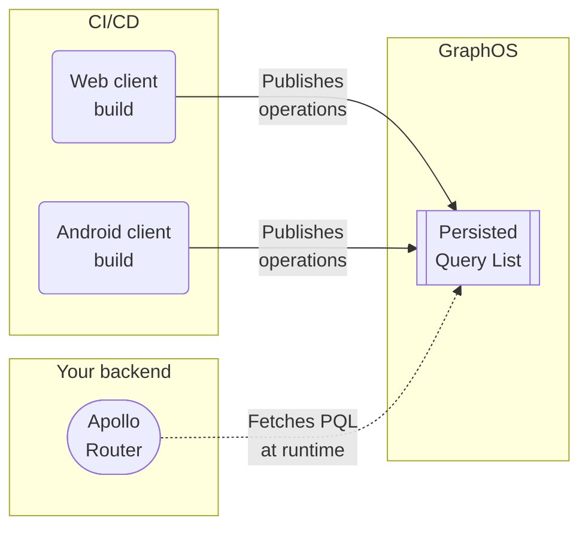

<blockquote>

**This feature is available only with a [GraphOS Enterprise plan](/graphos/enterprise/).** It is currently in [preview](/resources/product-launch-stages#preview).

If your organization _doesn't_ currently have an Enterprise plan, you can test out this functionality by signing up for a free [Enterprise trial](/graphos/org/plans/#enterprise-trials).

</blockquote>

With [GraphOS Enterprise](../enterprise/), you can maintain a **persisted query list** (or **PQL**) for your supergraph's self-hosted router. This list should contain all of the known GraphQL operations that all of your app clients execute against your router:



## Benefits

Your router can use its PQL to **protect your supergraph** and **speed up your clients**:

- If you enable **operation safelisting**, your router _rejects_ any incoming operations that aren't in its PQL.
    - This helps block requests from unauthorized clients.
- Client apps can execute an operation by providing its PQL-specified ID, _instead of_ providing its full operation string.
    - For very large operation strings, this can significantly reduce latency and bandwidth usage.
    - Your router can even _require_ that clients provide operations this way and _reject_ full query strings (even query strings that are present in the PQL).

## Differences from APQ

The Apollo Router also supports a related feature called [automatic persisted queries](/router/configuration/in-memory-caching#caching-automatic-persisted-queries-apq), or APQ. With APQ, clients can execute a GraphQL operation by sending the hash of its operation string, instead of sending the full string.

**Compared to GraphOS persisted queries, APQ has the following limitations:**

- APQ doesn't provide safelisting capabilities, because the router populates its APQ cache over time with _any_ operations it receives.
    - **With GraphOS persisted queries,** clients pre-publish their operations to GraphOS. Your router fetches its PQL on startup, enabling it to reject operations that aren't present in the PQL.

- With APQ, one of your router instances must receive any given operation string from a client at least once, in order to cache it.
    - **With GraphOS persisted queries,** your router fetches its full PQL from GraphOS on startup, which means clients can _always_ execute operations by their PQL-specified ID.

If you _only_ want to improve request latency and bandwidth usage, APQ probably addresses your use case. If you _also_ want to secure your supergraph with operation safelisting, you should use GraphOS persisted queries.

## Setup

### 0. Prerequisites

Before you get started with GraphOS persisted queries, do all of the following:

1. Update your Apollo Router instances to version `1.25.0` or later. [Download the latest version.](../quickstart/)
    - Previous versions of the Apollo Router don't support configuration for GraphOS persisted queries.
2. Make sure your router instances are [connected to your GraphOS Enterprise organization](/router/enterprise-features/#enabling-enterprise-features).
3. Update your version of the Rover CLI to `0.17.2` or later. [Download the latest version.](/rover/getting-started/)
    - Previous versions of Rover don't support publishing operations to a PQL.


### 1. Create a persisted query list (PQL)

To use persisted queries, you first create a **persisted query list** (**PQL**) in GraphOS Studio. Each PQL is associated with a single graph in GraphOS. You can link a single PQL to any number of different variants of its graph.

1. From your organization's Graphs page in [GraphOS Studio](https://studio.apollographql.com/?referrer=docs-content), open the PQL page for a graph by clicking its PQL button:

  

2. From the PQL page:

    - If you haven't created any PQLs yet, click **Create a Persisted Query List**.
    - If you already have at least one PQL, click **New List** in the upper right.

  The following dialog appears:

  

3. Provide a name and (optional) description for your PQL, then click **Create**.

    - At this point, your empty PQL has been created. The remaining dialog steps help with additional setup.

4. The second dialog step (**Link**) enables you to link your new PQL to one existing variant of your graph.

    - You can optionally **Skip** this step and link variants later (covered in the next step).
    
5. The third dialog step (**Publish**) displays your new PQL's unique ID, along with an example Rover CLI command for publishing operations to the PQL.

    - For now, we'll leave the PQL empty. We'll publish some operations to it in a later step.

6. The fourth and final dialog step (**Configure**) displays configuration options you apply to your router to begin using your PQL. We'll cover these in a later step.

7. Click **Finish** to close the dialog. Your newly created PQL appears in the table:

    

### 2. Link the PQL to variants

After you create a PQL, you can link it to one or more variants of your graph. Router instances associated with a linked variant automatically fetch their PQL from GraphOS.

It's safe to link an empty or incomplete PQL to a variant, because your router doesn't _use_ its PQL for anything until you configure it to do so (covered in a later step).

1. From the table on your graph's PQL page, open the **•••** menu under the **Actions** column for the PQL you want to link:

    

2. Click **Link and Unlink Variants**. The following dialog appears:

    

3. Use the dropdown menu to select any variants you want to link your PQL to.

4. Click **Save**.

After you link a PQL to a variant:

1. GraphOS validates the PQL against the variant's reported operation history and flags any recent operations that aren't represented in the PQL.

2. GraphOS then uploads the PQL to Uplink, the service that delivers configuration to your router at runtime.

> As a best practice, you should link PQLs to your staging _and_ production environments.

### 3. Generate operation manifests

After you create a PQL, you can start publishing operations to it. To do _that_, you need to generate JSON **manifests** of the operations to publish. You usually generate a separate manifest for each of your client apps.

<ExpansionPanel title="See an example manifest file with two operations">

```json title="persisted-queries.json"
{  
  "format": "apollo-persisted-queries",
  "version": 1,
  "operations": [  
    {
      "id": "dc67510fb4289672bea757e862d6b00e83db5d3cbbcfb15260601b6f29bb2b8f",
      "body": "query UniversalQuery { __typename }",
      "name": "UniversalQuery",
      "type": "query" 
    },
    {
      "id": "f11e4dcb28788af2e41689bb366472084aa1aa1e1ba633c3d605279cff08ed59",
      "body": "query FragmentedQuery { post { ...PostFragment } }  fragment PostFragment on Post { id title }",
      "name": "FragmentedQuery",
      "type": "query" 
    }
  ]
}
```

</ExpansionPanel>

You should perform manifest generation in your CI/CD pipeline. This enables you to incorporate new operations automatically whenever you release a new client app version.

#### Generation methods

Apollo Client for Web and iOS each provide a mechanism for generating a manifest file from your application source:

- [iOS docs](/ios/code-generation/codegen-configuration/#operation-manifest)

Similar mechanisms for other client libraries are in development.

> You can also build your _own_ mechanism for generating operation manifests. See the expected [manifest format](#manifest-format).

### 4. Publish operations to the PQL

After you [generate an operation manifest](#3-generate-operation-manifests), you publish it to your PQL with the [Rover CLI](/rover/):

```bash title="Example command"
rover persisted-queries publish my-graph@my-variant \
  --manifest ./persisted-query-manifest.json
```

- Replace `my-graph@my-variant` with the **graph ref** of _any_ variant that your PQL is [linked to](#2-link-the-pql-to-variants).
    - Graph refs have the format `graph-id@variant-name`.
- For the `--manifest` option, provide the path to the manifest you want to publish.

<blockquote>

As with [generating manifests](#3-generate-operation-manifests), you should execute this command in your CI/CD pipeline to publish new operations as part of your app release process.

[See the full reference for `rover persisted-queries publish`.]()

</blockquote>

**The above command does the following:**

1. It publishes all operations in the provided manifest file to whichever PQL is linked to the specified variant.
    - If you publish an operation with the same `id` as an existing PQL entry, the existing entry is overwritten. Overwriting a PQL entry with new details can break your clients! For more information, see [Generating IDs](#generating-ids).
    - It's always safe to publish an operation with the _exact same details_ as one that's already in the PQL.

2. It updates any _other_ variants that the PQL is applied to, so routers associated with those variants can fetch their updated PQL.

### 5. Configure your router

After you [publish all operations](#4-publish-operations-to-the-pql) to your PQL, you can configure your router instances to fetch and _use_ your PQL.

1. As mentioned in [Prerequisites](#0-prerequisites):
    - Make sure you're using version `1.25.0` or later of the Apollo Router.
    - Make sure your router instances are [connected to your GraphOS Enterprise organization](/router/enterprise-features/#enabling-enterprise-features), and that they're associated with a variant that your PQL is linked to.

2. Set your desired persisted query behavior in your router's YAML config file. For supported options, see [Router modes](#router-modes).

3. Deploy your updated router instances to begin using your PQL.

### 6. Send a test operation

First, start your GraphOS-connected router:

```bash
APOLLO_KEY="..." APOLLO_GRAPH_REF="..." ./router --config ./router.yaml

2023-05-11T15:32:30.684460Z  INFO Apollo Router v1.18.1 // (c) Apollo Graph, Inc. // Licensed as ELv2 (https://go.apollo.dev/elv2)
2023-05-11T15:32:30.684480Z  INFO Anonymous usage data is gathered to inform Apollo product development.  See https://go.apollo.dev/o/privacy for details.
2023-05-11T15:32:31.507085Z  INFO Health check endpoint exposed at http://127.0.0.1:8088/health
2023-05-11T15:32:31.507823Z  INFO GraphQL endpoint exposed at http://127.0.0.1:4000/ 🚀
```

Next, make an "APQ-style" POST request with `curl`, like so:

```bash
curl http://localhost:4000 -X POST --json \
'{"extensions":{"persistedQuery":{"version":1,"sha256Hash":"dc67510fb4289672bea757e862d6b00e83db5d3cbbcfb15260601b6f29bb2b8f"}}}'
```

If your router's PQL includes an operation with an ID that matches the value of the provided `sha256Hash` property, it executes the corresponding operation and returns its result.

### 7. Update client apps

After your router is running with persisted queries enabled, you can start updating your client apps to execute operations by their PQL-specified ID, instead of by sending full query strings.

To do this, clients can use the same protocol that's used for automatic persisted queries (APQ). 

Here's the JSON body of a request to execute an operation by its ID:

```json
{
  "variables": null,
  "extensions": {
    "persistedQuery": {
      "version": 1,
      "sha256Hash": "PQL_ID_HERE"
    }
  }
}
```

> If you're executing an operation that includes GraphQL variables, specify them with the `variables` property.

If your GraphQL client library provides a mechanism for executing operations via APQ, you can use that same mechanism with your router's PQL.

Here are links to documentation for APQ mechanisms in Apollo Client libraries:

- [Apollo Client Web](/react/api/link/persisted-queries/)
- [Apollo iOS](/ios/fetching/apqs/)
- [Apollo Kotlin](/kotlin/advanced/persisted-queries/)

## Router security levels

Your router instances with a persisted query list (PQL) can use it to enable one of a few different security levels, which you set up in your router's [YAML config file](/router/configuration/overview/#yaml-config-file).

> When you first adopt persisted queries, you should always start with the _least_ restrictive security level ([performance-only](#performance-only-no-safelisting)). You can then enable increasingly restrictive levels after you make all necessary changes to your clients.

The Apollo Router supports the following security levels, in increasing order of restrictiveness:

- [Performance-only](#performance-only-no-safelisting): Clients can optionally execute an operation on your router by providing the operation's PQL-specified ID.
    - All other levels also provide this core capability.
    - This level provides no operation safelisting.
- [Safelisting with query strings allowed](#safelisting-query-strings-allowed): The router _rejects_ any incoming operations that aren't present in its PQL.
    - Before moving to this security level, make sure _all_ of your client operations are present in your PQL.
- [Safelisting with IDs only](#safelisting-ids-only): The router rejects any incoming operations that aren't present in its PQL, _and_ clients _must_ execute an operation by providing its PQL-specified ID.
    - Before moving to this security level, make sure _all_ of your clients execute operations by providing their PQL-specified ID.

See below for details on each level.

### Performance-only (no safelisting)

> **Always start with this security level.** You can enable increasingly restrictive levels after you make all necessary changes to your clients.

To use persisted queries _only_ to reduce network bandwidth and latency (_not_ for safelisting), add the following minimal configuration:

```yaml title="router.yaml"
preview_persisted_queries:
  enabled: true
apq:
  enabled: false # APQ must be disabled 
```

This enables your clients to execute operations by providing their PQL-specified ID (instead of the full query string). Your router continues to accept full query strings as well, even for operations that _don't_ appear in its PQL.

### Safelisting (query strings allowed)

> ⚠️ **Before you apply this configuration,** first make sure your PQL contains _all_ of the GraphQL operations that _all active versions_ of your clients execute. If you enable safelisting _without_ ensuring this, your router will reject your unpublished client operations!

With the following configuration, your router allows _only_ GraphQL operations that are present in its PQL, while rejecting all other operations:

```yaml title="router.yaml"
preview_persisted_queries:
  enabled: true
  safelist:
    enabled: true
    freeform_graphql: 
      enabled: true # highlight-line
apq:
  enabled: false # APQ must be disabled 
```

To execute an operation, clients can provide either its full operation string _or_ its PQL-specified ID.

### Safelisting (IDs only)

> ⚠️ **Do not start with this configuration!** It requires _all_ of your clients to execute operations by providing their PQL-specified ID. If any clients still provide full operation strings, those clients will break.

With the following configuration, your router allows _only_ GraphQL operations that are present in its PQL, _and_ it requires clients to provide PQL-specified IDs instead of full query strings:

```yaml title="router.yaml"
preview_persisted_queries:
  enabled: true
  safelist:
    enabled: true
    freeform_graphql:
      enabled: false #highlight-line
apq:
  enabled: false # APQ must be disabled 
```

If you want to use this mode, you should _first_ set up [safelisting with query strings allowed](#safelisting-query-strings-allowed). That's because this mode requires modifying _all_ of your clients to execute operations via PQL-specified ID instead of query string. While you're making those necessary changes, you can enforce the less strict safelisting mode in your router.

## Manifest format

<blockquote>

⚠️ **This manifest format is subject to change during the preview period.**

You only need to read this section if you're building your own tooling to [generate persisted query manifests](#generating-manifests).

</blockquote>

A persisted query manifest has the following minimal structure:

```json title="persisted-queries-manifest.json"
{  
  "format": "apollo-persisted-queries",
  "version": 1,
  "operations": [  
    {
      "id": "dc67510fb4289672bea757e862d6b00e83db5d3cbbcfb15260601b6f29bb2b8f",
      "body": "query UniversalQuery { __typename }",
      "name": "UniversalQuery",
      "type": "query" 
    }
  ]
}
```

Manifest properties are documented below.

### Top-level properties

<table class="field-table">
  <thead>
    <tr>
      <th>Property</th>
      <th>Description</th>
    </tr>
  </thead>

<tbody>
<tr>
<td>

###### `format`

</td>
<td>

This value is currently always `apollo-persisted-queries`.

</td>
</tr>

<tr>
<td>

###### `version`

</td>
<td>

This value is currently always `1`.

</td>
</tr>

<tr>
<td>

###### `operations`

</td>
<td>

An array of objects describing the individual GraphQL operations to publish.

For details, see [Per-operation properties](#per-operation-properties).

</td>
</tr>

</tbody>
</table>

### Per-operation properties

Each entry in a [manifest's](#manifest-format) `operations` array is a JSON object that describes a single GraphQL operation to publish:

```json
{
  "id": "dc67510fb4289672bea757e862d6b00e83db5d3cbbcfb15260601b6f29bb2b8f",
  "body": "query UniversalQuery { __typename }",
  "name": "UniversalQuery",
  "type": "query" 
}
```

Each operation object has the following properties:

<table class="field-table">
  <thead>
    <tr>
      <th>Property</th>
      <th>Description</th>
    </tr>
  </thead>

<tbody>
<tr>
<td>

###### `id`

</td>
<td>

The unique ID to use for the operation in your PQL.

**This value must be unique among operations in the PQL.** If you publish an operation with the same `id` as an existing operation, the new operation _overwrites_ the existing PQL entry.

**To ensure uniqueness,** tooling should generate this value based on the operation `body`. For details, see [Generating IDs](#generating-ids).

</td>
</tr>

<tr>
<td>

###### `body`

</td>
<td>

The complete query document for the operation. Includes the definition of the operation itself, along with accompanying fragment definitions.

**This string must match _exactly_ the query document that your client sends your router, including whitespace and field order.** For details, see [Ensuring consistent operation signatures](#ensuring-consistent-operation-signatures).

</td>
</tr>

<tr>
<td>

###### `name`

</td>
<td>

The operation's name. Must match the name specified in `body`.

This value does _not_ need to be unique among operations in the PQL. Often, different clients execute slightly different operations with the same name, and those operations each require a separate entry in the PQL.

</td>
</tr>

<tr>
<td>

###### `type`

</td>
<td>

The type of GraphQL operation. Always one of the following values:

- `query`
- `mutation`
- `subscription`

</td>
</tr>

</tbody>
</table>

### Generating IDs

When generating operation IDs for a manifest, you should use a value that's unique to each operation, such as the query document's cryptographic hash. Apollo's [manifest generation tools](#3-generate-operation-manifests) use the base16 representation of the document's SHA256 hash, which is the same format used for [APQ](#differences-from-apq).

By generating identifiers based on query documents this way, you ensure that different operations always have different IDs. This prevents unexpected collisions in your PQL.

> **Never use an operation _names_ for PQL IDs.** Different clients (or even different versions of the _same_ client) might execute different operations with the same name, and _all_ of those distinct operations should be present in your PQL.

### Ensuring consistent operation signatures

Whenever a client sends an operation string to a router that has safelisting enabled, the router checks for that operation string's presence in its persisted query list. **The incoming string must match a PQL entry's operation string _exactly_, including whitespace and field order.**

The following queries are functionally identical, but the router will _reject_ the client operation because it doesn't match the PQL entry exactly.

<CodeColumns>

```graphql title="PQL entry"
query GetBooks {
  books {
    author
    title
  }
}
```

```graphql title="Client operation"
query GetBooks {
  books {
    #highlight-start
    title # Field order reversed!
    author
    #highlight-end
  }
}
```

</CodeColumns>


Apollo Client libraries can all potentially modify the operations they define in app. This means that the operations they define will be potentially different from the operations that are executed at runtime.

For example, the client libraries typically add a `__typename`  field to every object type in the operation in order to understand more information about the operation's result. It's important that these changes are reflected in the published operations as well. Otherwise, two kinds of issues may occur:

- If a client's operation is published without the added `__typename` and the client sends the operation's ID in its request, the server will return results that do not include the `__typename` fields that the client was expecting. This will break the client features that need to know the type information.

- If a client's operation is published without the added `__typename` and the client sends the operation as a raw GraphQL document, then if the Router is configured to reject raw GraphQL that does not match a published operation, the operation may be surprisingly rejected. (We expect the "matching" rules to be configurable here, so that this particular "unexpected extra `__typename`" case could be made to work, but this may not cover all possible client-side transformations.)

Apollo's clients use the same logic to transform operations at runtime and at build time, so that this is not a concern.
