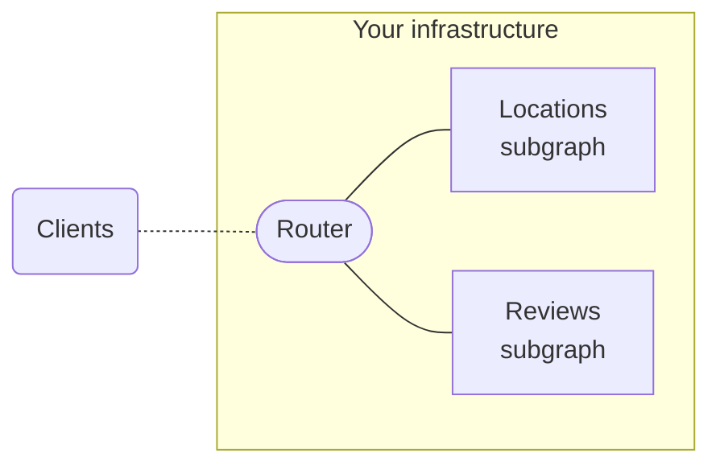

> ⚠️ **Important:** If you're just getting started with GraphOS, instead [create a cloud supergraph](../quickstart/cloud/).
>
> **Self-hosted supergraphs are an [Enterprise feature](/graphos/enterprise/)** for organizations with advanced performance or compliance requirements.
>
> If your organization _doesn't_ currently have an Enterprise plan, you can test out this functionality by signing up for a free [Enterprise trial](https://studio.apollographql.com/signup?type=enterprise-trial&referrer=docs-content).

Some organizations with advanced requirements need to host every part of their supergraph in their own infrastructure, _including_ the supergraph's router:

A supergraph with this structure is called a [self-hosted supergraph](../graphs/#self-hosted-supergraphs). Here are some reasons why an enterprise organization might need to use self-hosted routing instead of [cloud routing](./cloud/) (where Apollo hosts your router for you):

- **Compliance.** All of your supergraph's components must be hosted in a particular region to adhere to compliance requirements.
- **Performance.** You need to minimize latency between your router and subgraphs by enabling them to communicate _without_ traversing the public internet (e.g., by hosting all components in a VPC).
- **Customization.** You need to configure your router's behavior beyond what's currently possible with [cloud routing](./cloud-configuration/).

With the exception of Apollo-managed routing, self-hosted supergraphs benefit from all of the same GraphOS features as cloud supergraphs (metrics reporting, schema checks, the Explorer, and so on).

## Creating a self-hosted supergraph

<CreateSelfHostedSupergraph />
