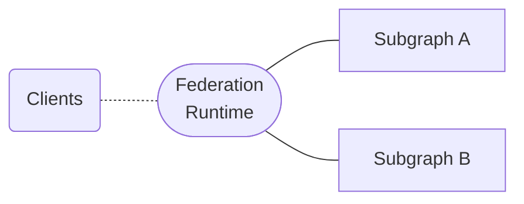
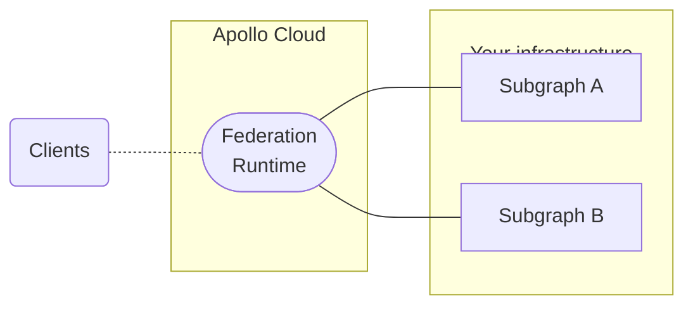
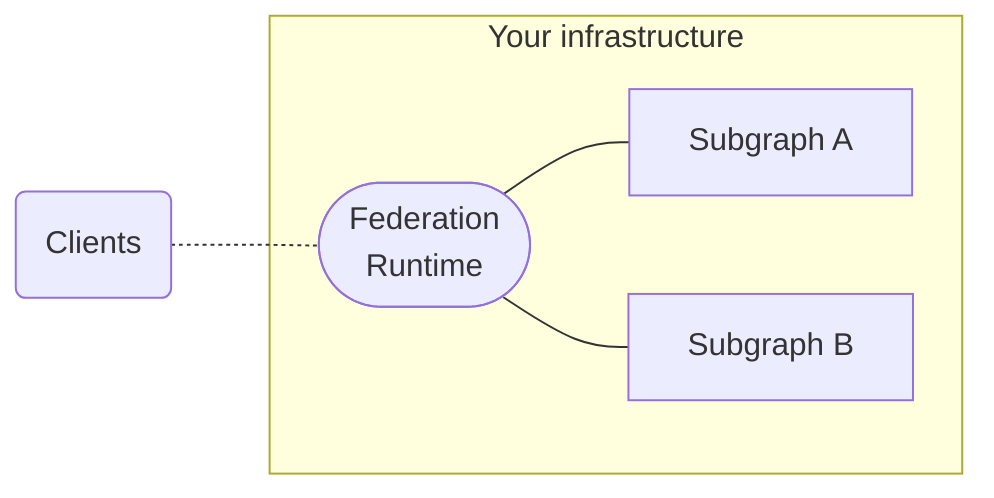

With supergraph architecture (also known as [Apollo Federation](/federation/)), each component service is known as a _subgraph_. The GraphOS _Federation Runtime_ acts as an entry point to your subgraphs and provides a unified interface for clients to interact with. Clients send operations to your runtime's public endpoint instead of directly to your APIs.

The runtime intelligently executes each incoming client operation across the appropriate combination of subgraphs. It then merges subgraph responses into a single response for the client. You can configure your runtime's error handling, CORS settings, other security features, and more. Your configuration options depend on your runtime type.

## GraphOS runtime types

With GraphOS, you can choose for Apollo to provision and manage a cloud-hosted runtime for you:

Or you can choose to self-host your runtime:

Cloud and self-hosted runtimes are both powered by the Apollo Router—a high-performance runtime runtime packaged as a [standalone binary](https://github.com/apollographql/router).

### Runtime comparison

Apollo offers the following runtime options, in increasing order of configurability:

<table>
  <thead>
    <tr>
      <th>Runtime type</th>
      <th>Description</th>
      <th>Configurability</th>
      <th>Plan availability</th>
    </tr>
  </thead>
  <tbody>
    <tr>
      <th>Shared cloud runtime</th>
      <td>Apollo provisions and manages runtimes on shared infrastructure.</td>
      <td>
        Basic configurability, including HTTP header rules, CORS settings, and
        subgraph error inclusion
      </td>
      <td>
        <a href="https://apollographql.com/pricing">Serverless</a>
      </td>
    </tr>
    <tr>
      <th>Dedicated cloud runtime</th>
      <td>
        Apollo provisions and manages runtimes on dedicated infrastructure that
        you control and scale.
      </td>
      <td>
        Highly configurable, including all options for shared cloud runtimes and
        additional configurations
      </td>
      <td>
        <a href="https://apollographql.com/pricing">Dedicated</a>
      </td>
    </tr>
    <tr>
      <th>Self-hosted runtime</th>
      <td>You host and manage the runtime on your own infrastructure.</td>
      <td>
        Highly configurable and customizable, including all options for Cloud
        Dedicated runtimes and additional{' '}
        <a href="/router/customizations/overview">customization options</a>
      </td>
      <td>
        Apollo Router is available as a free and source-available runtime.
        Connecting your self-hosted runtime to GraphOS requires an{' '}
        <a href="https://apollographql.com/pricing">Enterprise</a> plan.
      </td>
    </tr>
  </tbody>
</table>

### GraphOS runtime features

Although all GraphOS runtimes (both cloud- and self-hosted) are powered by the source-available Apollo Router binary, they offer an expanded feature set that isn't available when running the Apollo Router without connecting it to GraphOS.

Cloud-hosted runtimes automatically have access to additional GraphOS runtime features, while self-hosted runtimes must be authenticated with a GraphOS Enterprise license to gain access to these features. Refer to the [pricing page](https://www.apollographql.com/pricing#graphos-router) to compare GraphOS runtime features across plan types.

## Setup and configuration

For setup and configuration instructions, refer to the respective runtime documentation:

- [Cloud runtime on shared infrastructure](./quickstart/cloud)
- [Cloud runtime on dedicated infrastructure](/graphos/cloud-routing/dedicated/quickstart)
- [Self-hosted runtime](./quickstart/self-hosted)
