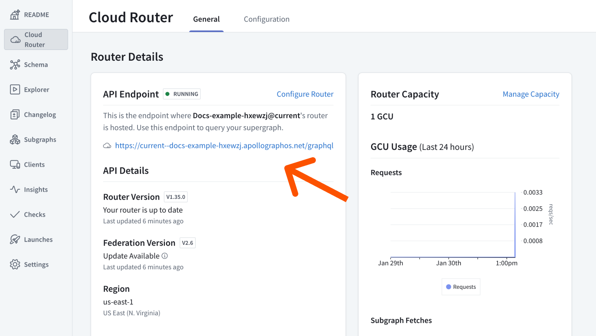
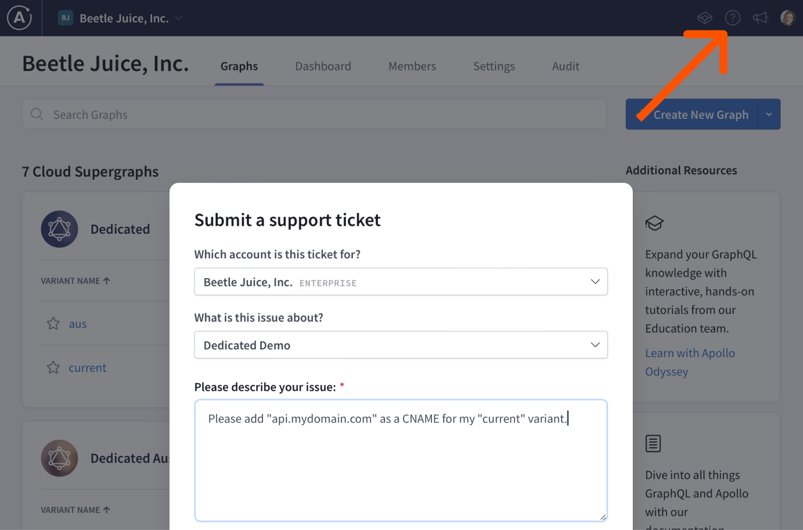

<DedicatedPreview />

The **custom domains** feature lets you replace the default `apollographos.net` [router endpoint URL](./quickstart#router-endpoint-url) with your own subdomain, for example `api.apollographql.com`.

Custom domains can help to:

- Minimize client-side changes
- Use your existing CORS policies and security controls
- Protect your cloud routers from DDoS attacks

## How custom domains works

Custom domains run on [Cloudflare's](https://www.cloudflare.com/) global network.
Using a custom domain provides DDoS protections and TLS termination to your cloud routers.
Custom domains support CNAME records which are assigned at the variant level.

## Custom domains setup

Setup includes two steps:

1. Setting up a new CNAME record in your DNS provider.
2. Verifying your CNAME with Apollo.
  <Note>

  Later in 2024, custom domains will be available self service through GraphOS Studio. In the meantime, you need to open a support request to verify your CNAME with Apollo.

  </Note>

### Setup a CNAME

To get started with custom domains, create a [CNAME record](https://www.cloudflare.com/learning/dns/dns-records/dns-cname-record/) in your DNS provider that points at your Dedicated variant's [existing subdomain](./quickstart#router-endpoint-url). For example, create a CNAME for `api.mydomain.com` that points to `current--docs-example.apollographos.net`.

### Verify CNAME

Next, open a support ticket requesting Apollo to enable your new CNAME.
You can open a ticket by clicking the **?** icon in the top right of [GraphOS Studio](https://studio.apollographql.com?referrer=docs-content) and selecting **Contact Support**.

Apollo will reply with a new TXT record you need to add to your DNS to verify your CNAME.
Once you've created your TXT record, let Apollo know.
Upon verification, your new CNAME will be live.

## Limitations

Custom domains doesn't support:

- [Apex records](https://learn.microsoft.com/en-us/azure/dns/dns-zones-records#record-names) or [A records](https://learn.microsoft.com/en-us/azure/dns/dns-zones-records#record-types)
- Multiple custom domains per variant
- Load balancing traffic across multiple variants
