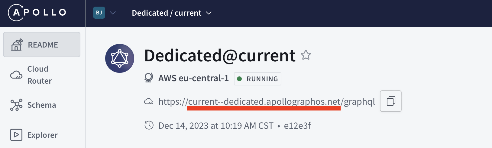

<DedicatedPreview />

Custom Domains lets you replace the default apollographos.net domain with your own subdomain (eg: api.apollographql.com).

Custom Domains is useful for:
* Minimizing client-side changes
* Using your existing CORS policies and security controls
* Protect your cloud routers with DDoS

## How it works
Custom Domains runs on CloudFlare's global network. It provides DDoS protections and TLS termination to your cloud routers.

Custom Domains support CNAME records which are assigned at the variant level. Custom Domains does not support apex domains or A record configuration.

## Setup Custom Domains
Later this year, Custom Domains will be available self service through GraphOS Studio. In the meantime, you'll need to open a support request. 

### Step 1: Setup a CNAME
To get started with Custom Domains, create a CNAME record in your DNS provider that points at your Dedicated variant's existing subdomain.

For example, create a CNAME for "api.mydomain.com" that points at "current--dedicated.apollographos.net".

### Step 2: Verify CNAME
Next, open a support ticket requesting we enable your new CNAME. Apollo will reply with a new TXT record you'll need to add to your DNS to verify your CNAME.

### Step 3: Go live
Once your TXT record has been created, email Apollo that you've done so. Upon verification, your new CNAME will be live.

## Limitations
Custom Domains does not support:
* Apex records or A records
* Multiple custom domains per variant
* Load balancing traffic across multiple variants
