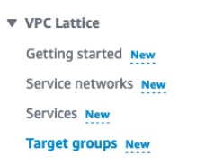
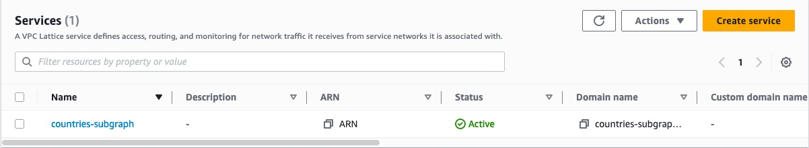
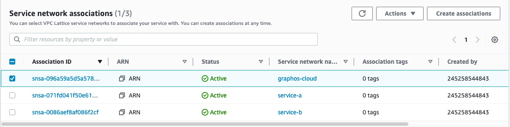
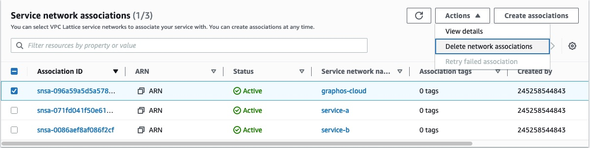
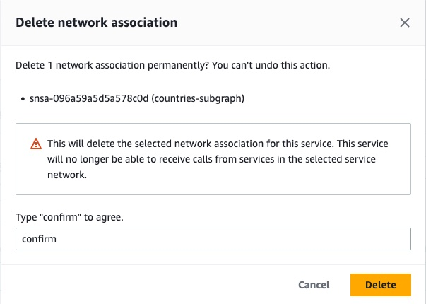
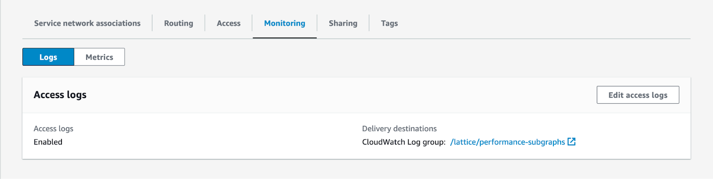
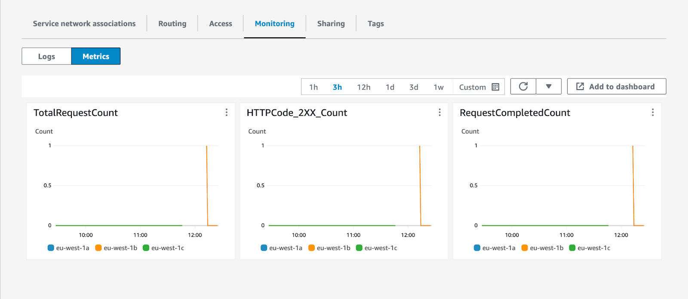

## Further restrict access to private subgraphs

Once you configure an Amazon VPC Lattice service to accept traffic from the Apollo AWS Organization, it is protected by multiple security layers:

- The Amazon VPC Lattice service network only allows traffic with a valid signature and over HTTPS.
- The Lattice service's configured authorization policy ensures traffic only comes from Apollo's AWS accounts. (This is the authorization policy you configured in step 6 [when creating your Lattice service](#step-2-create-an-aws-vpc-lattice-service).)
- Apollo cloud router provisioning compares subgraphs in a supergraph's configuration against the list of known private subgraphs in its Apollo account. It refuses to create or update cloud routers with unknown private subgraphs.
- Cloud routers only have permission to invoke private subgraphs listed in their supergraph configuration.

You can further restrict access to your private subgraphs by configuring additional [conditions](https://docs.aws.amazon.com/IAM/latest/UserGuide/reference_policies_elements_condition.html) in your service's authorization policy.
Specifically, you can add conditions to restrict traffic based on your organization's Apollo account ID or your supergraph's graph ref.

### Update Lattice service authorization policy

To update a Lattice service's authorization policy with additional restrictions, you first need the **Apollo account ID** and/or **graph ref** to which you want to restrict subgraph access.

#### Obtain account ID and graph ref

- <TrackableLink
    href="https://www.apollographql.com/contact-sales?type=dedicated&referrer=docs"
    eventName="content_contact_cloud"
  >
    Contact Apollo
  </TrackableLink> to obtain your account ID. Specify you would like the account
  ID needed to update your Lattice service's authorization policy.

  <Note>

  The Apollo account ID you specify in your authorization policy is not the Apollo organization ID you can find in GraphOS Studio.

  </Note>

- You can find your supergraph's graph ref in your Apollo account:
  - Log in to [GraphOS Studio](https://studio.apollographql.com?referrer=docs-content).
  - Click on a graph variant on the **Graphs** page. The graph ref will be at the top of the page—click it to copy.

If you want to provide subgraph access to multiple Apollo accounts or supergraphs, you can specify multiple account IDs and graph refs when updating your policy.

#### Update policy

If you are using the [Apollo Terraform module](https://github.com/apollographql/terraform-graphos-aws), you can set the [`apollo_account_ids` and `apollo_graph_refs` variables](https://github.com/apollographql/terraform-graphos-aws#usage) to update your authorization policy. Provide one or more Apollo account IDs or graph refs:

```txt showLineNumbers=false disableCopy=true
apollo_account_ids = ["my_account_id", "another_account_id"]
apollo_graph_refs  = ["my-graph@my-variant", "another-graph@my-variant"]
```

If you aren't using the Apollo Terraform module, follow these steps:

1. In the AWS Console for your region of choice, go to the VPC service page:

- [US East (N. Virginia) - us-east-1](https://us-east-1.console.aws.amazon.com/ram/home?region=us-east-1)
- [Europe (Ireland) - eu-west-1](https://eu-west-1.console.aws.amazon.com/ram/home?region=eu-west-1)

2. In the menu on the left, scroll down and open **Services** in the **VPC Lattice** section.

{' '}



3. Click the name of the Lattice service whose authorization policy you want to configure.

{' '}



4. In the **Service access** section, update your authorization policy. You can use the following as an example&mdash;make sure to replace the account ID and graph ref with your own.

```json {13-17} showLineNumbers=false
{
  "Version": "2012-10-17",
  "Statement": [
    {
      "Effect": "Allow",
      "Principal": "*",
      "Action": "vpc-lattice-svcs:Invoke",
      "Resource": "*",
      "Condition": {
        "ForAnyValue:StringLike": {
          "aws:PrincipalOrgPaths": "o-9vaxczew6u/*/ou-leyb-l9pccq2t/ou-leyb-fvqz35yo/*"
        },
        // Restrict traffic based on Apollo account IDs or graphRefs
        "StringEquals": {
          "aws:PrincipalTag/Apollo:accountId": "my_account_id_xezf34",
          "aws:PrincipalTag/Apollo:graphRef": "my-graph@my-variant"
        }
      }
    }
  ]
}
```

If there are multiple supergraphs which should have access to the subgraph, use a comma-separated string of graph refs for `aws:PrincipalTag/Apollo:graphRef`. For example:

```json showLineNumbers=false disableCopy=true
"aws:PrincipalTag/Apollo:graphRef": "my-graph@my-variant, my-graph@another-variant, another-graph@another-variant"
```

Similarly, you can use a comma-separated string of account IDs for `aws:PrincipalTag/Apollo:accountId`:

```json showLineNumbers=false disableCopy=true
"aws:PrincipalTag/Apollo:accountId": "my_account_id_xezf34", "my_account_id_dehs56"
```

## Remove access to private subgraphs

To remove Cloud Dedicated access to private subgraphs, you need to remove both resource shares and service network associations. Keep in mind that any existing supergraph that sends traffic to your private subgraphs will stop working once you remove access.

### Remove resource shares

1. In the AWS Console for your region of choice, go to the Resource Access Manager service page:

- [US East (N. Virginia) - us-east-1](https://us-east-1.console.aws.amazon.com/ram/home?region=us-east-1)
- [Europe (Ireland) - eu-west-1](https://eu-west-1.console.aws.amazon.com/ram/home?region=eu-west-1)

2. In the menu on the left, click **Resource shares** in the **Shared by me** section.

{' '}


3. Select the resource share(s) associated with Cloud Dedicated and click the **Delete** button in the top right corner.

{' '}


4. Click **Delete** in the dialog that appears.

### Remove service network associations

1. In the AWS Console for your region of choice, go to the VPC service page:

- [US East (N. Virginia) - us-east-1](https://us-east-1.console.aws.amazon.com/ram/home?region=us-east-1)
- [Europe (Ireland) - eu-west-1](https://eu-west-1.console.aws.amazon.com/ram/home?region=eu-west-1)

2. In the menu on the left, scroll down and open **Services** in the **VPC Lattice** section.

{' '}


3. Click the name of the Lattice service you want to disconnect.

{' '}


4. In the **Service network associations**, select the **graphos-cloud** service name.

{' '}



5. Click the **Actions** button in the top right of that section, and click **Delete network associations**.

{' '}



6. Follow the confirmation instructions and click **Delete**.

{' '}



Deleting the network association can take a few seconds. Once the network association is deleted, Cloud Dedicated cannot contact your subgraphs anymore.

## Amazon VPC Lattice monitoring

To validate that traffic is flowing to your private subgraphs, you can use the metrics and access logs emitted by Amazon VPC Lattice:

1. In the AWS Console for your region of choice, go to the VPC service page.

2. In the menu on the left, scroll down and open **Services** in the **VPC Lattice** section.

{' '}


3. Click on the name of the Lattice service used by the subgraph in question.

{' '}


4. Click on the **Monitoring** tab.

From there, you can configure and enable access logs for your Amazon VPC Lattice service. You can also navigate to the Metrics tab to get a quick overview if traffic is flowing to your private subgraphs.



{' '}



You can also use [Amazon CloudWatch metrics emitted by Amazon VPC Lattice](https://docs.aws.amazon.com/vpc-lattice/latest/ug/monitoring-cloudwatch.html) to set up dashboards and alarms to understand the health of your private subgraphs.

## Frequently asked questions

#### How does Cloud Dedicated prevent other users from accessing my private subgraphs?

When you associate a resource share for the first time, Cloud Dedicated will scan the Lattice services contained in the resource share to retrieve their ARNs and domain names.

When you add a private subgraph to one of your supergraphs, Cloud Dedicated will check that the domain for that subgraph matches one of the Lattice services you have associated with your Apollo Organization.

As a second line of defense, supergraphs use AWS IAM permissions and [SigV4](https://docs.aws.amazon.com/AmazonS3/latest/API/sig-v4-authenticating-requests.html) to only allow traffic to the subgraphs in the same Apollo organization.

#### I want to use Amazon VPC Lattice within my own organization. Can I still use Lattice for private subgraphs?

Yes. Cloud Dedicated will associate your Lattice services with its own service network, and you can associate a Lattice service with multiple service networks. You can also create multiple Lattice target groups or Lattice services for the same load balancer, IP addresses, Lambda functions, or other resources supported by Lattice target groups.
