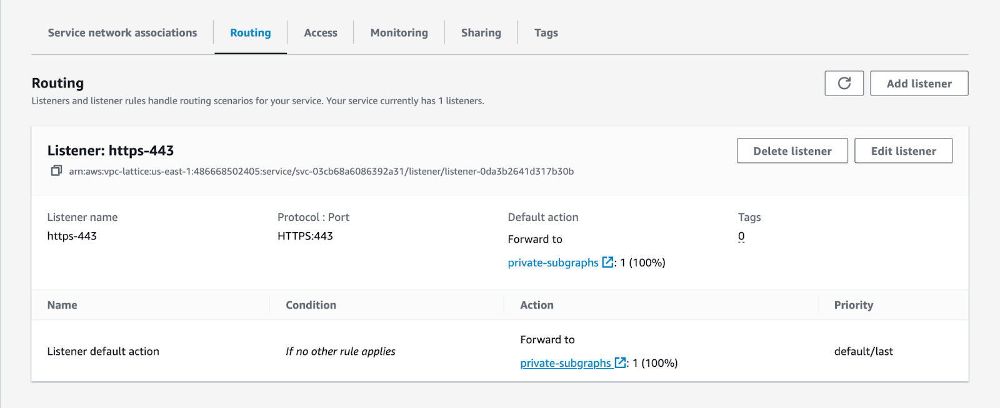

<DedicatedPreview />

To learn how to configure AWS VPC Lattice to send traffic to your subgraphs, refer to the [configuration docs](./lattice).

## Enable subgraph error inclusion

To help resolve AWS VPC Lattice connection issues, we recommend enabling subgraph error inclusions for your graph variant during troubleshooting. This configuration lets you see error messages generated by your subgraphs. Follow these steps to do set the configuration:

1. Go to [GraphOS Studio](https://studio.apollographql.com?referrer=docs-content).

2. Open the **Cloud Router** page from the left navigation.
3. Open the **Configuration** tab.
4. In **Router configuration YAML**, ensure that the following configuration block that sets `include_subgraph_errors` is present:

```yaml
include_subgraph_errors:
  all: true
```

5. Click the **Save** button in the top right corner of that section.

Configuration changes trigger a new launch. Please wait a few minutes for your cloud router to update with this new configuration. You can monitor the deployment status in the Launches page for your graph variant.

Once you've identified and resolved the underlying issue, we recommend you turn off subgraph errors by removing the block that sets `include_subgraph_errors` and saving the router configuration YAML again.

## Common issues and errors

If you encounter an error or not listed below and need assistance, don't hesitate to <TrackableLink href="https://www.apollographql.com/contact-sales?type=dedicated&referrer=docs" eventName="content_contact_cloud">get in touch</TrackableLink>. We're here to help.

### Overriding `host` headers

Amazon VPC Lattice relies on the `host` header to properly secure and route requests. You can't change this header on Cloud Dedicated. Instead, consider using a header like `x-host`. You can rewrite an incoming `host` header as `x-host` through your [router configuration](./quickstart#step-3-inspect-and-configure-your-cloud-router) YAML:

```yaml title="router.yaml"
# ...other configuration...
headers:
  all: # Header rules for all subgraphs
    request:
      - propagate:
        named: 'host'
        rename: 'x-host'
```

### Service in resource share doesn't appear in private subgraphs

Cloud Dedicated does not automatically scan your resource shares for new Lattice services. If you add a service, you can manually trigger a scan by going to your Apollo Organization settings page and clicking the **Rescan subgraphs** button.

### Providing `Authorization` headers

Because AWS Sigv4 relies on the [HTTP `Authorization` request header](https://developer.mozilla.org/en-US/docs/Web/HTTP/Headers/Authorization) for [signing requests](https://docs.aws.amazon.com/AmazonS3/latest/API/sigv4-auth-using-authorization-header.html), you may receive an error like this: `You must be authenticated to access this resource. Please provide a valid Bearer Token in the Authorization header.`

If your subgraphs rely on the `Authorization` header for authentication, your router needs to [rename](/router/configuration/header-propagation/#propagate) it. For example:

```yaml title="router.yaml"
# ...other configuration...
headers:
  all: # Header rules for all subgraphs
    request:
      - propagate:
        named: 'Authorization'
        rename: 'X-Authorization'
```

Then, ensure you update your subgraphs to check for either `Authorization` or your new header name.

### Error trying to connect: Connection reset by peer (os error 104)

This error is likely to occur when your cloud router tries to send traffic to a port different from the listener on your AWS VPC Lattice service. Apollo GraphOS Cloud only supports communicating with private subgraphs over HTTPS on port 443.

You can validate that your Lattice services are configured to receive traffic on the right port by navigating to the service routing page:

1. In the AWS Console for your region of choice, go to the VPC service page.

2. In the menu on the left, scroll down and open **Services** in the **VPC Lattice** section.


3. Click the name of the Lattice service leveraged by the subgraph in question.


4. Click the **Routing** tab.



5. Validate that you have a listener with a `protocol:port` configuration of **HTTPS:443**.

If this is not the case, you must create a new listener by clicking on the **Add listener** button at the top left of this section.

### HTTP fetch failed from '_subgraph_': 403: Forbidden

This error likely occurs for one of the following reasons:

- One of your clients is sending a subscription request to a private subgraph over WebSockets.
- The VPC Lattice IAM policy does not allow traffic from Apollo GraphOS Cloud.

#### Subscriptions over WebSockets

Subscriptions over WebSockets are not supported in AWS VPC Lattice, as the platform [lacks WebSocket support](https://docs.aws.amazon.com/vpc-lattice/latest/ug/listeners.html#listener-configuration) at this time. When sending a request to upgrade to a WebSockets connection, Lattice will return a blank response with a 403 response code. In this situation, Lattice will also not emit access log entries to Amazon CloudWatch Logs. We recommend you [contact your AWS account team](https://aws.amazon.com/contact-us/sales-support/) to notify them of your interest in this feature.

#### VPC Lattice IAM policy

You can validate that your Lattice services are configured to allow traffic from Apollo GraphOS Cloud by navigating to the service access page:

1. In the AWS Console for your region of choice, go to the VPC service page.

2. In the menu on the left, scroll down and open **Services** in the **VPC Lattice** section.


3. Click the name of the Lattice service leveraged by the subgraph in question.


4. Click the **Access** tab.

5. Ensure that the Auth type is set to **IAM** and that the policy looks like this:

```json
{
  "Version": "2012-10-17",
  "Statement": [
    {
      "Effect": "Allow",
      "Principal": "*",
      "Action": "vpc-lattice-svcs:Invoke",
      "Resource": "*",
      "Condition": {
        "ForAnyValue:StringLike": {
          "aws:PrincipalOrgPaths": "o-9vaxczew6u/*/ou-leyb-l9pccq2t/ou-leyb-fvqz35yo/*"
        }
      }
    }
  ]
}
```
