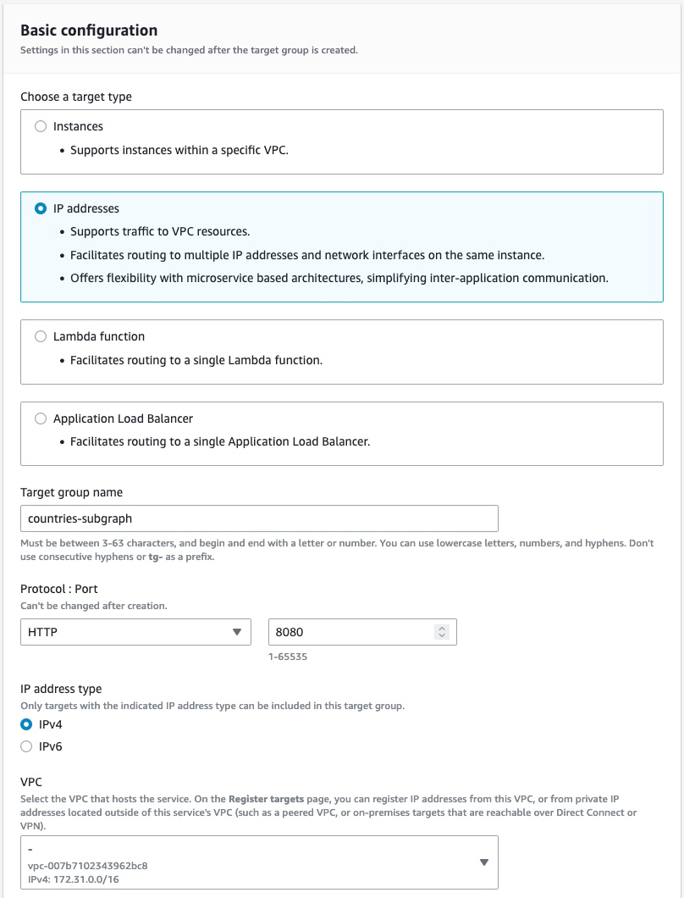
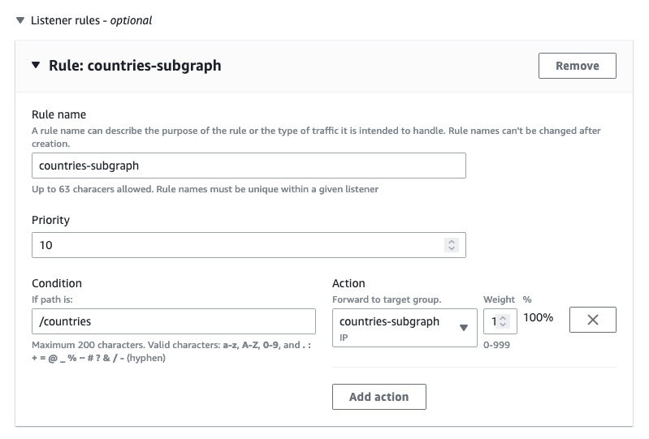
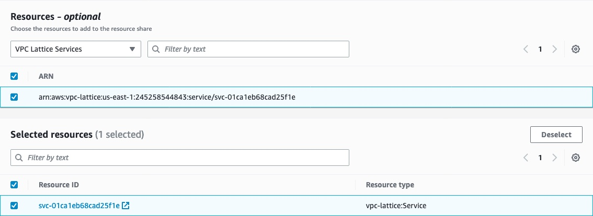

<DedicatedPreview />

Cloud Dedicated uses [Amazon VPC Lattice](https://aws.amazon.com/vpc/lattice/) to send traffic to subgraphs running in an Amazon VPC without exposing them to the internet.


This guide shows how to create Lattice services and share them with the Apollo AWS organization that hosts cloud routers.

You can provision VPC Lattice with the [Apollo Terraform module](https://github.com/apollographql/terraform-graphos-aws).
Refer to the [module's README](https://github.com/apollographql/terraform-graphos-aws#apollo-graphos-cloud-private-subgraphs-module) for more information.

<Note>

Using Amazon VPC Lattice incurs costs outside of your Cloud Dedicated spend. Refer to the [Lattice pricing page](https://aws.amazon.com/vpc/lattice/pricing/) to learn more.

</Note>


## How GraphOS ensures subgraph security through Lattice

When you first share Lattice services with GraphOS, it scans the Lattice services to retrieve their ARNs and domain names.
When you add a private subgraph to one of your cloud supergraphs, GraphOS checks that the subgraph's domain matches one of the Lattice services associated with your Apollo organization.

As a second line of defense, supergraphs use AWS IAM permissions and [SigV4](https://docs.aws.amazon.com/AmazonS3/latest/API/sig-v4-authenticating-requests.html) to only allow traffic to the subgraphs in the same Apollo organization.

## Configuration overview

To allow Cloud Dedicated to send traffic to private subgraphs in an Amazon VPC, you must:

1. Create one or more Lattice target groups.
2. Create a Lattice service.
3. Share the service with the Apollo AWS Organization via a resource share.
4. Link the resource share to a GraphOS router.

This guide offers instructions for each step.

<Note>

- You can use Amazon VPC Lattice in your organization for other uses than subgraph hosting. GraphOS associates your Lattice services with its own service network, and you can associate a Lattice service with multiple service networks. You can also create multiple Lattice target groups or Lattice services for the same load balancer, IP addresses, Lambda functions, or other resources supported by Lattice target groups.
- You can only use Lattice for subgraphs in the same AWS region as your cloud router. If you need to run subgraphs in different AWS regions or run your workloads in a region not yet supported by Cloud Dedicated, please <TrackableLink href="https://www.apollographql.com/contact-sales?type=dedicated&referrer=docs" eventName="content_contact_cloud">let us know</TrackableLink>.

</Note>

## Step 1. Create target group

A VPC Lattice _target group_ is a collection of targets, or compute resources, that run your application or service. In the context of GraphOS, each target group translates to a subgraph.

You must set up target groups so your Lattice service can route requests accurately. Check out the [AWS documentation](https://docs.aws.amazon.com/vpc-lattice/latest/ug/target-groups.html) to learn more.

1. In the AWS Console for your region of choice, go to the VPC service page:

- [US East (N. Virginia) - us-east-1](https://us-east-1.console.aws.amazon.com/vpc/home?region=us-east-1)
- [Europe (Ireland) - eu-west-1](https://eu-west-1.console.aws.amazon.com/vpc/home?region=eu-west-1)

2. In the menu on the left, scroll down and open **VPC Lattice > Target groups**.
3. Click **Create target group** on the top right.
4. In the **Basic configuration** section, set the properties that match your subgraph resources.

  

5. (Optional) If you use a target type with health checks, ensure you configure your health checks correctly. Otherwise, Lattice will not be able to send traffic to your subgraphs.
6. Register the targets based on your chosen target type. For example, if you selected **IP addresses** as your target type, add each IP address.

  

7. Review your targets to make sure all information is correct.
8. Click **Create target group** at the bottom right corner of the page.

Congratulations! You've created an Amazon VPC Lattice target group. Repeat this process for each subgraph you want to share with Cloud Dedicated.

## Step 2. Create a Lattice service

In Lattice, a _service_ represents a self-contained software module.
A VPC Lattice service has a listener that uses rules, called listener rules, that you can configure to help route traffic to your targets.
In this step, you create a single VPC Lattice service that has listeners for each of your target groups.

You should create one Lattice service for each supergraph in GraphOS.

1. In the AWS Console for your region, go to the VPC service page:

- [US East (N. Virginia) - us-east-1](https://us-east-1.console.aws.amazon.com/vpc/home?region=us-east-1)
- [Europe (Ireland) - eu-west-1](https://eu-west-1.console.aws.amazon.com/vpc/home?region=eu-west-1)

2. In the menu on the left, scroll down and open **VPC Lattice > Services**.
3. Click **Create service** in the top right.
4. In the **Identifiers** section, enter a descriptive name for the service. Optionally, enter a description and tags.

  

5. In the **Custom domain configuration** section, leave **Specify a custom domain configuration** unchecked.
6. In the **Service access** section, select the **AWS IAM** authentication type and paste the following authorization policy. This policy ensures that only the Apollo AWS Organization can send traffic to your subgraphs.

  ```json showLineNumbers=false
  {
    "Version": "2012-10-17",
    "Statement": [
      {
        "Effect": "Allow",
        "Principal": "*",
        "Action": "vpc-lattice-svcs:Invoke",
        "Resource": "*",
        "Condition": {
          "ForAnyValue:StringLike": {
            "aws:PrincipalOrgPaths": "o-9vaxczew6u/*/ou-leyb-l9pccq2t/ou-leyb-fvqz35yo/*"
          }
        }
      }
    ]
  }
  ```

7. (Optional) For extra security, you can audit all the traffic coming to your subgraph by enabling **Access logs** in the **Monitoring** section.
8. Once you've configured the service, click **Next** on the bottom right of the page.
9. Define routing information to the target group you created in [Step 1](#step-1-create-lattice-target-group). Set the protocol to **HTTPS** and the port to **443**.

  <Note>

  For security reasons, we require you to use HTTPS for your listener. This enforces encryption in transit of the traffic between your GraphOS cloud router and your Lattice listener.

  </Note>

  

10. If you have multiple target groups, add a **Listener rule** for each target group. Recall that each target group represents a subgraph.

  

11. Click **Next** at the bottom right of the page once you've configured your listener.
12. Do NOT select a VPC Lattice service network. Your subgraphs will integrate with a service network managed by Apollo. Instead, click the **Next** button at the bottom right of the page.
13. Ensure the information you've entered is correct, then click **Create VPC Lattice service** at the bottom right of the page.

Congratulations! You've now created a Lattice service with listeners for your subgraphs.


## Step 3. Share Lattice service

For GraphOS to have access to your Lattice service, you need to share it with the Apollo AWS organization.
You do this through a _resource share_ in AWS Resource Access Manager (AWS RAM).
A resource share specifies the resources to share, and the consumers with whom to share them.


If you have multiple Lattice services—each correlating to a supergraphs in GraphOS—you can share them all from this step.

1. In the AWS Console for your region of choice, go to the Resource Access Manager service page:

- [US East (N. Virginia) - us-east-1](https://us-east-1.console.aws.amazon.com/ram/home?region=us-east-1)
- [Europe (Ireland) - eu-west-1](https://eu-west-1.console.aws.amazon.com/ram/home?region=eu-west-1)

2. In the menu on the left, scroll down and open **Shared by me > Resource shares**.
3. Click **Create resource share** in the top right corner.
4. In the **Resource share name** section, enter a name for your resource share.
5. In the **Resources section**, select the **VPC Lattice Services** resource type.
6. Select all the Lattice services that contain subgraphs.

  

7. (Optional) Set tags for your resource share.
8. Click the **Next** button at the bottom right corner of the page.
9. Verify that the **Managed permissions** give access to associate the Lattice services with a service network (`vpc-lattice:CreateServiceNetworkServiceAssociation` and `vpc-lattice:GetService`). Then click the **Next** button at the bottom right of the page.

  

10. In the **Principals** section, select **Allow sharing with anyone** with a **principal type** of `AWS account`. Enter the following value for the account ID: `282421723282`, then click the **Add** button.

  

11. Confirm that `282421723282` is the only selected principal for this resource share, then click the **Next** button on the bottom right corner.
12. Confirm that all the information is correct, then click **Create resource share** at the bottom right of the page.

Congratulations! You've now shared your Lattice service(s) with Apollo's AWS organization.

The last step is associating your resource share a particular graph in GraphOS.

<Note>

- You have 12 hours to associate your resource share—otherwise, AWS RAM will fail to process the invitation, and you will have to restart this step.
- For security purposes, we recommend you continue to the next step immediately after creating the resource share. If you see that the resource share was **Accepted** or **Failed** in the AWS console and you did not follow step 4 of this guide, follow the steps to [remove access to private subgraphs](./lattice-management#remove-access-to-private-subgraphs) and restart this step.

</Note>

## Step 4. Link resource share to router

In Step 3, you shared your Lattice services with the Apollo AWS organization. In this step, you link the service to a particular cloud router.
The cloud router can then route requests from clients.


1. In the AWS Console for your region of choice, go to the Resource Access Manager service page:

- [US East (N. Virginia) - us-east-1](https://us-east-1.console.aws.amazon.com/ram/home?region=us-east-1)
- [Europe (Ireland) - eu-west-1](https://eu-west-1.console.aws.amazon.com/ram/home?region=eu-west-1)

2. In the menu on the left, scroll down and open **Shared by me > Resource shares**.
3. Click the resource share you created in the previous step.
4. Copy the **ARN** for the resource share.

  

The next steps differ based on whether you're creating a [new graph](#setup-for-new-graphs) in GraphOS or if you're adding this [service to an existing graph](#setup-for-existing-graphs).

### Setup for new graphs

1. Go to [GraphOS Studio](https://studio.apollographql.com?referrer=docs-content).
2. Click the **Create New Graph** tab at the top right of the screen.
3. Follow Studio's onboarding steps to create a graph with a new private subgraph.
4. When prompted to **Provide your GraphQL API endpoint**, select **My endpoint is not directly accessible** at the bottom of the page.
5. Choose the backend provider you want to use for your private subgraph and the region where your subgraph should be provisioned.

  <Note>
  
  All private subgraphs connected to a GraphOS cloud router must be in the same region.

  </Note>

6. Paste the ARN of the resource share you created and copied from your AWS Console, then click **Link my Resource** and **Next** to continue.
7. From the dropdown menu, select the Lattice service that you would like to connect to your GraphOS router. A default path of `/api/graphql` is automatically added to the URL. You can change this path if you want to.
8. Add a **Service Name** to describe your Lattice service. This name will be used to identify your Lattice service in GraphOS Studio.
9. Paste the GraphQL schema for this subgraph in the **Schema** field. You can also upload a schema file by clicking the **Upload Schema** button.

<ExpansionPanel title="Why do I need to provide a GraphQL Schema?">

When your AWS resource is set to private, it isn't accessible by external services by default. This ensures a high level of security for your data, but it also means extra steps are needed to enable communication between your resource and our system. GraphOS needs your GraphQL API's schema so it can generate the correct queries and mutations to send to your subgraph.

</ExpansionPanel>

10. Update the ID and the name of the supergraph that you want to add this private subgraph to. An ID and name are automatically generated based on your GraphOS organization's name, but you can change both as needed.
11. To finish, click **Create GraphOS Router**.

Congratulations! You've now created a GraphOS cloud router with a private subgraph.

### Setup for existing graphs

1. Go to the graph you want to connect in [GraphOS Studio](https://studio.apollographql.com?referrer=docs-content).
2. From the left sidebar, open the **Subgraphs** tab of your graph.
3. Click **Add a Subgraph** on the right of the page.
4. In the dialog, select the **Private** option, then select the AWS service you want to add from the dropdown menu. A default path of `/api/graphql` is automatically added to the URL. You can change this path if you like.
5. Add a **Service Name** to describe your Lattice service. This name will be used to identify your Lattice service in GraphOS Studio.
6. Paste the GraphQL schema for this subgraph in the **Schema** field. You can also upload a schema file by clicking the **Upload Schema** button.

<ExpansionPanel title="Why do I need to provide a GraphQL Schema?">

When your AWS resource is set to private, it isn't accessible by external services by default. This ensures a high level of security for your data, but it also means extra steps are needed to enable communication between your resource and our system. GraphOS needs your GraphQL API's schema so it can generate the correct queries and mutations to send to your subgraph.

</ExpansionPanel>

7. To finish, click **Add Subgraph**.

Congratulations! You've now added a private subgraph to your GraphOS cloud router.

## Next steps

After you've linked your VPC Lattice services with your cloud router, you may want to set up monitoring to validate that traffic is flowing.
Refer to the [Lattice management page](./lattice-management) for more information on this, how to further restrict access to subgraphs, and remove resource shares.

If you're running into issues with your Lattice setup, see the [troubleshooting guide](./lattice-troubleshooting).