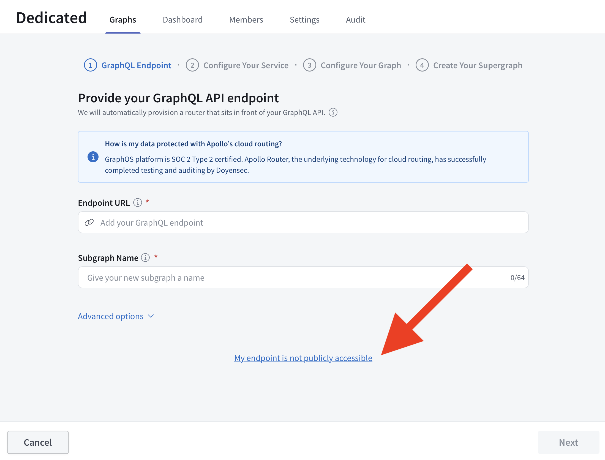
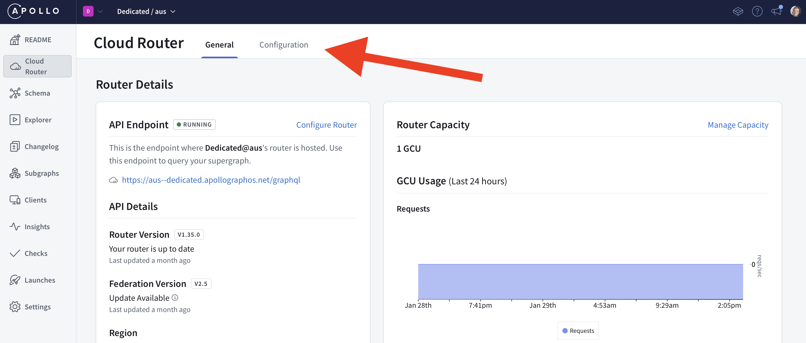
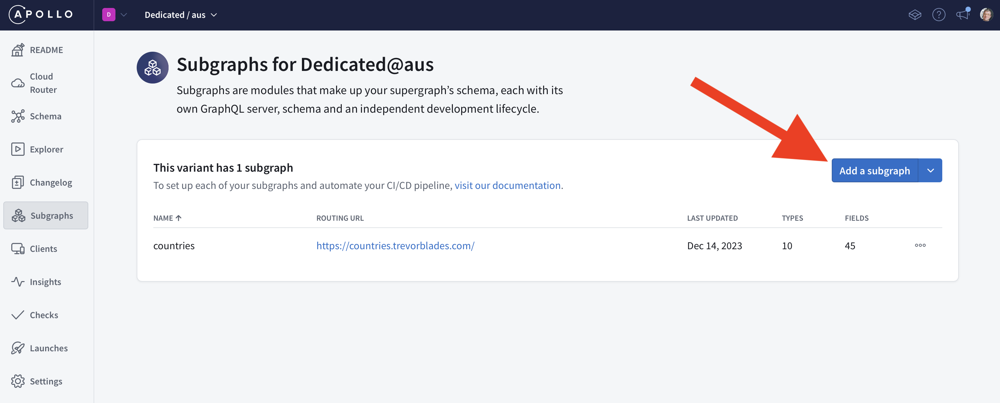
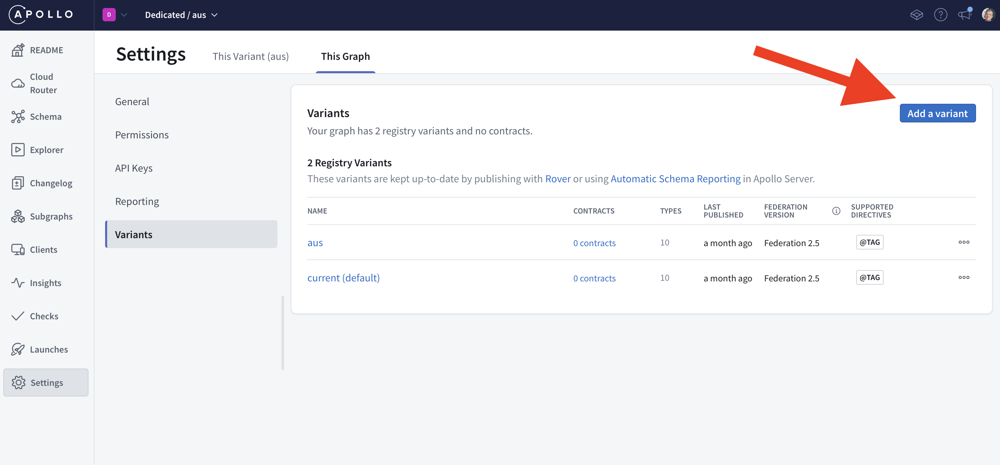

<PreviewFeature>

Cloud Dedicated is currently in invite-only [preview](/graphos/routing/cloud-dedicated#private-preview). Don't hesitate to <TrackableLink href="https://www.apollographql.com/contact-sales?type=dedicated&referrer=docs" eventName="content_contact_cloud">get in touch</TrackableLink> if you'd like to request access or have any questions or feedback.

</PreviewFeature>

Prerequisites:

- A GraphOS Studio account
- An organization on the Dedicated plan
- One or more existing GraphQL APIs

## 1. Create a new graph

To create a new Dedicated cloud router in the AWS region of your choice, you'll need to create a new graph in Studio. You can do this by choosing "Create New Graph" from the Graphs page.

## 2. Connect an API

If your subgraph URLs are publicly accessible, enter your API URL and name your subgraph.

If your subgraphs are not publicly accessible and require private networking, you can connect to them with (AWS VPC Lattice)[../lattice]. Select "My endpoint is not publicly accessible" to connect a VPC (see below).

## 3. Setup your graph

Dedicated cloud routers have a new UI for management and configuration. Head over to the Cloud Router page from the Studio navigation. From here, you can see a summary of your cloud router's settings. Use the "Configuration" tab to manage your Cloud Router's configuration. See the [Apollo Router](https://www.apollographql.com/docs/router/configuration/overview) docs for more information.

You'll also need to add each of your GraphQL APIs to your new Dedicated cloud router. Head over to the Subgraphs page from the Studio navigation.

<Note>

Each change you make to your router configuration and each change to your supergraph schema (eg: adding a subgraph) will result in a new cloud router deployment. These are deployed safely to minimize API degredation and downtime. As a result, new GCUs are provisioned and swaped over to once they're online. This process typically takes 1-2 minutes per change but may take up to 5 minutes.

</Note>

## 4. Test and validate

To test your graph is working as intended, head over to Explorer and run a sample query. You may want to enable subgraph error reporting if you run into issues.

Finally, we recommend running a load test to determine how much [throughput capacity](/graphos/routing/cloud-dedicated/throughput) you need to run your graph.

You may want to add additional variants to your graph. You can do that by going to Settings, This Graph, and Variants:

## 5. Go live

When you're ready to go live, you'll need to migrate clients to your new `apollographos.net` endpoint by either passing this to your clients directly or by configuring a reverse proxy. Support for custom domains will arive in 2024.
