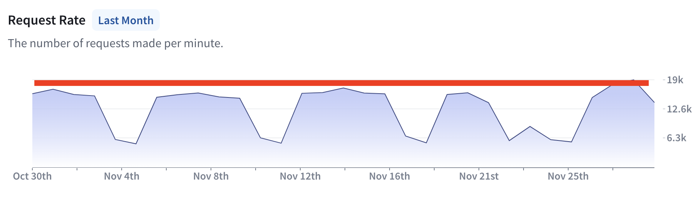
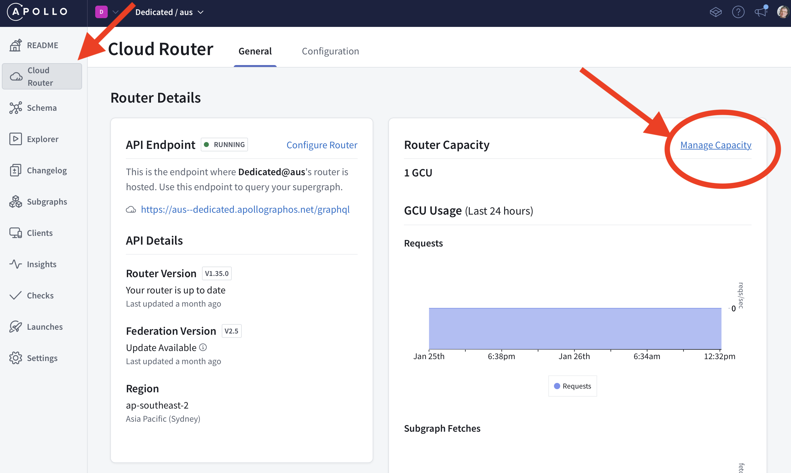
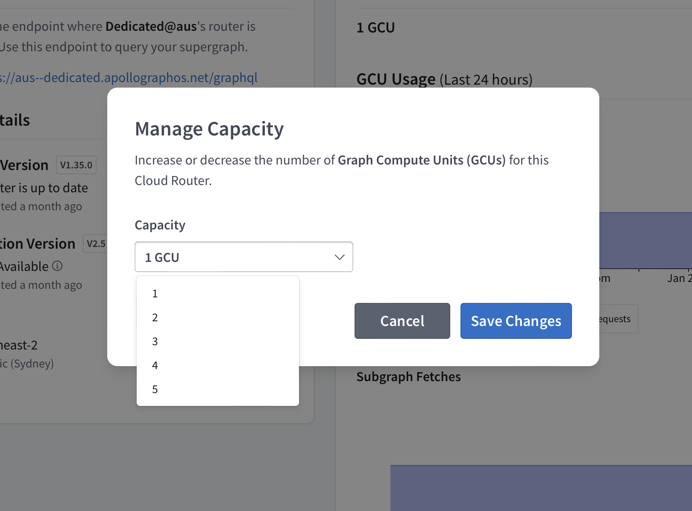

<PreviewFeature>

Cloud Dedicated is currently in invite-only [preview](/graphos/cloud-routing/dedicated#private-preview). Don't hesitate to <TrackableLink href="https://www.apollographql.com/contact-sales?type=dedicated&referrer=docs" eventName="content_contact_cloud">get in touch</TrackableLink> if you'd like to request access or have any questions or feedback.

</PreviewFeature>

From a single GCU, you can expect the following performance:

- 25 requests per second (RPS)
- 150 subgraph RPS
- Up to 0.5 megabytes of response data per second

GCU performance varies depending on your GraphQL workload and architecture. For example, queries that return large payloads may decrease throughput below the baseline 25 RPS. Conversely, queries that return small amounts of data from several subgraphs may achieve above the baseline 25 RPS. Apollo recommends load testing your GraphQL workload on Cloud Dedicated before going into production.

## How many GCUs do I need?

If you're already using GraphOS, go to Insights and look at the Request Rate chart. Request Rate is in requests per minute, so find the peak requests per minute (eg: 19,000) and divide by 60 to calculate requests per second. In this workload, the customer has a peak of 317 RPS. Assuming a GCU can serve 25 RPS, this workload would require at least 13 GCUs to operate properly.

## How do query complexity and response size affect throughput?

Beyond RPS, query complexity and repsonse size influence GCU throughput. For example, the following scenarios would decrease relative GCU throughput:

- Query plans that query more than 5 subgraphs
- Query plans that return 100s or 1,000s of fields per operation

This is because these types of operations require additional compute resources to execute. This may mean you need to add additional GCUs as query complexity or response size increases. GCUs include burst capacity, so the occassional complex or large query should be handled properly.

## Load testing

Before going into production on Dedicated, we highly recommend running a load test to simulate production traffic. For example, if you run a load test of 10% of a typical day's traffic and this runs well on a single GCU, you may need 10 x GCUs to serve a typical day.

Dedicated Trials are available to help you run a load test for free. <TrackableLink href="https://www.apollographql.com/contact-sales?type=dedicated&referrer=docs" eventName="content_contact_cloud">Contact us</TrackableLink> to start a trial.

## How do I scale Dedicated?

Dedicated supports mission-critical production workloads, and you can scale performance to meet the needs of your GraphQL APIs. Dedicated supports up to 40 x GCUs per GraphOS variant.

Dedicated starts with 1 x GCU when you create a new variant. You can add additional GCUs from the Cloud Router page in Studio:

Then, select the number of GCUs required and choose "Save".

## Are GCUs rate limited?

No. However, GCUs do offer a specific amount of throughput capacity. It's possible to temporarily burst GCU throughput for a few seconds. After this period, your clients will receive 429 errors. We recommend adding retry logic to your clients to minimize dropped requests.

Later this year, GraphOS Cloud will include the ability to forecast and estimate the number of GCUs you should use to run your Dedicated variant.
