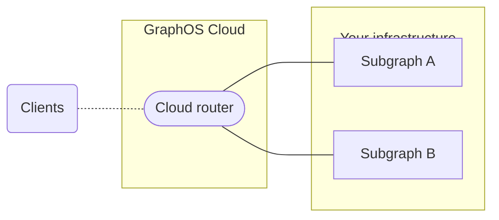
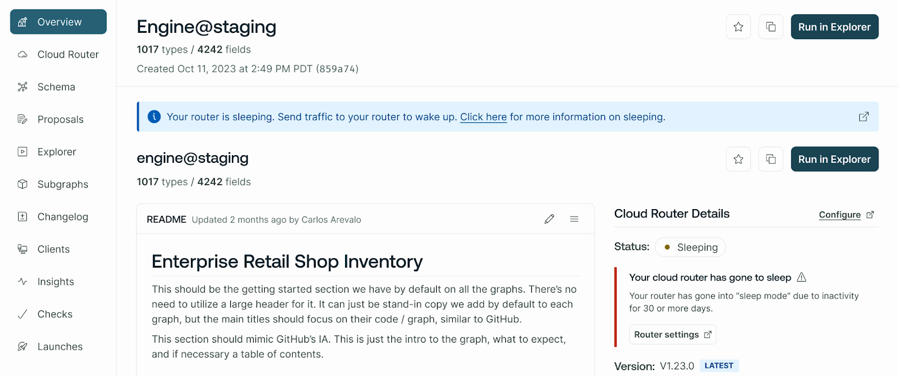

When you create a cloud supergraph with GraphOS Studio, GraphOS automatically provisions and manages a _cloud router_ that acts as an entry point to your GraphQL APIs. In this architecture, individual GraphQL APIs are called _subgraphs_.

Clients send operations to your router's public endpoint instead directly to your subgraphs.

GraphOS only hosts the runtime for your supergraph's cloud router. GraphQL servers for your subgraphs are still hosted in your infrastructure.

  <ButtonLink
    href="/graphos/quickstart/cloud/"
    style={{
      marginRight: '10px'
    }}
  >
    Create your first cloud supergraph
  </ButtonLink>

## Federation and subgraph compatibility

Cloud supergraphs use [Apollo Federation 2](/federation/) for their core architecture. [Many GraphQL server libraries](/federation/building-supergraphs/supported-subgraphs/) support Federation 2. Your GraphQL API doesn't already need to be using Apollo Federation to add it to a cloud supergraph.

## Cloud router types and availability

Cloud supergraphs are only available to organizations with Serverless and Dedicated plans.
They aren't available with Enterprise or legacy Free or Team plans.

Serverless cloud routers run on shared infrastructure. Dedicated cloud routers run on dedicated infrastructure that you control and scale.
See the [pricing page](https://www.apollographql.com/pricing/) for more information.

### Cloud router regions

Cloud routing for Serverless plans is only available in the us-east-1 AWS region. Dedicated cloud routers have a wider [variety of options](./dedicated#runs-on-aws). Region selection for cloud routers is only available on the Dedicated plan. <TrackableLink href="https://www.apollographql.com/contact-sales?type=dedicated&referrer=docs" eventName="content_contact_cloud">Contact Sales</TrackableLink> to learn more.

<Note>

Serverless cloud routers were previously hosted in Chicago, Illinois. [Learn more.](./serverless/aws-migration/#change-summary)

</Note>

## Cloud router status

You can see your cloud router's current status in the GraphOS Studio on the right side of your graph's **Overview** page under **Cloud Router Details**.

<Note>

Serverless routers have additional possible statuses, including **Sleeping** and **Deleted**. Learn more on the [Serverless overview page](./serverless/#serverless-router-status).

</Note>

| Status           | Description                                                                                                                                               |
| ---------------- | --------------------------------------------------------------------------------------------------------------------------------------------------------- |
| **Initializing** | Your cloud router is being created. This process may take up to five minutes. [Learn more.](#initializing)                                                |
| **Running**      | Your graph is operating normally.                                                                                                                         |
| **Error**        | Your cloud router is running, but a deployment recently failed. For more information on the failure, see the graph's **Launches** page in GraphOS Studio. |

### Initializing

Your router is provisioned automatically whenever you create a cloud supergraph in GraphOS Studio or whenever you create a new variant for an existing cloud supergraph. Each variant has its own distinct router.

When you first create a variant, the router provisioning process can take a few minutes. If this process hasn't completed yet for a particular variant, an **INITIATING ENDPOINT** label is shown at the top of the variant's page in Studio:

Once initialized, you can [configure your cloud router](./configuration).

## Cloud launches

Publishing a new subgraph schema or editing a cloud router's configuration triggers a new [launch](/graphos/delivery/launches/). Every launch automatically deploys new router instances for your graph. You can see a launch's details, including possible failures, from a graph's **Launches** page in GraphOS Studio.

<Note>

A router deployment might fail due to a platform incident or schema composition issues. To resolve this, try republishing your subgraph schema.

</Note>

## Router version updates

Apollo manages the version of Apollo Router deployed to cloud routers. It ensures that newly released versions are deployed within 30 days of release. Some minor and patch versions may be skipped.

Router releases go through rigorous testing before deployment on GraphOS Cloud. During the deployment of new versions, an Apollo engineer actively oversees the process and rolls back any cloud routers that fail to boot up. While some edge cases may arise—for example, a query planner update could result in slightly degraded performance—router updates should not disrupt your supergraphs.

<Note>

Opting out of router updates to cloud routers isn't currently supported. Advanced version management will be available in Dedicated in 2024.

</Note>

## Security and compliance

The entire GraphOS platform, including its cloud routing infrastructure, is SOC 2 Type 2 certified.
Secrets are encrypted both in transit and at rest.
Secrets are only available inside the runtime environment, and you have total control over when those secrets are resolved in configuration.

The Apollo Router (the underlying technology for cloud routing) has been [tested and audited by Doyensec](https://doyensec.com/resources/Doyensec_Apollo_Report_Q22022_v4_AfterRetest.pdf).

### GraphOS Cloud on AWS

GraphOS Cloud on AWS is a managed API solution. It runs the Apollo Router on AWS infrastructure to provide a high-performance, configurable GraphQL router.

[Download an overview of GraphOS Cloud on AWS security and compliance practices](https://www.apollographql.com/trust/request-security-report).
For more information on Apollo's compliance and security measures, visit the [Trust Center](https://www.apollographql.com/trust/compliance-and-security).
