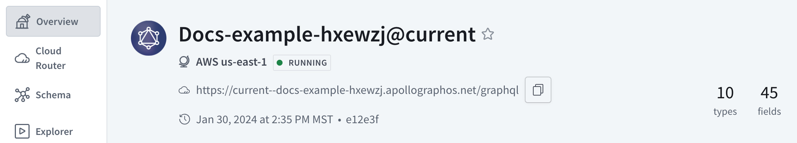

<Note>

This page only applies to Serverless cloud routers created before May 21, 2024. Serverless cloud routers created on or after this date automatically run on AWS.

</Note>

Serverless is switching cloud providers from Fly.io to AWS to improve reliability and performance.
Serverless cloud routers running on Fly.io infrastructure must be migrated in GraphOS Studio.

## Who needs to migrate?

You need to migrate if:

- Your organization is on a Serverless plan AND
- You have graphs created before May 21, 2024

Cloud routers on Fly.io will continue to operate until July 2, 2024. After this date, any cloud routers on Fly.io will be permanently deleted and graphs using them will no longer respond to requests.

You can check if any of your graphs need to be migrated from their **Overview** page in [GraphOS Studio](https://studio.apollographql.com?referrer=docs-content). If you see the migration alert, you need to migrate.

[To-do: add screenshot of migration banner]

<Tip>

Don't hesitate to contact [cloud@apollographql.com](mailto:cloud@apollographql.com) with any migration questions or concerns.

</Tip>

## What's changing?

Along with improved reliability and performance, the move to AWS also includes changes to hosting region and inactivity periods.
With improved reliability and performance, Serverless can offer additional GraphOS router features. Refer to the [pricing page](https://www.apollographql.com/pricing#graphos-router) for the full list of supported features.

### Reliable throughput

On AWS, Serverless cloud routers will be able to process a consistent 10 requests per second (RPS) of throughput. Cloud routers will also be able to consistently support larger schemas.

<Note>

If you need more than 10 RPS throughput or have [complex schemas](./#serverless-compute-limitations), consider upgrading to Dedicated.

</Note>

### Hosting region

On Fly.io, cloud routers were hosted in Chicago. On AWS, they will be hosted in us-east-1. This means faster performance, particularly for customers running subgraph servers on AWS, especially if they are in or near us-east-1.

<Note>

Dedicated offers a [wider variety of AWS regions](../dedicated#runs-on-aws).

</Note>

### Inactivity periods

On Fly.io, Serverless cloud routers sleep after two minutes of inactivity. Sleeping routers can't serve requests and must wake up to do so. On AWS, cloud routers sleep after seven days of inactivity.

After an additional 30 days of inactivity, Apollo deletes Serverless cloud routers.
Deletion preserves a cloud router's associated variant's schema but deletes the underlying cloud router. Learn more in [Serverless router status](./#serverless-router-status).

|                                        | Fly.io Hosted | AWS Hosted |
| -------------------------------------- | ------------- | ---------- |
| Inactivity period  before sleep    | 2 minutes     | 7 days     |
| Inactivity period  before deletion | 60 days       | 37 days    |

## How to migrate

Apollo is unable to offer an in-place migration. To migrate, you need to create a new variant on your graph, or create a new graph entirely. Once you create this new variant or graph, you will receive a new graph ref and endpoint URL which you can redirect your client traffic to.

<Caution>

Don't delete the variant that houses your existing cloud router until you've created a new one.

</Caution>

<!-- vale Apollo.Headings = NO -->

### Step 1. Create a new graph

To get started, create a new graph or variant in GraphOS Studio. You need at least one subgraph during this process. See the [getting started](/graphos/quickstart/cloud/#from-an-existing-account) for details on creating a new graph.

Creating a new graph or variant generates a new graph ref and endpoint URL. You need to update these values wherever you use them. This includes the graph ref in your Rover commands and endpoint URL in your client codebase.

### Step 2. Add subgraphs

If you have multiple subgraphs, [add each subgraph](/graphos/quickstart/next-steps/#add-another-subgraph) to your new variant.

### Step 3. Setup router configuration

Copy and paste your old router's configuration into your new one. You can access a Serverless cloud router configuration in GraphOS Studio under **Settings > Cloud Router > Router configuration YAML**.

Router configuration defines important values like CORS policies and header propagation.

<Note>

If you have [secrets](../configuration/#managing-secrets) in your old cloud router config, you must also set them in your new one. Secrets can't be read once saved.

</Note>

### Step 4. Test

After you've added all your subgraphs and set up your cloud router config, try running a few sample operations from [Explorer](../../explorer/).
You may need to enable [subgraph errors](/graphos/cloud-routing/configuration#subgraph-error-inclusion) to troubleshoot if your operations don't execute.

Simulate production traffic before going live. With extremely complex schemas or operations, Serverless on AWS may offer less throughput than Fly.io. If you exceed throughput limits, your clients will receive 429 errors.

<Note>

It isn't possible to increase throughput on Serverless. Consider upgrading to [Dedicated](../dedicated/).

</Note>

### Step 5. Go live

To go live, update the endpoint URL your clients use to query your supergraph. You can see your new router's endpoint from the **Overview** page of your variant.

<!-- vale Apollo.Headings = YES -->
