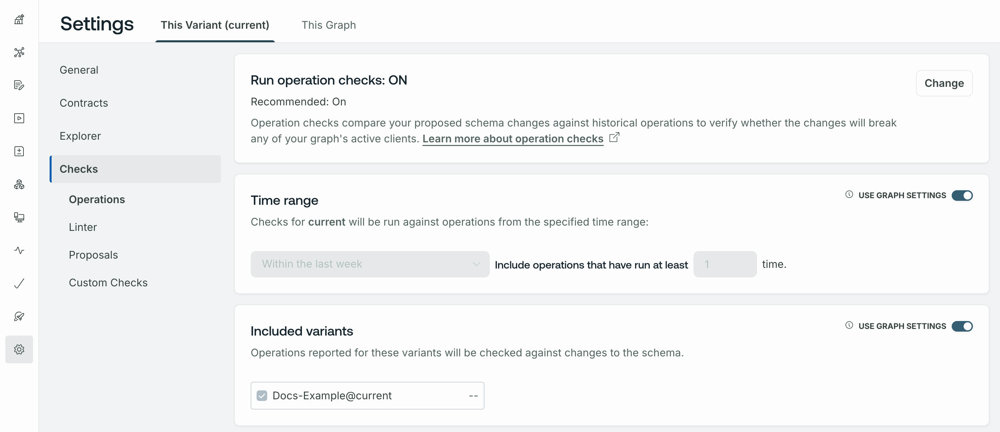

You can configure schema checks behavior to suit your use case using either GraphOS Studio or the Rover CLI. For example, you can:

- Exclude past operations executed by a particular client, such as a client you only use for testing.
- Exclude past operations that were executed relatively infrequently.
- Check schema changes against multiple graph variants.
- Ignore changes to default values.
- Ignore potentially breaking changes when an operations check runs against zero operations.
- Change the [severity level](./schema-linter/#setting-severity-levels) of linter rules.

## Using GraphOS Studio (recommended)

In [GraphOS Studio](https://studio.apollographql.com?referrer=docs-content), you can configure default rules that are applied to every executed schema check.
You define these rules from the **Configuration** tab of your variant's **Checks** page:



### Configuration options

You configure operations, linter, and proposals checks.

#### Operations check configurations

- Whether operations checks are included in check runs. (On by default.)
- **Time range**: Include all distinct operations executed within this range. The default value is 7 days ("Within the last week").
  - **Operation count threshold**: Exclude all operations executed fewer than this number of times within the specified **time range**.
- **Included Variants**: Include all distinct operations executed against each selected variant of your graph. The default value is **Base variant**—whichever variant schema checks are being run against.
- **Excluded Clients**: Exclude all operations executed by particular clients, such as clients used exclusively for development and testing.
- **Excluded Operations**: Exclude specific named operations.
- **Ignored Conditions**: Ignore certain kinds of schema changes. [Learn more.](./run-checks/#ignored-conditions-settings)

#### Linter check configurations

Configurations include whether to include linter checks (on by default), approved `@tag` names, and [severity level](./schema-linter/#setting-severity-levels) of linter rules.
See [Linter configuration](./schema-linter/#linter-configuration) for details.

#### Proposals check configurations

You can configure schema checks to include a Proposals task that verifies whether the schema changes a check is running on have matching and approved schema proposals.
(Off by default.) [Learn more.](./schema-proposals/configuration#configure-schema-checks)

## Using the Rover CLI

You can customize a single schema check run by providing options to the Rover CLI. If you've also [configured default rules](#using-graphos-studio-recommended) for schema checks, any command-line options you provide take precedence over those rules.

### Validation period

You can provide the `--validation-period` option to specify how far back in time Studio should look when determining the compatibility of past operations with the changes to your schema (by default, the command uses the last 7 days of operations).

This command checks schema changes against the past two weeks of operations:

```bash showLineNumbers=false
rover subgraph check docs-example-graph@current \
  --name products \
  --schema ./schema.graphql \
  --validation-period="2 weeks"
```

Valid durations are represented as any combination of `months`, `weeks`, `days`, `min`, and `sec`:

- `1 month 2 weeks`
- `525600 min`

<Note>

If you specify a `--validation-period` that exceeds your organization's operation retention period, the `subgraph check` command fails with an error.

</Note>

### Threshold values

You can provide _threshold values_ to Rover to ignore historical operations that are relatively rare.

For example, you might want to discontinue support for an old version of your client that uses deprecated fields. You can set threshold values to determine when an acceptably small number of users are using the outdated client, thus reducing the impact of discontinuing support.

Provide threshold values with the following flags:

- `--query-count-threshold` - Check your schema only against operations that have been executed at least the specified number of times within the specified duration.
- `--query-percentage-threshold` - Check your schema only against operations that account for at least the specified percentage of all operations against the graph within the specified duration. For example, specify `3` to set this threshold to 3%.

<Note>

You can provide values for both of these flags. If you do, an operation must meet or exceed both thresholds for schema checks to include it.

</Note>

Here's an example of running `rover subgraph check` with threshold values:

```bash showLineNumbers=false
rover subgraph check docs-example-graph@current \
  # Path to schema file
  --schema ./schema.graphql
  # Name of subgraph with schema updates
  --name products
  # Check the schema against operations that have run in the last 5 days
  --validation-period="5 days" \
  # Only check against operations that have run at least 5 times during the 5-day duration
  --query-count-threshold=5 \
  # Only check against operations that account for at least 3% of total operation volume
  --query-percentage-threshold=3
```

To request other filtering or threshold mechanisms, please get in touch with us on the [Rover repository](https://github.com/apollographql/rover).

### Checking against multiple environments

You might want to check schema changes against multiple environments, such as production, staging, and beta. Each of these environments might have a slightly different schema to support features that are experimental or in active development. In GraphOS, these schemas are represented as variants of a single graph.

You specify which variant you want to check against in the [graph ref](/rover/conventions/#graph-refs) you provide to `rover subgraph check`:

```bash showLineNumbers=false
rover subgraph check docs-example-graph@staging \
  --name products \
  --schema ./schema.graphql
```

The graph ref `docs-example-graph@staging` specifies the `staging` variant of the `docs-example-graph` graph.

To check your schema against multiple variants, call `rover subgraph check` once for each variant.
