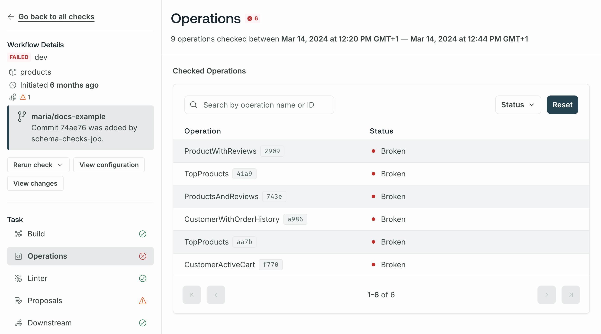

This guide covers how to run your first schema check, integrate checks into your CI pipeline, and configure checks for your organization's use cases.

## Prerequisites

To enable schema checks for your supergraph:

1. Make sure you've published all your subgraph schemas to GraphOS and that those schemas are up to date. [Learn how to publish schemas.](./)
2. For operations checks, make sure your supergraph is sending operation metrics to GraphOS. GraphOS uses historical metrics to determine whether a potentially dangerous schema change is safe.

   - If you have a [cloud supergraph](../graphs/#cloud-supergraphs), your router reports metrics automatically.
   - [See setup for other graph types.](../metrics/sending-operation-metrics/)

   <Note>

   If GraphOS has no operation metrics to compare against, all potentially dangerous schema changes result in a failed check.

   </Note>

3. [Install the Rover CLI](/rover/getting-started/) in your development environment and [authenticate it with GraphOS](/rover/configuring/#authenticating-with-graphos).

## Running checks

Let's say you've made local changes to one of your subgraph schemas. After you [complete the prerequisites](#prerequisites), you can run schema checks against those changes with the `rover subgraph check` command.

<Note>

If you have a [monograph](../graphs/#monographs), use [`rover graph`](/rover/commands/graphs/#validating-schema-changes) commands instead of `rover subgraph` commands.

</Note>

The `rover subgraph check` command looks something like this:

```bash showLineNumbers=false
rover subgraph check \
  docs-example-graph@main \
  --name products \
  --schema ./schema.graphql
```

It requires the following:

- Your registered graph's graph ref, which a string with the format `graph-id@variant-name` (for example, `docs-example-graph@main`). This is available from your supergraph's README page in GraphOS Studio.
- The name of the subgraph with schema changes.
- The locally modified version of your schema. In the command above, the schema is provided via a `.graphql` file.

  - If your schema is not in a standalone `.graphql` file, you can run your GraphQL server locally and pipe its schema directly from `rover graph introspect`, like so:

    ```bash showLineNumbers=false

    rover subgraph introspect http://localhost:4000 \
     | rover subgraph check docs-example-graph@main \
     --name products \
     --schema -

    ```

Try changing something in the local version of your schema and see what happens! If everything is set up correctly, the command's output looks similar to the output shown in [the check response](#the-check-response).

### The checks lifecycle

When you run `rover subgraph check`:

1. GraphOS generates a diff between your local schema and the published schema for the variant you're checking against.
2. GraphOS uses this diff to determine whether the changes affect any operations that have been executed against your supergraph within a [customizable time window](./check-configurations/) (by default, this is the last seven days).
3. GraphOS returns the diff, along with a list of operations affected by the changes.
4. Rover prints the check result and returns a non-zero exit code if at least one breaking change is found. You can also view the check result in the Studio UI.

#### The check response

Running `rover subgraph check` outputs the diff of all detected schema changes and highlights breaking changes. For example:

```console
$ rover subgraph check docs-example-graph@current --subgraph products --schema ./schema.graphql

Validated the proposed subgraph against metrics from docs-example-graph@current
Compared 1 schema changes against 24 operations
┌────────┬────────────────────┬─────────────────────────────────────────────────────────┐
│ Change │        Code        │                       Description                       │
├────────┼────────────────────┼─────────────────────────────────────────────────────────┤
│ PASS   │ FIELD_CHANGED_TYPE │ field `Query.books`: type `[Book]` changed to `[Book!]` │
└────────┴────────────────────┴─────────────────────────────────────────────────────────┘

View full details at https://studio.apollographql.com/service/docs-example-graph/checks/<DETAILS>
```

Each change to the schema is labeled either `PASS` or `FAIL`. For a complete list of schema changes codes, see the [Reference](./checks-reference#schema-change-types).

<Note>

Because breaking changes are detected by analyzing recent operations, your graph must [report metrics to GraphOS](#prerequisites) for schema checks to work. If there are no operation metrics to compare against, all potentially dangerous schema changes are labeled `FAIL`.

</Note>

The `rover subgraph check` command returns a nonzero result if any check fails.

The output includes a Studio URL that provides full details on the changes and their impact on existing clients and operations:



If you've [integrated schema checks with your GitHub PRs](#integrating-with-github), the **Details** link in your GitHub check takes you to this same details page.

If you run a check within a Git repository, `rover subgraph check` sends both the commit hash and that hash's author to GraphOS to display on the check. If you haven't [integrated schema checks with GitHub](#integrating-with-github), the author appears as **Unknown**. If you want to override author, commit, or other values, you can [set environment variables in Rover](/rover/configuring/#overriding) to do so.

### Rerunning checks

You can rerun checks from GraphOS Studio. Select the check and click **Rerun check**.


The new checks run incorporates any changes made to excluded or included clients, checked variants, and any operations marked as safe or ignored.

The new run uses the current [check configuration options](#configuring-checks), regardless of the configuration at the time of the original run. Similarly, the new run's time window is based on the current time, not when the original check ran.

<Note>

If you've [integrated schema checks with your GitHub PRs](#integrating-with-github), a rerun of the check also updates the status of the check in GitHub.

</Note>

### Overriding flagged changes

Occasionally, schema checks might flag a change that you know is safe. For example, you might change an input type's field from nullable to non-nullable (usually a breaking change) when you're certain that your clients never provide a null value for the field.

You can override flagged changes on an operation-by-operation basis or update your check settings to ignore certain kinds of changes.

<Note>

If you use the GraphOS Router to [report operation metrics](../metrics/sending-operation-metrics), you can configure extended reference reporting for more accurate operations checks. [Learn more.](/router/configuration/overview/#extended-reference-reporting)

</Note>

#### Override changes per operation

[**Org admins** and **Graph admins**](../org/members) can override flagged changes on an operation-by-operation basis in GraphOS Studio.
From the associated check's details page, select the **Override** dropdown under a flagged operation:


For each operation with flagged changes, you can override those changes in the following ways:

- **Mark change as safe**: In this case, schema checks will not flag these exact changes for the operation in any future execution. This effectively "approves" the changes for the operation.
  - If a future check detects approved changes along with new unsafe changes to the operation, the new unsafe changes will be flagged.
- **Ignore the operation**: In this case, schema checks will completely ignore the operation when checking all changes in any future execution.
  - This option is useful when you know an operation originates only from clients or client versions you don't actively support.

You can **Undo** an override from the banner that appears on any overridden operations.


#### Ignored conditions settings

You can update your check settings so operations checks don't flag the following kinds of changes:

- **Ignore breaking changes when there are no operations**: Turning this setting on ignores any potentially breaking changes when an operations check is run against zero operations.
- **Ignore default value changes**: Turning this setting on ignores any changes to default values.

  <Note>
    This setting ignores default values changes but doesn't ignore default value
    removals.
  </Note>

You enable these settings from the **Configuration** tab of your variant's **Checks** page.
Learn about other [checks settings](#configuring-checks).

## Using in CI

Schema checks are especially useful when you add them to your CI pipeline such as Jenkins or CircleCI. By doing so, you can obtain check results and display them directly on your team's pull requests.

We recommend defining a separate CI job for each [variant of your schema](#checking-against-multiple-environments) (production, staging, etc.) that you want to validate your changes against. The `rover subgraph check` command returns a non-zero exit code when it detects a breaking change, meaning the job fails when the check fails.

### Authenticating Rover

The `rover config auth` command is interactive, which means you shouldn't use it in CI environments. Instead, you can authenticate Rover with Studio by setting the `APOLLO_KEY` environment variable in CI. For details, see [Configuring Rover](/rover/configuring).

### Example CI configuration

The following config defines a schema check job for a CircleCI pipeline. Your config's syntax varies depending on your CI tool, but the job's steps are the same.

```yaml {30} title="config.yml"
version: 2

jobs:
  # ...other jobs...

  # Define a separate job for each environment you validate against.
  check_against_staging:
    docker:
      - image: circleci/node:12

    steps:
      - checkout

      - run: npm install

      # Start the GraphQL server. If a different command is used to
      # start the server, use it in place of `npm start` here.
      - run:
          name: Starting server
          command: npm start
          background: true

      # Make sure the server has enough time to start up before running
      # commands against it.
      - run: sleep 5

      # In CI environments, this command authenticates via the `APOLLO_KEY`
      # environment variable.
      - run: rover subgraph check docs-example-graph@current --name products --schema ./schema.graphql
```

## Configuring checks

After you enable schema checks for your graph, you can customize their behavior to suit your use case. For example, you can:

- Exclude past operations that were executed by a particular client, such as a client that you only use for testing
- Exclude past operations that were executed relatively infrequently
- Check schema changes against multiple graph variants
- Ignore changes to default values
- Ignore potentially breaking changes when an operations check runs against zero operations

### Using GraphOS Studio (recommended)

In [GraphOS Studio](https://studio.apollographql.com?referrer=docs-content), you can configure default rules that are applied to every executed schema check. You define these rules from the **Configuration** tab of your variant's **Checks** page:


#### Configuration options

- **Time range**: Include all distinct operations that were executed within this range. The default value is 7 days ("Within the last week").
  - **Operation count threshold**: Exclude all operations that were executed fewer than this number of times within the specified **time range**.
- **Included Variants**: Include all distinct operations that were executed against each selected variant of your graph. The default value is "Base variant" (that is, whichever variant schema checks are being run against).
- **Excluded Clients**: Exclude all operations that were executed by particular clients, such as clients used exclusively for development and testing.
- **Excluded Operations**: Exclude specific named operations.
- **Ignored Conditions**: Ignore certain kinds of schema changes. [Learn more.](./schema-checks/#ignored-conditions-settings)

### Using the Rover CLI

You can customize a single run of schema checks by providing options to the Rover CLI. If you've also [configured default rules](#using-graphos-studio-recommended) for schema checks, any command-line options you provide take precedence over those rules.

#### Validation period

You can provide the `--validation-period` option to specify how far back in time Studio should look when determining the compatibility of past operations with the changes to your schema (by default, the command uses the last 7 days of operations).

This command checks schema changes against the past two weeks of operations:

```bash showLineNumbers=false
rover subgraph check docs-example-graph@current \
  --name products \
  --schema ./schema.graphql \
  --validation-period="2 weeks"
```

Valid durations are represented as any combination of `months`, `weeks`, `days`, `min`, and `sec`:

- `1 month 2 weeks`
- `525600 min`

<Note>

If you specify a `--validation-period` that exceeds your organization's operation retention period, the `subgraph check` command fails with an error.

</Note>

#### Threshold values

You can provide _threshold values_ to Rover to ignore historical operations that are relatively rare.

For example, you might want to discontinue support for an old version of your client that uses deprecated fields. You can set threshold values to determine when an acceptably small number of users are using the outdated client, thus reducing the impact of discontinuing support.

Provide threshold values with the following flags:

- `--query-count-threshold` - Check your schema only against operations that have been executed at least the specified number of times within the specified duration.
- `--query-percentage-threshold` - Check your schema only against operations that account for at least the specified percentage of all operations against the graph within the specified duration. For example, specify `3` to set this threshold to 3%.

<Note>

You can provide values for both of these flags. If you do, an operation must meet or exceed both thresholds for schema checks to include it.

</Note>

Here's an example of running `rover subgraph check` with threshold values:

```bash showLineNumbers=false
rover subgraph check docs-example-graph@current \
  # Path to schema file
  --schema ./schema.graphql
  # Name of subgraph with schema updates
  --name products
  # Check the schema against operations that have run in the last 5 days
  --validation-period="5 days" \
  # Only check against operations that have run at least 5 times during the 5-day duration
  --query-count-threshold=5 \
  # Only check against operations that account for at least 3% of total operation volume
  --query-percentage-threshold=3
```

To request other filtering or threshold mechanisms, please get in touch with us on the [Rover repository](https://github.com/apollographql/rover).

#### Checking against multiple environments

You might want to check schema changes against multiple environments, such as production, staging, and beta. Each of these environments might have a slightly different schema to support features that are experimental or in active development. In GraphOS, these schemas are represented as variants of a single graph.

You specify which variant you want to check against in the [graph ref](/rover/conventions/#graph-refs) you provide to `rover subgraph check`:

```bash showLineNumbers=false
rover subgraph check docs-example-graph@staging \
  --name products \
  --schema ./schema.graphql
```

The graph ref `docs-example-graph@staging` specifies the `staging` variant of the `docs-example-graph` graph.

To check your schema against multiple variants, call `rover subgraph check` once for each variant. Doing so results in status checks similar to the following:


## Integrating with GitHub

If you're using GitHub, you can install the [Apollo Studio GitHub app](https://github.com/marketplace/apollo-studio#pricing-and-setup). This app enables GraphOS to send a webhook back to your GitHub project on each call to `rover subgraph check`, providing built-in pass/fail status checks on your pull requests:


### Integrating with other version control services

If you're using GitHub Enterprise, Bitbucket, or another version control service, we recommend setting up your CI tool to post a comment on each pull request with the results of schema checks. By surfacing schema diffs and breaking changes directly in your PR, you can avoid searching your CI logs to determine why a check failed.
