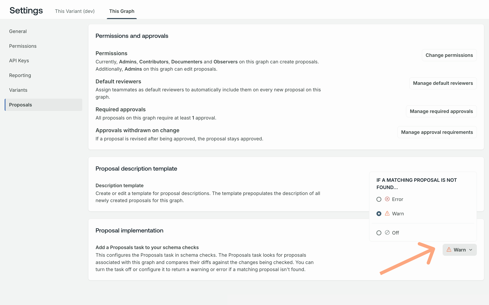

<GraphOSEnterpriseRequired />

[Org and graph admins](../org/members/#organization-wide-member-roles) can configure the following aspects of schema proposals:

- Which [roles can create and edit proposals](#configure-permissions-and-approvals)
- Which team members are [default reviewers](#default-reviewers) and whether [default reviewer approval is required](#require-default-reviewer-approval)
- The [minimum number of approvals](#required-approvals) required for a proposal to achieve [**Approved** status](./schema-proposals#proposal-statuses)
- Whether and how [schema checks incorporate proposals](#configure-schema-checks)
- [Coming soon] Whether to [mute email notifications](#mute-notifications) from proposal activty

<Note>

Schema proposal configurations are on a **per-graph** basis&mdash;not per-organization or per-proposal. This includes [muting notifications](#mute-notifications), which are on a per-teammate, per-graph basis.

</Note>

## Configure permissions and approvals

[Permissions](/graphos/org/members) for proposal actions are set at the graph level with the following defaults:

|                        | Org Admin | Graph Admin | Contributor | Observer / Documenter | Consumer |
| :--------------------- | :-------: | :---------: | :---------: | :-------------------: | :------: |
| Change proposal status |     ✓     |      ✓      |             |                       |          |
| Create proposals       |     ✓     |      ✓      |      ✓      |           ✓           |          |
| Edit proposals         |     ✓     |      ✓      |      ✓      |           ✓           |          |
| Add reviewers          |     ✓     |      ✓      |      ✓      |           ✓           |          |
| View proposals         |     ✓     |      ✓      |      ✓      |           ✓           |    ✓     |
| Make comments          |     ✓     |      ✓      |      ✓      |           ✓           |    ✓     |
| Approve proposals      |     ✓     |      ✓      |      ✓      |           ✓           |    ✓     |

[Org and graph admins](../org/members/#organization-wide-member-roles) can configure which roles can create, edit, and approve proposals. Permissions for other proposal actions are not configurable.

Permissions and other configurations are available on a graph's **Settings** page in [GraphOS Studio](https://studio.apollographql.com?referrer=docs-content).

Refer to the [configuration reference table](#configuration-reference) below for default and valid values.

### Configuration reference

[Org and graph admins](../org/members/#organization-wide-member-roles) can set the following proposal configurations on a graph's **Proposals** tab on **Settings** page in [GraphOS Studio](https://studio.apollographql.com?referrer=docs-content).

<table class="field-table">
  <thead>
    <tr>
      <th style="min-width: 175px">Configuration/   Default value</th>
      <th>Description</th>
      <th>Valid values</th>
    </tr>
  </thead>

<tbody>

<tr>

<td>

##### Permissions

Defaults:

Create: `Observers`

Edit: `Admins`

</td>

<td>

The _minimum_ [roles](../org/members/#organization-wide-member-roles) required to create or edit proposals.

 

`Observers` is the least restrictive setting and `Admins` the most restrictive.

The `Observers` default for creating proposals means all organization members except Consumers and Billing Managers can create proposals.
The `Admins` default for editing proposals means only org and graph admins can edit proposals they didn't create.

_Proposal authors can always edit their own proposals regardless of their role._

</td>

<td>

`Admins`, `Contributors`, `Documentors`, and `Observers`

</td>

</tr>
<tr>
<td>

##### Default reviewers

Default: `None`

</td>
<td>

The team members automatically marked as reviewers once a proposal's status becomes [**Open for feedback**](./schema-proposals#proposal-statuses).

</td>

<td>

Any member of your organization can be a default reviewer except for [billing managers](../org/members/#organization-wide-member-roles).

</td>

</tr>

<tr>
<td>

##### Required approvals

Default: `3`

</td>
<td>

The minimum number of approvals a proposal must receive for its status to become [**Approved**](./schema-proposals#proposal-statuses).

</td>

<td>

1 - 6

</td>

</tr>

</tbody>
</table>

<Note>

Changing the number of required approvals updates the status of existing proposals that aren't [**Closed** or **Implemented**](./propose-changes#change-proposal-status) based on whether their current number of approvals meets the new number of required approvals.

</Note>

### Require default reviewer approval

By default, _any_ team member's approval can contribute to the [minimum number of required approvals](#required-approvals).
Once you've added [**default reviewers**](#default-reviewers), you can require _at least one_ approval to come from a default reviewer by selecting **Require at least one default reviewer's approval**.

## Configure schema checks

You can configure [schema checks](./schema-checks) to include a **Proposals** task that verifies whether the changes a check is running on have matching and approved schema proposals.

By default, the severity of this task is **Off**. You can select from the following severity levels:

- With the severity set to **Off**, the proposals task isn't part of the checks that changes must pass for the check to succeed.
- Setting the severity to **Error** means the proposals task fails when the change being checked isn't included in approved proposals.
- Setting the severity to **Warning** means the proposals tasks can still pass even when the change being checked isn't included in approved proposals. However, warnings appear in the check run.

Integrating the Proposals task into schema checks strengthens schema governance when [publishing changes](./schema-proposals#proposal-process).
See the [Implement approved proposals](./implement-proposals) article for more information on how to use schema checks as part of your proposal process.

## Mute notifications

By default, all team members receive email notifications for the following:

- If you're selected as a reviewer on a proposal, whether because you are a [default reviewer](#default-reviewers), or you've been manually selected
- Whenever you are @mentioned in a comment

Additionally, the following roles receive email notifications for the following proposal actions:

|                 | Comments | Saved Revisions | Status Changes | Reviews   |
|-----------------|----------|-----------------|----------------|-----------|
| Proposal author | ✔️        | ✔️               | ✔️              | ✔️         |
| Commenter       | ✔️ **     | ❌              | ❌             | ❌        |
| Reviewer        | ❌       | ✔️               | ❌             | ❌        |
| Proposal editor | ❌       | ❌              | ❌             | ❌        |

<Note>

\*\*Commenters only receive notifications for new comments on threads that they commented on. They don't receive notifications for all new comments on a proposal.

</Note>

Notifications are cumulative. For example, if you comment on a particular thread and review a proposal, you get notifications for both new comments on the thread and saved revisions.

Notifications are enabled by default. To mute your notifications, go to a proposal's Overiew page and click the bell icon.

A modal appears where you can select to mute your notifications. To re-enable them, click the same bell icon.

<Note>

Notifications are enabled or muted on a per-team member, per-graph basis. 

</Note>