<EnterpriseFeature />

<Note>

The GraphOS Studio steps below require an organization member with the **Org Admin** or **Graph Admin** role. [Learn about member roles.](../org/members/)

</Note>

## Create contracts

### Prerequisites

#### Update your router and subgraphs

Before you create any contracts:

1. If you're using Apollo Server:

   - For Federation 2 contract variants, update your Apollo Server subgraphs to version 2.0.0 or later of the `@apollo/subgraph` library.
   - For Federation 1 contract variants, update `@apollo/subgraph` to version 0.1.1 or later.

<Note>

`@apollo/subgraph` replaced `@apollo/federation` for Apollo Server instances acting as subgraphs. Symbol names are unchanged.

</Note>

2. If you're using the `@apollo/gateway` library instead of the Apollo Router:

   - For Federation 2 contract variants, update your gateway's `@apollo/gateway` library to version 2.0.2 or later.
   - For Federation 1 contract variants, update your gateway's `@apollo/gateway` library to version 0.34.0 or later.

<Note>

Apollo recommends the Apollo Router over `@apollo/gateway` because it [significantly improves performance and security](https://www.apollographql.com/blog/announcement/backend/apollo-router-our-graphql-federation-runtime-in-rust/).
If you have a federated graph currently using `@apollo/gateway`, you can move to the Apollo Router without changing any other part of your graph. See the [migration guide](/router/migrating-from-gateway/).

</Note>

Older versions of the above libraries and tools don't fully support the required `@tag` directive.

#### (Fed1 only) Enable variant support for `@tag`

<Note>

This step is required for Federation 1 supergraphs only. If you have a Federation 2 supergraph, proceed to [the next step](#1-add-tags-to-subgraph-schemas).

</Note>

A contract uses one of your graph's existing [variants](/graphos/graphs/#variants) (called the **source variant**) to generate its contract schema. If your source variant uses Federation 1, you need to enable its support for the `@tag` directive in [GraphOS Studio](https://studio.apollographql.com?referrer=docs-content):

1. Open the Settings page for the variant you want to use as your source variant, then select the **This Variant** tab:

   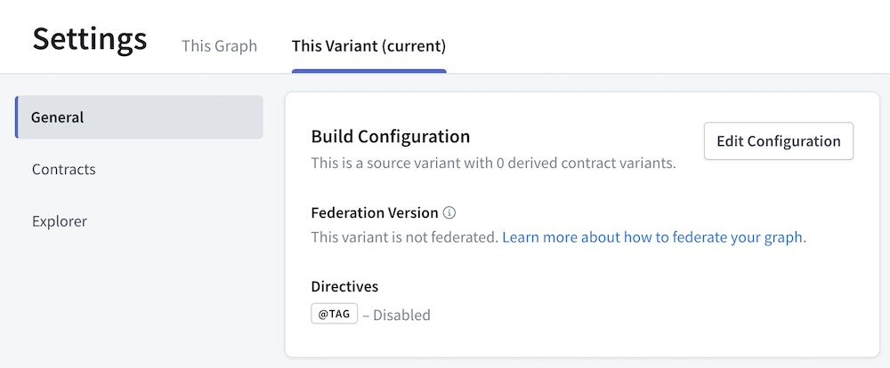

2. In the **Build Configuration** section, click **Edit Configuration** and enable support for `@tag`.

### 1. Add `@tag`s to subgraph schemas

With contracts, you apply the `@tag` directive to types and fields in your subgraph schemas to indicate whether to include or exclude them from your **contract schema**.

Before you can add `@tag`s, you need to define the directive in your subgraph schema. The way you do this depends on which federation version you're using:

<ExpansionPanel title="Federation 1">

Add the following definition to each of your subgraph schemas:

```graphql
directive @tag(
  name: String!
) repeatable on FIELD_DEFINITION | INTERFACE | OBJECT | UNION
```

</ExpansionPanel>

<ExpansionPanel title="Federation 2">

Add the `@tag` directive to your subgraph schema's Federation 2 `import` array:

```graphql {3}
extend schema
  @link(
    url: "https://specs.apollo.dev/federation/v2.0"
    import: ["@key", "@tag"]
  )
```

</ExpansionPanel>

For example, let's take a look at this Federation 2 subgraph schema:

```graphql {8,13} title="products.graphql" disableCopy=true
extend schema
  @link(
    url: "https://specs.apollo.dev/federation/v2.0"
    import: ["@key", "@tag"]
  )

type Query {
  topProducts: [Product!]! @tag(name: "partner")
}

# All fields of the Product object type automatically inherit
# the "partner" tag so we can avoid tagging them individually
type Product @key(fields: "upc") @tag(name: "partner") {
  upc: ID!
  name: String!
  description: String!
  # highlight-start
  internalId: ID! @tag(name: "internal")
  percentageMatch: Float! @tag(name: "experimental")
  # highlight-end
}
```

This schema applies the `@tag` directive to the following locations:

- The `Query.topProducts` field (which returns a list of `Product`s)
- The `Product` object type
- Two fields of `Product` (`internalId` and `percentageMatch`)

Each `@tag` has a string `name`. You tag types and fields with the _same_ `name` if they should be included or excluded as a group by a particular contract.

<Tip>

For in-depth details on valid `@tag` usage, see [Rules for `@tag`s and contracts](./contract-reference#rules-for-tags-and-contracts).

</Tip>

Whenever GraphOS composes your source variant's [supergraph schema](/federation/federated-types/overview), that schema retains all the `@tag`s from your subgraph schemas. Composition removes some other directives by default. [Learn more.](/federation/federated-types/composition/#directives)

### 2. Publish updated subgraph schemas

After you've added tags, update your source variant by [publishing your updated subgraph schemas](./publishing-schemas#publish-subgraph-schemas) to GraphOS.

<Tip>

After publishing, if Studio doesn't reflect the `@tags` you've added in your subgraph schemas, ensure you've [updated all required libraries and tools](#update-your-router-and-subgraphs). If you obtain your subgraph schemas via introspection, older subgraph libraries might strip the `@tag` directive.

</Tip>

### 3. Create a contract

1. Open your source variant's **Settings** page and select the **This Variant** tab. Open **Contracts** in the left nav:

   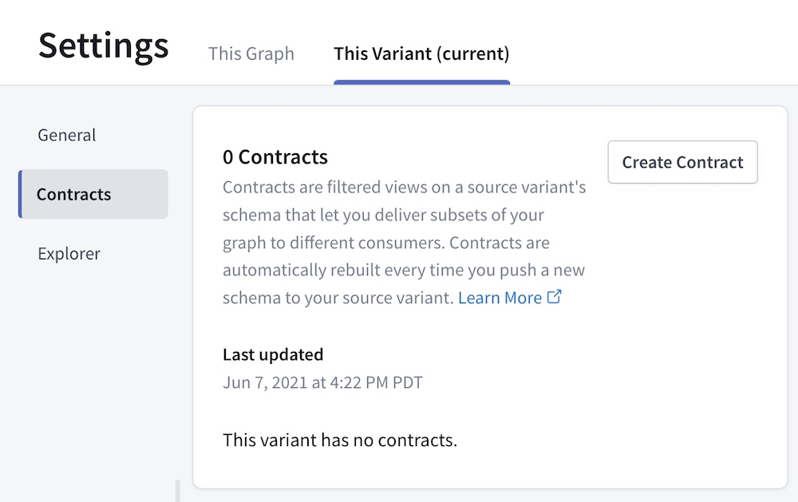

2. Click **Create Contract** to open the following dialog:

   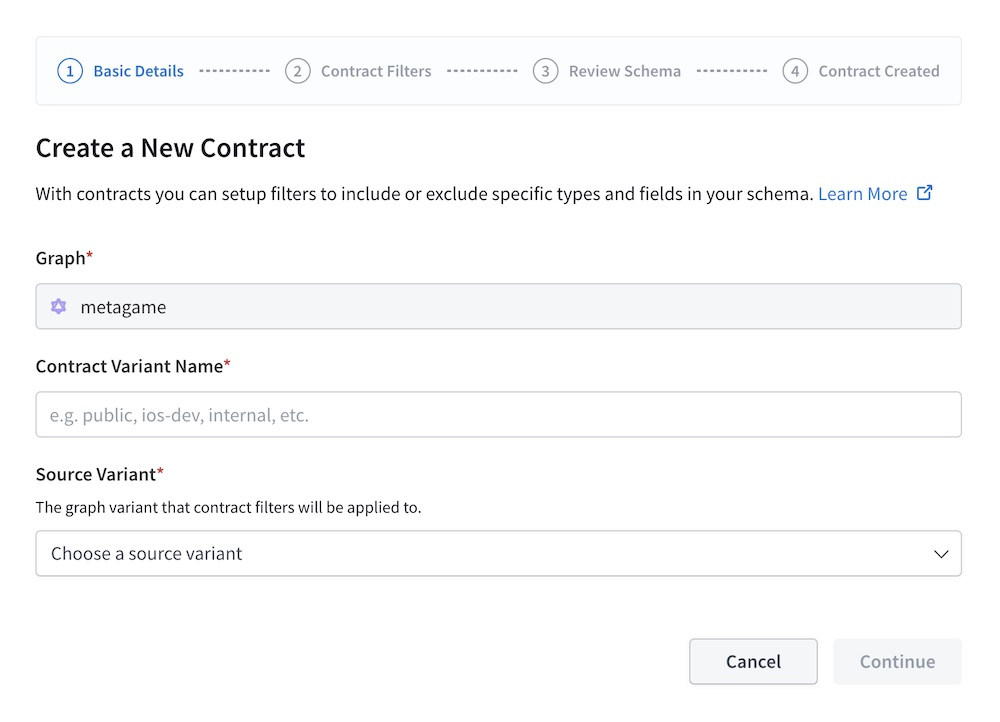

3. In the first step of the dialog, provide the following:

   - A name for your new contract variant
   - The source variant to use

  <Note>

    You can't change these values after the contract is created.

  </Note>

4. Click **Continue**.

5. Specify tag-based filters for your contract:

   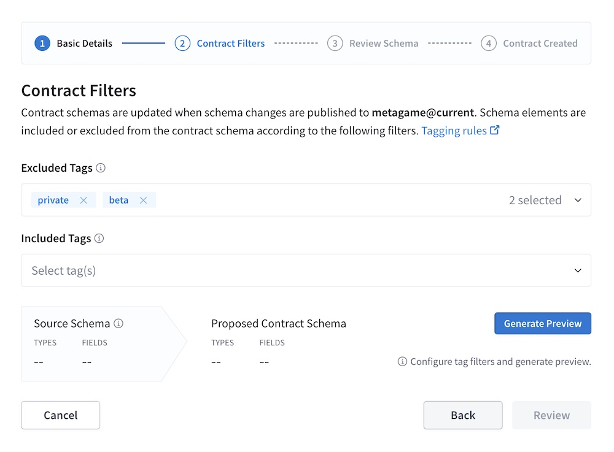

   - The dialog detects all tag names used in your source variant's schema and populates the **Excluded Tags** and **Included Tags** dropdown lists with those names. You can add any number of tag names to each list.

   - You can also add tag names not yet present in your source variant's schema. If you later add tags with that name, the contract honors them.

<ExpansionPanel title="How filtering works">

A contract filters types and fields from its source variant according to the following rules:

- **If the Included Tags list is empty**, the contract schema _includes_ each type and object/interface field _unless_ it's tagged with an _excluded_ tag.
- **If the Included Tags list is non-empty**, the contract schema _excludes_ each union type and object/interface field _unless_ it's tagged with an _included_ tag.
  - Each object and interface type is _included_ as long as _at least one_ of its fields is included (unless the type is explicitly excluded)
  - The contract schema _excludes_ a type or field if it's tagged with both an included tag _and_ an excluded tag.
- **If you enable the option to hide unreachable types**, the contract schema _excludes_ each unreachable object, interface, union, input, enum, and scalar _unless_ it's tagged with an _included_ tag.
  - A type is considered **unreachable** in a schema if there exists no path to that type from _either_ a [root operation type](https://spec.graphql.org/October2021/#sec-Root-Operation-Types) or an [executable-directive](https://spec.graphql.org/October2021/#ExecutableDirectiveLocation).

</ExpansionPanel>

<Tip>

In Apollo Federation 2, if you want to exclude a type or field from your source variant's API schema and all its contract schemas, you can use the `@inaccessible` directive instead of `@tag`. For details, see [Using `@inaccessible`](/federation/federated-types/sharing-types/#using-inaccessible).

</Tip>

6. When you're finished adding tag names, click **Generate Preview**. Studio attempts to generate a contract schema based on the filters you provided and displays the result. After you generate the preview, click **Review** to continue to the next step.

   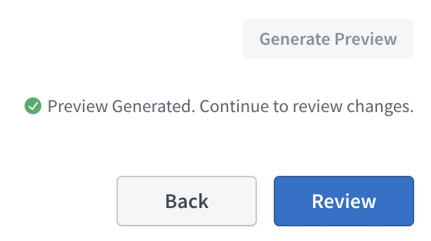

7. Review all the details of your contract:

   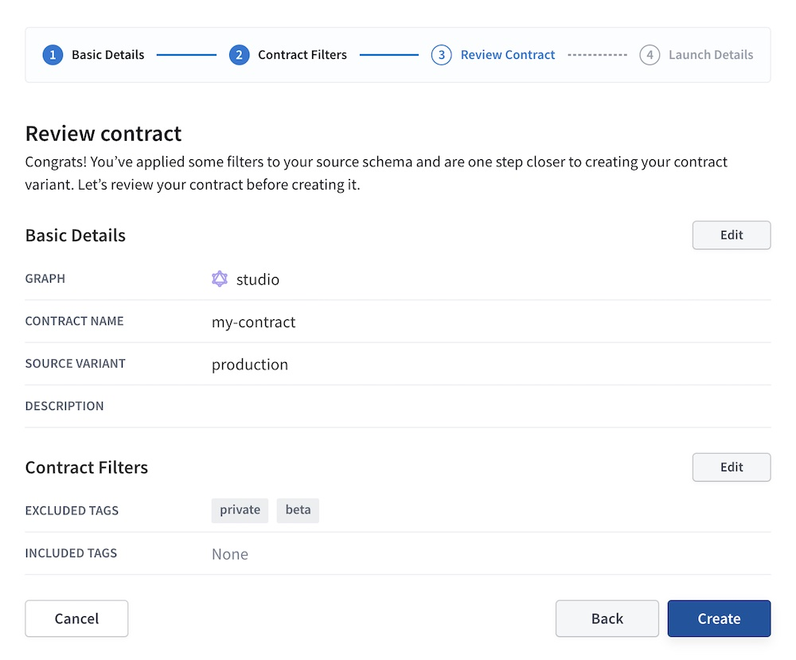

8. If everything looks right, click **Create**. This kicks off the generation of your contract variant and its initial contract schema as a [launch](./launches).

<Note>

GraphOS might encounter an error while generating your contract schema. For descriptions of these errors, see [Errors](./contract-reference#errors).

</Note>

## Using contract variants

You can use your contract variants to provide [contract routers or contract documentation](./contracts#how-to-use-contracts) to your users. For example, you can complete the [managed federation setup](/federation/managed-federation/setup/) for a new router instance that uses your contract variant.

## Automatic updates

Apollo automatically updates your contract schema whenever any of the following occurs:

- GraphOS successfully composes an updated supergraph schema for the contract's source variant.
- You [edit your contract](#edit-contracts).

These automatic updates ensure that your contract schema reflects your source variant's latest version and that the correct types and fields are included and excluded.

Your managed [contract routers](./contracts#contract-routers) automatically fetched updates to your contract schema.

## Edit contracts

<Note>

You can't change an existing contract's name or source variant. Instead, you can create a _new_ contract and delete the existing contract variant if you no longer need it.

</Note>

After you create a contract, you can edit its lists of included and excluded tags:

1. From the Contracts list in your graph's Settings page, click **Edit Contract** where shown:

   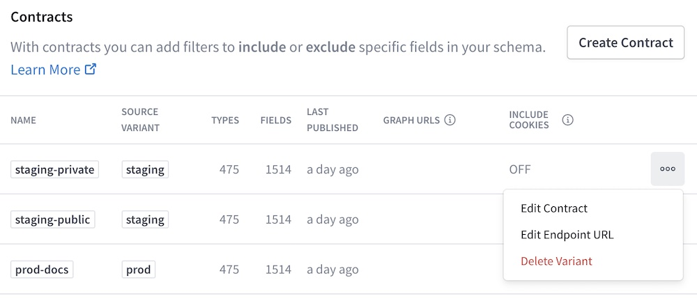

   This opens a dialog similar to the one you used to [create the contract](#3-create-a-contract). Make any required changes.

2. If you change the contract's included or excluded tags, GraphOS automatically runs [contract checks](#run-contract-checks) to determine whether those changes will affect any clients using your contract variant. The result of these checks appears in the **Review Schema** step of the contract edit dialog:

   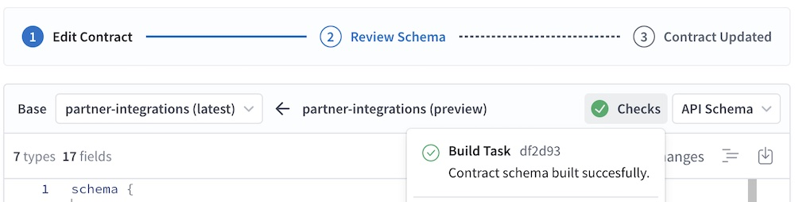

3. The dialog shows **Contract Updated** once the update is complete.

## Run contract checks

If you run [schema checks](./schema-checks/) in GraphOS Studio (which we recommend for all graphs), those checks include **contract checks** for any variant that acts as a source variant for contracts. Contract checks help your team identify when proposed changes to a source variant will negatively affect one or more downstream contracts.

<Note>

To run contract checks via `rover subgraph check`, you must [update the Rover CLI](/rover/getting-started/#installation-methods) to v0.8.2 or later.

- **If you use Rover v0.8.0 or v0.8.1,** contract checks run, but Rover ignores any contract check failures in [blocking downstream variants](#failing-contract-checks) you've set.
- **If you use a version prior to v0.8.0,** `rover subgraph check` does not run contract checks _at all_.

</Note>

When you run schema checks on a source variant, contract checks execute alongside the other checks for that variant ([composition checks](./schema-checks/#composition-checks) and [operation checks](./schema-checks/#operation-checks)).

Contract checks rely on the supergraph schema generated by composition, so they _don't_ execute if composition checks fail.

Contract checks do the following for **each** of a source variant's associated contracts:

1. Use the source variant's proposed supergraph schema (validated by composition checks) to generate and validate an updated contract schema.
2. Run operation checks against the updated contract schema.

On your graph's **Checks** page in Studio, contract checks appear as **Downstream**:

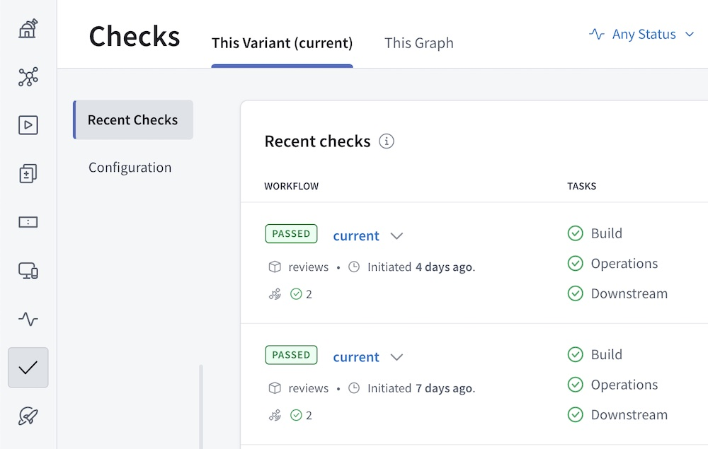

You can click the **Downstream** item in the Tasks column to view a summary of all contract checks that ran and click a particular check to view more details:

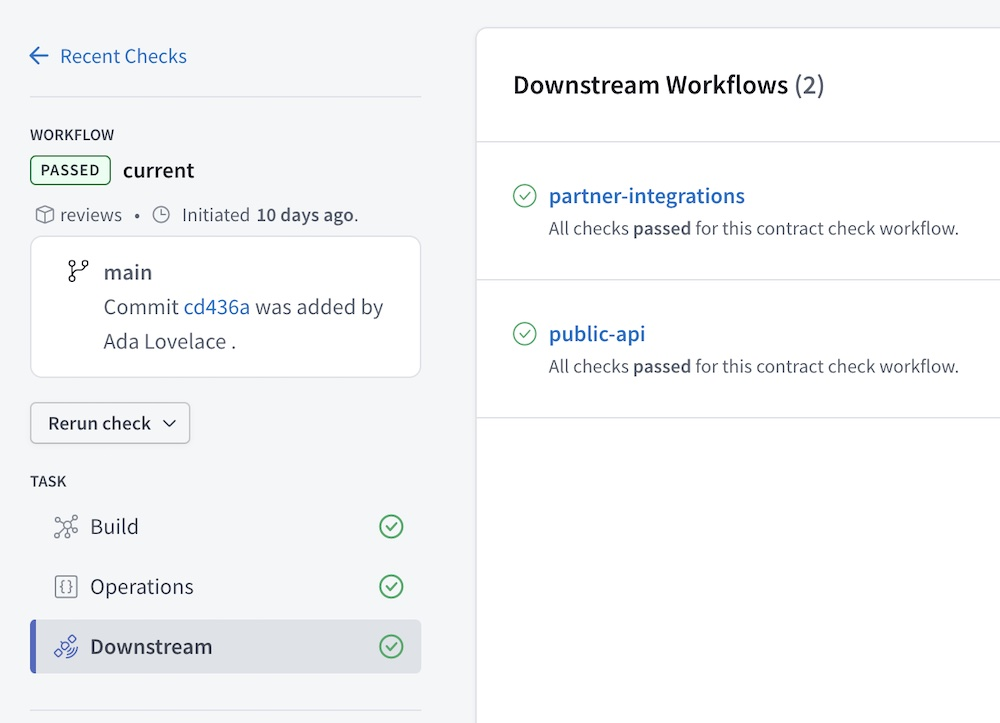

### Failing contract checks

Unlike other types of checks, failing contract checks **don't** cause their associated schema checks workflow to fail by default. This means that the `rover subgraph check` command doesn't return an error state that would prevent a CI task from merging or deploying changes to the source variant.

If you want failing contract checks to fail your entire checks workflow, you can set the **blocking downstream variants** configuration for your source variant. If contract checks fail for any of these specified contract variants, the source variant's checks workflow _does_ fail.

To set blocking downstream variants:

1. Open your source variant's Checks page and select the **This Variant** tab.
2. Click **Configuration** and scroll down to the **Blocking Downstream Variants** section:

   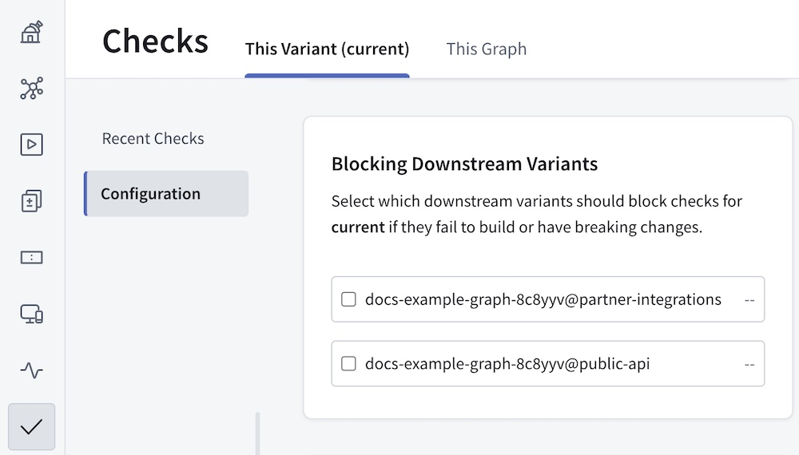

3. Select each contract variant that should be a blocking downstream variant.

From now on, whenever schema checks run for your source variant, those checks fail if contract checks fail for _any_ blocking downstream variant.
