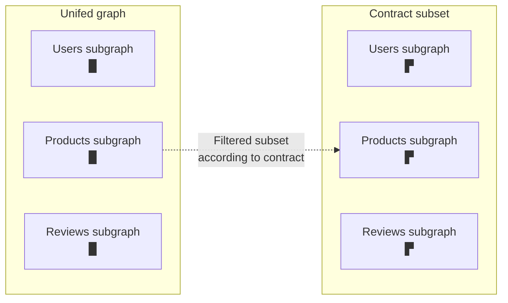

<EnterpriseFeature />

A unified supergraph provides a single source of truth for your organization's data. That data, however, likely has different consumers with different needs and permissions. GraphOS **contracts** enable you to deliver different subsets of your supergraph to different consumers. Each subset includes different fields and types from each subgraphs.



Contracts automate publishing supergraph subsets for specific audiences. They decentralize your supergraph's metadata via centralized filtering.

## Benefits of contracts

Contracts offer these benefits:

- **Selective data access**: Supergraphs often contain a wide range of data, including experimental or irrelevant (to specific audiences) information. Contracts declaritively grant access to specific parts of the supergraph so consumers only access the data that is relevant to them.

- **Data security and privacy**: Contracts bolster data security and privacy by enabling the exclusion of sensitive or confidential data from certain consumers. This ensures that only authorized parties have access to specific data.

- **Documentation and guidance**: Contracts provide [documentation](#contract-documentation) to external client developers. By generating contract-specific documentation, developers can better understand and more easily interact with the data they are authorized to access.

## How contracts work

Each contract filters specific portions of your supergraph's schema into a different GraphOS variant:


Contracts are created by adding `@tag` directives to your subgraph schemas. `@tag`s declare which types and fields to exclude from specific contract variants.

```graphql {4} title="Source variant subgraph schema"
type Product {
  id: ID!
  name: String!
  codename: String! @tag(name: "internal")
}
```

```graphql title="Contract variant API schema"
type Product {
  id: ID!
  name: String!
  # codename field is filtered out
}
```

In the above example, a contract excludes types and fields marked with the `internal` `@tag`. The resulting contract schema defines a tailored GraphQL API for external audiences.

## How to use contracts

You usually create a contract to support a **contract router** or **contract documentation** or both.

### Contract routers

You can deploy a [managed instance](/federation/managed-federation/overview/) of your graph router that uses a contract schema. Clients that use a contract router's endpoint can only execute GraphQL operations that the contract schema supports:


This enables you to hide experimental types and fields that are still in development, or to limit a particular audience's access to only the portions of your graph that they need.

Contract routers can safely connect to the same subgraph instances as any other router, because their clients can only interact with data that's represented in the contract schema. This does not affect internal routing. For example, filtered fields can still be used in a [`@requires`](/federation/federated-types/federated-directives/#requires) selection set.

<Note>

Any `@tag` present in a source variant's supergraph schema is _also_ present in a contract variant's supergraph schema.

</Note>

### Contract documentation

In GraphOS Studio, each contract variant has its own README, schema reference, and Explorer. If you [make a contract variant public](../graphs/studio-features/#public-variants), you can provide these resources to external client developers to help them interact with a specific portion of your graph while omitting irrelevant types and fields.

## Federation 1 limitations

Contracts behave slightly differently depending on which version of Apollo Federation your graph uses—either Federation 1 or Federation 2. Most importantly, graphs that use Federation 1 _cannot_ use `@tag`s to exclude the following from a contract schema:

- Custom scalar types (default scalar types can _never_ be excluded in Federation 1)
- Enum types or their values
- Input types or their fields
- Arguments of object fields or interface fields

### Contracts and Federation 2

To create a contract variant that uses Federation 2, the contract's source variant must _also_ use Federation 2.
[Learn how to move an existing variant to Federation 2.](/federation/federation-2/moving-to-federation-2#step-2-configure-your-composition-method)

#### Moving an existing contract to Federation 2

If a Federation 1 source variant already has one or more associated contracts, it isn't possible to move that variant or its contract variants to Federation 2. Instead, you need to **delete and recreate** your contract variants with the following steps:

<ExpansionPanel>

1. Identify the source variant you want to move to Federation 2.
2. Save the details for each of that source variant's existing contract variants, most importantly each variant's associated filters.
3. Delete all of the source variant's existing contract variants.
4. Now that the source variant has no associated contracts, you can configure it to use Federation 2 composition. [Learn how](/federation/federation-2/moving-to-federation-2#step-2-configure-your-composition-method).
5. Recreate your deleted contract variants, which will now use Federation 2 composition like the modified source variant.

</ExpansionPanel>

## Related resources

<Tip>

- If you're an enterprise customer looking for more material on this topic, try the [Enterprise best practices: Contracts](https://www.apollographql.com/tutorials/contracts) course on Odyssey.

- Learn about [contract usage patterns](/technotes/TN0014-contracts-patterns/) in the Tech Notes.

</Tip>
