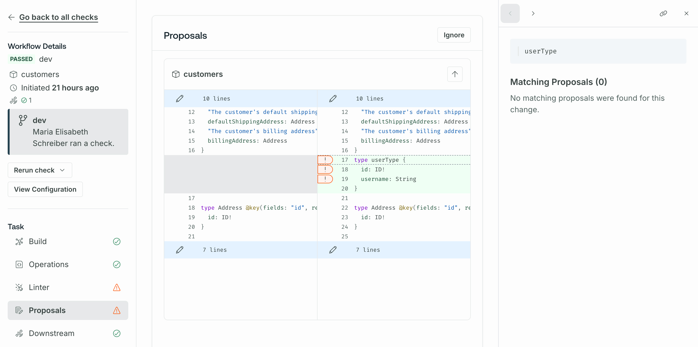

<GraphOSEnterpriseRequired />

Once a schema proposal is **Approved**, its changes need to be implemented.
For those implementing the changes, [pulling the approved schema changes](#pull-subgraphs-schemas-with-rover) into their IDE is a great starting point.

Once the changes are implemented—including updating resolvers and other supporting work—you can use the [schema checks process](#validate-changes-with-checks) to ensure that your organization only publishes changes that were part of an approved proposal.

## Pull proposed schemas with Rover

You can pull a proposal's subgraph schemas using the [`rover subgraph fetch` command](/rover/commands/subgraphs/#subgraph-fetch). This command is also used to pull subgraph schemas from a variant. To pull a schema from a _proposal_, use the proposal's ID instead of a variant name.

```bash disableLineNumbers=true
rover subgraph fetch my-graph@p-101 --name subgraph
```

A proposal's ID is always prefixed with `p-` and followed by a number. You can find the proposal ID in the proposal's URL in [GraphOS Studio](https://studio.apollographql.com?referrer=docs-content). For example, a proposal with the following URL `https://studio.apollographql.com/graph/Example-supergraph/proposal/p-0/home` has an ID of `p-0`.

<Note>

You cannot push schema changes to proposals with the `rover subgraph publish` command.

</Note>

## Validate changes with checks

GraphOS provides [schema checks](./schema-checks) to help you identify breaking changes before you make them. You [run checks on local changes](./schema-checks#the-checks-lifecycle) before publishing them.

Since schema checks [run on every revision](./propose-changes#schema-checks) in a proposal, if your last revision's checks pass, any changes you implement from a proposal should pass, too.
Regardless, it's best to run checks before publishing changes to make sure no unintentional errors have been made.

### Ensure changes match an approved proposal

You can [configure schema checks](./configure-proposals/#configure-schema-checks) to include a **Proposals** task that checks whether the changes a check is running on have matching and approved schema proposals.


Configuring the **Proposals** task's severity to **Error** ensures that only changes that have gone through the proposal process are published. You can set the severity to **Warning** if you want to be able to publish changes that haven't gone through the process but receive warnings about them.

<Note>

The Proposals task also checks _comments_ in the SDL. For example, the Proposals task fails if a matching approved proposal includes a comment with a period and the change the check is running on doesn't.

</Note>

When a check with the **Proposals** task runs, you can see the following by clicking the **Proposals** task on the **Checks** page:



- Changes with matching approved proposals show checkmark icons.
- Changes without matching approved proposals show warning or error icons depending on the [configured severity](./configure-proposals#configure-schema-checks).

Clicking the icons reveals a list of matching proposals in the right panel.
Click **Ignore** to allow the Proposals task to succeed without matching approved proposals for all changes.

### Matching changes to proposals

**Incoming changes and approved proposals don't need to match one-to-one.** For example, if you have an approved proposal with changes in multiple subgraphs, you can check each subgraph's changes separately. The changes still match and the check still passes even though the change doesn't encompass all changes in the approved proposal. Similarly, if a single proposal contains a large change in one subgraph that you want to divide into multiple checks, those will also match and pass.

## Publish changes to GraphOS

Publishing changes that are part of a schema proposal uses the same [publishing steps](./publishing-schemas) as any other changes.
When a schema published to a [proposal's source variant](./propose-changes/#start-a-proposal) contains changes that are in an open proposal, the corresponding [launch](./launches) appears in the proposal's activity log.


When an **Approved** or **Open for feedback** proposal's changes have been fully implemented—[whether from one launch or many](#matching-changes-to-proposals)—the proposal's status changes to **Implemented**.


<Note>

- A proposal with **Draft** status can't become **Implemented**, even when all its changes are published. Once such a proposal's status is changed to **Open for feedback**, it automatically switches to **Implemented**.
- **Implemented** proposals cannot receive further revisions, nor their status changed.

</Note>
