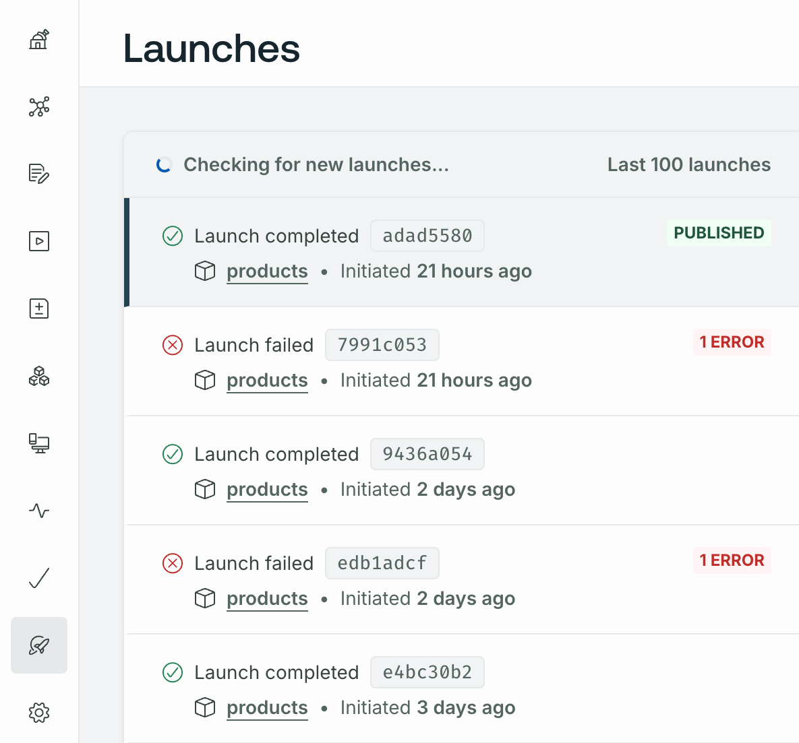

GraphOS provides schema pipeline tools to develop and deploy changes to your graph schemas. These tools fall into two main categories:

- **Schema governance** tools let you manage, validate, and enforce standards in your schemas.
- **Schema delivery** tools let you integrate schema publication into your DevOps workflows.

<SummitCallout
  topic="schema design"
  workshopName="Schema design excellence"
  URL="https://reg.summit.graphql.com/flow/apollo/summit24/AttendeePortal/page/catalog/session/1712947470535001L9a9"
/>

## Schema governance

GraphOS provides the following schema governance tools:

- [Schema checks](./schema-checks) identify breaking changes before you publish them. They can also determine when a potentially dangerous change is, in fact, safe.
- [Schema linting](./schema-linter) ensures consistent, well-formed schemas. Automated linting lowers maintenance overheads and improves developer productivity. You can run the linter as [part of schema checks](./schema-linter#linting-via-schema-checks) in GraphOS Studio and [one-off via the Rover CLI](./schema-linter#one-off-linting).
- [Schema proposals](./schema-proposals) provide GraphOS-native schema change management. Team members propose changes to subgraph schemas, and others review and approve them before they're implemented. Schema proposals do more than just strengthen governance&mdash;they foster cross-organization collaboration.

<EnterpriseFeature>

Schema proposals are only available with a [GraphOS Enterprise plan](https://www.apollographql.com/pricing#collaboration).

</EnterpriseFeature>

## Schema delivery

Schema delivery refers to the process of making your supergraph schema available to clients. You can publish schema changes [using the Rover CLI](./publishing-schemas) or [GraphOS Platform API](/graphos/platform-api). Using the Rover CLI command lets you integrate publication into your continuous delivery pipeline.

To integrate other aspects of your supergraph configuration, such as your router configuration or federation version, GraphOS uses the concept of [launches](./launches). Schema publications trigger launches which you can monitor them from the **Launches** page in GraphOS Studio.

### Contracts

<EnterpriseFeature>

Contracts are only available with a [GraphOS Enterprise plan](https://www.apollographql.com/pricing#collaboration).

</EnterpriseFeature>

GraphOS [contracts](./contracts) let you deliver different subsets of your supergraph to different consumers. Contracts rely on [`@tags`](./contract-setup#1-add-tags-to-subgraph-schemas) in subgraph schemas to denote which types and fields are accessible to different consumers.

## Client operation validation

Apollo provides app developers a way to confirm client operations' compatibility with the published schema. Refer to the [Validating client operations page](/rover/validating-client-operations) for more information.
