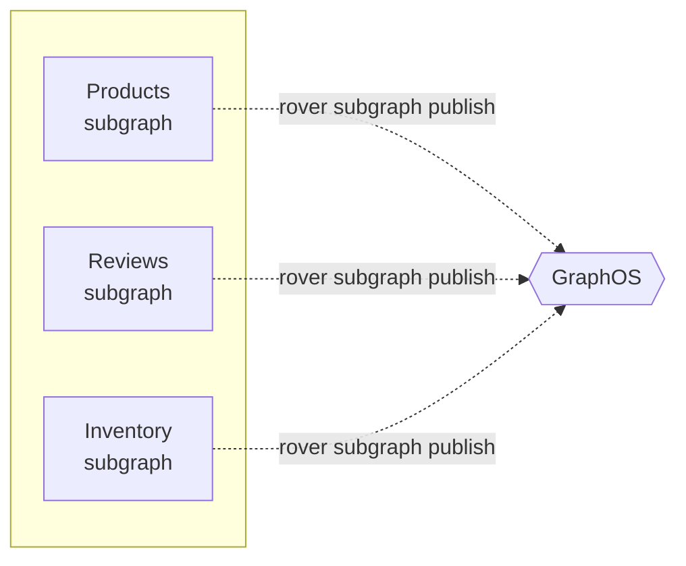
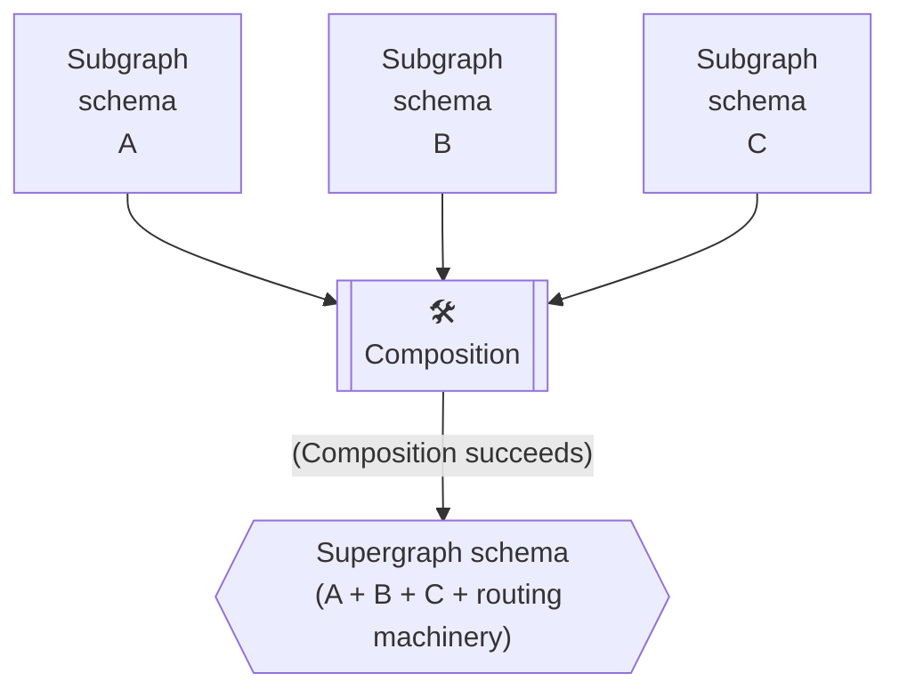

Whenever you make changes to a graph's schema, you should **publish** those changes to Apollo GraphOS using **the Rover CLI**. Doing so ensures that Apollo always has an up-to-date understanding of your graph.

> ⚠️ **If you haven't installed Rover yet:**
>
> 1. [Install the Rover CLI](/rover/getting-started/).
> 2. [Authenticate Rover](/rover/configuring/#authenticating-with-graphos) with GraphOS.

## Subgraph schemas

Every supergraph in GraphOS includes one or more subgraphs. You _individually_ publish each subgraph's schema to Apollo with `rover subgraph publish`:

```bash
rover subgraph publish --schema ./products.graphql --name products docs-example-graph@current --routing-url https://products.example.com
```



**To publish a subgraph schema to Apollo:**

1. Identify the name of the subgraph you're publishing to. You can view the names of your existing subgraphs from your variant's **Subgraphs** page in Apollo Studio.

2. **If you're publishing a subgraph for the first time,** _also_ obtain the **routing URL** for that subgraph. This is the URL that your router will use to communicate with the subgraph.

   - If GraphOS already knows your subgraph's routing URL, you don't need to provide this value unless you're changing it.

3. Run the `rover subgraph publish` command and provide it your subgraph's schema in one of the ways shown:

   ```bash
   # Provide a local .graphql file path
   rover subgraph publish my-graph@my-variant --name locations --routing-url https://flyby-locations-sub.herokuapp.com/ --schema ./schema.graphql

   # Provide an introspection result via stdin
   rover subgraph introspect http://localhost:4000 | rover subgraph publish my-graph@my-variant --name locations --routing-url https://flyby-locations-sub.herokuapp.com/ --schema -
   ```

Whenever you publish a subgraph schema, GraphOS attempts to **compose** all latest versions of your subgraph schemas into a single **supergraph schema** for your router:



If this composition succeeds, your router is updated with the result. This enables clients to query any newly added fields, and it _prevents_ them from querying any _removed_ fields.

> You can manually fetch your router's latest supergraph schema with the `rover supergraph fetch` command, or retrieve it from your supergraph's **Schema > SDL** page in Apollo Studio.

## Publishing with continuous delivery

To get the most out of GraphOS, you should **publish each update to any production schema as soon as it occurs**. Consequently, schema publishing should be part of your continuous delivery pipeline.

Here's a sample continuous delivery configuration for schema publishing in CircleCI:

```yaml
version: 2

jobs:
  build:
    docker:
      - image: circleci/node:8

    steps:
      - checkout

      - run: npm install

      - run:
          name: Install Rover
          # highlight-start
          command: |
            # Download and install Rover
            # This is pinned to a specific version for predictability in CI
            curl -sSL https://rover.apollo.dev/nix/v0.8.1 | sh

            # This allows the PATH changes to persist to the next `run` step
            echo 'export PATH=$HOME/.rover/bin:$PATH' >> $BASH_ENV
          # highlight-end

      # Start the GraphQL server.  If a different command is used to
      # start the server, use it in place of `npm start` here.
      - run:
          name: Starting server
          command: npm start
          background: true

      # make sure the server has enough time to start up before running
      # commands against it
      - run: sleep 5

      # highlight-start
      # When running on the 'main' branch, push the latest version
      # of the schema to GraphOS.
      - run: |
          if [ "${CIRCLE_BRANCH}" == "main" ]; then
            rover subgraph publish my-graph@my-variant \
              --schema ./schema.graphql \
              --name locations \
              --routing-url https://products.example.com
          fi
      # highlight-end
```

## Monolith schemas

> ⚠️ These instructions apply only to [monographs](../graphs/#monographs), which are **not recommended**.

1. If you haven't yet:

   - [Install the Rover CLI](/rover/getting-started/)
   - [Authenticate Rover](/rover/configuring/#authenticating-with-graphos) with GraphOS.

2. Decide how you'll provide your server's schema to Rover. You can either:

   - Use a `.gql` or `.graphql` file saved on your local machine, or
   - Perform an introspection query on your running server to fetch the schema

3. Run the `rover graph publish` command, providing your schema in one of the ways shown:

   ```bash
   # Provide a local .graphql file path
   rover graph publish my-graph@my-variant --schema ./schema.graphql

   # Provide an introspection result via stdin
   rover graph introspect http://localhost:4000 | rover graph publish my-graph@my-variant --schema -
   ```

   As shown, the first positional argument you provide `rover graph publish` is a [graph ref](/rover/conventions/#graph-refs), a string that specifies a particular variant of a particular graph in GraphOS.
