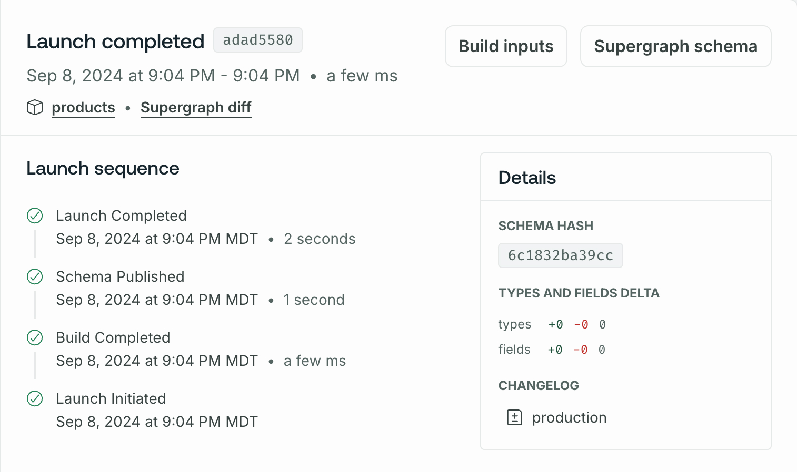
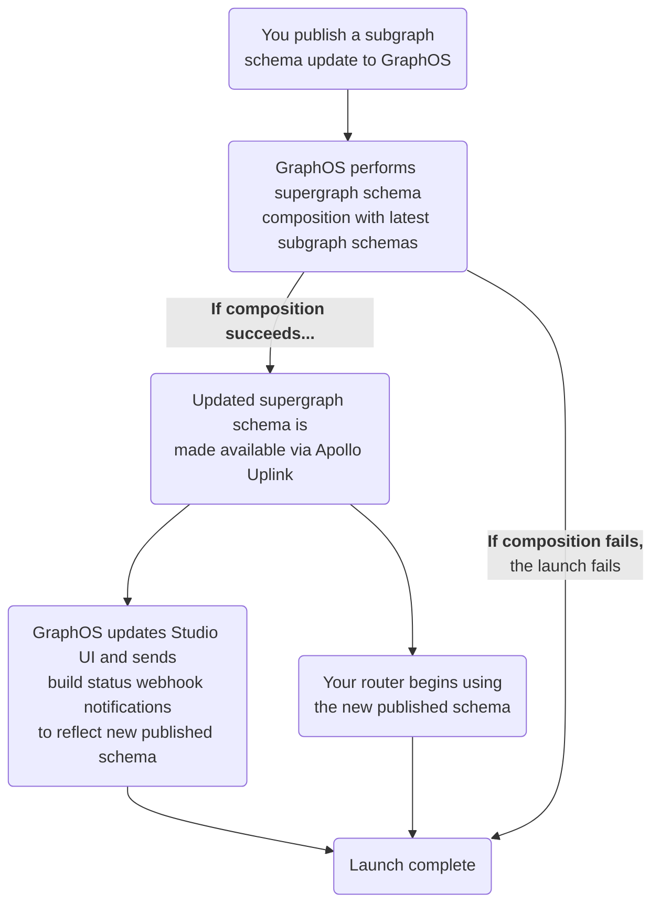

In GraphOS, a **launch** represents the complete process of applying a set of updates to a supergraph. Launches are _usually_ triggered by making changes to one of your published subgraph schemas.

Updates that trigger a launch include:

- Adding, removing, or modifying types and fields in a subgraph schema
- Adding or removing entire subgraphs
- Migrating types or fields between subgraphs
- Modifying your [cloud router's configuration](../routing/cloud-configuration/)
- Updating your federation version

A launch might consist entirely of changes that don't affect your supergraph's public API (such as migrating fields between subgraphs).

You can [trigger a launch manually by calling the GraphOS Platform API](#manually-trigger-launch).

## Launch status

Your supergraph's Launches page in GraphOS Studio enables you to observe and monitor the schema delivery process for both in-progress and past launches:

The green **PUBLISHED** badge indicates which launch corresponds to your supergraph's current published schema.

Selecting a launch provides a breakdown of its individual steps and any errors or warnings that occurred during it:

From this detail view, you can view the timestamp and other details for each step in the launch process. You can also view the launch's associated supergraph schema (or any build errors if composition failed).

## What's in a launch?

**A GraphOS launch proceeds through the following steps:**

## Manually trigger launch

<PreviewFeature />

You can trigger a launch manually by calling the [GraphOS Platform API](/graphos/platform-api) to publish subgraph schema updates. This is useful for deployments that require progressive rollouts, where different environments have unique subgraph schemas. In this scenario, you can publish the subgraph schemas for an environment, wait for the completed launch (and any downstream launches), then retrieve the supergraph schema with the launch ID.  

For an example workflow using GraphOS Platform API to manually trigger a launch, see the [Advanced deployment workflow for blue-green deployment](/federation/managed-federation/deployment/#example-blue-green-deployment).
