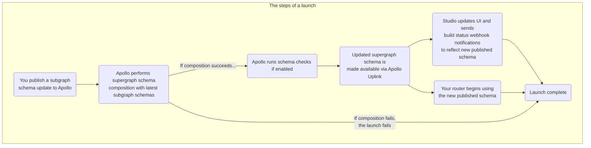

In GraphOS, a **launch** represents the complete process of making a set of updates to a supergraph, usually initiated by changes to one of its subgraphs.

These updates might include:

- Adding, removing, or modifying types and fields in a subgraph schema
- Adding or removing entire subgraphs
- Migrating types or fields between subgraphs

In some cases, a launch might consist entirely of changes that don't affect your supergraph's public API (such as migrating fields between subgraphs).

## Launch status

Your supergraph's Launches page in Apollo Studio enables you to observe and monitor the schema delivery process for both in-progress and past launches:

The green **PUBLISHED** badge indicates which launch corresponds to your graph's current published schema.

Selecting a launch provides a breakdown of its individual steps and any errors or warnings that occurred during it:

From this detail view, you can view the timestamp and other details for each step in the launch process, including any [schema checks](./schema-checks) that failed. You can also view the launch's associated supergraph schema (or any build errors if composition failed).

## What's in a launch?

A launch encapsulates the following steps for a supergraph:

